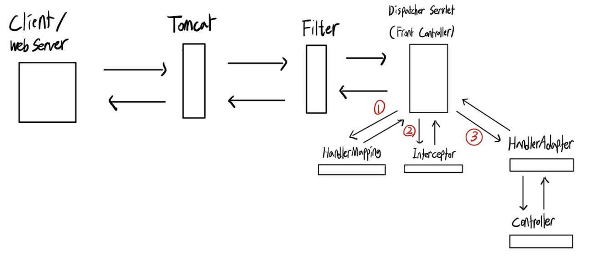
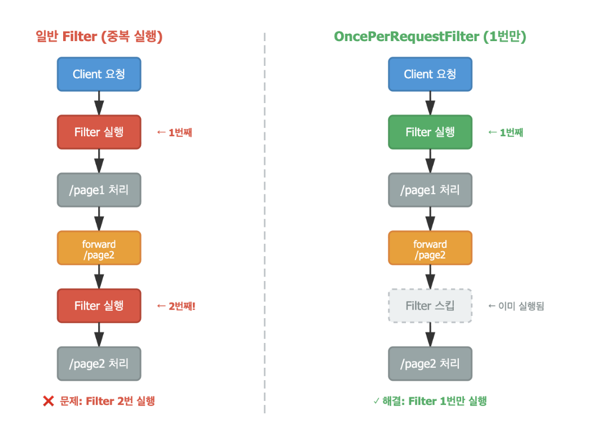
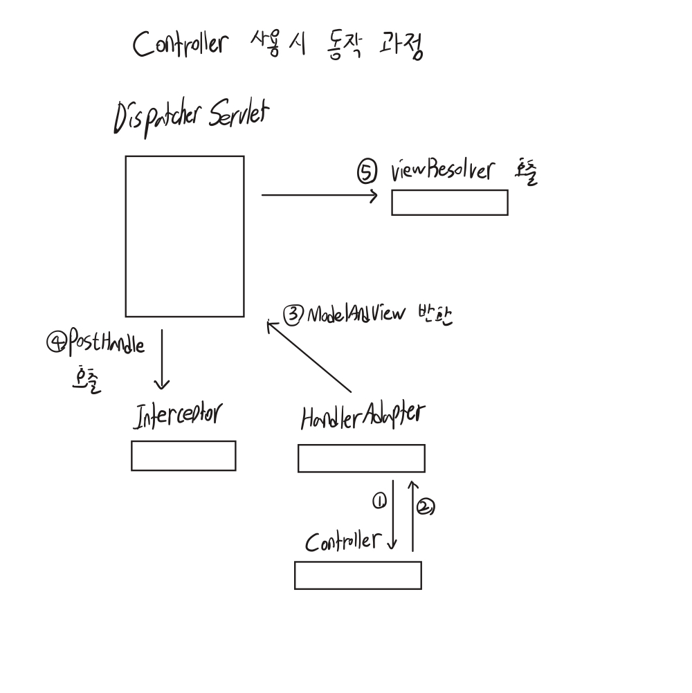
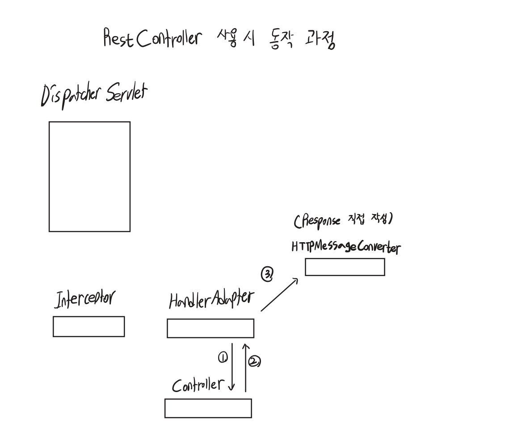
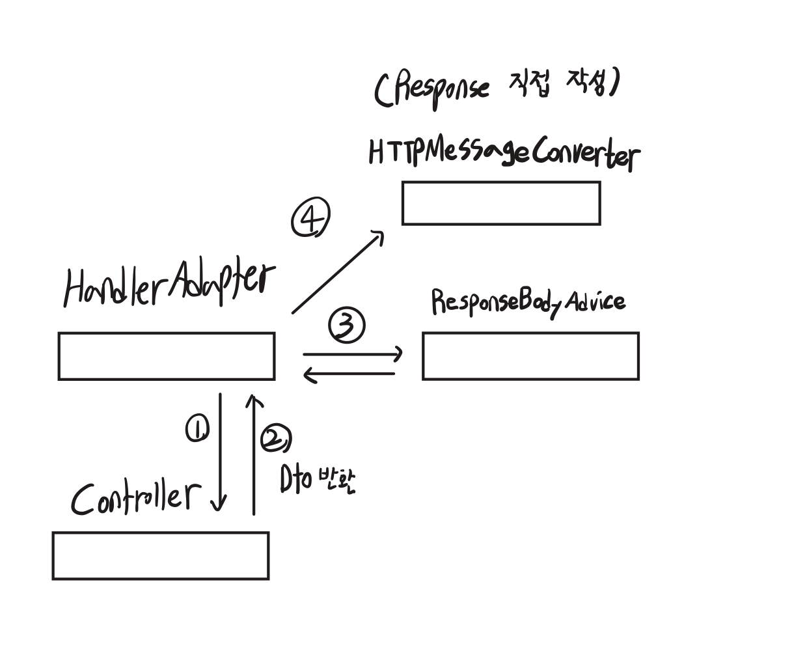

# Spring Filter, Interceptor

이번에 프로젝트를 진행하면서 Filter, Interceptor를 사용해 봤는데요, 어떤 친구들인지는 알고 있었지만
구체적으로 어느 상황에서 사용해야 하는지 헷갈려 정리를 하게 되었습니다. 우선 시작하기에 앞서 Spring의 요청 흐름에 대해 알고 있으면
많은 도움이 될 것 같습니다.



# Filter
필터가 무엇인지 Filter 인터페이스에 나와있는 주석을 보면 이해하기 좋습니다.

> A filter is an object that performs filtering tasks on either the request to a resource (a servlet or static* content), or on the response from a resource, or both. 

> Filter는 서블릿(또는 정적 콘텐츠)과 같은 리소스로 들어오는 요청이나, 리소스에서 나가는 응답(혹은 둘 다)에 대해 필터링 작업을 수행하는 객체입니다.

```java

package jakarta.servlet;

import java.io.IOException;

public interface Filter {

    default void init(FilterConfig filterConfig) throws ServletException {
    }

    void doFilter(ServletRequest request, ServletResponse response, FilterChain chain)
            throws IOException, ServletException;
            
    default void destroy() {
    }
}
```

Filter 인터페이스의 package를 확인해 보면 Spring Framework의 패키지가 아닌 jakarta.servlet입니다. 
즉, Filter는 서블릿 표준 스펙에 정의된 기술이며 ServletContainer 영역에서 동작하는 것을 알 수 있습니다. 
다시 말해, DispatcherServlet의 앞단에 위치한 셈이죠. Filter는 DispatcherServlet의 앞단에 위치하기에, 
DispatcherServlet으로 가기 전에 request를 조작하거나, DispatcherServlet에서 처리된 후의 response를 doFilter() 메서드를 통해 조작할 수 있습니다.

Filter 인터페이스에 나와있는 주석인데요, 여기에 어떤 상황에서 Filter를 사용해야 하는지 좋은 예시들이 나와있습니다.

> Examples that have been identified for this design are
> 1) Authentication Filters
> 2) Logging and Auditing Filters
> 3) Image conversion Filters
> 4) Data compression Filters 
> 5) Encryption Filters
> 6) Tokenizing Filters
> 7) Filters that trigger resource access events 
> 8) XSL/T filters
> 9) Mime-type chain Filter 

해당 작업들의 공통적인 부분이 있는데요, 바로 모든 웹 요청에 공통적으로 적용되어야 하고, DispatcherServlet과 무관하게 처리되어야 하는 작업들이라는 점입니다. 
저의 경우에는 프로젝트에서 로깅 작업을 Filter로 하고 있는데요, 메서드 단위의 세부적인 로깅은 AOP를 사용하고, 모든 HTTP 요청/응답에 대한 전체적인 로깅은 Filter를 사용했습니다.

여러분도 DispatcherServlet과 무관하면서 공통된 요청/응답에 대해 무언가 처리할 일이 있다면 Interceptor 대신에 Filter를 고려해 보시면 좋을 것 같습니다.

## TMI) Filter 사용 시 주의점
Filter를 사용할 때 조심해야 하는 부분이 있는데요, 바로 예외처리와 중복호출 입니다.

### 1) Filter에서의 예외처리

스프링 환경에서 Filter를 Bean으로 등록할 수 있는데요, Bean으로 등록하면 Filter의 생명주기 및 자원 관리를 SpringContainer가 담당하게 됩니다.

동작 위치: ServletContainer
관리 주체 : SpringContainer

Spring 빈으로 등록했더라도, 실제 동작은 ServletContainer에서 한다는 것을 꼭 알고 있어야 합니다.
추가적으로 이 글을 읽으면서 엥?? ServletContainer가 더 큰 개념인데 어떻게 Filter를 SpringContainer에서 관리한다는 거지?? 
에 대한 의문점이 생기신 분이 계시다면, 망나니개발자님의 글을 추천합니다.

https://mangkyu.tistory.com/221


Filter의 동작 위치는 ServletContainer 즉, DispatcherServlet의 앞단이기 때문에 Spring의 예외처리를 사용할 수 없습니다.

```java
@RestControllerAdvice
public class AuthExceptionHandler {

    @ExceptionHandler(AuthException.class)
    public ResponseEntity<ErrorResponse> handleAuthException(final AuthException e) {
        log.warn(e.getMessage(), e);
        final HttpStatus httpStatus = e.getErrorCode().getHttpStatus();
        return ResponseEntity.status(httpStatus)
                .body(ErrorResponse.error(e.getErrorCode()));
    }
}
```

많은 분들이 Spring 환경에서 상단의 코드처럼 @ControllerAdvice + @ExceptionHandler을 사용할 텐데요,
Filter에서 발생한 예외는 ExceptionHandler에서 처리할 수 없습니다. DispatcherServlet의 앞단에 위치하기 때문이죠. 
그렇기에 Filter에서 예외가 발생하면 ExceptionHandler를 거치지 못하고, ServletContainer의 기본 에러 처리 메커니즘에 의해 500 에러가 반환됩니다. 

만약 Filter에서 ServletContainer의 기본 예외가 아닌 상세한 예외를 던지고 싶다면, 아래와 같이 직접 response를 조작해줘야 합니다.

```java
@Component
public class JwtAuthFilter implements Filter {
    
    @Override
    public void doFilter(ServletRequest request, ServletResponse response, 
                         FilterChain chain) throws IOException, ServletException {
        try {
            // JWT 검증 로직
            chain.doFilter(request, response);
        } catch (JwtException e) {
            // Filter 내부에서 직접 처리
            HttpServletResponse httpResponse = (HttpServletResponse) response;
            httpResponse.setStatus(HttpServletResponse.SC_UNAUTHORIZED);
            httpResponse.setContentType("application/json");
            httpResponse.getWriter().write("{\"error\":\"Invalid token\"}");
        }
    }
}
```


### 2) 중복 호출

Filter는 중복 호출 문제가 존재하는데요, 하나의 HTTP 요청이 내부적으로 다른 리소스로 이동할 때, Filter가 여러 번 실행될 수 있습니다.
간단한 예시 코드를 통해 설명해 보겠습니다.

```java
@Controller
public class ErrorPageController {
    
    @GetMapping("/error-page")
    public String errorPage(HttpServletRequest request) {
        return "error";
    }
}
```

```java
@Controller
public class UserController {
    
    @Autowired
    private UserService userService;
    
    @GetMapping("/user/{userId}")
    @ResponseBody
    public String getUser(@PathVariable Long userId) {
        
        // Service 호출 - 여기서 예외 발생 가능
        User user = userService.findUser(userId);
        return "사용자: " + user.getName();
    }
}
```

findUser() 메서드 실행 시점에 예외가 발생하면, ServletContainer가 /error-page로 forward 합니다.
이때 ErrorPageController로 바로 이동하는 것이 아니라, 다시 FilterChain부터 시작하는데요, 
즉 이 시점에서 error-page로 가는 과정에서 Filter를 한 번 더 호출하게 됩니다. 
이때 Filter뿐만 아니라 Spring MVC의 다른 컴포넌트들(ex Interceptor, ArgumentResolver...)도 함께 추가로 호출되고요.


DispatcherType에는 다음과 같은 종류들이 있는데요,

* REQUEST: 최초 클라이언트 요청
* FORWARD: RequestDispatcher.forward()로 다른 서블릿/리소스로 요청을 전달할 때
* INCLUDE: RequestDispatcher.include()로 JSP 등에서 다른 리소스를 포함할 때
* ERROR: 에러 페이지 처리 시
* ASYNC: 비동기 서블릿 실행 시

이 중 Request를 제외한 나머지 타입에서 중복해서 Filter가 호출될 수 있습니다.

이런 Filter의 중복 호출 때문에 Spring에서는 OncePerRequestFilter를 제공해 줍니다.



OncePerRequestFilter는 같은 요청에 대해 Filter가 한 번만 실행되도록 보장하는 Spring 추상 클래스입니다. 
어떤 식으로 동작하는지 관심이 있다면, 하단의 아티클을 추천합니다. (지금 포스팅에서 자세히 다룰 내용은 아닌 것 같습니다)

https://www.baeldung.com/spring-onceperrequestfilter

추가적으로 @RestController만 사용하는 API 서버로 사용할 시에는 중복 호출이 발생하지 않는데요, 본인의 환경에 맞게 사용하시면 될 것 같습니다. 
(개인적으로는 보수적으로 OncePerRequestFilter를 사용하는 것도 나쁘지 않아 보이긴 합니다.)


# Interceptor
> interceptors intercept requests and process them. They help to avoid repetitive handler code such as logging and authorization checks.

> 인터셉터는 요청을 가로채서 처리합니다. 로깅 및 인증 확인과 같은 반복적인 처리기 코드를 방지하는 데 도움이 됩니다.

말 그대로 요청을 가로채서 처리하는 녀석입니다. 그렇다면 어디로 가는 요청을 처리하는 걸까요?


우선 Filter를 거쳐 DispatcherServlet에 도착을 하면 HandlerMapping이 동작합니다. HandlerMapping은 실행한 Handler를 찾는데요, 이후에 해당 Handler 요청에 적용될 Interceptor를 함께 찾습니다. (URL 매칭)


만약 Handler 요청에 적용될 Interceptor가 존재한다면, DispatcherServlet이 Interceptor를 실행한 이후에 HandlerAdapter로 넘어갑니다. 이 흐름을 HandlerMapping -> HandlerAdapter로 바로 가는 게 아니라, 실행할 Interceptor가 있다면 해당 요청을 전처리/후처리 하기 때문에 요청을 가로챈다는 느낌이 있어서 Interceptor라는 이름이 붙여지지 않았나 싶네요.


위의 설명을 통해 알 수 있듯이 Interceptor는 HandlerAdapter의 전/후 과정에 참여하는데요, HandlerInterceptor의 인터페이스를 확인해 보면 더 명확하게 알 수 있습니다.


```java
public interface HandlerInterceptor {

    default boolean preHandle(HttpServletRequest request,HttpServletResponse response, Object handler) throws Exception {
    
       return true;
    }

    default void postHandle(HttpServletRequest request, HttpServletResponse response, Object handler,
          @Nullable ModelAndView modelAndView) throws Exception {
    }

    default void afterCompletion(HttpServletRequest request, HttpServletResponse response, Object handler,
          @Nullable Exception ex) throws Exception {
    }

}
```

Interceptor가 무엇을 하는지는 얼추 이해가 됐을 거라 생각합니다. 그렇다면 Interceptor에서는 주로 어떤 작업을 수행해야 할까요?


HandlerInterceptor에 달려있는 주석 중 일부분인데요, 이번 포스팅에서 다루면 좋을 내용들을 가져와봤습니다. 하단의 주석을 보면 인터셉터가 왜 생겼는지, 그리고 어떤 용도로 사용해야 하는지에 대해 알 수 있습니다.

> A HandlerInterceptor gets called before the appropriate HandlerAdapter* triggers the execution of the handler itself. This mechanism can be used* for a large field of preprocessing aspects, or common handler behavior* like locale or theme changes. Its main purpose is to allow for factoring* out repetitive handler code.
> 
> HandlerInterceptor는 적절한 HandlerAdapter가 실제 핸들러 실행을 * 트리거하기 전에 호출됩니다. 이 메커니즘은 로케일(locale) 또는 테마 변경과 같은 * 공통 핸들러 동작이나 다양한 전처리 기능을 구현하는 데 사용할 수 있습니다. * 주요 목적은 반복되는 핸들러 코드를 분리해 내는 것입니다.

> As a basic guideline, fine-grained handler-related preprocessing tasks are* candidates for HandlerInterceptor implementations, especially factored-out* common handler code and authorization checks. On the other hand, a Filter* is well-suited for request content and view content handling, like multipart* forms and GZIP compression. This typically shows when one needs to map the* filter to certain content types (for example, images), or to all requests.
> 
> 기본 지침으로, 세밀한 핸들러 관련 전처리 작업은 * HandlerInterceptor 구현에 적합합니다. 예를 들어, * 공통 핸들러 코드 분리, 권한 검사 등이 이에 해당합니다. * 반대로, 요청 본문 처리나 뷰 콘텐츠 처리(멀티파트 폼, GZIP 압축 등)에는 * Filter가 더 적합합니다. 특히 특정 콘텐츠 타입(예: 이미지)이나 * 모든 요청에 대해 매핑해야 하는 경우 Filter가 바람직합니다.

위의 주석에 세밀한 핸들러 관련 전처리 작업은 HandlerInterceptor 구현에 적합하다고 나와있습니다. 세밀한 핸들러 관련 전처리 작업은 다음과 같은 작업이 있을 것 같네요.

* 세부적인 보안 및 인증/인가 공통 작업
* API 호출에 대한 로깅 또는 감사
* Controller로 넘겨주는 정보(데이터)의 가공

Filter보다는 조금 더 구체적인 정보가 필요하거나, 세부적인 처리가 필요하면 Interceptor를 고려해 보면 좋을 것 같습니다.

### TMI) Interceptor 사용 시 주의점


HandlerInterceptor의 postHandle에서는 주의해야 할 부분이 있는데요,

RestController를 사용하거나 Controller + ResponseBody 어노테이션을 사용할 때 dto, 엔티티, String, long 등을 반환하게 되면 Interceptor에서 response를 꺼내 수정할 수 없습니다. 왜 이런 상황이 발생하는 걸까요?


상단의 그림은 @Controller 어노테이션을 사용할 때의 DispatcherServlet이 HandlerAdapter를 실행하는 과정입니다.


여기서 자세히 봐야 할 부분은 3번인데요, HandlerAdapter에서 Controller를 실행하고, 그에 대한 ModelAndView를 DispatcherServlet에게 반환을 합니다. 실제로 viewResolver의 render() 메서드가 실행되는 건, Interceptor의 postHandle이 실행된 다음입니다. 이 상황에서는 postHandle()이 잘 호출되는데요, @RestController의 경우에는 다르게 동작합니다.


@RestController는 이와 달리 Controller 실행 직후 HttpMessageConverter가 즉시 개입하여 반환된 DTO를 JSON으로 변환합니다. 변환된 JSON은 ViewResolver나 View를 거치지 않고 HttpServletResponse에 직접 작성되며, 이 시점에서 이미 response가 완성됩니다. 따라서 HandlerAdapter는 null을 반환하고, 이후의 postHandle()과 View 렌더링 과정은 실행되지 않습니다.


그렇다면 @RestController를 사용할 때 응답값을 조작하려면 어떻게 해야 할까요?

크게 2가지 방법이 있는데요, 첫 번째 방법은 ResponseBodyAdvice의 beforebodyWrite를 사용하는 것입니다.



HandlerAdapter는 MessageConverter로 타입을 변환하기 전에 ResponseBodyAdvice를 먼저 호출하는데요, 이때 Body에 담길 DTO를 수정하거나 Header를 조작할 수 있습니다.

```java
public class CustomResponseAdvice implements ResponseBodyAdvice<Object> {

    @Override
    public boolean supports(final MethodParameter returnType, final Class converterType) {
        return false;
    }

    @Override
    public Object beforeBodyWrite(final Object body, final MethodParameter returnType,
            final MediaType selectedContentType, final Class selectedConverterType,
            final ServerHttpRequest request,
            final ServerHttpResponse response) {
        return null;
    }
}
```

ResponseBodyAdvice의 구현체인데요, beforeBodyWrite 메서드에서 Body를 조작하거나, response의 Header를 설정할 수 있습니다. 해당 구현체를 작성할 때 조심해야 할 부분은 아직 response의 body가 생성되기 전이기에, beforeBodyWrite에서 직접 응답값을 넣어줘서는 안 됩니다. 추후 MessageConverter에서 쓰기 작업이 일어나, 의도하지 않은 중복 응답값이 생길 수 있기 때문입니다.


두 번째 방법은 Filter를 사용하는 것인데요, ResponseBodyAdvice와는 동작 방식이 다릅니다.


ResponseBodyAdvice는 DTO 객체를 Json 변환 전에 조작하며, 동시에 HTTP 헤더나 상태코드도 함께 제어할 수 있습니다. 반면 Filter는 이미 Json으로 변환된 문자열을 가로채서 수정한 후 다시 작성하는 방식입니다. Filter는 ResponseWrapper로 응답을 버퍼에 임시 저장하고, JSON 문자열을 직접 조작할 수 있다는 장점이 있지만, 파싱/재직렬화 오버헤드가 발생합니다.


즉, 위의 Filter 설명 때 언급했던 것처럼 Body를 암호화 혹은 압축을 해야 한다면 filter를 사용하는 게 좋아 보입니다. 하지만 헤더에 쿠키를 설정한다거나, Body의 특정 값을 추가하는 작업(DTO 레벨 조작)은 ResponseBodyAdvice가 적절하다고 개인적으로 생각하고 있습니다.


# 권한 검증은 어디에서 해야 할까? Filter?? Interceptor?? Service Layer??
검증은 크게 두 가지로 분류할 수 있습니다.

* Authentication ex) 회원/비회원
* Authorization ex) Admin의 상세 권한 검증-  owner, manager, part_timer

HandlerInterceptor에는 다음과 같은 주석이 달려있는데요, 
> <p><strong>Note:</strong> Interceptors are not ideally suited as a security* layer due to the potential for a mismatch with annotated controller path matching.* Generally, we recommend using Spring Security, or alternatively a similar* approach integrated with the Servlet filter chain, and applied as early as* possible.
이 내용은 상단에서 다룬 내용과 비교했을 때 논리적으로 이상한 부분이 있었습니다.
> As a basic guideline, fine-grained handler-related preprocessing tasks are* candidates for HandlerInterceptor implementations, especially factored-out* common handler code and authorization checks.

분명 상단에서, HandlerInterceptor는 권한 검증에 후보가 될 수 있다고 하는데, 왜 Interceptor 대신에 Spring Security를 사용하라는 걸까? 라는 의문이 들었는데요, 주석에 NOTE 가 붙어있으면 최신에 추가된 내용이어서 더 신뢰할 수 있다고 하네요ㅋㅋ...


SpringSecurity에서도 Interceptor가 아닌 Filter를 사용한다고 합니다. Authorization도 마찬가지로 SpringSecurity를 사용하면 다음과 같이 간편하게 검증할 수 있고요.
```java
.requestMatchers("/owner/**").hasRole("OWNER")
```
SpringSecurity 같은 경우에는 별도의 라이브러리이기 때문에 DispatcherServlet에 속하지 않는 Filter에서 처리하는 게 당연하다고 느껴졌는데요, 그렇다면 Spring Security를 사용하지 않는 경우에서도 Filter가 적절할까요?

(여기서부터는 전적으로 제 개인적인 생각입니다. 참고만 해주세요)


우선 Authentication의 경우에는 제일 앞단인 Filter가 매우 바람직하다고 생각합니다만, Authorization는 비즈니스 로직과 결합도가 생길 수 있다고 생각해 개인적으로 선호하지는 않습니다. Filter는 DispatcherServlet의 앞단에 위치하기에 더더욱 비즈니스 로직과 결합이 되면 안 된다고 생각하고요.  (물론 상황에 따라 다르긴 합니다.)


만약 Sprign Security를 사용하고 있지 않다면, Authorization은 서비스 레이어 혹은 Interceptor에서 처리하는 걸 선호합니다. 물론 Interceptor에 비즈니스 로직이 결합되는 게 정상적이진 않지만 그로 인해 얻는 이점 ex) Service 로직의 간략화라던지...)이 있어 개인적으로는 Interceptor에서 Service를 주입해 메서드를 사용한다거나... 등의 로직을  종종 사용합니다.


서비스 레이어에서 Authentication 검증을 할 경우, 중복 코드가 많이 생길 것이고 이를 줄이기 위해 별도의 검증 객체를 만들 수도 있을 것 같네요. 다만 저는 이 방식보다는 Interceptor를 사용했을 때의 코드가 직관적이어서 선호하고 있습니다.


긴 글 읽어주셔서 감사합니다. 잘못된 정보가 있다면, 댓글 달아주시면 감사하겠습니다!


참고자료


https://www.baeldung.com/spring-mvc-handlerinterceptor


https://mangkyu.tistory.com/173


https://mangkyu.tistory.com/221
