# 이미지 최적화

팀 식사 고민을 해결하는 픽잇 프로젝트 진행 중, 사용자에게 식당 사진의 로딩 속도가 느리다는 피드백을 받았습니다. 이를 개선하는 과정에서 이미지 최적화를 알아보게 되었고, 최근 들어 가장 재미있게 공부한 내용이라 소개하고 싶었습니다! 이 글에서는 이미지 최적화 관련 이론적인 지식을 자세히 다룹니다.

# 1. 배경

## 1.1. 문제 상황

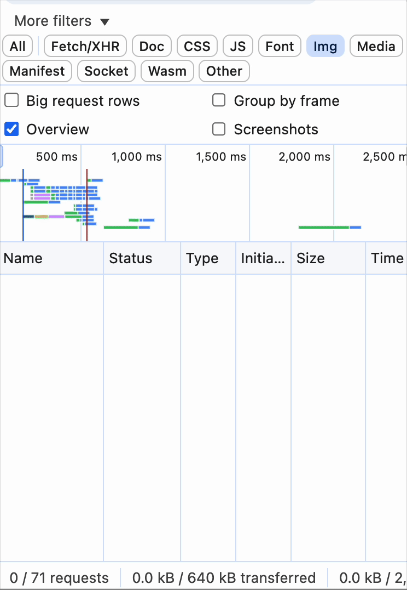

위의 살벌한 이미지는 식당 즐겨찾기 페이지에 접속했을 때의 네트워크 탭이다. 워터폴 타임라인을 보고 무한 요청 에러가 발생한 것으로 오해할 정도였다.

## 1.2. 최적화 필요성

불필요하게 큰 이미지를 요청할 경우 이와 같은 현상이 발생한다. 보통 사용자가 직접 촬영한 사진을 등록하는데, 이때 고해상도 원본 이미지(평균 3000 x 4000)는 렌더링 크기(90 x 90)에 비해 매우 크다.
이로 인해 렌더링 속도가 느려지고 네트워크 부하 발생한다. 이는 사용자 경험 및 LCP와 같은 성능 지표에 악영향을 줄 수 있다. 또한 저장 공간과 전송 비용이 낭비된다. 따라서 압축, 리사이즈 등을 통한 용량 절감이 필요하다.

# 2. 이미지

한 장의 이미지는 픽셀, 메타데이터, 압축 정보, 포맷 구조 등 여러 데이터로 이루어져있다. 이 중 픽셀은 색을 표현하기 위한 최소 단위로, 1920x1080 해상도 이미지는 가로 1920 x 세로 1080 = 약 200만 개의 픽셀로 구성된다.

## 2.1. 색공간

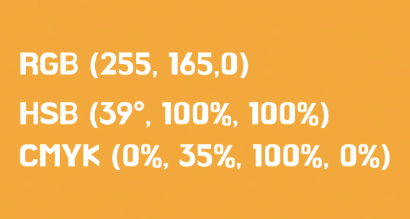

픽셀은 색공간(Color Space)으로 색상 정보를 표현한다. 색공간이란 색을 표현하는 좌표계다. 예를 들어, 같은 귤색이라도 각각의 색공간으로 다르게 표현할 수 있다. 따라서 목적에 따라 최적의 색공간을 이용할 수 있다.

## 2.2. 픽셀 데이터

일반적으로 픽셀은 RGB 색공간을 사용하여 빨강(R), 초록(G), 파랑(B) 각각 0~255 범위의 빛의 강도로 표현한다. 즉, 한 픽셀 = [R, G, B]로, 한 장의 RGB 이미지는 [세로][가로][RGB] 3차원 배열 형태다. 예를 들어 3x3 짜리 빨간 색 이미지는 아래와 같은 구조를 가진다.

```
[ [[255, 0, 0], [255, 0, 0], [255, 0, 0]],
  [[255, 0, 0], [255, 0, 0], [255, 0, 0]],
  [[255, 0, 0], [255, 0, 0], [255, 0, 0]] ]
```

# 3. 리사이즈

리사이즈는 이미지를 구성하는 픽셀 수를 줄이는 것이다. ‘보간 알고리즘’을 통해 각 픽셀의 밝기·색을 거리나 영역 비율에 따라 예측해 채워 넣음으로써 시각적인 왜곡과 손실을 최소화한다.

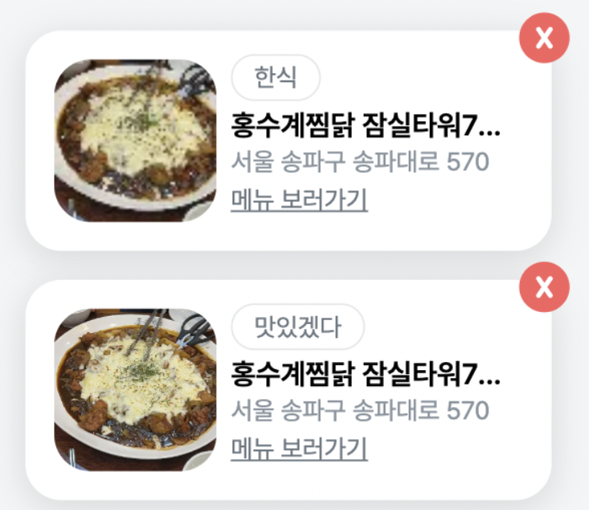

사진에서 위는 90 x 90 리사이즈한 이미지, 아래는 원본 이미지다. 리사이즈한 이미지의 화질이 눈에 띄게 저하된 것을 볼 수 있다. 이는 DPR을 고려하지 않아 발생한 문제다. DPR이란 무엇이며 어떻게 하면 화질 저하 없이 리사이즈할 수 있을까?

## 3.1 물리적 픽셀/논리적 픽셀

먼저 물리적 픽셀과 논리적 픽셀에 대한 이해가 필요하다. 물리적 픽셀은 실제 디스플레이를 구성하는 점의 단위로 ‘iPhone 14 Pro는 2556 × 1179’의 ‘2556 × 1179’에 해당한다. 논리적 픽셀이란 운영체제나 브라우저, CSS가 UI 요소를 배치할 때 사용하는 추상적 단위를 말한다. 개발자/디자이너가 다루는 단위로 ‘width: 100px;’의 px이 논리적 픽셀이다.

## 3.2 DPR

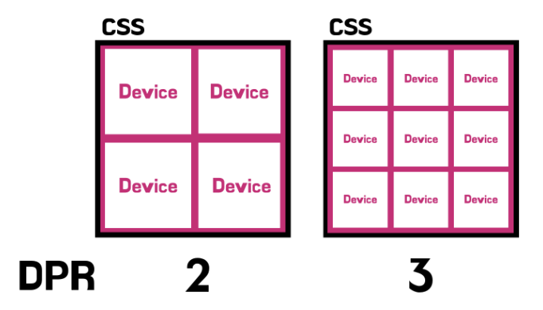

DRP은 디바이스 픽셀(물리적 픽셀)과 CSS 픽셀 수(논리적 픽셀)의 비율을 말한다.

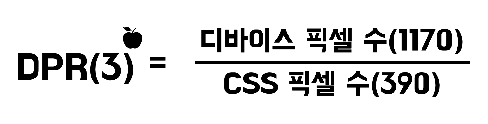

예를 들어 아이폰 13의 경우 디바이스 폭이 1170px이며 CSS 상에서 viewport 폭은 390px이다. 즉, DPR이 3으로 1개의 CSS 픽셀을 표현하기 위해 총 9(가로 3 × 세로 3)개의 물리적 픽셀이 사용된다.

```
console.log(window.devicePixelRatio);
```

window.devicePixelRatio을 통해 현재 화면의 DPR을 구할 수 있다. 아이폰 14pro max → 3, 아이패드 Pro → 2,맥북 → 2 임을 확인했다.

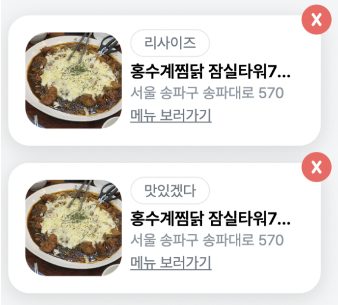

DPR을 고려하여 웹과 모바일 화면에 각각 4배(180 x 180), 9배(270 x 270)로 리사이즈했더니 화질 저하가 체감되지 않았다. 단, 픽셀 수 기준이기 때문에 이미지를 확대하게 되면 화질이 저하된다.

```
/* DPR */


/* 뷰포트 크기 */

```

리사이즈 시 DPR 뿐만 아니라 이미지 포맷도 함께 고려해야 한다. 또한 반응형 웹에서는 뷰포트 크기에 따라 적절하게 리사이즈 해야한다. srcset과 sizes 속성을 통해 다양한 DPR, 뷰포트 크기에 대응하는 이미지를 제공할 수 있다.

- srcset : 화면 상황(DPR/뷰포트 크기)에 따라 브라우저가 선택할 수 있도록 이미지 파일 목록 지정
- sizes : 뷰포트 크기에 따라 필요한 이미지 크기 힌트 제공

# 4. 압축

압축은 리사이즈와 달리 픽셀 수는 유지하지만, 효율적으로 데이터를 저장하여 용량을 줄인다. 무손실/손실 압축으로 구분하여 설명해 봤다.

## 4.1. 무손실 압축

데이터를 압축했다가 다시 복원했을 때 원본 데이터와 완전히 동일하게 복원할 수 있는 압축 방식이다. 처음에는 어떻게 완전한 복원이 가능한지에 의문이 들었다. 당연하게 들릴 수도 있지만 픽셀 정보가 숫자로 이루어진 데이터이기에 가능하다. 반복되는 패턴이나 중복 데이터를 제거하여 용량을 절감하는 것이다. 따라서 픽셀 데이터는 그대로 유지되지만 손실 압축보다 압축률이 낮다. 예시를 통해 원리를 파악해 봤다.

## 4.1.1. Huffman coding(허프만 코딩)

출현 빈도가 높은 값에 짧은 코드를, 낮은 값에 긴 코드를 부여하는 엔트로피 코딩 기법

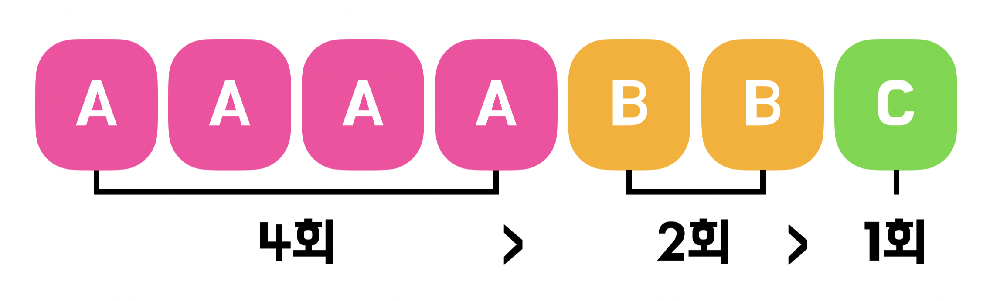

AAAABBC와 같은 데이터가 있다고 가정했을 때 먼저 각 문자의 빈도를 계산한다.

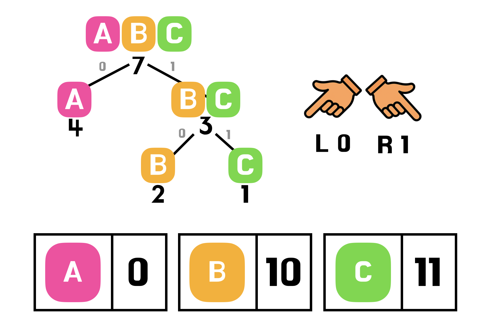

계산된 빈도를 가중치로 사용하여 노드를 만들고, 이를 오름차순 우선순위 큐에 넣는다. 이후 가장 작은 두 노드부터 꺼내서 묶어나가며 트리를 구성한다. 루트에서 왼쪽은 0, 오른쪽은 1을 부여한다. 즉, 가중치가 높은 문자일수록 짧은 코드를 부여받는다.

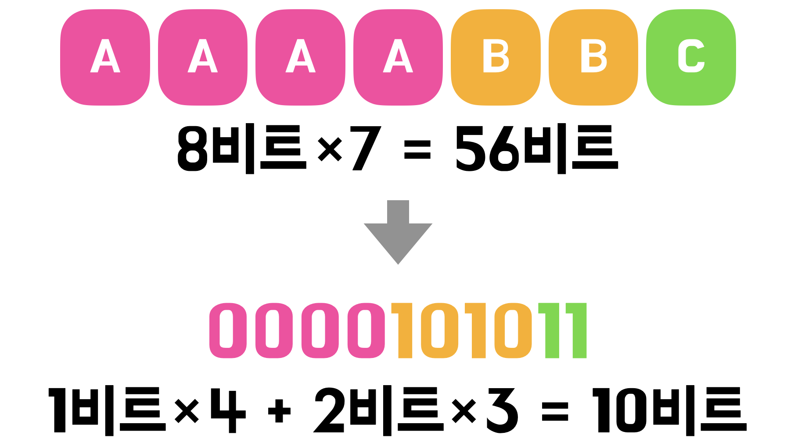

이러한 과정을 통해 용량을 절감한다. 따라서 패턴이 반복되는 이미지를 무손실 압축했을 때 큰 효과를 볼 수 있다.

## 4.2. 손실 압축

무손실 압축과 달리 완벽한 복원을 포기하고, 사람이 인지하기 힘든 정보를 제거하여 압축률을 높인다. 손실 압축은 어찌됐든 데이터가 손실되므로 주의가 필요하다.

### 4.2.1. Color Space Transform

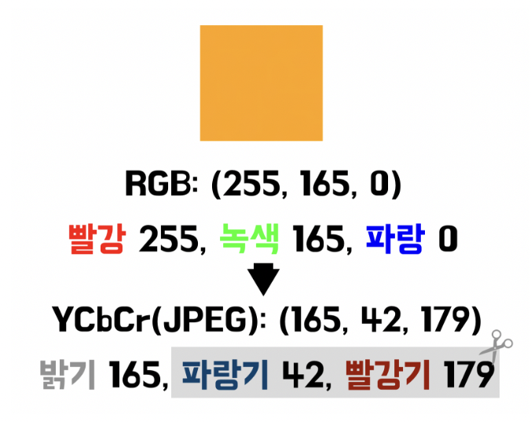

RGB=>YCbCr로 색공간 변환 시 이미지 압축에 용이해진다. YCbCr란 RGB를 밝기(Y)와 색차(Cb, Cr)로 분리한 색 표현 방식이다. 이때 색상의 일부를 제거하여 압축할 수 있다. 사람의 눈은 과학적으로 밝기에 민감하며 색에 둔감하여 손실된 데이터로 인한 화질 저하를 체감하기 어렵다.

### 4.2.2 Chroma Downsampling

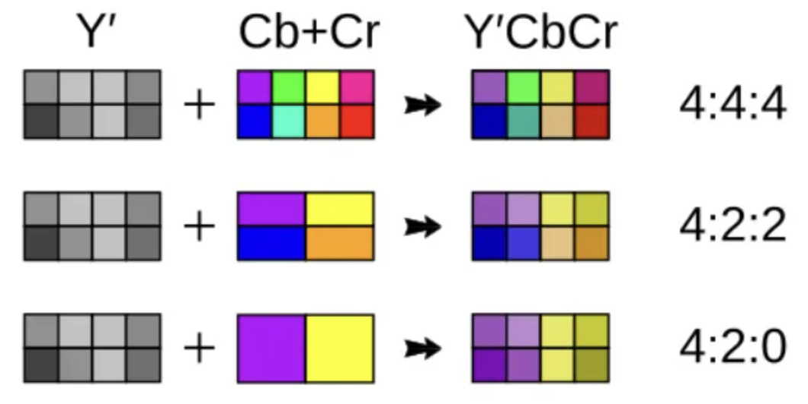

이미지 출처 https://en.wikipedia.org/wiki/Chroma_subsampling

이와 같이 YCbCr 변환 후 밝기는 그대로, 색상은 적게 샘플링하여 저장하는 방식을 크로마 서브샘플링 (Chroma Subsampling)이라고 한다. 이때 Cb/Cr 채널 해상도를 낮추는 처리 과정이 크로마 다운샘플링(Chroma Downsampling)이다.

4:4:4는 모든 픽셀의 색상 정보를 그대로 보존하므로, 원본과 동일한 품질을 유지한다. 4:2:2는 가로 방향으로 인접한 두 픽셀이 하나의 색상을 공유하도록 처리하여 색상 정보가 50%로 감소한다.(세로 방향은 유지) 4:2:0은 가로뿐 아니라 세로 방향에서도 색상 해상도를 절반으로 줄여, 결과적으로 색상 데이터의 75%를 제거한다. 이 방식은 전체 이미지 데이터의 약 50%를 색상 축소만으로 절감할 수 있다.

이와 같은 방식들은 예시일 뿐 다양한 압축 방식이 존재한다. 확장자별로 지원하는 압축 방식이 다른데, JPEG는 손실 압축을 기본으로 사용한다. 반면 PNG는 무손실 압축만을 지원하며, WebP는 두 방식을 모두 지원하기 때문에 목적에 따라 선택할 수 있다.

# 5. 적용

픽잇의 즐겨찾기 이미지는 참고용 이미지로 품질을 중요시하지 않는다. 또한 고작 90 x 90 픽셀로 화면에 표시되므로 리사이즈만으로도 충분한 용량 절감이 가능하다.

```
  //  긴 쪽을 잘라서 정사각형(270×270)으로 만들기
  const cropAndResizeToSquare = (file: File) => {
    const img = new Image();
    const reader = new FileReader();


    reader.onload = e => {
      img.src = e.target?.result as string;
    };


    img.onload = () => {
      const { width, height } = img;


      // 정사각형으로 자를 영역 계산
      const size = Math.min(width, height);
      const startX = (width - size) / 2;
      const startY = (height - size) / 2;


      // 1. crop canvas
      const cropCanvas = document.createElement('canvas');
      const cropCtx = cropCanvas.getContext('2d')!;
      cropCanvas.width = size;
      cropCanvas.height = size;
      cropCtx.drawImage(img, startX, startY, size, size, 0, 0, size, size);


      // 2. resize canvas (270×270)
      const TARGET_SIZE = 270;
      const resizeCanvas = document.createElement('canvas');
      const resizeCtx = resizeCanvas.getContext('2d')!;
      resizeCanvas.width = TARGET_SIZE;
      resizeCanvas.height = TARGET_SIZE;
      resizeCtx.drawImage(cropCanvas, 0, 0, TARGET_SIZE, TARGET_SIZE);


      // 3. Canvas → Blob(File)
      resizeCanvas.toBlob(
        blob => {
          if (blob) {
            const resizedFile = new File([blob], file.name, {
              type: file.type, //
              lastModified: Date.now(),
            });
            onFormChange('thumbnail', resizedFile);
            setPreviewUrl(URL.createObjectURL(resizedFile));
          }
        },
        file.type,
        0.9
      );
    };


    reader.readAsDataURL(file);
  };
```

코드를 더 간결하게 작성하고 싶다면 라이브러리를 활용하자!

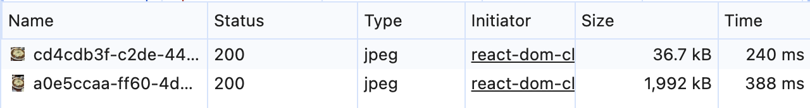

이미지 용량을 1,992kb에서 36.7kb로 약 54배 줄였다! 사진 품질의 중요도가 높지 않아 DPR 3까지만 대응해도 충분하다고 생각했다. Canvas API 기반으로 동작하므로 메타데이터까지 자동으로 제거된다. webp 변환을 고려했으나 이미 사이즈가 매우 작아 효과가 미미했다. Lambda + CloudFront + S3 조합으로 DPR 1/2/3 각각 대처 및 webp 미지원 브라우저 대처가 가능하지만 서비스 규모가 작아 오버엔지니어링이라고 판단했다.

오늘 다룬 내용은 필수적인 지식은 아닙니다. 하지만 원리를 파악하면 활용할 수 있는 범위가 매우 넓어집니다. 예시로 무손실/손실 압축 원리 파악으로 확장자 선택의 기준을 더욱 또렷하게 세울 수 있습니다. 또한 JS 번들 압축이나 웹 배포에 최적화된 폰트 포맷인 WOFF2 내부에서도 무손실 압축과 동일한 알고리즘이 사용됩니다. 따라서 다양한 방식에서 적용된 압축 원리까지 함께 이해할 수 있습니다. 다들 이미지 최적화 화이팅~!
