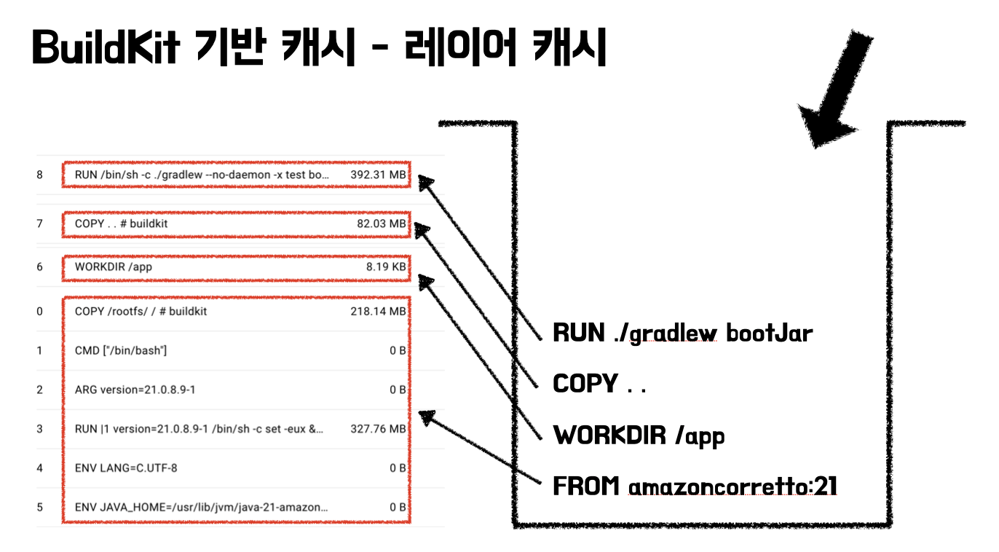
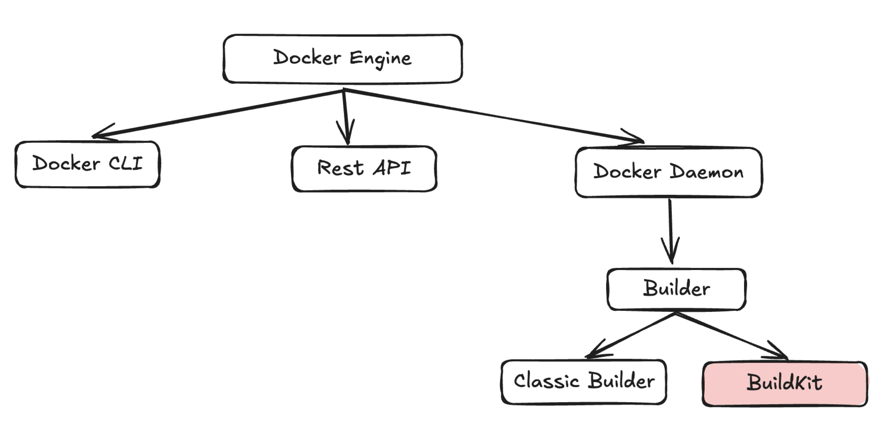
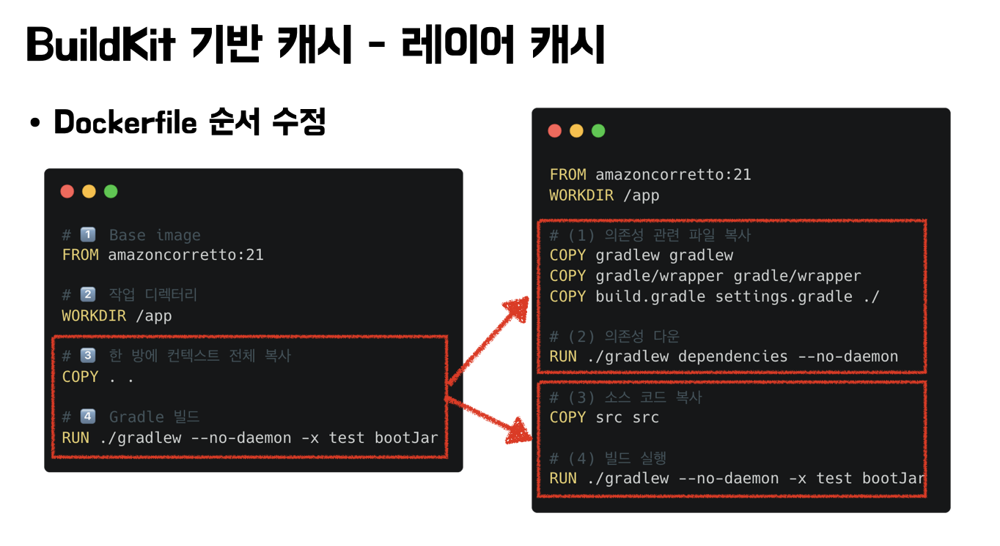
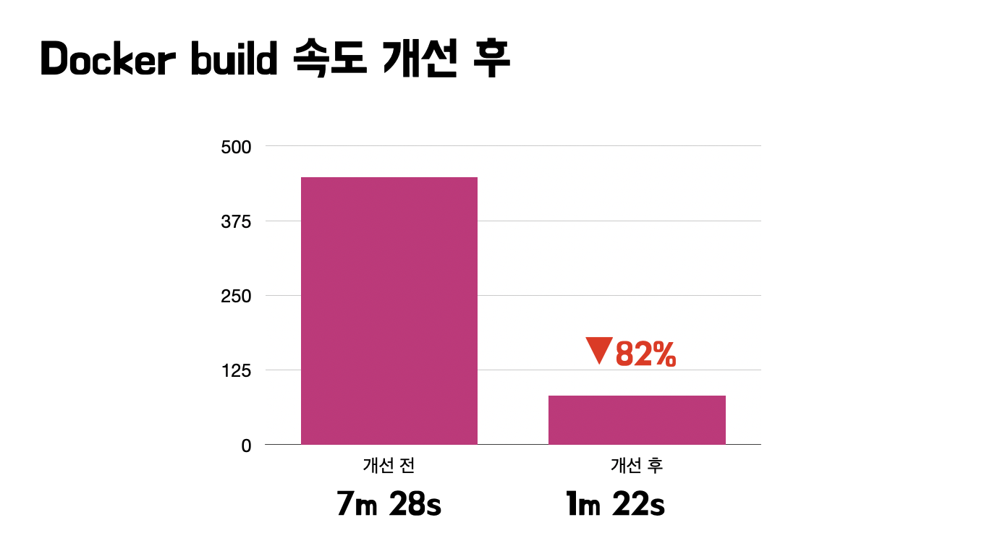
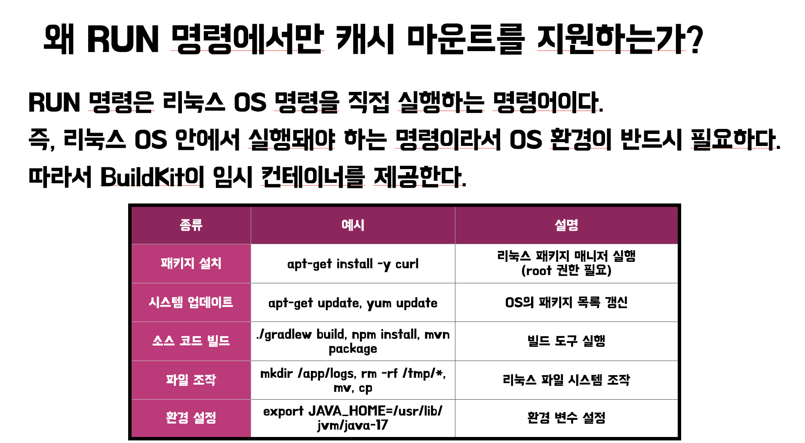

# BuildKit으로 Docker 빌드 80% 더 빠르게 만드는 우아한 방법

이 글에서는 많은 개발자가 CI/CD 파이프라인에서 겪는 문제인 '느린 Docker 이미지 빌드 시간'을 어떻게 단축시켰는지에 대한 과정을 공유하고자 한다.

프로젝트 규모가 커지고 의존성이 복잡해질수록 Docker 이미지 빌드 시간은 기하급수적으로 늘어난다.

우리 팀 역시 초기에는 빌드에 7분-9분이 소요되어 개발 생산성에 큰 영향을 미치고 있었다. 여러 단계에 걸친 최적화 작업을 통해 이 빌드 시간을 **1분**까지 단축하는 데 성공했다. 무려 80% 이상의 시간을
절약한 결과다.

이 글에서는 적용했던 다음과 같은 핵심 최적화 기법들을 단계별로 자세히 소개한다.

* Docker 빌드의 기본 원리 - 레이어와 캐시의 이해
* BuildKit의 등장, 더 빠르고 효율적인 빌더 활용하기
* Dockerfile 순서의 마법 - 캐시 효율 극대화하기
* 멀티 스테이지 빌드 - 이미지 용량 다이어트
* BuildKit 캐시 마운트 - CI/CD 환경에서의 영속적인 캐시 활용
* 원격 캐시 - 여러 환경에서 캐시 공유하기
* Multi-Platform 빌드 - 다양한 아키텍처 지원하기

이 글을 통해 독자의 Docker 빌드 시간 또한 획기적으로 단축되기를 바란다.

---

## Docker 빌드의 기본, Layer와 캐시의 이해

최적화의 첫 시작은 Docker가 이미지를 어떻게 빌드하는지 이해하는 것이다. Docker 이미지는 '**레이어**'라는 여러 개의 읽기 전용 파일 시스템이 겹겹이 쌓인 구조로 이루어져 있다.

> Dockerfile의 `FROM`, `COPY`, `RUN`과 같은 각 명령어는 하나의 레이어를 생성한다.

예를 들어, 아래와 같은 간단한 Dockerfile을 살펴보자.

```dockerfile
# 1. 베이스 이미지 레이어
FROM amazoncorretto:21

# 2. 작업 디렉토리 설정 레이어
WORKDIR /app

# 3. 애플리케이션 파일 복사 레이어
COPY . .

# 4. 애플리케이션 실행 레이어
CMD ["java", "-jar", "app.jar"]
```


이 Dockerfile은 총 4개의 레이어를 생성한다. (사실 베이스 이미지가 여러 레이어를 포함할 수 있으므로 실제로는 더 많음)

### Docker의 캐시 메커니즘

Docker는 빌드 속도를 높이기 위해 이 레이어 구조를 기반으로 한 강력한 캐시 메커니즘을 사용한다.

1. **명령어 확인**: Docker는 Dockerfile의 각 명령어를 순서대로 확인한다.
2. **캐시 확인**: 이전에 동일한 명령어로 생성된 레이어가 로컬 캐시에 있는지 확인한다.
3. **캐시 히트(Cache Hit)**: 만약 있다면, 새로운 레이어를 생성하는 대신 캐시된 레이어를 재사용한다. 빌드 로그에 'Using cache' 라고 표시된다.
4. **캐시 미스(Cache Miss)**: 캐시가 없다면, 명령어를 실행하여 새로운 레이어를 만들고 캐시에 저장한다.

특히 `COPY`나 `ADD` 명령어는 복사되는 파일의 내용이 변경되면 캐시 미스가 발생한다. 이 지점부터 그 이후의 모든 명령어는 캐시를 사용하지 못하고 다시 실행된다.

> 이것이 바로 Dockerfile 명령어의 순서가 최적화에 매우 중요한 이유이다. 자주 변경되지 않는 내용은 앞쪽에, 자주 변경되는 내용은 뒤쪽에 배치해야 캐시 효율을 극대화할 수 있다.

---

## 빌드 속도를 높여줄 빌더, BuildKit

기본적인 레이어와 캐시 개념을 이해했다면, 이제 빌드 프로세스를 한 단계 업그레이드해 줄 BuildKit을 알아볼 차례다.

### Builder란?

도커 데몬 내부의 하위 컴포넌트에 속한다. 빌더는 이미지를 만드는 엔진이다.

즉, `docker build`를 실행했을 때 실제로 Dockerfile을 읽고 이미지를 조립하는 역할을 하는 하위 모듈이다.

현재는 크게 두 종류가 있다 👇

### Buildx란?

`docker build`의 래퍼이자 확장 CLI이다.

* `build`와 다른 점은 동시 다중 빌드를 지원한다.
* 사용자가 BuildKit을 쉽게 다루기 위한 클라이언트이다. 즉, **엔진이 아니라 인터페이스!**
* Buildx는 빌드 요청을 BuildKit으로 보낼지, 다른 곳으로 보낼지 직접 지정할 수 있다. 즉 BuildKit을 어디서 실행할지를 선택한다.

### BuildKit이란?


BuildKit은 Docker 18.09 버전부터 도입된 최신 이미지 빌더 이다. 기존 빌더인 클래식 빌더에 비해 성능, 캐싱, 보안 등 여러 측면에서 크게 개선되었다. 최신 버전의 Docker Desktop에서는
기본적으로 BuildKit이 활성화되어 있지만, 구버전이나 서버 환경에서는 직접 활성화해야 할 수도 있다.

> 공식문서에서도 "Buildx always uses BuildKit." 이라는 문구가 있다.

#### BuildKit 활성화하여 빌드하기

만약 Classic Builder(레거시 Builder)를 사용하는 환경에서 BuildKit 기능을 강제로 키고 싶다면 다음 환경변수를 추가해보도록 하자.

```bash
$ DOCKER_BUILDKIT=1 docker build .
```

내부적으로 `docker buildx build` 처럼 동작할 것이다. `RUN --mount=type=cache` 같은 명령도 작동 가능하다.

### BuildKit의 핵심 장점

#### 병렬 빌드 실행

기존 빌더는 Dockerfile의 명령어를 순차적으로 하나씩 실행했다.

BuildKit은 의존성이 없는 빌드 단계를 분석하여 동시에 병렬로 실행한다. 예를 들어, 멀티 스테이지 빌드에서 서로 다른 스테이지가 동시에 빌드될 수 있어 전체 빌드 시간이 단축된다.

#### 캐싱 기능

BuildKit은 단순히 이전 레이어만 재사용하는 것을 넘어, 훨씬 더 정교한 캐싱 전략을 제공한다.

특히 `RUN` 명령어에 `--mount=type=cache` 옵션을 사용하여 빌드 중 생성되는 캐시(Gradle, Maven, npm 의존성 파일)를 다음 빌드에서도 재사용할 수 있게 해준다. 이 기능은 뒤에서
자세히 다룰 것이다.

#### 불필요한 파일 건너뛰기

빌드에 사용되지 않는 스테이지나 파일은 빌드 컨텍스트에 포함시키지 않아 효율성을 높인다.

#### 보안 강화

`--secret` 옵션을 통해 빌드 시에만 사용되고 최종 이미지에는 남지 않는 민감한 정보(API 키, 토큰 등)를 안전하게 전달할 수 있다.

> Docker 빌드 최적화를 논할 때 BuildKit은 거의 핵심이다.

---

## 최적화 1 - 느린 QEMU 대신 네이티브 빌드로 전환하기

최근 개발 환경은 점점 더 다양해지고 있다. 많은 개발자들이 Apple Silicon(ARM64)이 탑재된 Mac을 사용하고, 클라우드 환경에서는 AWS Graviton(ARM64)과 같은 고효율 프로세서의 사용이
늘고 있다. 이로 인해 단일 아키텍처(AMD64)뿐만 아니라 여러 아키텍처를 지원하는 Docker 이미지를 빌드해야 할 필요성이 커졌다.

### 🧩 기존의 문제: QEMU 에뮬레이션 빌드의 한계

과거에는 서로 다른 아키텍처의 이미지를 빌드하기 위해 각 환경별로 별도의 파이프라인을 만들어야 했다. 이 과정은 번거롭고 유지보수 비용이 컸다.

이 문제를 간소화하기 위해 **Docker Buildx**가 등장했다.

Buildx는 BuildKit의 기능을 CLI에서 최대한 활용할 수 있게 해주는 확장 도구로, 가장 큰 장점은 하나의 명령어로 여러 아키텍처용 이미지를 동시에 빌드하고 이를 하나의 이미지 태그로 묶어주는 *
*매니페스트 리스트(manifest list)** 를 생성한다는 점이다.

```bash
# buildx 빌더 생성 및 사용 설정 (최초 1회)
$ docker buildx create --name mybuilder --use
$ docker buildx inspect --bootstrap

# multi-platform 빌드 및 푸시
$ docker buildx build \
  --platform linux/amd64,linux/arm64 \
  --tag ghcr.io/my-org/my-app:latest \
  --push \
  .
```

이 명령어를 실행하면 Buildx는 `--platform` 옵션에 지정된 각 아키텍처별로 빌드를 병렬로 수행하고, 내부적으로 **QEMU 에뮬레이터**를 사용한다.

빌드가 완료되면 이미지가 레지스트리에 푸시되고, 마지막 단계에서 `my-app:latest` 태그 아래에 여러 아키텍처를 가리키는 매니페스트 리스트가 생성된다.

이렇게 하면 사용자가 단순히 `docker pull ghcr.io/my-org/my-app:latest` 를 입력하더라도 Docker가 자동으로 현재 시스템 아키텍처에 맞는 이미지를 다운로드한다.

> 덕분에 `my-app:latest-amd64`, `my-app:latest-arm64`와 같이 아키텍처별 태그를 따로 관리할 필요가 없어진다.

하지만 이 방식에는 한 가지 치명적인 단점이 있다. 바로 **QEMU 에뮬레이션 속도 문제**다.

### 🐢 QEMU의 느린 빌드 속도

QEMU는 실제 하드웨어 명령어를 소프트웨어로 변환해 실행한다.

즉, ARM 환경에서 AMD64 이미지를 빌드할 때, QEMU가 모든 명령어를 시뮬레이션하기 때문에 빌드 속도가 크게 느려진다.

예를 들어 동일한 Dockerfile을 기준으로 보면,

* 네이티브 ARM64 빌드: 약 1분 10초
* QEMU를 이용한 AMD64 빌드: 약 6~8분

처럼 최대 5배 이상의 시간 차이가 발생한다.

특히 Gradle 같은 빌드 도구는 CPU 연산과 I/O가 많기 때문에 QEMU 환경에서는 빌드가 매우 비효율적으로 진행된다.

### 🚀 해결: 네이티브 빌드 환경으로 전환하기

이 문제를 해결하기 위해 QEMU 대신 **네이티브 환경에서 직접 빌드**하는 방식으로 전환한다.

즉, `linux/arm64` 이미지는 ARM 환경에서, `linux/amd64` 이미지는 AMD 환경에서 각각 빌드한다.

GitHub Actions에서는 `runs-on` 옵션을 활용해 아키텍처별 환경을 나눌 수 있다.

다음 예시는 ARM 서버와 x86 서버에서 각각 빌드 후 결과 이미지를 하나로 합치는 방식이다.

```yaml
jobs:
  build-arm:
    runs-on: ubuntu-22.04-arm
    steps:
    - uses: actions/checkout@v3
    - uses: docker/setup-buildx-action@v2
    - uses: docker/login-action@v2
      with:
        registry: ghcr.io
        username: ${{ github.actor }}
        password: ${{ secrets.GITHUB_TOKEN }}
    - uses: docker/build-push-action@v4
      with:
        push: true
        platforms: linux/arm64
        tags: ghcr.io/my-org/my-app:arm64
        cache-from: type=registry,ref=ghcr.io/my-org/my-app:cache
        cache-to: type=registry,ref=ghcr.io/my-org/my-app:cache,mode=max

  build-amd:
    runs-on: ubuntu-22.04
    steps:
    - uses: actions/checkout@v3
    - uses: docker/setup-buildx-action@v2
    - uses: docker/login-action@v2
      with:
        registry: ghcr.io
        username: ${{ github.actor }}
        password: ${{ secrets.GITHUB_TOKEN }}
    - uses: docker/build-push-action@v4
      with:
        push: true
        platforms: linux/amd64
        tags: ghcr.io/my-org/my-app:amd64
        cache-from: type=registry,ref=ghcr.io/my-org/my-app:cache
        cache-to: type=registry,ref=ghcr.io/my-org/my-app:cache,mode=max
```

#### ⚡️ 효과: 빌드 속도 70~80% 단축

네이티브 빌드 환경을 적용한 결과, QEMU 기반 빌드 대비 80% 이상 빌드 속도가 단축되었다.

* `runs-on: ubuntu-22.04-arm` 환경을 활용하면 EC2 서버와 동일한 ARM64 환경에서 직접 빌드가 가능해 에뮬레이션 오버헤드를 완전히 제거한다.
* 레지스트리 캐시(`--cache-to`, `--cache-from`)까지 병행 사용하면 반복 빌드 시에도 속도 저하 없이 일관된 빌드 시간을 유지해 더 빠른 빌드 속도를 경험할 수 있다.

---

## 최적화 2 - Dockerfile 순서

> 캐시를 잘 활용하려면, 자주 바뀌지 않는 것을 앞에 두어야 한다.

Docker 빌드 최적화의 가장 기본적인 원칙이다.

위에서 설명한 바와 같이, 특정 레이어에서 캐시가 무효화되면 그 이후의 모든 레이어는 새로 빌드되어야 한다. 소스 코드는 개발 과정에서 계속해서 변경되므로, `COPY . .`와 같이 전체 소스 코드를 복사하는
구문이 앞쪽에 있다면 캐시의 이점을 누릴 수 없다.

### 나쁜 예시 (Bad Practice)

```dockerfile
FROM amazoncorretto:21
WORKDIR /app

# 소스 코드가 변경될 때마다 매번 모든 의존성을 새로 다운로드 받게 됨
COPY . .
RUN ./gradlew bootJar

CMD ["java", "-jar", "build/libs/app.jar"]
```

위 Dockerfile은 소스 코드의 아주 작은 부분이 변경되어도, `COPY . .` 단계에서 캐시가 깨지기 때문에 `RUN ./gradlew bootJar` 명령어가 항상 다시 실행된다. 즉, 매번 Gradle
의존성을 새로 다운로드하고 컴파일하는 비효율이 발생한다.

### 좋은 예시 (Good Practice)

이 문제를 해결하기 위해, 의존성 관련 파일과 실제 소스 코드를 분리하여 복사하는 전략을 사용한다.

```dockerfile
FROM amazoncorretto:21
WORKDIR /app

# 1. 의존성 관련 파일만 먼저 복사
# (build.gradle, settings.gradle 등)
COPY build.gradle settings.gradle ./
COPY gradle ./gradle

# 2. 의존성을 먼저 다운로드하여 레이어에 캐싱
# 이 레이어는 build.gradle 파일이 변경될 때만 다시 실행됨
RUN ./gradlew dependencies

# 3. 전체 소스 코드 복사
# 소스 코드 변경 시 이 지점부터 빌드가 다시 시작됨
COPY . .

# 4. 애플리케이션 빌드 (의존성은 캐시된 레이어 사용)
RUN ./gradlew bootJar

CMD ["java", "-jar", "build/libs/app.jar"]
```



#### 개선 효과

* `build.gradle` 파일이 변경되지 않는 한, `RUN ./gradlew dependencies` 단계는 캐시된 레이어를 사용한다.
* 개발 중 소스 코드만 변경될 경우, `COPY . .` 단계부터 빌드가 다시 시작된다.
* 하지만 이미 의존성 파일들은 이전 레이어에 다운로드되어 있으므로, `RUN ./gradlew bootJar`는 다시 의존성을 다운로드하지 않고 빠르게 컴파일 및 패키징만 수행한다.

> 단순히 `COPY` 명령어의 순서와 대상을 조절하는 것만으로도 빌드 시간을 크게 단축시킬 수 있다.

---

## 최적화 3 - 멀티 스테이지 빌드

> 빌드 속도만큼 중요한 것은 바로 최종 이미지의 크기다.

이미지 크기가 작을수록 레지스트리 PUSH, PULL 속도가 빨라지고, 배포 시간이 단축되며, 저장 공간을 절약할 수 있다.

또한, 불필요한 도구나 파일이 없는 이미지는 보안적으로도 더 안전하다.

### 뚱뚱 이미지

일반적인 빌드 방식에서는 JDK, Gradle, 소스 코드 등 빌드에 필요했던 모든 파일들이 최종 이미지에 포함되는 경우가 많다. 하지만 실제 운영 환경에서 애플리케이션을 실행하는 데 필요한 것은 단지 JRE와
컴파일된 `*.jar` 파일뿐이다.

### 멀티 스테이지 빌드

멀티 스테이지 빌드는 하나의 Dockerfile 안에서 여러 개의 `FROM` 명령어를 사용하여 빌드 환경과 실행 환경을 분리하는 기법이다.

1. **빌더(Builder) 스테이지**: 첫 번째 스테이지에서는 JDK와 빌드 도구를 포함한 이미지에서 소스 코드를 컴파일하고 실행 가능한 아티팩트(예: `app.jar`)를 생성한다.
2. **최종(Final) 스테이지**: 두 번째 스테이지에서는 JRE만 포함된 가벼운 베이스 이미지에서 시작하여, 빌더 스테이지에서 생성된 아티팩트만 `COPY --from=builder` 명령어로 가져온다.

### 멀티 스테이지 빌드 예시

```dockerfile
# =========================================================
# 1. 빌더(Builder) 스테이지: 앱을 빌드하는 환경
# =========================================================
FROM amazoncorretto:21 AS builder
WORKDIR /app

COPY build.gradle settings.gradle ./
COPY gradle ./gradle
RUN ./gradlew dependencies --no-daemon

COPY . .
RUN ./gradlew bootJar --no-daemon

# =========================================================
# 2. 최종(Final) 스테이지: 앱을 실행하는 환경
# =========================================================
FROM amazoncorretto:21-al2-jre
WORKDIR /app

# 빌더 스테이지에서 생성된 JAR 파일만 복사
COPY --from=builder /app/build/libs/*.jar app.jar

ENTRYPOINT ["java", "-jar", "app.jar"]
```

#### 효과

* **이미지 크기 감소**: 최종 이미지에는 JDK, Gradle, 소스 코드 등이 전혀 포함되지 않고, 오직 JRE와 `app.jar` 파일만 남게 되어 이미지 크기가 수백 MB 이상 감소한다.
* **보안 강화**: 공격에 사용될 수 있는 빌드 관련 도구나 불필요한 라이브러리가 제거되어 보안 표면이 줄어든다.
* **관리 용이성**: 복잡한 셸 스크립트 없이도 Dockerfile 하나만으로 빌드와 실행 환경을 깔끔하게 분리하여 관리할 수 있다.

---

## 최적화 4 - BuildKit 캐시 마운트 활용하기 (feat. Gradle)

Dockerfile 순서를 최적화하고 멀티 스테이지 빌드를 적용했지만, 여전히 아쉬운 점이 남는다.

`build.gradle` 파일에 작은 변경(주석 추가, 라이브러리 버전 수정 등)만 생겨도 의존성을 다운로드하는 레이어의 캐시가 깨지고, 모든 의존성을 처음부터 다시 받아와야 한다. 이 과정은 수 분이 소요될 수
있는 매우 비싼 작업이다.

### BuildKit의 cache 마운트

이 문제를 해결하기 위해 BuildKit은 `RUN` 명령어에 `--mount=type=cache` 옵션을 제공한다. 이 옵션은 Docker 호스트의 캐시 디렉토리를 빌드 컨테이너의 특정 경로에 마운트하여,
`RUN` 명령어가 실행되는 동안 해당 디렉토리의 내용을 유지하고 다음 빌드에서 재사용할 수 있게 해준다.

### 캐시 마운트 적용 예시 (Gradle)

Gradle은 다운로드한 의존성을 보통 `~/.gradle/caches` 디렉토리에 저장한다. 우리는 이 디렉토리를 캐시 마운트의 target으로 지정할 수 있다.

```dockerfile
# ... (이전 스테이지)

# RUN 명령어에 --mount=type=cache 옵션 추가
# target: 컨테이너 내에서 캐시로 사용할 경로
# id (선택사항): 여러 캐시 마운트를 구분하기 위한 고유 ID
RUN --mount=type=cache,target=/root/.gradle/caches,id=gradle-caches \
    ./gradlew bootJar --no-daemon

# ... (이후 스테이지)
```

#### 동작 방식

1. `RUN` 명령어가 실행될 때, Docker는 호스트에 `gradle-caches`라는 이름의 캐시 볼륨이 있는지 확인한다.
2. 이 캐시 볼륨을 컨테이너의 `/root/.gradle/caches` 경로에 마운트한다.
3. `./gradlew bootJar`가 실행되면, 의존성을 다운로드할 때 이 마운트된 디렉토리를 사용한다. 이미 다운로드된 파일이 있다면 네트워크 통신 없이 바로 사용한다. 새로 다운로드된 파일은 이 디렉토리에
   저장된다.
4. `RUN` 명령어가 종료되면 마운트가 해제되지만, 캐시 디렉토리의 내용은 호스트에 그대로 남아 다음 빌드를 위해 유지된다.

#### 개선 효과

* **의존성 다운로드 시간 절약**: `build.gradle` 파일이 변경되어 레이어 캐시가 깨지더라도, Gradle은 캐시 마운트에 남아있는 파일들을 재사용하므로 의존성을 다시 다운로드하는 시간을 거의 없앨 수
  있다.
* **다양한 도구에 적용 가능**: 이 방식은 Gradle뿐만 아니라 Maven (`/root/.m2`), npm (`/root/.npm`), apt (`/var/cache/apt`) 등 다양한 패키지 매니저의
  캐시 디렉토리에도 동일하게 적용할 수 있다.

> 캐시 마운트는 CI/CD 환경처럼 매번 새로운 환경에서 빌드하는 경우에 강력한 효과를 발휘한다.

---

## 최적화 5 - CI/CD 환경에서의 원격 캐시

로컬 환경에서 캐시 마운트를 사용하면 빌드 속도가 크게 향상되지만, GitHub Actions와 같은 CI/CD 환경에서는 또 다른 문제가 발생한다.

CI 작업은 대부분 매번 새로운 가상 머신이나 컨테이너 위에서 실행되기 때문에, 이전 작업에서 생성된 Docker 빌드 레이어 캐시나 캐시 마운트가 다음 작업으로 이어지지 않는다. 결국 CI 환경에서는 매번 '캐시
없는' 상태에서 빌드를 시작하게 된다.

이를 해결하기 위한 방법은 바로 **원격 캐시**이다.

### 원격 캐시란?

빌드 과정에서 생성된 캐시 데이터(레이어 등)를 Docker Hub, GitHub Container Registry(GHCR), AWS S3와 같은 원격 저장소에 저장하고, 다음 빌드 시에 가져와서 사용하는
방식이다.

BuildKit은 `--cache-from`과 `--cache-to` 플래그를 통해 이 기능을 지원한다.

* `--cache-to`: 빌드가 완료된 후 캐시를 지정된 원격 저장소로 내보낸다.
* `--cache-from`: 빌드를 시작하기 전, 지정된 원격 저장소에서 캐시를 가져온다.

### 원격 캐시 적용 예시

GitHub Actions 워크플로우에서 Docker Hub을 캐시 저장소로 사용하는 예시다.

```yaml
# .github/workflows/ci.yml

name: CI

on:
  push:
    branches: [ "main" ]

jobs:
  build:
    runs-on: ubuntu-latest

    steps:
      - name: Checkout
        uses: actions/checkout@v3

      - name: Set up Docker Buildx
        uses: docker/setup-buildx-action@v2

      - name: Log in to Docker Hub
        uses: docker/login-action@v2
        with:
          registry: docker.io
          username: ${{ secrets.DOCKERHUB_USERNAME }}
          password: ${{ secrets.DOCKERHUB_TOKEN }}

      - name: Build and push
        uses: docker/build-push-action@v4
        with:
          context: .
          push: true
            # Docker Hub 태그 형식: docker.io/<username>/<repo>:latest
          tags: docker.io/${{ secrets.DOCKERHUB_USERNAME }}/my-app:latest

            # 캐시 설정 (Docker Hub 레지스트리 활용)
          cache-from: type=registry,ref=docker.io/${{ secrets.DOCKERHUB_USERNAME }}/my-app:cache
          cache-to: type=registry,ref=docker.io/${{ secrets.DOCKERHUB_USERNAME }}/my-app:cache,mode=max
```

#### 동작 방식

1. 워크플로우가 시작되면 `cache-from` 설정을 통해 `docker.io/${{ secrets.DOCKERHUB_USERNAME }}/my-app:cache` 이미지로부터 캐시 메타데이터를 가져온다.
2. Docker 빌드가 진행되면서 가져온 캐시를 최대한 활용하여 빌드 시간을 단축한다.
3. 빌드가 성공적으로 완료되면 `cache-to` 설정을 통해 새로운 캐시 레이어들을 `docker.io/${{ secrets.DOCKERHUB_USERNAME }}/my-app:cache` 이미지로 내보내 다음
   빌드를 위해 저장한다.

#### 개선 효과

* **지속적인 캐시 활용**: CI 환경이 매번 초기화되더라도, 원격지에 저장된 캐시를 통해 빌드 속도를 꾸준히 빠르게 유지할 수 있다.
* **협업**: 여러 개발자가 동일한 원격 캐시를 공유함으로써, 누가 빌드를 하든 빠른 속도를 경험할 수 있다.

---

## 최적화 여정의 결과

지금까지 Docker 빌드 속도를 개선하기 위해 적용했던 여러 최적화 기법들을 살펴보았다.

야구보구의 CI는 7분 28초에서 **1분 22초**로 개선됐다. 우리 팀은 Docker 빌드 프로세스를 단계적으로 분석하고 개선함으로써 개발자의 시간을 아끼고 CI/CD 파이프라인의 효율을 극대화할 수 있었다.


### 핵심 요약

1. **기본에 충실해야 한다**
    * Docker의 레이어와 캐시 동작 방식을 이해하는 것이 모든 최적화의 출발점이다. 자주 변경되지 않는 무거운 작업을 Dockerfile 앞단에 배치해야 한다.
2. **BuildKit을 적극 활용해야 한다**
    * 병렬 빌드, 캐시 마운트 등 BuildKit이 제공하는 강력한 기능들은 최적화의 핵심 무기다. 아직 사용하고 있지 않다면 지금 바로 도입을 검토해야 한다.
3. **캐시**
    * 소스 코드 변경 시에도 의존성을 다시 받지 않도록 캐시 마운트를 사용하고, CI 환경에서는 원격 캐시를 구축하여 캐시의 이점을 최대한 활용해야 한다.
4. **이미지는 가볍게**
    * 멀티 스테이지 빌드는 이제 선택이 아닌 필수다. 최종 이미지의 크기를 줄여 보안을 강화하고 배포 속도를 높여야 한다.
5. **다양한 환경을 대비해야 한다**
    * `buildx`를 이용한 Multi-Platform 빌드는 변화하는 개발 및 운영 환경에 유연하게 대응할 수 있게 한다.

### 더 궁금한 점


