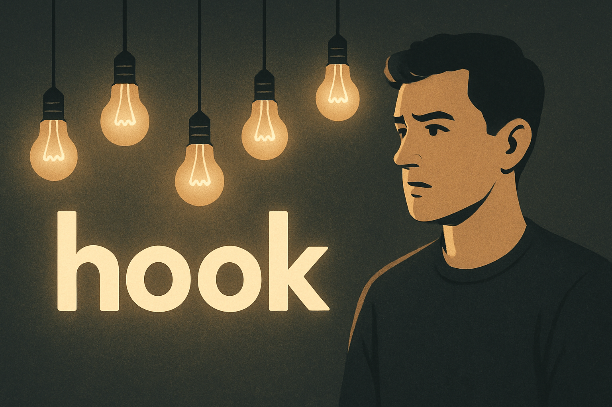
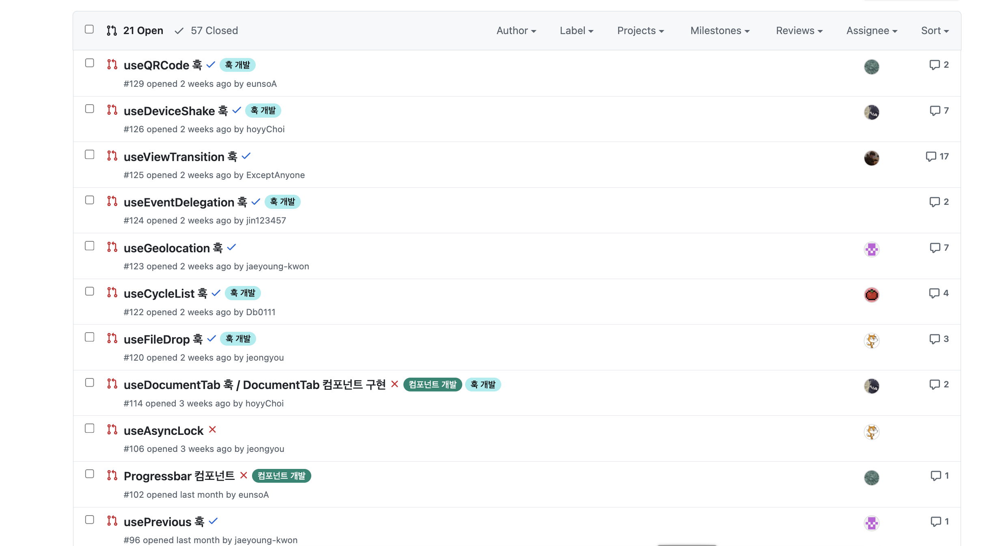
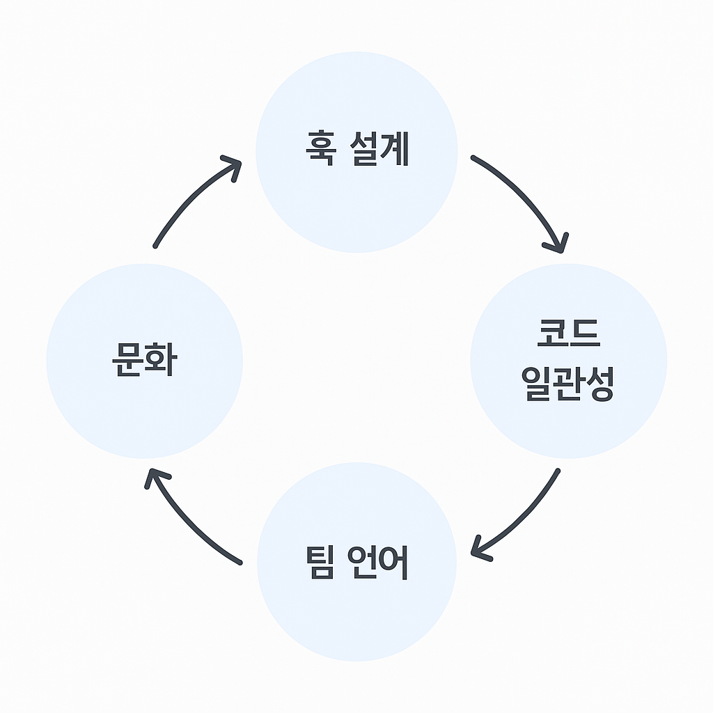

# 💡 좋은 훅을 설계하기 위한 5가지 원칙

> DX와 성능, 일관성, 그리고 경험으로 완성되는 React 훅 설계 이야기

<div align="center">
  
</div>

## 0. 들어가며

React를 사용하다 보면 누구나 한 번쯤 **훅을 만들어본 경험**이 있을 것입니다. 그러나 직접 만든 훅을 **다른 사람과 함께 사용하기 위해 설계**해본 경험은 많지 않습니다. 대부분은 특정 상황에서만 동작하는 훅을 빠르게 작성하거나, 이미 만들어진 것을 가져다 쓰는 수준에 그치죠.

> **동작하는 훅**과 **잘 설계된 훅**은 완전히 다르다.

이 글은 제가 진행한 **Hookdle 스터디**에서 얻은 경험을 바탕으로, "**좋은 훅은 어떤 설계에서 탄생하는가**"를 탐구한 기록입니다.

단순히 기능적으로 작동하는 훅을 넘어서, **일관성과 직관성**, 그리고 **개발자 경험(DX)** 을 중심으로 훅을 설계한 사례를 공유합니다.

<div style="margin:50px"></div>

---

<div style="margin:50px"></div>

## 1. 훅 설계에 관심을 갖게 된 배경

여러 프로젝트를 진행하면서 자연스럽게 **React 기반의 커스텀 훅**을 만들 일이 많아졌습니다. 이벤트 바인딩, 다이얼로그 제어, 상태 초기화처럼 프로젝트마다 반복되는 패턴이 많았기 때문이죠.

처음엔 단순했습니다. **"복붙을 줄이자."**

하지만 어느 날 팀원들이 제 훅을 사용하면서 같은 질문을 반복했습니다.

> "호이초이! 이 훅 어떻게 써요?"
> "훅에 들어가는 세 번째 인자가 뭐였죠?"

심지어 대부분은 훅 내부 코드를 열어보며 사용법을 **유추**하고 있었습니다.

그제서야 알았습니다.

> **내가 만든 훅이 편리한 게 아니라, 오히려 장벽이 되고 있었다.**

이 문제의식이 계기가 되어 **Hookdle 스터디**를 시작했습니다.
단순히 "좋은 훅을 함께 만들어보자"에서 출발했지만, 점차 "**이 인터페이스는 정말 자연스러운가?**" 같은 본질적인 질문으로 확장되었습니다. Hookdle은 그렇게 단순한 스터디를 넘어, **개발자 경험(DX)을 실험하고 설계하는 작은 연구소**로 발전했습니다.

<div align="center">
  
  <figcaption style="font-size: 13px; color: #777; margin-top: 6px;">
    Hookdle 스터디 Pull Request 목록
  </figcaption>
</div>
<div style="margin:30px"></div>

스터디를 진행하면서 여러 번의 시행착오 끝에 하나의 결론에 도달했습니다.

**"좋은 훅은 코드가 아니라, 설계에서 시작된다."**

이 깨달음을 구체화하기 위해, 먼저 비효율적이었던 훅들을 분석했습니다. 코드 자체보다 **설계의 문제(인자 구조, 반환 방식, 참조 안정성)** 가 사용자 경험에 더 큰 영향을 미친다는 사실을 발견했습니다.

이제부터는 그 구체적인 개선 과정을 단계별로 살펴보려 합니다.

<div style="margin:50px"></div>

---

<div style="margin:50px"></div>

## 2. 나쁜 훅 설계의 특징

훅을 만들다 보면 금세 깨닫습니다.

**"동작하는 코드와 쓰기 좋은 코드는 완전히 다르다."**

저는 3가지 실패 사례를 통해 이 사실을 체감했습니다.

<div style="margin:50px"></div>

### 실패 1 : 위치 인자 기반의 혼동

```tsx
const [count, inc, dec, reset] = useCounter(0, 5, 10);
```

겉보기엔 단순해 보이지만, 팀원들은 늘 같은 질문을 했습니다.

> "이게 min, max, step 중 뭐가 뭐예요?"

인자가 많아질수록 외워야 할 것이 늘어나고, IDE 자동완성도 도움이 되지 않습니다.
결과적으로 사용자는 코드를 직접 열어봐야 의도를 이해할 수 있습니다.

<div style="margin:50px"></div>

### 실패 2 : 반환 구조의 불명확함

```tsx
const [count, increase, decrease, reset] = useCounter();
```

배열 반환은 익숙하지만, 인자의 의미를 기억해야 합니다. IDE는 각 항목의 역할을 알려주지 않으므로, 시간이 지나면 "3번째로 반환하는 값(ex. decrease)이 뭐였지?"라는 기억 의존형 사용이 반복됩니다.

<div style="margin:50px"></div>

### 실패 3 : 내부 최적화의 부재

단순한 훅이라도 내부 최적화(`useCallback`, `useRef`)가 없으면 대규모 컴포넌트 트리에서 성능 저하를 유발할 수 있습니다.

예를 들어 다음과 같은 형태가 있습니다.

```tsx
export function useBooleanState(initial = false) {
  const [value, setValue] = useState(initial);

  const setTrue = () => setValue(true);
  const setFalse = () => setValue(false);
  const toggle = () => setValue((v) => !v);

  return [value, setTrue, setFalse, toggle];
}
```

겉보기엔 완벽히 작동하지만, 이 훅이 여러 컴포넌트에서 호출되면 **`setTrue`, `setFalse`, `toggle`이 매 렌더마다 새로 생성**됩니다. 이는 불필요한 리렌더링을 유발합니다.

또한 외부에서 전달받은 콜백을 사용하는 훅이라면, 다음과 같은 형태로 **콜백 참조 불안정성**이 발생할 수 있습니다.

```tsx
function useEventListener(eventName, handler) {
  useEffect(() => {
    window.addEventListener(eventName, handler);
    return () => window.removeEventListener(eventName, handler);
  }, [eventName, handler]);
}
```

이 경우 `handler`가 렌더마다 새로 생성되면, `useEffect`가 매번 재실행되며 이벤트 리스너가 반복 등록/해제됩니다.

즉, **참조 안정성(ref)** 을 고려하지 않으면 훅 내부의 `useEffect`나 이벤트 리스너가 불필요하게 다시 실행될 수 있습니다.

이런 문제는 작고 단순한 훅에서도 쉽게 발생합니다. 특히 라이브러리나 공용 코드 레벨에서 작성된 훅은 한 번 배포되면 수십, 수백 개의 컴포넌트에서 재사용되기 때문에 작은 비효율이 누적되어 전반적인 성능 저하로 이어집니다.

> **"작은 훅일수록, 내부 최적화는 더 중요합니다."**
> 훅은 한 번 만들어지면 다른 팀원들, 더 나아가 다른 프로젝트에서도 그대로 사용됩니다.
> 즉, **한 번의 설계가 수많은 개발자의 경험**을 결정짓습니다.
> 이 사실을 깨닫고 나서야, 저는 작게 만든 훅 하나에도 신중해야 한다는 **책임감**을 갖게 되었습니다.

<div style="margin:50px"></div>

---

<div style="margin:50px"></div>

## 3. 좋은 훅을 만드는 설계 방향

앞선 실패를 통해 1가지 분명해졌습니다.

**"좋은 훅은 기능이 아니라 설계로 완성된다."**

동작만 하는 훅은 금세 한계를 드러내지만, 설계된 훅은 팀의 언어가 됩니다!
이제 각 실패 사례를 어떻게 개선했는지, 그리고 어떤 기준으로 설계를 다듬었는지 살펴보겠습니다.

<div style="margin:50px"></div>

### 개선 1 : 인자는 '순서'보다 '의도'를 설계하라

#### 문제

위치 기반 인자는 직관성이 떨어집니다.

```tsx
const [count, inc, dec, reset] = useCounter(0, 10, 5);
```

이 코드는 동작하지만, 팀원에게 넘겨줄 때 매번 같은 질문이 반복됩니다.

> "이게 min, max, step 중 뭐가 뭐였죠?"

<div style="margin:40px"></div>

#### 개선 방향

인자의 순서를 외워야 하는 문제를 해결하기 위해 **옵션 객체 패턴**을 도입했습니다.

```tsx
const { count, increment, decrement, reset } = useCounter(0, {
  min: 0,
  max: 10,
  step: 5,
});
```

옵션 객체는 다음과 같은 장점을 가집니다.

> - 인자 순서를 기억할 필요가 없다.
> - IDE 자동완성으로 옵션을 직관적으로 확인할 수 있다.
> - 기능이 늘어나도 기존 시그니처가 깨지지 않는다.

#### 결과

IDE 도움을 통해 팀원들의 사용 오류가 **90% 이상 감소**했고 새로운 옵션(onChange, clamp, loop 등)을 추가해도 기존 코드가 깨지지 않았습니다.

<div style="margin:50px"></div>

### 개선 2 : 배열보다 '이름'이 말하게 하라

#### 문제

useState처럼 익숙한 훅으로 인해 배열 구조는 익숙하지만, 의미가 숨겨집니다.

```tsx
const [count, increase, decrease, reset] = useCounter();
```

즉, 이러한 구조는 외워야만 쓸 수 있습니다. IDE는 반환값의 역할을 알려주지 않기 때문이죠.

<div style="margin:40px"></div>

#### 개선 방향

이름 기반 접근을 지원하는 **객체 반환 구조**로 전환했습니다.

```tsx
const { count, increment, decrement, reset } = useCounter();
```

이제 IDE 자동완성만으로 각 메서드의 의미를 바로 파악할 수 있습니다.

<div style="margin:30px"></div>

**단, 모든 훅이 객체 반환을 쓸 필요는 없습니다.**
단일 상태 + 제어 함수만 존재하는 훅은 배열 구조가 더 간결합니다.

```tsx
const [value, setValue] = useState(false);
const [isOpen, open, close] = useBooleanState();
```

결국 핵심은 **훅의 책임이 하나인지, 여러 개인지**를 구분하는 것입니다.

<div style="margin:50px"></div>

### 개선 3 : 작을수록 더 신중하게, 내부 최적화의 책임

#### 문제

훅이 작을수록, 내부 최적화는 더 중요합니다.

함수형 컴포넌트의 특성상 렌더마다 새로운 함수가 생성됩니다.
최적화가 없는 훅은 이 재생성 비용이 누적되며 전체 트리의 성능을 떨어뜨립니다.

<div style="margin:40px"></div>

#### 개선 방향

##### ① useCallback으로 콜백 안정화

##### Before

```tsx
const setTrue = () => setValue(true);
const setFalse = () => setValue(false);
const toggle = () => setValue((v) => !v);
```

##### After

```tsx
const setTrue = useCallback(() => setValue(true), []);
const setFalse = useCallback(() => setValue(false), []);
const toggle = useCallback(() => setValue((v) => !v), []);
```

매 렌더마다 함수들이 새로 생성되지 않기 때문에, 훅을 여러 컴포넌트에서 사용할 때도 불필요한 함수 재생성이 발생하지 않습니다.
**"useCallback은 훅의 불필요한 함수 재생성을 막는 가장 기본적인 최적화 도구입니다."**

<div style="margin:30px"></div>

##### ② 외부 콜백을 인자로 받는 훅이라면 ref로 최신 참조 유지

##### Before

```tsx
function useEventListener(eventName, handler) {
  useEffect(() => {
    window.addEventListener(eventName, handler);
    return () => window.removeEventListener(eventName, handler);
  }, [eventName, handler]);
}
```

##### After

```tsx
function useEventListener(eventName, handler) {
  const handlerRef = useRef(handler);

  useEffect(() => {
    handlerRef.current = handler;
  }, [handler]);

  useEffect(() => {
    const listener = (...args) => handlerRef.current?.(...args);
    window.addEventListener(eventName, listener);
    return () => window.removeEventListener(eventName, listener);
  }, [eventName]);
}
```

이 구조에서는 `handler`가 렌더마다 새로 만들어지더라도 `handlerRef`를 통해 항상 최신 콜백을 참조할 수 있습니다.
결과적으로 `useEffect`가 불필요하게 재실행되지 않으며, 이벤트 리스너가 반복 등록/해제되는 문제를 방지할 수 있습니다.
**"참조 안정성(ref)은 외부 콜백을 다루는 훅에서 반드시 고려해야 할 기본 요소입니다."**

#### 결과

최적화를 적용한 뒤, 훅을 여러 컴포넌트에서 사용할 때 **불필요한 리렌더링이 눈에 띄게 줄었습니다.**
특히 `useCallback`과 `ref`를 통해 콜백 참조가 안정되면서, 훅이 재사용되는 환경에서도 **일관된 성능과 동작 예측 가능성**을 확보할 수 있었습니다.

<div style="margin:50px"></div>

---

<div style="margin:50px"></div>

## 4. 좋은 훅을 위한 5가지 설계 원칙

훅은 결국 "**개발자 경험을 설계하는 도구**"입니다.
여러 실패를 거치며, 일관된 훅을 만들기 위한 5가지 기준을 정리했습니다.

<div style="margin:30px"></div>

#### 1. 인자 설계의 일관성

**인자가 많아지면 순서보다 의도가 중요하다.**

- 인자 수가 많거나 선택 옵션이 있다면 **옵션 객체**로 설계하자.
- 단순히 짝지어진 인자라면 **배열형 구조**가 더 간결하다.
- 중요한 것은 형식보다 **한 라이브러리 내에서 일관된 기준**을 유지하는 것이다.

<div style="margin:30px"></div>

#### 2. 반환 구조 선택

**훅의 책임 범위에 따라 구조를 다르게 가져간다.**

- **단일 책임 훅** -> 배열 구조가 간결하고 익숙하다.
- **복합 책임 훅** -> 객체 구조가 명확하고 확장에 유리하다.

<div style="margin:30px"></div>

#### 3. 내부 최적화

**작은 훅일수록 더 자주 쓰이고, 영향 범위도 넓다.**

- `useCallback`, `useMemo` 등으로 불필요한 함수 재생성을 막는다.
- 라이브러리 수준에서는 항상 **안전하게 동작** 하도록 설계해야 한다.
- 외부 사용자는 내부 구현을 몰라도, 성능 저하 없이 쓸 수 있어야 한다.

<div style="margin:30px"></div>

#### 4. 참조 안정성 확보

**외부에서 콜백을 인자로 받는 훅이라면, `ref`를 사용해 최신 상태를 참조하도록 만들어야 한다.**

- 이렇게 하면 `useEffect` 재실행을 줄이고, 이벤트 리스너 중복 등록을 막을 수 있다.
- 참조 안정성은 **훅의 예측 가능성**을 보장하는 핵심이다.

<div style="margin:30px"></div>

#### 5. 문서화

**문서화는 단순한 정리가 아니라, DX를 완성하는 마지막 단계다.**

- 좋은 훅은 코드보다 문서로 먼저 이해되는 도구다.
- `JSDoc`, `README`, 예제 코드로 사용법을 명확히 남긴다.

<div style="margin:50px"></div>

---

<div style="margin:50px"></div>

## 5. 내가 훅 설계 철학

> **좋은 훅은 코드가 아니라, 경험이다.**

훅은 단순히 기능을 모듈화하는 도구가 아닙니다.
반복되는 맥락을 단순화하고, 개발자가 덜 생각하게 만드는 경험 설계 도구입니다.

제가 생각하는 좋은 DX는 단순히 **편의성**을 주는 것이 아니라, **올바르게 사용할 수밖에 없는 설계**를 의미합니다.

- 이름만 보고 기능이 유추되고
- 타입 추론만으로 인자와 반환 구조를 알 수 있으며
- 문서를 보지 않아도 사용법이 명확하다면

그 훅은 이미 **좋은 훅**이라고 생각합니다.

> 훅은 기능이 아니라, 개발자 간의 언어입니다.
> 코드 위에서 사고를 공유하고, 같은 방향으로 나아가게 만드는 **팀의 문법**이 됩니다.

<div style="margin:50px"></div>

---

<div style="margin:50px"></div>

## 6. 훅에서 팀으로, 그리고 문화로

Hookdle 스터디를 진행한 후, 가장 크게 느낀 변화는 팀의 언어가 통일되었다는 점이었습니다.

이전에는 프로젝트를 하며 "**이 훅은 무슨 역할인가요?**"라는 질문이 자주 나왔습니다.
그러나 이제는 훅의 이름과 반환 구조만 봐도 의도를 바로 이해합니다.
**문서화와 코드 규칙의 일관성**이 자리 잡으면서, 코드 리뷰 시간이 단축되고 팀원 간의 이해도도 높아졌습니다.

커스텀 훅은 결국 **React와 개발자를 연결하는 구조이자, 경험의 교차점**이라고 생각합니다.
따라서 훅 설계는 단순한 기능 구현이 아니라, **개발자 경험(DX)을 설계하는 일**입니다.

Hookdle 스터디를 통해 배운 것은 단순한 코드 작성법이 아니라, 좋은 설계가 문화를 만든다는 사실이었습니다.

동작하는 훅은 누구나 만들 수 있습니다. 하지만 신뢰받는 훅은 **설계에서 시작**됩니다.

<div align="center">
  
</div>
