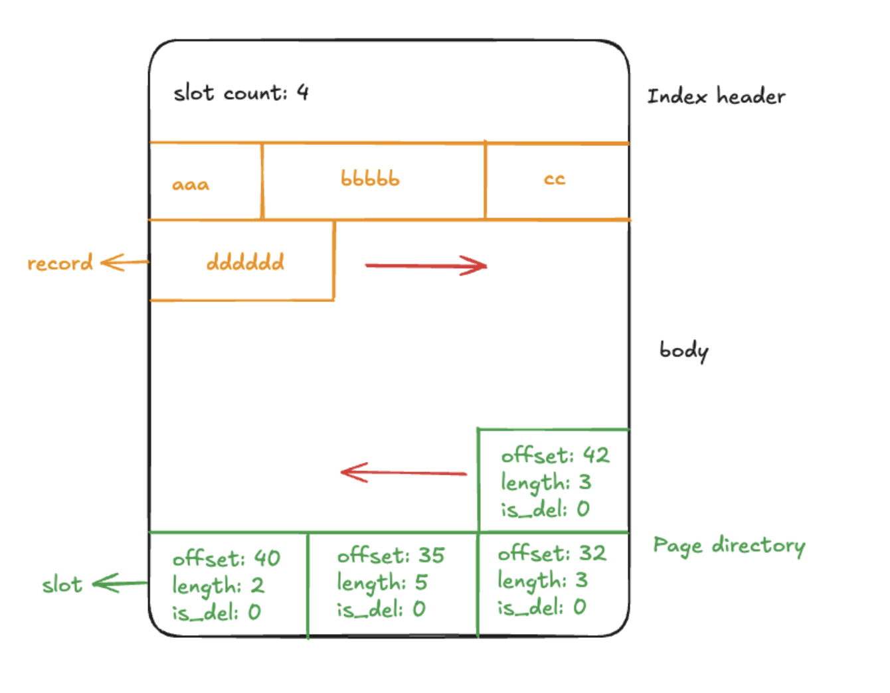
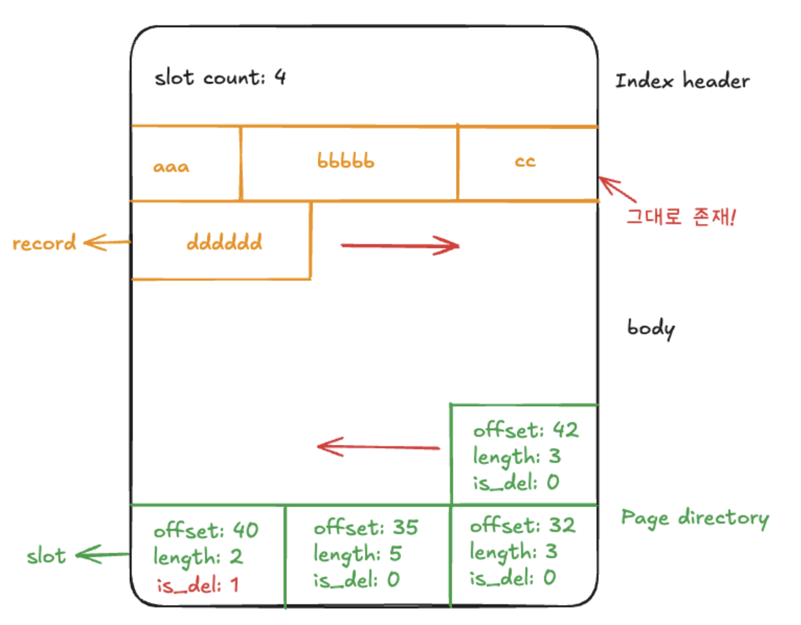

## 느려지는 쿼리의 숨은 원인, 단편화(Fragmentation)
데이터베이스에서 쿼리 성능이 점차 느려지는 현상을 경험한 적이 있나요? 인덱스를 잘 설계했어도 데이터가 계속 쌓이고 삭제와 수정이 반복되면 쿼리 실행 속도가 저하됩니다. 인덱스를 도입했다고 항상 최고의 성능이 보장되는 것은 아닙니다. 데이터의 삽입, 삭제, 수정이 자주 발생하는 환경에서는 인덱스 내부 구조가 단편화되어 효율이 떨어집니다.
이럴 때 인덱스를 추가하거나 쿼리만 개선하는 방식으로는 한계가 있습니다. 실제 운영 환경에서는 인덱스 단편화 현상과 이를 해소하기 위한 리빌딩 작업이 중요합니다.

## 단편화(Fragmentation)란?
인덱스 단편화는 데이터베이스 인덱스가 연속적으로 저장되지 못하고 여러 조각으로 나뉘어 비효율적으로 분산된 상태를 의미합니다. MySQL InnoDB와 같은 B+트리 기반 인덱스에서는 데이터의 삽입, 삭제, 수정이 반복될 때 페이지 내부에 빈 공간이 생기고, 이 공간이 즉시 재사용되지 않아 단편화가 누적됩니다.
예를 들어, 레코드를 삭제하면 InnoDB는 해당 레코드를 즉시 제거하지 않고 삭제 표시만 남깁니다. 이로 인해 페이지 내에 사용하지 않는 빈 슬롯이 남게 되고, 새로운 데이터가 들어와도 이 공간이 바로 활용되지 않는 경우가 많습니다. 이런 빈 공간이 페이지 곳곳에 흩어지면 인덱스의 논리적 순서와 물리적 저장 위치가 어긋나면서 단편화가 심화됩니다.
단편화가 심해지면 인덱스 탐색, 범위 검색, 정렬 등에서 더 많은 디스크 I/O가 발생하고 쿼리 성능이 저하됩니다. 특히 범위 스캔이나 전체 인덱스 스캔 시 불필요한 페이지 접근이 늘어나 전체적인 처리 속도가 느려집니다.
단편화에 대한 간단한 설명으로는 원리를 이해하기 어려울 수 있습니다. MySQL이 데이터를 저장하는 방식인 슬롯 구조를 살펴보겠습니다.

사실 이와 같이 단편화에 대한 간단한 설명으로는 원리가 잘 와닿지 않을 수도 있는데요, 그래서 MySQL이 데이터를 저장하는 방식인 슬롯(Slot) 구조를 한번 알아보겠습니다!

## 단편화의 발생 메커니즘, InnoDB 슬롯 구조
MySQL InnoDB 엔진에서 인덱스와 데이터는 16KB 페이지 단위로 저장되며, 각 페이지에는 여러 레코드가 슬롯 단위로 저장됩니다. 슬롯은 페이지 내 레코드가 위치한 오프셋을 가리키는 포인터 역할을 합니다. 페이지 하단에는 슬롯 배열(page directory)이 있고, 각 슬롯이 페이지 내부의 레코드 위치를 가리킵니다.

### 1. 데이터 삽입
예를 들어, 다음과 같이 데이터가 삽입되면 그림과 같이 저장됩니다.

```sql
INSERT INTO table1(c1) VALUES ('aaa');
INSERT INTO table1(c1) VALUES ('bbbbb');
INSERT INTO table1(c1) VALUES ('cc');
INSERT INTO table1(c1) VALUES ('dddddd');
```




레코드와 page directory가 맞닿으면 페이지가 꽉 찼다고 판단하고 새로운 페이지를 할당받습니다.

### 2. 데이터 삭제
데이터 삭제가 발생하면 어떻게 될까요?

```sql
DELETE FROM table1 WHERE c1 = 'cc';
```



레코드가 추가될 때마다 슬롯과 레코드가 짝을 이루고, 삭제될 경우 논리적으로 빈 슬롯 상태가 됩니다. InnoDB의 주요 특징 중 하나는 레코드를 삭제할 때 페이지 구조 전체를 바로 수정하지 않고 해당 레코드에 삭제 표시만 한다는 점입니다.
즉, 물리적으로 데이터가 즉시 사라지는 것이 아니라 그 영역이 논리적으로 사용 불가 표시만 되고, 이 공간은 당장 재사용되지 않습니다.
이러한 빈 슬롯이 늘어나면 페이지 내에 물리적으로 사용할 수 없는 공간이 점점 많아지고, 이로 인해 페이지 내부가 조각나듯이 비연속 공간으로 분산됩니다.
페이지가 꽉 찼다고 판단되면 InnoDB는 새로운 페이지를 분할해 할당하지만, 실제로는 삭제된 공간이 그대로 남아 전체적으로 단편화가 심화됩니다.

## 우리 테이블은 단편화가 얼마나 발생했을까?
이제 실제 서비스에서 얼마나 단편화가 진행 중인지 확인해보겠습니다. 다음 쿼리를 이용해 특정 데이터베이스에 존재하는 모든 테이블의 정보를 조회하고, 이를 토대로 단편화를 계산하겠습니다.

```sql
SELECT * FROM information_schema.tables WHERE table_schema = '데이터베이스명';
```

독서 기반 토론 서비스 '토독토독'의 데이터베이스를 기반으로 단편화를 계산하는데 필요한 정보들만 추려보겠습니다.

| TABLE_NAME             | DATA_LENGTH  | INDEX_LENGTH | DATA_FREE  |
|------------------------|-------------|--------------|------------|
| block                  | 16384       | 32768        | 0          |
| book                   | 132808704   | 63045632     | 3145728    |
| comment                | 101318656   | 67223552     | 4194304    |
| comment_like           | 16384       | 32768        | 0          |
| comment_report         | 16384       | 32768        | 0          |
| discussion             | 171655168   | 78299136     | 5242880    |
| discussion_like        | 58277888    | 55607296     | 6291456    |
| discussion_member_view | 16384       | 32768        | 0          |
| discussion_report      | 16384       | 32768        | 0          |
| flyway_schema_history  | 16384       | 16384        | 0          |
| member                 | 142262272   | 220545024    | 7340032    |
| member_report          | 16384       | 32768        | 0          |
| notification_token     | 16384       | 32768        | 0          |
| refresh_token          | 16384       | 16384        | 0          |
| reply                  | 101318656   | 57835520     | 6291456    |
| reply_like             | 16384       | 32768        | 0          |
| reply_report           | 16384       | 32768        | 0          |


먼저, data_length는 데이터가 차지하는 공간 크기(바이트 단위)를 뜻합니다. index_length는 인덱스가 차지하는 공간 크기(바이트 단위)를 뜻하고, data_free는 예약되어 있지만 실제로 사용되지 않는 공간 크기(바이트 단위)를 뜻합니다. 즉, 삭제 표시된 공간이 data_free로 잡힌다고 생각하면 됩니다.
이를 이용해 단편화 비율을 구해보겠습니다. 단편화 비율은 다음과 같은 공식을 이용해 구할 수 있습니다.

단편화 비율(%) = (data_free / (data_length + index_length)) * 100

이를 이용해 계산하면 결과는 다음과 같습니다.

| 테이블명           | data_length   | index_length  | data_free   | 단편화 비율(%) |
|-------------------|--------------|--------------|-------------|---------------|
| book              | 132,808,704  | 63,045,632   | 3,145,728   | 1.6           |
| comment           | 101,318,656  | 67,223,552   | 4,194,304   | 2.5           |
| discussion        | 171,655,168  | 78,299,136   | 5,242,880   | 2.1           |
| discussion_like   | 58,277,888   | 55,607,296   | 6,291,456   | 5.5           |
| member            | 142,262,272  | 220,545,024  | 7,340,032   | 2.0           |
| reply             | 101,318,656  | 57,835,520   | 6,291,456   | 3.7           |


비율이 5% 이상일 경우 인덱스 리빌딩을 고려할 수 있고, 10%를 넘는 시점부터 개선 효과가 크게 나타날 수 있습니다. 특히 전문 검색 인덱스를 사용하면 효과를 더 크게 볼 수 있습니다.

## 인덱스 리빌딩은 어떻게 하지?
### 1. 인덱스 재생성
인덱스 리빌딩을 하는 방법은 간단합니다. 인덱스를 지우고 새로 생성하면 됩니다.
MySQL은 별도의 인덱스 리빌드 명령이 없으며, 인덱스 리빌드는 ALTER TABLE을 통해 테이블 전체를 재생성하거나 DROP INDEX 후 ADD INDEX를 실행하는 방식으로 수행합니다. 인덱스 리빌딩은 인덱스만 다시 만드는 것이지만, InnoDB에서 테이블 재빌드 작업은 자동으로 인덱스를 포함하여 전체 데이터를 재정렬하는 효과를 냅니다.

### 2. OPTIMIZE TABLE
인덱스 리빌딩은 OPTIMIZE TABLE의 하위 개념으로 볼 수 있으며, OPTIMIZE TABLE은 테이블 데이터와 인덱스를 통합적으로 최적화합니다.
테이블 데이터를 클러스터형 인덱스(기본 키) 순서대로 재배치하여 단편화된 데이터와 인덱스를 정리하고, 삭제나 수정으로 인해 남은 불필요한 공간을 회수합니다. 인덱스 통계 정보도 갱신되어 옵티마이저가 최신 통계 기반으로 쿼리 계획을 세울 수 있게 돕습니다.
작업 중 임시 테이블을 생성하여 데이터를 복제하고, 최종적으로 원본 테이블을 교체하므로 락과 많은 I/O가 발생할 수 있습니다. InnoDB는 MVCC(다중 버전 동시성 제어) 구조이며 페이지 할당 방식 때문에 조각화 발생 빈도가 상대적으로 낮지만, 대량 삭제나 수정 이후 수동 최적화가 필요할 수 있습니다.
따라서 단순히 재생성하는 것보다는 OPTIMIZE TABLE을 이용해 테이블 자체를 재구성하는 것이 더 큰 성능 향상을 이뤄낼 수 있습니다.
단편화 비율이 높은 discussion_like 테이블에 대해 리빌딩 작업을 수행했습니다. 그 결과, 전문 검색 인덱스를 사용하는 테이블에서 80만 개의 데이터를 기준으로 18.6초에서 10초로 46%의 성능 개선을 이뤄냈습니다.

## 마치며
인덱스 단편화는 쿼리 성능 저하의 주요 원인 중 하나입니다. 실무에서는 단편화 비율을 주기적으로 모니터링하고, 상황에 맞게 OPTIMIZE TABLE을 통한 인덱스 리빌딩으로 성능을 관리하는 것이 효과적입니다. 대량 삭제나 수정 이후에는 반드시 최적화 작업을 수행하고, 자동화 스크립트로 단편화 상태를 정기적으로 점검하면 운영 효율을 높일 수 있습니다. 꾸준한 관리가 안정적인 서비스 성능을 유지하는 핵심입니다.

