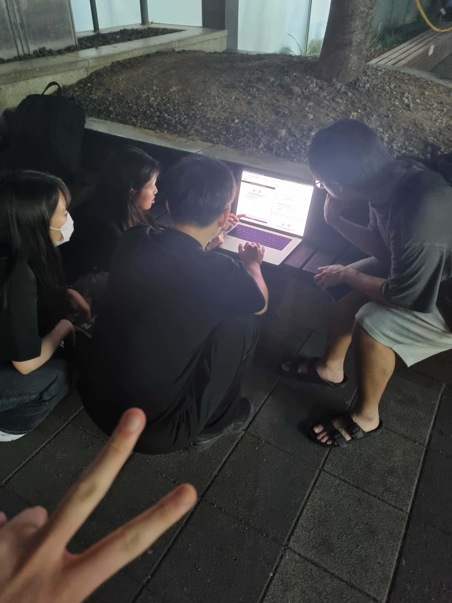

# 📚 토독토독 팀 인터뷰 북
개발 서적을 기반으로 토론하는 서비스를 제공하는 토독토독 팀입니다.  
레벨 3를 마치며 몇 가지 질문에 대해 팀원들이 답변하는 방식으로 인터뷰를 진행했어요.

## Q1. 우리 팀을 한마디로 표현하면 어떤 비유나 별명이 떠오르나요?

### 🪙 동전
**토닥토닥**  
의견이나 생각에 관해서 그럴 수 있지라는 생각으로 토닥여주는 느낌이 많이 들었고, 힘든 일정 중에 못하는 부분에서도 괜찮다고 토닥여주는 느낌이 많이 들었어요  

### 🍀 모다
**토다다닥**  
우리 토독토독 팀은 의사결정 과정이 성숙하고, 뭐든 질질 끄는 법 없이 착착 쳐내면서 앞으로 나아가는 팀이에요. 그러면서도 팀원의 어려움을 절대 묵인하지 않고 밖으로 꺼내서 도와주고 있어요. 각자의 속도를 이해해주면서도 팀 전체의 속도가 쳐지지 않는 팀이랍니다.  

## Q2. 프로젝트를 하면서 가장 효과가 좋았다고 생각했던 협업 프로세스는 무엇이었나요?

### 🐳 제프
아발론이라는 역할 프로세스가 효과적이었다고 생각해요.  
> ### 우리 팀의 '아발론' 규칙이란?
> 아발론은 실제 존재하는 보드게임인데, 저희는 이걸 프로젝트에 도입했어요. 실제 보드 게임의 역할과 같은 역할은 아니고 회의를 진행하는데 필요한 역할들을 만들어서 분배했습니다!  
회의를 전반적으로 진행하는 **진행자** 역할, 회의 중 놓치는 아젠다를 트래킹하는 **아젠다 트래커**, 진행자가 적지 못하는 내용들을 기록하는 **서기**, 회의실 예약과 같은 스케줄 관리를 맡아서 하는 **동전**으로 역할을 구성해봤습니다.  
> 재미 요소를 위해 회의 중 다른 팀을 섭외하러 뛰어다녀야 하는 **말벌 아저씨**나 다른 역할을 뺏어서 진행하는 **스파이** 같은 역할도 추가했습니다.  
>
일정 주기마다 각자 새로운 역할을 맡게 되면서 특정 인원에게만 어려운 역할이 집중되지 않았다는 점이 좋았어요. 특히, 회의 진행자와 같이 모두가 부담을 느끼는 역할을 미리 정해놓고 시작할 수 있어 회의 초반이 매끄럽고 빠르게 진행되었습니다.  
또한, 팀에 필요한 다양한 역할을 고르게 경험해볼 수 있어서 좋았던 것 같아요. 이러한 프로세스를 통해 모든 팀원이 적극적으로 프로젝트에 참여하게 되었고, 결과적으로 팀 전체의 몰입도를 높일 수 있었답니다!

### 🐱 모찌
저는 모다가 작성해준 개선사항 정리가 너무 좋았어요!  
여러사람들한테 UT를 받으면서, 받은 의견은 많은 데, 정리가 안되어서 너무 복잡했어요!  
하지만, 모다가 보기 쉽게 정리를 해줘서 빠르게 개선사항을 파악할 수 있었어요! 

### 🐰 듀이
팀 노션의 `이슈` 탭을 활용한 게 가장 효과가 좋았다고 생각해요.  
> ### 우리 팀의 '이슈' 탭이란?
> 저희 팀의 `이슈` 탭은 개인별로 작업을 하다가 다같이 논의했으면 좋겠다고 생각되는 아이디어들을 적어두는 곳이에요. 작성자가 이슈 내용과 본인의 의견, 확인해야 하는 범위(전체 또는 분야별, 팀원 등)를 지정해서 올려두면 해당하는 팀원들이 확인하고, 다른 의견이 있다면 댓글을 달아둬요. 이슈에서 의견이 모아지지 않는다면 매일 아침 스크럼에서 해결합니다.  
>
프로젝트 초반에는 팀원 모두가 모여서 기획 회의를 했지만, 중후반으로 갈수록 개별적으로 개발하는 일이 더 많아졌고, 작은 이슈 때문에 회의 시간을 따로 잡기가 미안하기도 하거든요. 그래서 이 `이슈` 탭을 활용해서 함께 논의해야 할 사항들을 정리하고, 병렬적으로 이슈를 쳐낼 수 있어서 좋았어요.  

## Q3. 스스로 돌아봤을 때 팀에 충분히 기여했다고 생각하나요? 어떤 점을 기여했다고 생각하나요?

### 🦦 페토
저는 충분히 했습니다. 더 하면 죽어요  
.  
.  
.  
라고 당당히 말하고 싶지만 솔직하게 털어놓으면 전 제 스스로가 많이 아쉬웠다고 생각해요. 코치님들은 팀이 목에 칼이 들어와도 랜덤이라고 하시겠지만 전 안믿어요. 잠실에 배치된 안드로이드 크루들중에 프로젝트 경험이 있는 크루들을 이렇게 정확히 딱 4팀에 배치하는게 말이 안되거든요 ^^  
솔직히 고백하면 뭉치와 지오의 안드로이드팀을 보면서 부러운 맘이 있었어요. 이 팀들을 보면 뭔가 항상 같이 토론하고 개발하는 모습들이 너무 좋아보았거든요.  
특히 지오네가 `Analythics` 설정을 할 때 다 같이 하는 모습들이 부러웠어요. 그에 반해 저희는 제가 혼자 맡아서 하게 되었는데, 태스크를 하나 더 맡는것에 대한 부담은 없었지만 이걸 나 혼자하지 않고 다 같이 할 이해할 수 있도록 이끌었으면 어땠었을까 라는 생각이 들어요.  
아무래도 동전과 모찌보단 제가 안드로이드 경험이 조금이라도 더 있다보니 이런 부분들에 대해서 먼저 이야하고 이끌어나갔으면 어땠을까 하는 아쉬움이 남는 것 같습니다.  

### 🍀 모다
아쉬운 부분도 많았지만 분명 기여했다고 생각해요!  
초반엔 추상적인 아이디어를 많이 냈지만, 뒤로 갈수록 팀에게 제 의견을 설득하려면 그에 맞는 액션플랜이 필요하다는 걸 배우게 되었어요. 그래서 그 이후로는 저희 팀이 (아마도) 제일 좋아하는 팀문화인 아발론을 제안하면서 매주 게임을 하는 것 같은 즐거운 시간을 보내고 있어요. 그 외에도 여러 문서화 도구나 회의 진행 도구를 개입해서 좋은 피드백을 많이 받았던 것 같아서 뿌듯해요.  
또, 백엔드 팀에서 인프라 구축 및 개선에 많이 참여했다고 생각합니다. 팀원들과 최적의 인프라 구조를 두고 서로를 설득하고, 공부한 부분을 설명하면서, 그동안 무섭기만 했던 인프라 구축이 이렇게 재밌는 것이었구나 처음 알았어요. 다함께 작성하며 점점 늘어나는 기술 문서들을 보면 마음이 뿌듯하네요..  

## Q4. 프로젝트를 하면서 내 생각이나 가치관이 변한 적이 있었나요?

### 🍀 모다
네! 정말 많이 변했어요! (과장하며)  
가장 먼저, 모든 사람들의 사고회로는 다 다르다는 걸 배우고, 의견을 전달할 때의 자세가 변화했어요. 다른 사람에게 내 의견을 전달하고, 더 나아가 나의 의견을 무려 “설득”하려면 많은 사전 준비와 소프트스킬, 양보의 자세가 필요하다는 걸 깨달았어요. 우리 팀에는 사소한 안건이라도 미리 올리고 대화할 수 있는 도구들이 많았기 때문에, 이를 열심히 이용해서 의견을 피력하는 연습을 할 수 있었습니다.  
… 그래도 부족함을 많이 느껴요. 가끔은 말이 두서 없어지기도 하고, 툴툴하기도 하고, 의견 조율이 잘 안 되면 잠시 현자타임(?)을 갖기도 해요. 그럼에도 항상 열정적으로 받아주는 팀원들이 너무 고맙고, 저도 도움이 되기 위해 항상 노력 중이에요.  
또 하나 배운 건, 설득할 때는 사용자 경험을 드는 게 짱이라는 것입니다 ㅋㅋ   
레벨3 동안 가장 인상 깊었던 말 중 하나가, ‘개발자는 가설을 세우고, 검증은 소비자가 한다’라는 말이었어요! 기술에 매몰되지 않고 사용자를 생각하며 개발할 줄 아는 것의 중요성을 배웠고, 팀원들 모두가 공감하면서 인정할 수 있는 기준이 하나 생긴 것 같아요. 그래서 기획 회의 하다가 조율이 잘 안 되면 <<일단 만들고 사용자 의견을 듣자!!>> 라는 가불기 스킬을 쓰게 되었어요. 

### 🦦 페토
프로젝트 초기엔 기술적인 어려움이 없었기에 이 프로젝트에서 내가 무엇을 가져갈 수 있을지 의문이 들었어요. 찐한 협업 같은 경험도 물론 좋은 경험일 순 있겠지만, 이 경험이 지금 당장 내 눈앞에 펼쳐질 취업 준비에 도움이 된다고는 생각하지 않았거든요. 제가 생각하기에 이런 경험은 실제 회사에 들어 갔을 때 도움이 될 것 같았어요.  
제가 생각하기에 취업을 위해선 기술적 역량을 키우는게 중요하다고 생각하지만 하지만 우테코에선 미션에서만 배운 것들로 사용할 수 있는 기술을 제한하고 있다는게 다소 답답하다고 느껴졌어요. 제가 생각하는 팀의 성장 방향도 모두가 이해하고 공감할 수 있는 기술만 사용하는 것이 맞다고 생각했답니다.  
이런 기술적 성장에 대한 갈증은 점점 프로젝트를 진행하면서 사라졌어요.    
요구사항이 점점 어려워 졌거든요 ^^  
로깅과 CI/CD, 에러처리 등 단순히 여러가지 기술을 사용해서 화면을 만드는 것 뿐만 아니라, 우리가 만든 어플레케이션을 보다 견고하고 단단하게 만들기 위한 다양한 외부 라이브러리들을 사용하는 것이 굉장히 어려웠고 동시에 목마름을 해결해줘 너무 재미있었어요. 
뿐만 아니라, 제가 가장 좋아하는 레아 코치님과의 원온원에서 우테코가 왜 이런 방향을 제시하는지, 코치가 아닌 현업자의 관점에서 말씀해주신 신입 개발자가 갖춰야할 요소들을 듣고나서 기술에 구애받지 않고 필요한 요구사항을 빠르고 정확하게 구현해내는 것이 중요함을 깨닫게 되었어요.  
결과적으로 프로젝트 초기에 고민하던 기술적 성장에 대한 갈증은, 갈증 해소를 넘어서 익사 직전이 되버려서 너무나 즐기운 매일 매일이 된 것 같아요.  

### 🐰 듀이
가치관까지는 아니지만, 생각이 변화한 것은 있어요. 유강스에서 깨달음 회고를 하면서 알게 된 건데요. 저는 원래 팀 프로젝트를 별로 좋아하지 않는 사람이라고 생각했는데, 토독토독 팀과 함께 프로젝트를 진행하면서 오히려 개인 공부를 할 때보다 팀 프로젝트를 할 때 열정적이게 되는구나 라고 깨달았어요.  
원래 팀 프로젝트를 별로 좋아하지 않았던 이유는 팀으로 협업하는 것보다 혼자 할 때 효율이 더 좋다고 생각했기 때문이에요. 그런데 토독토독 팀원들과 함께할 땐 혼자보다 협업할 때 효율이 훠얼씬 좋다고 느껴요. 그래서 저도 더 열정적이게 되고요.  
앞으로 회사에 가서도 이런 팀원들을 만나고 싶고, 그렇다면 협업을 더 열정적으로 할 수 있을 것 같다는 생각이 계속 들어요. 

## Q5. 토독토독 팀이 아니었다면 하지 못했을 것 같은 경험은 무엇인가요?

### 🪙 동전
노션에 팀 활동에 필요한 것들을 문서화하고 정리하는 부분이 좋았어요.  
다른 팀이었으면, 활동 중에 정리된 의견이 없어서 의견을 다시 정리할 시간이 많았을 텐데   
링크가 초반에 잘 잡아두고 시작해서 한번 의논하면 다시 이야기하는 시간이 없었어요  

### 🐰 듀이
길바닥에서 프로젝트하기..?  
그라파나 연동 후 슬랙으로 알림 설정을 하던 중이었는데, 캠퍼스가 11시까지만 운영을 해서 나가야 했거든요. 조금만 더 하면 슬랙 연동이 끝나고, 알림을 받을 수 있는데 중간에 끝낼 수가 없어서 팀원들 모두가 캠퍼스 1층 벤치에서 노트북을 열고 있었던 게 기억에 남아요.  
결국 알림 설정을 완료하진 못했지만, 더운 여름 밤에 팀원들끼리 길바닥에서 노트북 하나만 보고 있던 경험은 다른 팀에서는 못 할 경험이지 않을까 싶어요.  
 

## Q6. 프로젝트를 진행하면서 가장 재미있었던 순간은?

### 🐱 모찌 
유강스에서 제프가 자신의 의견을 낭독해줬을 때가 기억에 남아요! 제프가 낭독에 어울리는 음악까지 BGM으로 깔아줘서 더 기억에 남았어요 ㅎㅎ 이때까지 유강스를 진행하면서, 기록 위주로 진행을 했어요. 그런데, 제프 덕분에 음성으로 자신의 생각을 한번더 전달한다는 것이 좋다는 것을 깨달았던 순간입니다.  

### 🔗 링크
저는 아무래도 회의하는게 힘든 부분도 많았지만, 그만큼 즐겁고 기억에 남는 부분도 많았던 것 같아요. 예를 들면 서로의 의견을 주고받으면서 분위기가 점점 과열되는 것이 느껴지는 순간인 것 같아요. 팀원들에 대한 신뢰가 있다 보니 싸움이 날 것 같은 느낌은 하나도 들지 않고 오히려 한 발짝 뒤에서 바라보면 되게 재미있어요. 마치 “아 그래, 이게 팀 프로젝트지!”하는 생각이 나서 웃음이 나고, 결과가 어떻게 날지 흥미가 생겨요. 너무 과열되면 잠시 쉬면서 소강 타이밍을 가진 뒤, 빠르게 결론이 정해지는 편이예요. 그렇게 정하고 다들 힘빠지는게 진짜 열심히 회의하고, 하나의 서비스를 향해 함께 달려가는 느낌이 나요. 그래서 저에게는 회의시간이 힘들지만 즐겁고, 기억에 남는 순간입니다.  

### 🐳 제프
인프라 설계를 진행했던 순간이 가장 기억에 남네요. 인프라는 제게 어려운 주제였고, 처음에는 낯선 대상이었습니다. 하지만 팀원들과 함께 전체적인 구조를 그려가며 단계적으로 설계를 진행했고, 여러 시행착오를 겪는 과정에서 점차 전체 구조를 다듬어갈 수 있었어요. 특히, 보안 그룹 설정이나 네트워크 연결과 같은 세부적인 요소들을 직접 다뤄보면서 단순히 그림으로만 이해했던 개념들이 실제 동작 방식과 연결되는 것을 경험하면서 희열을 느꼈죠. 
이 과정을 통해 어렵게만 느껴졌던 AWS UI가 지금은 훨씬 친숙하게 느껴져요. 무엇보다도, 이러한 과정을 통해 시야를 넓혀갈 수 있었던 경험이 프로젝트에서 가장 의미 있고 즐거웠던 순간이었습니다!  

## Q7. 프로젝트를 진행하면서 힘들었던 순간은?

### 🔗 링크
프로젝트를 하면서 몸이 안좋았던 적이 있었는데, 그 때 열정에 비해 몸이 따라주지 않아서 힘들었던 것 같아요. 많은 일을 맡아서 팀에게 도움이 되고 싶은데, 아프다보니 속도가 나오지 않아 팀에 피해가 갈까봐 걱정이 좀 되었어요. 그래도 다행히 제 시간 내에 맡은 일들을 처리할 수 있었지만, 건강만큼 서러운게 또 없더라고요. 그 외에는 전부 즐거웠습니다!!  

### 🐳 제프
프로젝트를 진행하면서 가장 힘들었던 순간은 서비스 UI에 대한 회의 시간이었어요. 프로젝트 초기에 토독토독 앱의 디자인을 두고 오랜 시간 의견을 나누었지만, 좀처럼 합의가 이루어지지 않아 지쳤던 기억이 있습니다. 각자가 피그마를 통해 직접 구상한 디자인을 가져와 서로 피드백을 주고받는 방식으로 회의를 진행했는데, 생각하는 방향이 달라 끝이 보이지 않는 회의가 이어지는 듯한 답답함을 느꼈어요.   
시행착오를 겪으며 지금의 앱 디자인을 완성할 수 있었기에 꼭 필요한 과정이었다고 생각하지만, 돌이켜보면 가장 힘들었던 순간 중 하나로 남아 있습니다.  
