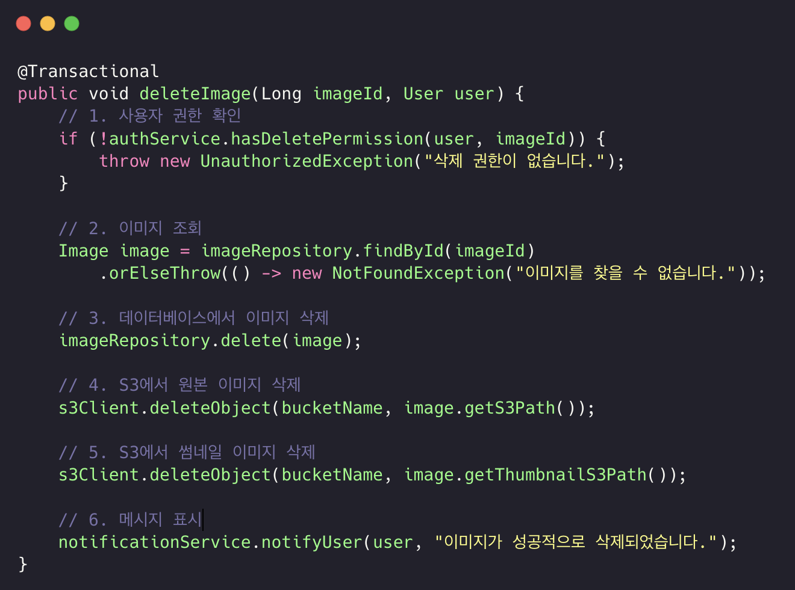
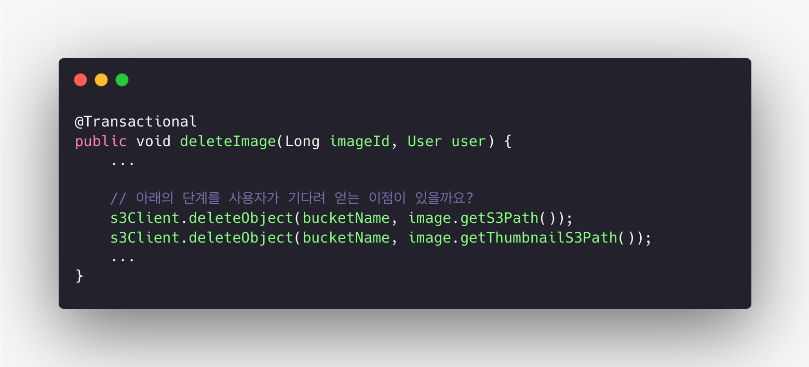
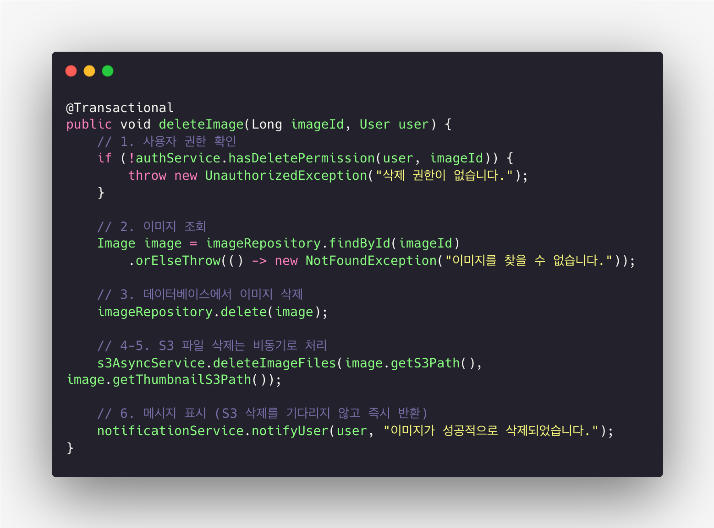
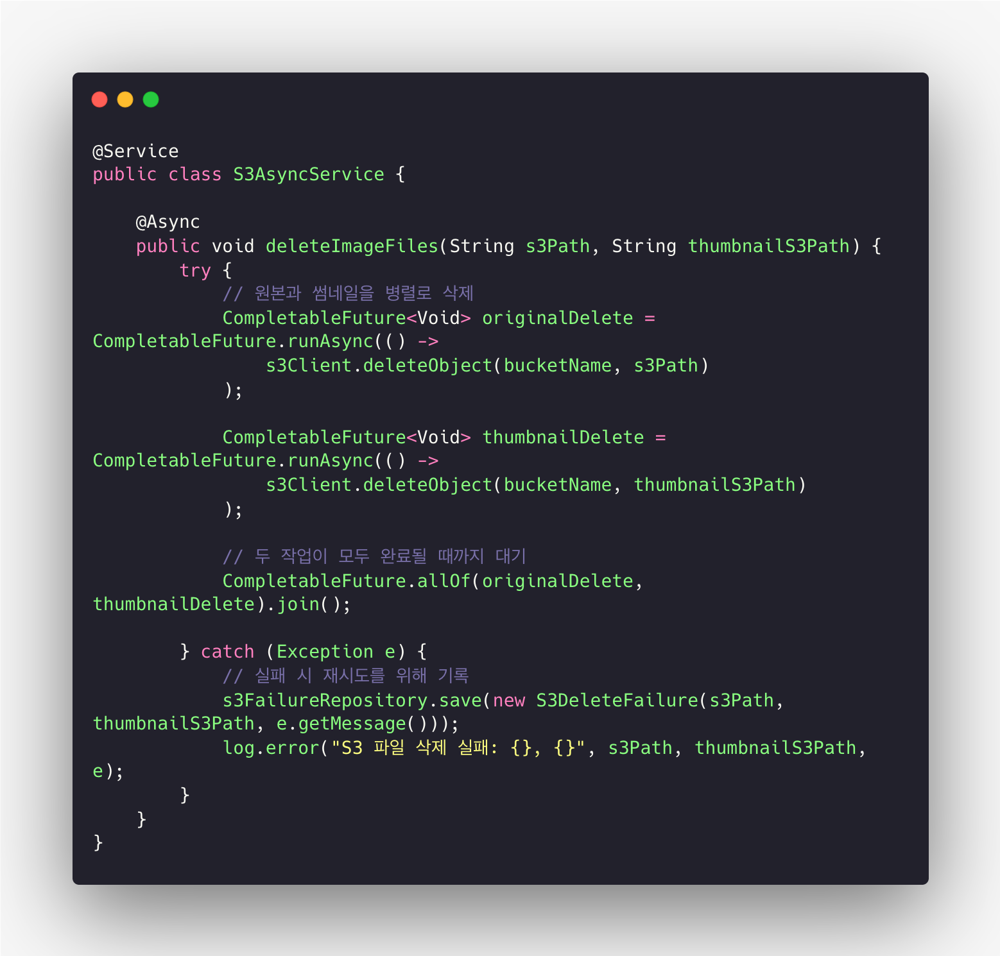
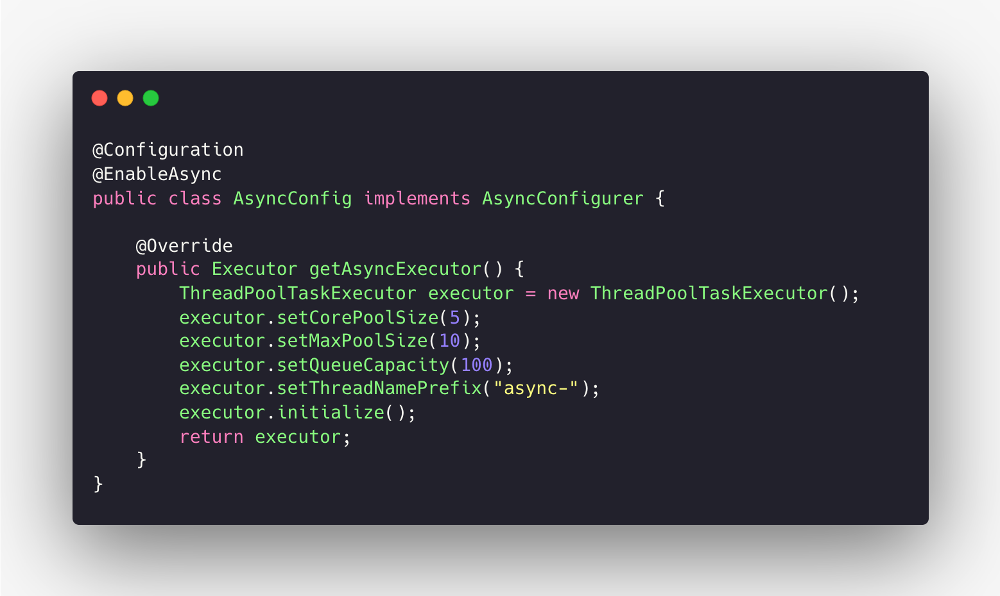

# 동기와 비동기 프로그래밍의 이해

## 들어가며

이 글은 **웹 애플리케이션, 서버 애플리케이션, 또는 비동기 처리가 필요한 시스템을 설계, 개발하는 개발자**를 대상으로 합니다.
특히 **I/O(입출력) 작업이 많은 환경**에서 성능 최적화와 사용자 경험 개선을 고민하는 분에게 도움이 되는 내용을 다룹니다.

이 글에서는 **동기(synchronous)**와 **비동기(asynchronous)** 프로그래밍의 개념을 명확히 구분하고,
실제 코드에서 어떻게 동작하는지, 그리고 언제 어떤 방식을 선택해야 하는지를 실제 사례(이미지 삭제 기능)를 중심으로 설명합니다.

## 동기 방식의 기본 동작 원리

개발자는 요구사항을 받으면 보통 **순차적인 처리**를 먼저 고려합니다.
요구사항을 완성하기 위해 필요한 단계를 차례대로 쌓아 나가며 기능을 개발하는 방식입니다.
이는 가장 직관적이고 이해하기 쉬운 접근법입니다.

동기 방식에서는 각 작업이 순서대로 실행됩니다.
첫 번째 작업이 완료되면 두 번째 작업을 시작하고, 두 번째 작업이 끝나면 세 번째 작업을 시작합니다.
마치 계단을 한 칸씩 올라가듯 단계별로 진행됩니다.

다음과 같은 요구사항이 개발자에게 전달됐다고 가정해봅시다.

```text
사용자가 이미지 삭제 버튼을 클릭하면 다음 작업을 수행한다:
1. 사용자의 삭제 권한을 확인한다
2. 데이터베이스에서 삭제 요청이 들어온 이미지를 조회한다
3. 데이터베이스에서 삭제 요청이 들어온 이미지를 삭제한다
4. S3에서 원본 이미지를 삭제한다
5. S3에서 썸네일 이미지를 삭제한다
6. 사용자에게 삭제 완료 메시지를 표시한다
```

개발자는 이 요구사항을 보고 자연스럽게 순차적인 코드를 작성합니다.
각 단계를 함수로 만들고 순서대로 호출하면 됩니다.
코드의 흐름이 요구사항의 흐름과 일치하므로 이해하기 쉽고 유지보수도 간편합니다.



### 동기 방식의 실행 과정

동기 방식에서 위 요구사항을 처리하는 과정을 살펴보겠습니다.

1. **사용자 권한 확인 (100ms 소요)**
   인증 시스템에 사용자의 삭제 권한을 확인합니다. 권한 확인이 완료될 때까지 다른 작업은 수행하지 않습니다.

2. **이미지 조회 (100ms 소요)**
   권한이 확인되면 데이터베이스에서 삭제할 이미지 정보를 조회합니다.
   이미지의 S3 경로, 파일명, 썸네일 정보 등을 가져올 때까지 대기합니다.

3. **데이터베이스에서 이미지 삭제 (100ms 소요)**
   조회된 정보를 바탕으로 해당 이미지 레코드를 삭제합니다.
   삭제가 완료될 때까지 프로그램은 대기합니다.

4. **원본 이미지 삭제 (400ms 소요)**
   데이터베이스 삭제가 끝난 후 S3에 원본 이미지 삭제를 요청합니다.
   외부 API 호출이므로 가장 시간이 오래 걸립니다.

5. **썸네일 이미지 삭제 (300ms 소요)**
   원본 이미지 삭제가 완료된 후 썸네일 이미지를 삭제합니다.
   썸네일은 용량이 작아 상대적으로 짧은 시간이 걸립니다.

6. **메시지 표시**
   모든 작업이 끝난 후 사용자에게 삭제 완료 메시지를 표시합니다.

전체 처리 시간은 `100 + 100 + 100 + 400 + 300 = 1000ms (1초)`입니다.
각 단계가 끝나야 다음 단계로 넘어가기 때문에 모든 대기 시간이 누적됩니다.

실제 프로젝트 모니터링 결과, **S3 API 호출이 전체 시간의 약 70%(700ms)**를 차지하며,
나머지 **30%(300ms)**는 권한 확인과 데이터베이스 작업에 사용되었습니다.

## 동기 방식의 문제점

동기 방식은 직관적이고 이해하기 쉽지만, 다음과 같은 한계가 있습니다.
특히 I/O 작업이 많거나 네트워크 요청이 잦은 환경에서는 이 한계가 두드러집니다.

### 1. 긴 처리 시간

모든 작업이 순차적으로 진행되므로, 한 작업이 끝날 때까지 기다려야 합니다.
예시의 경우 전체 처리에 1초가 걸렸습니다.
사용자는 이 시간 동안 아무런 반응 없이 기다려야 하며, 500ms 이상 지연되면 느려졌다고 인식하고, 1초 이상이면 불편함을 느낍니다.

### 2. 자원 낭비

대기 시간 동안 CPU는 거의 사용되지 않습니다.
S3 API 응답을 기다리는 동안 CPU는 놀고 있지만, 다른 요청을 처리할 수 없습니다.
이 때문에 서버의 처리 효율이 급격히 떨어집니다.

### 3. 블로킹으로 인한 응답성 저하

동기 방식이 UI에서 사용되면 화면이 멈춘 것처럼 보입니다.
사용자가 클릭하거나 스크롤해도 반응이 없고,
“페이지가 응답하지 않습니다”라는 메시지가 표시될 수도 있습니다.

### 4. 병렬 처리 불가능

권한 확인, 이미지 조회, DB 삭제는 순차적이어야 하지만, S3 원본 이미지 삭제와 썸네일 삭제는 동시에 실행해도 문제없습니다.
그러나 동기 방식에서는 이를 병렬로 처리할 수 없습니다.

### 5. 확장성 제한

서버에서는 각 요청마다 스레드를 할당해야 합니다.
스레드 수가 한정되어 있으므로 동시 접속자 수가 많아지면 일부 요청은 대기해야 하고, 확장성이 떨어집니다.

예를 들어 이미지 10개를 삭제하는 데 각 이미지마다 1초가 걸린다면 총 10초가 필요합니다.
서버가 동시에 100개의 요청만 처리할 수 있다면, 101번째 사용자는 다른 요청이 끝날 때까지 기다려야 합니다.
이런 구조는 트래픽이 많은 서비스에서는 사용자 경험을 크게 저하시킵니다.

## 비동기 방식의 필요성

이 문제들을 해결하기 위해 **비동기(Asynchronous)** 방식이 등장했습니다.
비동기 방식은 작업이 끝나기를 기다리지 않고 다른 작업을 처리할 수 있도록 합니다.

앞서 살펴본 이미지 삭제 예시에서,
S3 원본 이미지 삭제(400ms)와 썸네일 삭제(300ms)를 동시에 실행하면
순차 처리(700ms)보다 **400ms 만에 완료**할 수 있습니다.

즉, 전체 처리 시간을 **1000ms → 700ms**로 줄일 수 있습니다.
이는 약 **30%의 성능 향상**이며, 사용자가 체감할 수 있을 정도의 개선입니다.

비동기 처리를 제대로 이해하려면
**블로킹(Blocking)**, **논블로킹(Non-Blocking)**, **동기(Synchronous)**, **비동기(Asynchronous)**
이 네 가지 개념의 차이를 명확히 이해해야 합니다.

## 블로킹 I/O와 논블로킹 I/O

블로킹과 논블로킹은 **호출된 함수가 제어권을 즉시 반환하는지 여부**로 구분됩니다.
제어권이란 프로그램의 실행 흐름을 제어할 수 있는 권한을 의미합니다.

### 블로킹(Blocking) 방식

프로그램이 다른 작업을 호출하면, 해당 작업이 끝날 때까지 기다립니다.
파일을 읽는 함수를 호출하면 파일 읽기가 끝날 때까지 다음 코드가 실행되지 않습니다.

일상생활에 비유하면 은행 창구에서 업무를 보는 것과 같습니다.
고객이 창구 직원에게 업무를 요청하면, 직원이 업무를 끝낼 때까지 기다려야 합니다.

**특징**

- 작업이 끝날 때까지 실행이 멈춥니다.
- 코드의 흐름을 이해하기 쉽습니다.
- 그러나 대기 시간 동안 CPU 자원을 효율적으로 사용하지 못합니다.

### 논블로킹(Non-Blocking) 방식

작업을 호출해도 제어권을 즉시 돌려받아 다른 일을 할 수 있습니다.
파일 읽기를 요청하면, 읽기 작업이 진행되는 동안 다른 코드를 실행할 수 있습니다.

은행 창구로 비유하면 번호표를 받고 대기하는 것과 같습니다.
번호표를 받은 고객은 기다리는 동안 다른 일을 하다가 자신의 차례가 되면 호출을 받아 창구로 갑니다.

**특징**

- 작업 완료 여부와 관계없이 즉시 제어권을 반환합니다.
- 대기 시간 동안 다른 작업을 수행할 수 있어 CPU 자원을 효율적으로 활용합니다.
- 코드 구조가 다소 복잡해질 수 있습니다.

**핵심 차이점**:

> 블로킹은 작업이 끝난 후 제어권을 반환하고,
> 논블로킹은 작업이 끝나지 않아도 즉시 반환합니다.

## 동기와 비동기

동기와 비동기는 **작업 완료 시점과 결과 처리 방식**을 기준으로 구분합니다.

### 동기(Synchronous) 방식

하나의 작업이 끝나야 다음 작업을 시작합니다.
작업 결과를 즉시 확인할 수 있으며, 코드 실행 순서를 예측하기 쉽습니다.

식당에서 음식을 주문하고, 음식이 나올 때까지 기다렸다가
받은 후에야 다음 주문을 하는 것과 비슷합니다.

**특징**

- 작업이 순서대로 실행됩니다.
- 이전 작업의 결과를 다음 작업에 바로 사용할 수 있습니다.
- 하지만 전체 처리 시간이 길어질 수 있습니다.

### 비동기(Asynchronous) 방식

한 작업이 끝나기 전에 다른 작업을 시작할 수 있습니다.
작업의 완료 순서가 호출 순서와 다를 수 있습니다.

식당에서 여러 음식을 한꺼번에 주문하고
조리된 순서대로 받는 것과 비슷합니다.

**특징**

- 여러 작업을 동시에 진행할 수 있습니다.
- 전체 처리 시간을 단축할 수 있습니다.
- 결과를 콜백(callback)이나 프라미스(Promise) 등으로 처리해야 하므로 코드가 복잡해질 수 있습니다.

**핵심 차이점**:

> 동기는 작업이 순서대로 완료되는 것에 관심이 있고,
> 비동기는 작업 완료 순서에 상관없이 결과를 나중에 처리합니다.

## 네 가지 개념의 조합

실제 프로그래밍에서는 **블로킹/논블로킹**과 **동기/비동기**가 조합되어 사용됩니다.

| 조합             | 설명                           | 특징             |
| -------------- | ---------------------------- | -------------- |
| **동기 + 블로킹**   | 결과를 받을 때까지 기다림               | 가장 직관적이지만 비효율적 |
| **동기 + 논블로킹**  | 제어권은 즉시 받되 결과를 계속 확인         | CPU 낭비 가능      |
| **비동기 + 논블로킹** | 제어권을 즉시 반환하고, 결과는 콜백/이벤트로 받음 | 효율적이지만 코드 복잡   |
| **비동기 + 블로킹**  | 기다리면서도 결과는 나중에 받음            | 거의 사용되지 않음     |

## 언제 비동기를 고려해야 할까?

### 외부 연동과 기능 실패의 구분

외부 시스템과 연동할 때, “**외부 연동 실패가 전체 기능 실패를 의미하는가?**”를 먼저 판단해야 합니다.

예를 들어, 이미지 삭제 기능에서 데이터베이스 삭제는 성공했지만 S3 파일 삭제가 실패했다고 해서 전체 기능을 실패로 볼 필요는 없습니다.
사용자가 원하는 것은 **이미지가 보이지 않게 되는 것**이며, 데이터베이스에서 삭제되면 이 요구사항은 이미 충족됩니다.
S3 파일 삭제는 이후 별도의 비동기 작업으로 처리할 수 있습니다.

## 이미지 삭제 기능의 처리 흐름

동기 방식으로 구현한 이미지 삭제는 DB 삭제까지 완료되면 이미 주요 기능이 끝납니다.
하지만 S3 파일 삭제(700ms)가 완료될 때까지 사용자는 기다려야 합니다.
이 때문에 사용자 경험이 나빠집니다.



S3 삭제가 완료될 때까지 메서드가 반환되지 않기 때문에
사용자는 응답을 받을 때까지 기다려야 합니다.

## S3 삭제를 비동기로 처리하기

S3 파일 삭제를 비동기로 처리하면 사용자 경험을 크게 개선할 수 있습니다.
데이터베이스 삭제까지만 동기로 처리하고, S3 파일 삭제는 백그라운드에서 수행합니다.

이 경우 **DB 삭제까지 약 300ms**, S3 삭제는 별도로 **400ms**가 걸리지만, 사용자는 300ms 만에 응답을 받습니다.

Spring의 `@Async` 어노테이션을 사용하면 손쉽게 구현할 수 있습니다.





이 방식에서는 S3 삭제가 별도의 스레드 풀에서 실행되며,`CompletableFuture`를 사용해 원본과 썸네일 삭제를 병렬로 처리할 수 있습니다.

## S3 삭제 실패 시 처리 방안

비동기 방식은 실패를 별도로 관리해야 합니다.

1. **실패 내역 기록과 재시도**
   실패한 S3 삭제 내역을 테이블에 기록하고, 주기적으로 재시도합니다.
   무한 재시도를 방지하기 위해 재시도 횟수와 마지막 시도 시각을 함께 저장합니다.

2. **고아 파일 정리**
   데이터베이스에는 없지만 S3에 남아 있는 파일(고아 파일)을
   정기적으로 스캔하여 삭제합니다.
   예: 매주 새벽에 배치로 실행.

3. **수동 처리 도구**
   관리자 페이지에서 실패 내역을 확인하고,
   필요 시 직접 재시도할 수 있도록 합니다.

## 비동기 처리 시 주의사항

- **데이터 정합성 순서**
  반드시 데이터베이스 삭제 후 S3 삭제를 수행해야 합니다.
  순서가 바뀌면 데이터는 남고 파일만 사라지는 문제가 발생할 수 있습니다.

- **실패 모니터링**
  비동기 실패율을 지속적으로 모니터링해야 합니다.
  예를 들어 S3 삭제 실패율이 10% 이상으로 증가하면
  네트워크, 권한, API 설정 등을 점검해야 합니다.

## 비동기 처리 결정 체크리스트

비동기 처리를 적용하기 전, 다음 질문을 점검해야 합니다.

- 외부 연동 실패가 핵심 기능 실패인가?
- 외부 서비스 응답 시간이 사용자 경험에 영향을 주는가?
- 실패했을 때 재시도 또는 수동 복구가 가능한가?
- 일시적인 실패를 허용할 수 있는가?

이 질문에 대한 답변이 “예”라면, 해당 기능은 비동기 처리에 적합할 가능성이 높습니다.

**결론적으로**,
비동기 처리를 올바르게 이해하고 적용하면
사용자 경험(UX)과 시스템 효율성을 모두 높일 수 있습니다.
동기와 비동기를 구분하고 상황에 맞게 조합한다면
더 빠르고 안정적인 서비스를 설계할 수 있습니다.

## 정리하며

동기와 비동기 프로그래밍은 단순한 실행 방식의 차이가 아니라, **시스템 구조와 사용자 경험** 전반에 영향을 미치는 핵심 개념입니다.
동기 방식은 직관적이고 디버깅이 쉬운 반면, 대기 시간이 긴 I/O 중심의 환경에서는 비효율적일 수 있습니다.
반대로 비동기 방식은 코드 구조가 복잡해지지만, **시스템 자원 활용도와 응답성**을 극대화할 수 있습니다.

두 방식을 **상황에 맞게 조합하는 전략적 선택**이 필요합니다.

예를 들어,
* **데이터 정합성이 중요한 내부 트랜잭션**은 동기로,
* **네트워크 지연이 발생하는 외부 연동 작업**은 비동기로 처리하는 것이 일반적입니다.

마지막으로, 비동기를 적용할 때는 다음 세 가지 원칙을 기억해야 합니다.

1. **핵심 기능의 성공 여부를 명확히 정의하라.**
   외부 연동 실패가 곧 전체 실패를 의미하지 않을 수 있습니다.
2. **비동기 실패를 관찰하고 복구할 수 있는 체계를 마련하라.**
   로그, 재시도, 알림 시스템이 필수입니다.
3. **비동기의 이점을 측정하라.**
   처리 시간, 자원 사용량, 사용자 응답 시간을 수치로 비교해야 개선 효과를 명확히 알 수 있습니다.

결국, **비동기 처리는 “빠른 코드”가 아니라 “지연을 관리하는 설계”**입니다.
적절한 비동기 설계는 단순히 성능을 높이는 것을 넘어,
사용자가 “빠르고 부드럽게 동작하는 서비스”라고 느끼게 만드는 기술적 토대가 됩니다.
