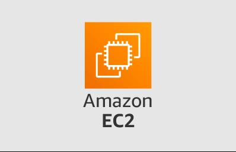
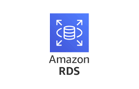
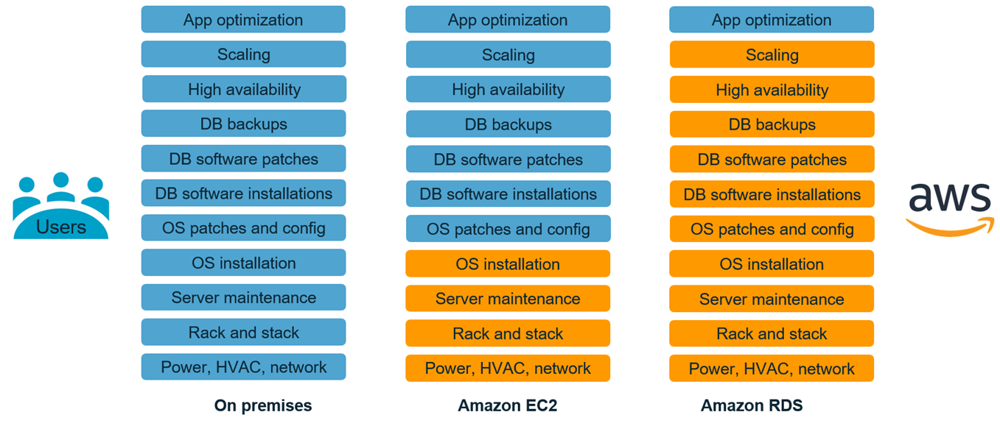
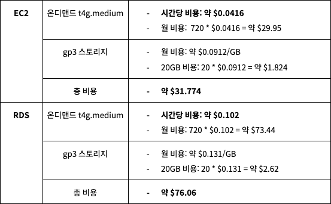
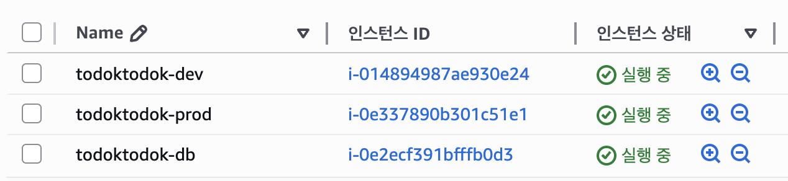
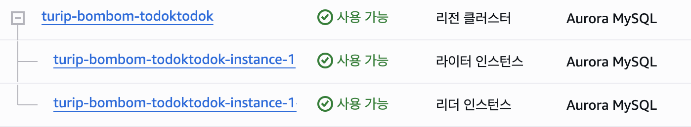

# AWS EC2와 RDS, 무엇이 다르고 뭘 써야 할까?

## 0. 목차
1. 주제 선택 이유
2. AWS EC2
3. AWS RDS
4. EC2와 RDS 비교
5. 토독토독의 선택
6. 마치며
7. Reference

## 1. 주제 선택 이유
프로그래밍은 항상 선택의 연속이다.  
선택할 항목에 따라 장점과 단점을 비교해야 하고, 언제나 그에 따른 절충(`Trade off`)이 발생한다.  
인프라 역시 마찬가지이다.  
토독토독 서비스 팀 프로젝트를 시작하며, 인프라 영역에서 가장 궁금했던 부분이 EC2와 RDS 선택 지점이었다.  
이 글은 AWS 인프라를 처음 접하거나, 접한 지 얼마 되지 않은 사람들을 위한 글이다.  
EC2에 직접 데이터베이스를 설치해야 할지, RDS를 사용해야 할지 그 선택에 필요한 정보를 제공하며 토독토독 서비스에서는 어떤 선택을 했는지 적어보려 한다.

## 2. AWS EC2
### a. AWS EC2란?

AWS EC2(Amazon Web Services Elastic Compute Cloud)는 AWS에서 제공하는 가상 컴퓨터(서버)이다.  
과거 온프레미스(On-Premise) 서버 환경처럼 물리적인 서버 컴퓨터를 직접 구매하는 것이 아니라, AWS에서 클릭 몇 번으로 서버를 생성할 수 있다.  
AWS에서 서버 컴퓨터를 빌리는 개념으로도 생각할 수 있기 때문에, 사용한 만큼만 비용을 지불하면 된다.

초기 비용과 전기, 네트워크, 인력 등 유지보수 비용이 많이 들었던 과거와 비교하여, 스타트업이나 개인 개발자도 쉽게 서버 컴퓨터를 빌려 사용할 수 있게 되었다.  
다양한 인스턴스 종류 중 필요에 따라 선택할 수 있으며, 원하는 운영 체제(Linux, Windows)뿐만 아니라 애플리케이션, 서비스, 부팅 파티션 크기까지 선택할 수 있다.  
오늘날 EC2는 웹 서버나 API 서버, 실험용 서버 등 대부분 서비스의 시작점이다.

### b. AWS EC2 인스턴스의 종류
AWS에서는 사용자의 필요에 따라 사양을 선택할 수 있도록 다양한 인스턴스 유형을 제공한다.  
인스턴스 유형은 CPU, 메모리, 스토리지, 네트워킹 용량 등의 다양한 조합으로 구성된다.  
AWS 공식 페이지에 따르면 크게 범용, 컴퓨팅 최적화, 메모리 최적화, 가속화된 컴퓨팅, 스토리지 최적화, HPC(High Performance Computing, 고성능 컴퓨팅) 최적화로 나뉘며, 아래 표와 같이 정리할 수 있다.

|  분류 |  타입  |설명|              예시               |
|:--:|:----:|:--:|:-----------------------------:|
|  범용 | t, m |CPU/메모리/ 네트워크 리소스 균형, 다양한 일반 워크로드에 적합| t4g, t3, t2, m8g, m7g, m6g 등  |
|컴퓨팅 최적화|  c   |고성능 프로세서 기반, 연산 집약적 어플리케이션에 적합|    c8g, c7g, c6g, c5, c4 등    |
|메모리 최적화|r, x, z, u|대용량 메모리 필요 작업(빅데이터, 인메모리 DB 등)에 적합|r7g, x2idn, z1d, u-6tb1.metal 등|
|가속화된 컴퓨팅|p, g, dl, f, inf, trn|머신러닝, HPC 및 GPU/FPGA 활용 작업에 적합|  p5, g5, dl1, f1, inf1, trn1  |
|스토리지 최적화|i, d, h|높은 IOPS, 대용량 스토리지, 데이터 웨어하우스, 분석에 적합|         i4i, d3en, h1         |
|HPC 최적화|hpc|매우 높은 네트워크/CPU/IO 성능을 위해 설계, 슈퍼 컴퓨팅에 적합|hpc7g, hpc7a|

각 분류별로 다양한 타입이 있으며, 필요에 따라 적합한 인스턴스 타입을 선택해 사용할 수 있다.  
토독토독 서비스와 같이 이제 막 시작한 웹/앱 애플리케이션 서비스의 WAS(Web Application Server) 서버는 범용의 t4g 타입을 선택하는 것이 일반적이다.

## 3. AWS RDS
### a. AWS RDS란?

AWS RDS(Amazon Web Services Relational Database Service)는 데이터베이스를 완전 관리형으로 사용할 수 있는 서비스이다.  
완전 관리형이 무엇일까?  
RDS를 사용하지 않는다면 사용자는 EC2에 직접 원하는 데이터베이스를 설치하고, 여러 설정을 관리하며 사용해야 한다.  
반면 RDS를 사용하면 PostgreSQL, MySQL, MariaDB, Oracle, SQL Server(MSSQL), Amazon Aurora 등 다양한 엔진 중 하나를 선택하여 관리 부담 없이 데이터베이스를 운영할 수 있다.

### b. AWS RDS의 장점
관리 부담이 없다는 것은 책임이 분리되어 있다는 의미로 이해할 수 있다.  
사용자는 데이터베이스 관리와 관련된 측면은 신경 쓰지 않고 데이터베이스를 사용할 수 있다. 이것이 RDS의 가장 큰 장점이다.

또한 컴퓨팅 규모나 스토리지 규모를 빠르게 조정할 수 있으며, 데이터베이스 인스턴스의 복제본을 생성하여 대량 읽기 트래픽을 처리할 수 있다.
설정만 하면 자동으로 스냅샷 백업과 복원이 가능하고, Multi-AZ(다중 가용 영역) 구성으로 장애가 발생했을 때 자동 장애 조치(Failover)가 가능해 고가용성을 지원한다.  
관리형 서비스인 만큼 별도의 모니터링 도구를 붙이지 않아도 AWS CloudWatch를 통해 성능 모니터링이 가능하다.

### c. AWS RDS 데이터베이스의 종류
AWS RDS 데이터베이스는 위에 언급했듯이 다양한 엔진 중 하나를 선택할 수 있다.  
엔진 종류는 다음과 같다.

|엔진 종류|설명|
|:--:|:--:|
|PostgreSQL|기능과 성능을 모두 갖춘 오픈 소스 관계형 데이터베이스|
|MySQL|세계적으로 가장 많이 사용되는 오픈 소스 관계형 데이터베이스|
|MariaDB|MySQL의 업그레이드 판, MySQL 개발자가 만든 오픈 소스 관계형 데이터베이스|
|Oracle|오라클 사의 유료 관계형 데이터베이스|
|SQL Server(MSSQL)|MicroSoft 사의 관계형 데이터베이스|
|Amazon Aurora|MySQL 및 PostgreSQL 호환 관계형 데이터베이스|

## 4. EC2와 RDS 비교
### a. 차이점 비교

위 그림은 온프레미스 서버, AWS EC2, AWS RDS를 사용했을 때 사용자와 AWS의 책임 분담을 나타낸다.  
그림에서도 확인할 수 있듯이 EC2에서는 RDS보다 사용자의 책임 분담이 더 많고, RDS는 AWS의 책임 분담이 더 많다.  
그만큼 사용자는 데이터베이스 관리보다 애플리케이션 개발에 더 집중할 수 있다.

EC2와 RDS의 차이점은 다음과 같다.

|항목|EC2|RDS|
|:--:|:--:|:--:|
|관리 부담|높음 (직접 설정/운영/관리)|낮음 (AWS가 관리)|
|제어|완전 제어 가능|제약 있음 (루트 권한 없음)|
|백업/복원|직접 스크립트/작업|자동화 지원|
|비용|RDS보다 낮음|EC2보다 높음|
|성능 튜닝|자유롭게 튜닝 가능|제약 있음 (파라미터 제한)|

### b. 비용 시나리오 비교
서울 리전에서 2025년 10월 13일 기준으로 한 달(720시간 = 24시간 * 30일) 동안 MySQL 엔진으로  
t4g.medium 인스턴스, 20GB 스토리지를 사용한다고 가정할 때, EC2와 RDS의 비용을 비교해보면 다음과 같다.

동일 사양, 동일 기간으로 보았을 때 EC2가 RDS에 비해 약 1/2 가량 저렴한 것으로 확인된다.  
RDS는 AWS에서 많은 것을 관리해주는 만큼 더 비싸다고 볼 수 있다.  

또 한 가지 고려할 점은, RDS는 관리형 서비스인만큼 고가용성, 자동 백업, 스토리지 IOPS 등 추가 기능을 사용했을 때 비용 증가로 이어질 수 있다.  
특히 고가용성을 위해 다중 AZ를 사용한다면 인스턴스 2대가 운영되므로 그만큼 비용이 증가하고, 모니터링을 위해 CloudWatch를 연결한다면 이 또한 비용이 발생한다.

EC2에 비해 RDS의 비용이 많이 높다고 느껴질 수 있지만, 안정적인 운영 측면에서 바라본다면 장기적으로 합리적인 선택일 수 있다.  
단, 단기적으로 가벼운 테스트용 서버나 개발 서버와 같은 경우라면 RDS보다 EC2를 택하는 것이 유리할 수 있다.

## 5. 토독토독의 선택

팀마다 선택하는 상황이라던가 환경이 다를 수 있겠지만, 토독토독은 서비스 기획 초반에는 모든 백엔드 팀원들의 동의 하에 개발 서버와 운영 서버 모두 EC2 내부에 MySQL을 설치하는 것으로 사용했다.  
운영 서버보다 가벼운 개발 서버는 심지어 한 대의 EC2 인스턴스에 WAS 서버와 DB를 함께 띄워두었다.  
제약 측면에서 RDS 보다 EC2가 자유롭기 때문에, 학습적인 측면에서 더 많은 것을 배울 수 있다고 생각했기 때문이다.  

하지만 최종 데모데이 서비스의 배포를 앞두고 있는 지금,   
DB가 단일 장애 지점이 되지 않게 하기 위해, CQRS 패턴 적용을 통한 고가용성 적용을 위해, DB 모니터링을 위해 RDS로의 마이그레이션을 진행하고 있다. 

## 6. 마치며
EC2와 RDS 중 어느 것이 `정답`이라고 말할 수는 없다.  
프로젝트의 규모, 팀의 기술 수준, 운영 환경의 안정성 요구 정도에 따라 선택이 달라질 뿐이다.  

EC2에 직접 데이터베이스를 설치하면 학습과 실험에는 유리하다.  
서버 내부 구조를 이해하는 데에 도움이 되고, 세밀한 제어와 커스터마이징을 할 수 있다.  
하지만 서비스가 커지고, 트래픽이 높아지고, 장애 상황에 대비해야 하는 시점이 오면 직접 관리의 부담이 커지고 운영 리스크가 높아진다.

반대로, RDS는 AWS가 많은 부분을 대신 관리해주기 때문에 안정성, 확장성, 백업, 모니터링 측면에서 훨씬 유리하다.  
비용은 다소 높더라도, 서비스가 `운영 단계`로 넘어가는 시점에는 관리형 서비스의 필요성을 체감하게 된다.

토독토독 서비스 역시 초반에는 EC2를 선택해 직접 설치, 설정하는 방법을 경험하며 인프라에 대한 학습을 함께 진행했다.  
그러나 실제 서비스 배포를 앞두고, 고가용성과 안정적인 운영을 위해 RDS로의 이전을 진행하고 있다.  
이 과정에서 인프라 선택이 단순히 기술적인 문제가 아니라, `운영 효율성과 서비스 신뢰성`과도 연결되는 것을 배웠다.

역시, 모든 것은 `Trade off`다.

## 7. Reference
- [Amazon Elastic Compute Cloud Documentation](https://docs.aws.amazon.com/ec2/?icmpid=docs_homepage_featuredsvcs)
- [Amazon EC2 인스턴스 유형](https://aws.amazon.com/ko/ec2/instance-types/)
- [Amazon EC2를 써야 하나요, Amazon RDS를 써야 하나요?](https://www.smileshark.kr/post/amazon-ec2-vs-amazon-rds-how-to-choose-right-hosted-database#viewer-netf)
- [AWS RDS Vs EC2 직접 설치](https://velog.io/@kinggusrl3/AWS-RDS)
- [AWS RDS 개념 & 아키텍쳐 정리](https://inpa.tistory.com/entry/AWS-%F0%9F%93%9A-RDS-%EA%B0%9C%EB%85%90-%EC%95%84%ED%82%A4%ED%85%8D%EC%B3%90-%EC%A0%95%EB%A6%AC-%EC%9D%B4%EB%A1%A0%ED%8E%B8#rds%EC%9D%98_%ED%8A%B9%EC%A7%95__%EA%B8%B0%EB%8A%A5)
- [Amazon EC2와 Amazon RDS 중 선택](https://docs.aws.amazon.com/ko_kr/prescriptive-guidance/latest/migration-sql-server/comparison.html)
- [Amazon EC2 온디맨드 요금](https://aws.amazon.com/ko/ec2/pricing/on-demand/#On-Demand_Pricing)
- [Amazon EBS 요금](https://aws.amazon.com/ko/ebs/pricing/)
- [Amazon RDS for MySQL 요금](https://aws.amazon.com/ko/rds/mysql/pricing/?pg=pr&loc=2)
- [AWS 요금 계산기](https://calculator.aws/#/)
