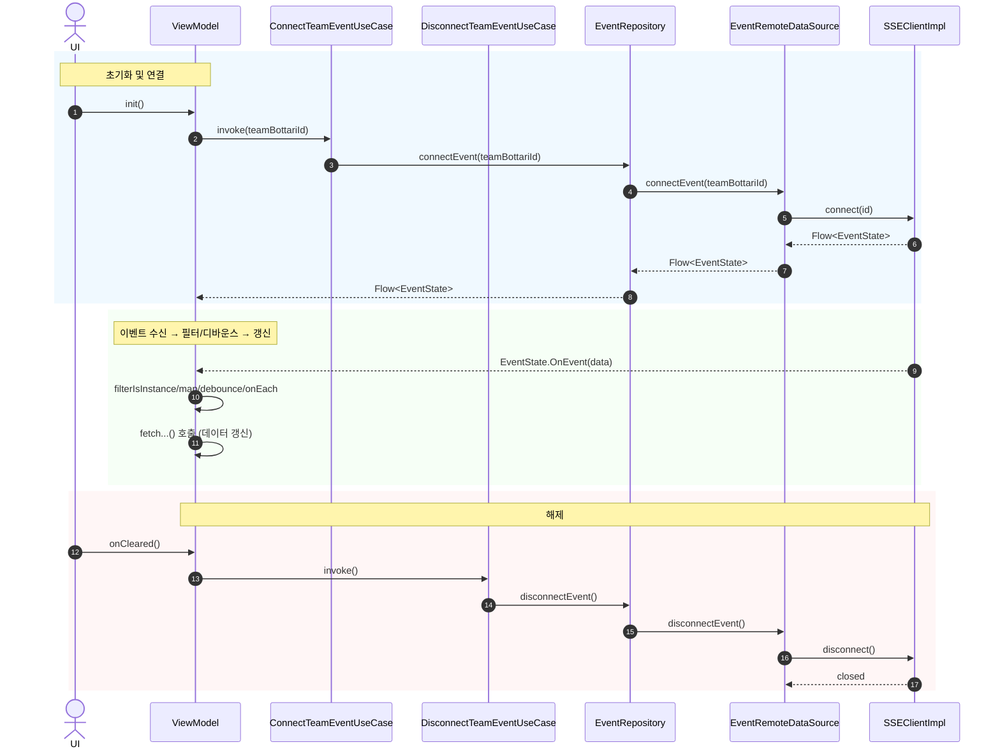

# 실시간 통신
실시간 데이터 전송은 오늘날의 웹 애플리케이션에서 빠질 수 없는 기능입니다. <br>
채팅, 알림, 주식 시세, 대시보드 모니터링 등 사용자에게 즉시 반응하는 인터페이스를 제공하기 위해서는 서버와 클라이언트 간의 지속적인 데이터 교환이 필요합니다.

이를 구현하는 대표적인 방법으로는 **폴링(Polling)**, **롱 폴링(Long Polling)**, **웹소켓(WebSocket)** 이 잘 알려져 있습니다. <br>

하지만 이들 방식이 항상 최적의 선택은 아닙니다. <br> 
서버에서 클라이언트로 **단방향 실시간 데이터 스트림**을 전송해야 하는 상황이라면, **SSE(Server-Sent Events)** 가 더 단순하고 효율적인 대안이 될 수 있습니다.

## 폴링 (Polling)
폴링은 가장 단순한 형태의 실시간 통신입니다. <br>
클라이언트가 일정 주기(예: 5초마다)로 서버에 요청을 보내 새로운 데이터가 있는지를 확인합니다. <br>
구현이 쉽고 간단하다는 장점이 있지만, 불필요한 요청이 반복적으로 발생하여 서버 자원을 낭비하고 데이터 전송 지연이 커질 수 있습니다.

## 롱 폴링 (Long Polling)
롱 폴링은 이러한 폴링의 단점을 보완한 방식으로, 클라이언트가 요청을 보내면 서버는 새로운 데이터가 생길 때까지 응답을 지연시킵니다. <br>
데이터가 준비되면 서버가 응답을 보내고, 클라이언트는 즉시 다음 요청을 보냅니다. <br>
폴링보다는 효율적이지만, 여전히 HTTP 연결이 반복적으로 생성되고 끊어지는 구조이기 때문에 완벽한 실시간 통신이라고 할 수 없습니다.

## 웹소켓 (WebSocket)
웹소켓은 클라이언트와 서버 간의 양방향 통신 채널을 영구적으로 유지합니다. <br>
한 번 연결이 맺어지면, 양쪽에서 자유롭게 데이터를 주고 받을 수 있습니다. <br>

실시간성이 매우 뛰어나지만, 프로토콜이 복잡하고 서버 자원 관리나 보안 설정이 복잡할 수 있습니다. <br>
특히 양방향 통신이 필요하지 않은 경우에는 오버 엔지니어링이 될 수 있습니다.

## SSE (Server-Sent Events)
SSE는 이러한 문제를 해결하기 위해 등장한 HTTP 기반의 단방향 스트리밍 기술입니다. <br>
클라이언트는 서버와 하나의 연결을 유지하며, 서버가 발생시키는 이벤트를 실시간으로 수신합니다. <br>
웹소켓처럼 별도의 프로토콜이나 핸드셰이크 과정이 필요하지 않고, 표준 HTTP로 동작하기 때문에 <br>
브라우저 호환성, 프록시 통과성, 구현 단순성 면에서 큰 장점을 가집니다. <br>
즉, 서버에서 클라이언트로만 데이터를 지속적으로 보내야 하는 상황이라면 SSE는 웹소켓보다 더 가볍고 간결한 선택이 될 수 있습니다.

이번 글에서는 SSE 구현 라이브러리 내부 구조와 동작 원리, <br>
그리고 제가 개발하고 있는 **보따리**에서의 SSE 구현 과정에 대해 설명하고자 합니다.

# SSE 구현 라이브러리
## `okhttp-sse`
OkHttp3에서 제공하는 SSE 라이브러리입니다. <br>
> Experimental support for server-sent events. API is not considered stable and may change at any time.

아직까지는 실험적인 라이브러리이기 때문에 불안정하며, 변경을 인지하고 사용해야 합니다.

## `launchdarkly/okhttp-eventsource`
`OkHttp`를 이용하여 SSE를 쉽게 구현할 수 있도록 돕는 라이브러리입니다. <br>
이벤트 비동기 처리, 핸들러 및 리스너 등 여러 기능을 제공하지만, <br>
프로젝트에 실제로 적용했을 때는 핸들러가 의도한대로 동작하지 않아서 `okhttp-sse`를 선택했습니다.

## `okhttp-sse` 동작 방식
구현에 앞서 `okhttp-sse`가 어떻게 SSE 통신을 처리하는지 알아보겠습니다. <br>
### `EventSource`
```kotlin
interface EventSource {
  /** Returns the original request that initiated this event source. */
  fun request(): Request

  /**
   * Immediately and violently release resources held by this event source. This does nothing if
   * the event source has already been closed or canceled.
   */
  fun cancel()

  fun interface Factory {
    /**
     * Creates a new event source and immediately returns it. Creating an event source initiates an
     * asynchronous process to connect the socket. Once that succeeds or fails, `listener` will be
     * notified. The caller must cancel the returned event source when it is no longer in use.
     */
    fun newEventSource(request: Request, listener: EventSourceListener): EventSource
  }
}
```
`EventSource`는 인터페이스로 선언되어 있습니다. <br>
내부에는 `request()`, `cancel()` 메소드와 함수형 인터페이스가 있습니다.
- `request()` : `EventSource` 객체를 초기화할때 사용한 요청 반환
- `cancel()` : `EventSource`의 리소스를 즉시 해제, 이미 `EventSource`가 닫히거나 취소된 경우에는 동작 X
- `newEventSource(request: Request, listener: EventSourceListener)` : 소켓 연결을 비동기적으로 처리하는 `EventSource` 생성 후 반환, 성공 및 실패 여부를 `listener`가 처리하며 `EventSource`를 사용하고 있지 않을 경우 호출자 취소

이를 통해 `EventSource`를 직접 상속받아서 구현하는 것이 아닌 `newEventSource`를 통해 `EventSource`를 생성할 수 있다는 것을 알았습니다. <br>
또한 `EventSource`를 생성할 때는 `Request`와 `EventSourceListener`를 전달해야 하는데, 이에 대해 알아보겠습니다. <br>

### `EventSourceListener`
```kotlin
abstract class EventSourceListener {
  /**
   * Invoked when an event source has been accepted by the remote peer and may begin transmitting
   * events.
   */
  open fun onOpen(eventSource: EventSource, response: Response) {
  }

  /**
   * TODO description.
   */
  open fun onEvent(eventSource: EventSource, id: String?, type: String?, data: String) {
  }

  /**
   * TODO description.
   *
   * No further calls to this listener will be made.
   */
  open fun onClosed(eventSource: EventSource) {
  }

  /**
   * Invoked when an event source has been closed due to an error reading from or writing to the
   * network. Incoming events may have been lost. No further calls to this listener will be made.
   */
  open fun onFailure(eventSource: EventSource, t: Throwable?, response: Response?) {
  }
}
```
- `onOpen(eventSource: EventSource, response: Response)` : 이벤트 전송이 시작될 때 호출
- `onEvent(eventSource: EventSource, id: String?, type: String?, data: String)` : 이벤트가 발생했을 때 호출
- `onClosed(eventSource: EventSource)` : 연결이 닫혔을 때 호출
- `onFailure(eventSource: EventSource, t: Thrwoable?, response: Response?)` : 네트워크에서의 읽기 혹은 쓰기 오류로 `EventSource`가 닫혔을 때 호출, 이후 해당 리스너를 더 이상 호출하지 않음

실질적으로 이벤트를 처리할 수 있는 부분은 `onEvent()`입니다. <br>
`EventSourceListener`를 상속받아서 위의 메소드를 재정의해야 한다는 사실을 알 수 있습니다. <br>

### `Request`
```kotlin
/**
 * An HTTP request. Instances of this class are immutable if their [body] is null or itself
 * immutable.
 */
class Request internal constructor(
  @get:JvmName("url") val url: HttpUrl,
  @get:JvmName("method") val method: String,
  @get:JvmName("headers") val headers: Headers,
  @get:JvmName("body") val body: RequestBody?,
  internal val tags: Map<Class<*>, Any>
)
```
OkHttp3에서 사용하는 `Request` 클래스입니다. <br>
`EventSource`를 생성할 때는 `url` 이외에는 신경쓰지 않아도 됩니다. <br>

### `EventSources`
```kotlin
object EventSources {
  @JvmStatic
  fun createFactory(client: OkHttpClient): EventSource.Factory {
    return EventSource.Factory { request, listener ->
      val actualRequest =
        if (request.header("Accept") == null) {
          request.newBuilder().addHeader("Accept", "text/event-stream").build()
        } else {
          request
        }

      RealEventSource(actualRequest, listener).apply {
        connect(client)
      }
    }
  }

  @JvmStatic
  fun processResponse(response: Response, listener: EventSourceListener) {
    val eventSource = RealEventSource(response.request, listener)
    eventSource.processResponse(response)
  }
}
```
- `createFactory(client: OkHttpClient)` : `EventSource`에 선언되어 있던 함수형 인터페이스 `Factory`의 구현체 반환
- `processResponse(response: Response, listener: EventSourceListener)` : 통신 과정을 동기적으로 처리할 때 사용

`Flow`를 통해서 이벤트를 비동기적으로 처리할 예정이기 때문에 `createFactory(client: OkHttpClient)`만 살펴보겠습니다. <br>
위에서 서술했듯이 `Factory`의 구현체를 반환하며, 람다 표현식으로 `newEventSource`가 구현되어 있음을 알 수 있습니다. <br>

`newEventSource(request: Request, listener: EventSourceListener)`를 호출하면 해당 람다가 호출되는데, <br>
`Request`를 전달할 때 헤더를 추가하지 않아도 내부에서 SSE 헤더를 자동으로 추가해주고 있습니다. <br>

또한 실질적인 통신 로직은 모두 `RealEventSource` 내부에 있다는 사실을 알 수 있습니다. <br>

### `RealEventSource`
```kotlin
class RealEventSource(
  private val request: Request,
  private val listener: EventSourceListener
) : EventSource, ServerSentEventReader.Callback, Callback
```
`newEventSource(request, listener)`에 전달한 객체를 통해 생성됩니다. <br>

```kotlin
  fun connect(client: OkHttpClient) {
    val client = client.newBuilder()
        .eventListener(EventListener.NONE)
        .build()
    call = client.newCall(request) as RealCall
    call.enqueue(this)
  }
```
Retrofit을 통해 통신을 구현한 경험이 있다면 위의 코드를 쉽게 이해할 수 있습니다. <br>
`Call` 객체를 생성하고, `enqueue` 메소드에 전달하여 이벤트 스트림 연결을 요청합니다. <br>

```kotlin
  override fun onResponse(call: Call, response: Response) {
    processResponse(response)
  }
```
`RealEventSource`가 상속받은 `Callback` 인터페이스의 메소드입니다. <br>
`connect` 메소드의 `enqueue`에 대한 응답을 처리합니다. <br>

```kotlin
  override fun onEvent(id: String?, type: String?, data: String) {
    listener.onEvent(this, id, type, data)
  }
```
`RealEventSource`가 상속받은 `ServerSentEventReader.Callback` 인터페이스의 메소드입니다. <br>
`EventSourceListener`의 `onEvent`를 호출하여 이벤트가 발생했을 때를 처리합니다. <br>
실제로 버퍼를 읽고 이벤트 데이터를 처리하는 로직은 `ServerSentEventReader` 내부에 구현되어 있는데, <br>
로직이 복잡하게 구성되어 있어 깊게 이해하지 않아도 됩니다. <br>

```kotlin
fun processResponse(response: Response) {
    response.use {
      if (!response.isSuccessful) {
        listener.onFailure(this, null, response)
        return
      }

      val body = response.body!!

      if (!body.isEventStream()) {
        listener.onFailure(this,
            IllegalStateException("Invalid content-type: ${body.contentType()}"), response)
        return
      }

      // This is a long-lived response. Cancel full-call timeouts.
      call.timeoutEarlyExit()

      // Replace the body with an empty one so the callbacks can't see real data.
      val response = response.newBuilder()
          .body(EMPTY_RESPONSE)
          .build()

      val reader = ServerSentEventReader(body.source(), this)
      try {
        listener.onOpen(this, response)
        while (reader.processNextEvent()) {
        }
      } catch (e: Exception) {
        listener.onFailure(this, e, response)
        return
      }
      listener.onClosed(this)
    }
  }
```
서버에 연결을 요청하고, 응답이 왔을 때를 처리하는 메소드입니다. <br>
`EventSourceListener`의 콜백 메소드로 연결이 되었을 때, 실패했을 때, 연결이 끊겼을 때를 처리하고 있으며 <br>
`ServerSentEventReader`를 통해 이벤트를 수신 및 처리하고 있습니다. <br>

```kotlin
  override fun cancel() {
    call.cancel()
  }
```
이벤트 스트림을 닫을 때 호출하는 메소드입니다.

### 흐름 요약
라이브러리 내부 코드를 모두 살펴보았으므로, SSE 연결 및 이벤트 처리 흐름을 알 수 있습니다. <br>
1. `EventSources.createFactory(client: OkHttpClient)`로 함수형 인터페이스인 `EventSource.Factory` 구현체 생성
2. `EventSource.Factory`의 `newEventSource(request: Request, listener: EventSourceListener)`를 호출하여 `EventSource` 구현체 생성
3. `EventSource` 구현체가 생성됨과 동시에 `RealEventSource`의 `connect`가 호출되어 연결 요청, 성공 시 이벤트 스트림 연결
4. `RealEventSource` 내부에서 이벤트 처리

# SSE 구현 과정
보따리에서의 SSE 통신 과정은 다음과 같은 단계로 이루어져 있습니다.
1. 서버 연결 (성공 시 HTTP 200 반환) 및 이벤트 스트림 시작
2. 이벤트 수신
3. 연결 해제

## 클라이언트
연결과 이벤트 스트림을 처리할 클라이언트를 구현했습니다.
```kotlin
interface SSEClient {
    fun connect(teamBottariId: Long): Flow<EventStateResponse>

    fun disconnect()
}
```
의존성 역전 원칙에 의거하여, 클라이언트를 인터페이스로 추상화했습니다. <br>
또한 API 호출 이후에 이벤트를 받는 것이 아니라, 서버에서 스트림을 통해 이벤트를 전송하는 것이므로 이를 처리하기 위해서 `Flow`를 사용했습니다. <br>

물론 해당 라이브러리에서는 `Flow` 사용이 강제되어 있지는 않습니다.

## 클라이언트 구현체
```kotlin
class SSEClientImpl(
    private val client: OkHttpClient,
) : EventSourceListener(), SSEClient 
```
`EventSource`를 생성하는 데 필요한 `OkHttpClient`를 생성자로 주입받고, <br>
`EventSourceListener`를 상속받아서 이벤트 처리 로직을 내부에서 구현했습니다. <br>

```kotlin
private var eventSource: EventSource? = null
private var id: Long? = null
private val eventFlow: MutableStateFlow<EventStateResponse> =
    MutableStateFlow(
        EventStateResponse.Empty,
    )
```
- `eventSource` : `EventSource` 객체를 담을 변수
- `id` : 로깅을 위한 우리 보따리 ID
- `eventFlow` : 이벤트를 담을 Flow

```kotlin
    override fun onEvent(
        eventSource: EventSource,
        id: String?,
        type: String?,
        data: String,
    ) {
        super.onEvent(eventSource, id, type, data)
        runCatching {
            val rawEvent = json.decodeFromString(OnEventRaw.serializer(), data)
            rawEvent.toEvent(json)
        }.onSuccess { event ->
            BottariLogger.network("[Event] $data")
            eventFlow.value = event
        }.onFailure { exception ->
            BottariLogger.error(exception.message, exception)
            eventFlow.value = EventStateResponse.OnFailure(exception)
        }
    }
```
보따리에서는 이벤트에 담긴 데이터를 유연하게 처리하기 위해서 이벤트 내부의 데이터를 `JsonElement` 타입으로 저장한 후, <br>
특정 이벤트 유형에 따라 그에 맞는 DTO로 변환하게끔 로직을 구성했습니다. <br>
서버에서 지정한 리소스 타입과 이벤트 타입은 모두 열거형 클래스로 선언되어 있기 때문에 유형이 추가되더라도 유연하게 대처할 수 있습니다. <br>

또한 이벤트 DTO는 `EventStateResponse` 타입을 상속받게 하여 하나의 Flow에 담고, <br>
Presentation 계층에서 이벤트 유형에 따른 처리를 쉽게 할 수 있도록 하였습니다. <br>

```kotlin
sealed interface EventStateResponse {
    data object Empty : EventStateResponse

    data object OnClosed : EventStateResponse

    data object OnOpen : EventStateResponse

    data class OnEventResponse(
        val resource: ResourceResponse,
        val event: EventResponse,
        val data: EventDataResponse,
        val publishedAt: LocalDateTime,
    ) : EventStateResponse

    data class OnFailure(
        val exception: Throwable?,
    ) : EventStateResponse
}
```
```kotlin
sealed interface EventDataResponse {
    val publishedAt: LocalDateTime

    fun toDomain(): EventData

    @Serializable
    data class TeamMemberCreateResponse(
        @SerialName("publishedAt")
        @Serializable(with = LocalDateTimeSerializer::class)
        override val publishedAt: LocalDateTime,
        @SerialName("memberId")
        val memberId: Long,
        @SerialName("name")
        val name: String,
        @SerialName("isOwner")
        val isOwner: Boolean,
    ) : EventDataResponse {
        override fun toDomain(): EventData = EventData.TeamMemberCreate(publishedAt, memberId, name, isOwner)
    }

    @Serializable
    data class TeamMemberDeleteResponse(..)
}
```
각 화면은 모두 같은 이벤트를 수신하지만, `when` 분기 처리를 통해 해당 화면에 필요한 데이터만 받아서 UI를 갱신할 수 있습니다. <br>
`EventSourceListener`의 다른 메소드는 로깅 및 예외 처리를 진행하고 있습니다. <br>

<br>

라이브러리 코드에서 알 수 있듯이, `EventSource`를 생성하려면 먼저 `Request`를 생성해야 합니다.
```kotlin
    private fun createRequest(teamBottariId: Long): Request =
        Request
            .Builder()
            .url(getUrl(teamBottariId))
            .get()
            .build()

    private fun getUrl(teamBottariId: Long): HttpUrl =
        BuildConfig.BASE_URL
            .toHttpUrl()
            .newBuilder()
            .addPathSegment(PATH_TEAM_BOTTARIES)
            .addPathSegment(teamBottariId.toString())
            .addPathSegment(PATH_SSE)
            .build()
```
`Request`의 `url`에는 `HttpUrl` 타입이 전달되어야 하므로, `getUrl`을 선언하여 처리하였습니다. <br>

```kotlin
    private fun createEventSource(request: Request): EventSource =
        EventSources
            .createFactory(client)
            .newEventSource(request, this)
```
그 다음 `EventSource`를 생성하는 `createEventSource`를 선언했습니다. <br>
SSE 통신은 해당 메소드가 호출되는 시점부터 시작됩니다. <br>

```kotlin
    override fun connect(teamBottariId: Long): Flow<EventStateResponse> {
        if (eventSource != null) return eventFlow
        id = teamBottariId
        val request = createRequest(teamBottariId)
        eventSource = createEventSource(request)
        BottariLogger.network("[Event] Team Bottari $id stream connect")
        return eventFlow
    }
```
외부에서는 위의 `connect` 함수를 호출하는 시점부터 이벤트를 수신할 수 있습니다. <br>
OkHttp3가 내부적으로 비동기 처리를 하기 때문에 해당 메소드를 `suspend`로 선언할 필요는 없습니다. <br>
또한 이미 이벤트 스트림이 존재하는 경우 (`eventSource`가 null이 아닐 때) 불필요한 요청을 다시 보내지 않기 위해 조건문을 추가했습니다. <br>

```kotlin
    override fun disconnect() {
        if (id == null || eventSource == null) return
        BottariLogger.network("[Event] Team Bottari $id stream disconnect")
        eventSource?.cancel()
        eventSource = null
        id = null
    }
```
연결을 종료할 때 호출하는 `disconnect` 메소드입니다. <br>
이미 연결이 종료되었을 때 동작하게 하지 않기 위해서 조건문을 추가했습니다. <br>
또 메모리 누수를 방지하기 위해서 `cancel()` 호출 후 리소스를 해제했습니다. <br>

```kotlin
    private val sseOkHttpClient: OkHttpClient by lazy {
        OkHttpClient
            .Builder()
            .addInterceptor(authInterceptor)
            .connectTimeout(0, TimeUnit.MILLISECONDS)
            .readTimeout(0, TimeUnit.MILLISECONDS)
            .retryOnConnectionFailure(true)
            .build()
    }

    val sseClient: SSEClient by lazy { SSEClientImpl(sseOkHttpClient) }
```
SSE 클라이언트를 생성하기 위해서는 OkHttpClient 인스턴스가 필요합니다. <br>
위처럼 `connectTimeout`, `readTimeout`을 0으로 설정하면 타임아웃이 일어나지 않습니다. <br>

SSE 연결 종료를 ViewModel에서 명시적으로 하기 때문에 위와 같은 코드를 작성했습니다. <br>
또한 `retryOnConnectionFailure()`에 `true`를 전달하면 연결 실패 시 재연결 시도가 가능합니다. <br>

## Data Layer
### DataSource
```kotlin
interface EventRemoteDataSource {
    fun connectEvent(teamBottariId: Long): Flow<EventStateResponse>

    fun disconnectEvent()
}
```

```kotlin
class EventRemoteDataSourceImpl(
    private val client: SSEClient,
) : EventRemoteDataSource {
    override fun connectEvent(teamBottariId: Long): Flow<EventStateResponse> = client.connect(teamBottariId)

    override fun disconnectEvent() = client.disconnect()
}
```
SSE 클라이언트에 직접 의존하여 연결 요청 및 해제를 처리하는 `DataSource`입니다.

### Repository
```kotlin
class EventRepositoryImpl(
    private val eventRemoteDataSource: EventRemoteDataSource,
) : EventRepository {
    override fun connectEvent(teamBottariId: Long): Flow<EventState> =
        eventRemoteDataSource.connectEvent(teamBottariId).map { eventStateResponse ->
            eventStateResponse.toDomain()
        }

    override fun disconnectEvent() = eventRemoteDataSource.disconnectEvent()
}
```
Data Layer에는 `EventRepository`의 구현체를 선언하였습니다. <br>
이는 Domain Layer가 Data Layer에 의존하는 것을 방지하기 위함이며, 클린 아키텍쳐를 따른 설계입니다. <br>

Data Layer의 DTO를 도메인 객체인 `EventState`로 변환합니다. <br>
`EventState`는 `EventStateResponse`와 동일한 구조로 구성되어 있습니다. <br>

## Domain Layer
### Repository
```kotlin
interface EventRepository {
    fun connectEvent(teamBottariId: Long): Flow<EventState>

    fun disconnectEvent()
}
```
### `EventState`
```kotlin
sealed interface EventState {
    data object Empty : EventState

    data object OnClosed : EventState

    data object OnOpen : EventState

    data class OnEvent(
        val data: EventData,
        val publishedAt: LocalDateTime,
    ) : EventState

    data class OnFailure(
        val exception: Throwable?,
    ) : EventState
}
```
### `EventData`
```kotlin
sealed interface EventData {
    val publishedAt: LocalDateTime

    data class TeamMemberCreate(
        override val publishedAt: LocalDateTime,
        val memberId: Long,
        val name: String,
        val isOwner: Boolean,
    ) : EventData

    data class TeamMemberDelete(..)
}
```
`EventData`가 특정 이벤트에 의해 변경된 데이터를 담고 있습니다. <br>
즉, 실제로 화면에 반영되어야 하는 데이터입니다. <br>

### UseCase
```kotlin
class ConnectTeamEventUseCase(
    private val eventRepository: EventRepository,
) {
    operator fun invoke(teamBottariId: Long): Flow<EventState> = eventRepository.connectEvent(teamBottariId)
}

class DisconnectTeamEventUseCase(
    private val eventRepository: EventRepository,
) {
    operator fun invoke() = eventRepository.disconnectEvent()
}
```

## Presentation Layer
```kotlin
class TeamBottariStatusViewModel(
    stateHandle: SavedStateHandle,
    ..,
    private val connectTeamEventUseCase: ConnectTeamEventUseCase,
    private val disconnectTeamEventUseCase: DisconnectTeamEventUseCase,
)
```
SSE 이벤트를 처리해야 하는 우리 보따리 관련 ViewModel은 위 2개의 UseCase에 의존하게 됩니다. <br>
이로 인해 연결 요청 및 해제를 각 화면에서 처리할 수 있습니다. <br>

```kotlin
    @OptIn(FlowPreview::class)
    private fun handleEvent() {
        connectTeamEventUseCase(teamBottariId)
            .filterIsInstance<EventState.OnEvent>()
            .map { event -> event.data }
            .debounce(DEBOUNCE_DELAY)
            .onEach { fetchTeamStatus() }
            .launchIn(viewModelScope)
         }
    }
```
UseCase의 `invoke()`를 호출하여 연결 요청을 하되, 이미 이벤트 스트림이 존재하면 해당 이벤트 스트림을 사용합니다. <br>
`filterIsInstance`를 통해 실제 전송된 이벤트만을 필터링하고 (OnEvent), `map`으로 내부에서 데이터를 가져옵니다. <br>

또한 다수의 사용자가 동시에 이벤트를 발생시킬 때마다 화면이 갱신되는 것을 방지하기 위해 `debounce`를 활용했습니다. <br>
마지막으로 `onEach`에 이벤트가 발생했을 때의 동작을 지정하고, `launchIn`에 `viewModelScope`를 전달하여 실행합니다. <br>

위 메소드를 선언한 화면에서는 팀에서 발생하는 모든 종류의 이벤트를 관찰해야 하기 때문에 별도의 처리를 하지 않았습니다. <br>
이렇게 하면 같은 팀에 속한 팀원이 어떤 동작을 할 때 화면이 갱신되는 것을 확인할 수 있습니다. <br>

```kotlin
    override fun onCleared() {
        super.onCleared()
        disconnectTeamEventUseCase()
    }
```
마지막으로 ViewModel의 인스턴스가 제거될 때 SSE의 연결을 끊음으로써 메모리 누수를 방지합니다. <br>

## 시퀀스 다이어그램


# 고려할 점
## 이벤트 데이터 반영
현재 **보따리**에서는 특정 이벤트가 발생하면 해당 화면 구성에 필요한 API를 다시 호출하기 때문에 새로고침에 가깝습니다. <br>
`EventData`에 저장된 데이터를 통해 직접 화면을 갱신하면 불필요한 API 호출을 하지 않을 수 있습니다. <br>

## 오류 처리 (재연결)
`okhttp-sse`에서는 통신 도중 연결에 문제가 발생한 경우의 재연결 처리를 지원하지 않고 있습니다. <br>

```kotlin
  override fun onRetryChange(timeMs: Long) {
    // Ignored. We do not auto-retry.
  }
```

실제로 `RealEventSource` 내부 구현을 살펴보면 재연결 관련 메소드가 구현되어 있지 않고 무시하라는 주석이 작성되어 있습니다.<br>
때문에 재연결을 위해서는 별도의 처리가 필요합니다. <br>
크게 두 가지 방법이 있습니다. <br>

### 하트비트 (Heartbeat)
하트비트는 말 그대로 "아직 서버가 살아있다"는 신호를 주기적으로 보내는 작은 패킷입니다. <br>
일반적으로 별다른 의미 없는 주석 형태로 전송됩니다. <br>
해당 메시지는 실제 데이터로 처리되지 않으며, 주기적으로 전송되기 때문에 타임아웃에 걸리지 않을 수 있습니다. <br>
클라이언트에서는 일정 시간이 지났을 때 하트비트가 오지 않으면 재연결을 시도할 수 있습니다.

### 직접 구현하기
SSE는 라이브러리를 사용하지 않아도 큰 어려움 없이 구현할 수 있습니다. <br>
데이터를 파싱하는 코드가 복잡하기 때문에 많은 시간이 걸릴 수 있지만, 서버와 별도의 포맷으로 통신하거나 재연결 시도가 반드시 필요한 경우에는 직접 구현하는 방법이 용이할 수 있습니다. <br>

# 결론
지금까지 SSE 클라이언트 구현에 대해 알아보았습니다.<br>
SSE는 실시간 통신을 구축하는 데에 있어서 매우 각광받는 기술입니다.<br>
최근 컨퍼런스에도 자주 등장하고 있습니다. <br>
<br>
하지만 개인적으로 SSE 또한 웹소켓과 비슷할 정도로 러닝 커브가 높다고 생각합니다.<br>
특히 백엔드는 고려해야 할 점이 많다고 느껴졌습니다. <br>
때문에 도메인, 가용할 수 있는 리소스 등 여러 방면에서 고민하고 나서 선택해야 합니다. <br>
<br>
제가 진행하고 있는 프로젝트에서도 아직 SSE는 개선해야 할 점이 많습니다.<br>
이러한 구현 방법 외에도 여러 방법이 있기 때문에, 충분히 고민해보시길 바랍니다.<br>
긴 글 읽어주셔서 감사합니다.