# 🔒 락(Lock) 개념과 MySQL(InnoDB) 락(Lock)
동시성 문제를 계기로 Lock을 공부하면서 공식 문서, 책, 블로그 등 다양한 자료를 찾아보았다. 그러나 자료마다 설명이 조금씩 달랐고, *Real MySQL 8.0*의 설명조차 MySQL 공식 문서와 일치하지 않는 부분이 존재했다. 이는 DBMS마다 지원하는 Lock의 세부 종류와 동작 방식이 다르기 때문에, 통일된 기준 문서를 찾기 어렵기 때문이다.

따라서 이번 글은 이러한 혼란을 겪는 사람들을 위해 작성되었다. 글의 전반부에서는 **SQL 표준 문서, 혹은 일반적인 개념 기준으로 Lock의 개념을 정리**하고, 후반부에서는 **MySQL(InnoDB)를 중심으로 실제 Lock 동작을 쿼리로 검증하며 정리한 내용**을 다룬다.

해당 글은 락의 기본 개념과 MySQL 엔진 구조에 대한 기초 지식을 전제로 한다.

<br>
<br>

# 📎 목차
- [✅ Lock 지원 개념적 단위](https://github.com/soeun2537/woowa-writing/blob/level4/level4.md#-lock-%EC%A7%80%EC%9B%90-%EB%8B%A8%EC%9C%84)
- [✅ Lock 개념적 종류](https://github.com/soeun2537/woowa-writing/blob/level4/level4.md#-lock-%EC%A2%85%EB%A5%98)
- [✅ MySQL 엔진의 Lock](https://github.com/soeun2537/woowa-writing/blob/level4/level4.md#-mysql-%EC%97%94%EC%A7%84%EC%9D%98-lock)
- [✅ InnoDB 엔진의 Lock](https://github.com/soeun2537/woowa-writing/blob/level4/level4.md#-innodb-%EC%97%94%EC%A7%84%EC%9D%98-lock)
- [📍 참고 자료](https://github.com/soeun2537/woowa-writing/blob/level4/level4.md#-%EC%B0%B8%EA%B3%A0-%EC%9E%90%EB%A3%8C)

<br>
<br>

# ✅ Lock 지원 개념적 단위
> SQL 표준 문서에서 정의하는 Lock의 지원 단위는 Table과 Row에 한정된다. 그 외 Page/Block, Index, Database 수준의 Lock은 Oracle, SQL Server, MySQL 등 각 DBMS가 자체적으로 확장하여 제공한다.
> 
> 예를 들어, SQL Server는 RID, Page, Extent, HoBT, Table 단위 Lock을 지원하고, MySQL(InnoDB)는 Global 단위를 추가로 제공한다. 따라서 실제 사용 가능한 Lock 단위는 DBMS 공식 문서를 반드시 확인해야 한다.

<br>

## ▶ 데이터베이스(Database)
**데이터베이스 단위**로 Lock을 설정하는 방식이다.
- 해당 DB 내 모든 테이블과 레코드에 대한 접근이 차단된다.
- 주로 유지보수, 백업, 대규모 스키마 변경 같은 특수 상황에서만 사용된다.
- 동시성이 심각하게 제한되므로 일반적인 환경에서는 거의 사용되지 않는다.

<br>

## ▶ 파일(File)
테이블이나 인덱스가 저장된 **물리적 파일 단위**로 Lock을 설정하는 방식이다.
- 파일 기반 DBMS 또는 구버전에서 주로 사용되었다.
- 최신 DBMS에서는 더 세밀한 Lock 단위를 선호하기 때문에 잘 쓰이지 않는다.

<br>

## ▶ 테이블(Table)
**테이블 단위**로 Lock을 설정하는 방식이다.
- 테이블 내 모든 레코드가 동시에 수정 불가 상태가 된다.
- 쓰기 작업이 많을 경우 동시성이 크게 저하될 수 있다.

<br>

## ▶ 페이지(Page) (= Block)
DB 저장소에서 일정 크기(보통 4KB~16KB)의 데이터 묶음인 **페이지 단위**로 Lock을 설정하는 방식이다.
- 행보다 크고, 테이블 전체보다는 작은 단위다.
- 여러 행이 같은 페이지에 속해 있으면, 특정 행이 Lock될 때 페이지 전체가 함께 잠길 수 있다.

<br>

## ▶ 행(Row)
**행 단위**로 Lock을 설정하는 방식이다.
- 가장 세밀하게 제어할 수 있어 동시성 확보에 유리하다.
- 하지만 관리해야 할 Lock의 수가 많아져 성능 부담이 커질 수 있다.

<br>

## ▶ 열(Column)
**특정 행의 일부 열 단위**로 Lock을 설정하는 방식이다.
- 이론적으로는 가능하지만, 구현 난이도가 높고 실질적 효용이 낮아 상용 DBMS에서는 거의 사용되지 않는다.

<br>
<br>

# ✅ Lock 개념적 종류
SQL-92에서는 트랜잭션 격리 수준을 구현하기 위해 Lock 모드를 정의한다. SQL-92에는 **공유 락(Shared), 배타 락(Exclusive), 내재 락(Intent)** 등이 정의되어 있으며, **업데이트 락(Update)** 은 SQL Server 확장 기능이다.

<br>

## ▶ 공유 락(Shared Lock, S)
**데이터를 조회(SELECT)할 때 사용**하며, **S로 표기**한다.
- 다른 트랜잭션도 동일한 데이터에 대해 공유 락(S)을 걸 수 있다. 즉, 읽기는 여러 트랜잭션에서 동시에 가능하다.
- 그러나 다른 트랜잭션이 배타 락(X)을 거는 것은 허용되지 않는다. 즉, 쓰기는 불가능하다.

<br>

## ▶ 배타 락(Exclusive Lock, X)
**데이터를 변경(INSERT, UPDATE, DELETE)할 때 사용**하며, **X로 표기**한다.
- 해당 데이터에 대해 다른 어떤 트랜잭션도 공유 락(S)이나 배타 락(X)을 걸 수 없다.
- 즉, 읽기와 쓰기 모두 차단된다.

<br>

## ▶ 업데이트 락(Update Lock, U)
**데이터를 수정하기 위해 배타 락(X)을 걸기 전에 사용**하며, **U로 표기**한다.
- 공유 락(S)에서 배타 락(X)으로 승격하는 과정에서 Deadlock이 자주 발생한다.
- 이를 방지하기 위해 중간 단계로 Update Lock을 사용한다.
> ANSI SQL 표준에는 Update Lock이라는 용어 자체는 존재하지 않는다. Microsoft SQL Server 등 일부 DBMS에서 Deadlock 회피 목적으로 추가로 제공하는 락 모드다.

<br>

## ▶ 내재 락(Intent Lock, IS, IX, SIX)
**상위 객체(테이블)에 직접 Lock을 걸지 않고도, 하위 객체(행, 페이지) 단위 Lock을 명확히 알리기 위해 사용**하며, **IS, IX, SIX로 표기**한다.
- 계층적 구조(Database → Table → Page → Row)에서 DBMS가 Lock 충돌 여부를 빠르게 판별할 수 있도록 한다.
- 직접 데이터를 보호하는 Lock이 아니라, Lock 관리 최적화를 위한 의도 표시 역할을 한다.
- 종류
  - **IS (Intent Shared):** 테이블 내 특정 행에 공유 락(S)을 걸 예정이라는 의도를 표기한다.
  - **IX (Intent Exclusive):** 테이블 내 특정 행에 배타 락(X)을 걸 예정이라는 의도를 표기한다.
  - **SIX (Shared with Intent Exclusive):** 테이블 전체에는 공유 락(S)을 걸고, 특정 행에는 배타 락(X)을 걸 예정이라는 의도를 표기한다.

<br>
<br>

# ✅ MySQL 엔진의 Lock
> MySQL은 구조적으로 MySQL 엔진과 스토리지 엔진의 두 계층으로 구성되어 있다. 아래 그림에서 볼 수 있듯이, MySQL 엔진 락은 비교적 레거시에 가까운 개념이며, 현대 MySQL에서는 대부분의 동시성 제어가 InnoDB 스토리지 엔진의 락을 통해 이루어진다.
>
> 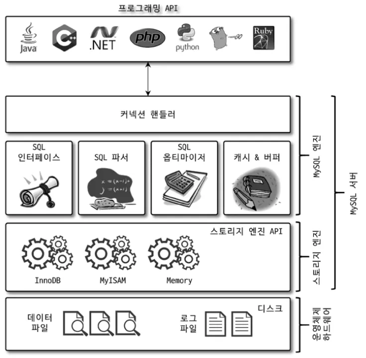
> 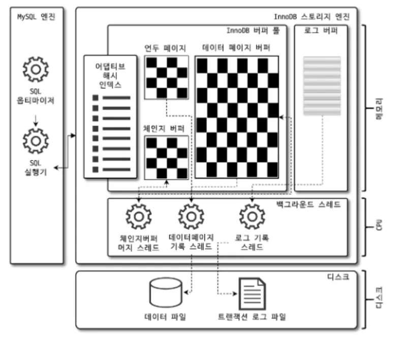
>
> 출처: Real MySQL 8.0

<br>

## ▶ 글로벌 락(Global Lock)
**데이터베이스 단위**로 설정되는 락이다.
- MySQL에서 제공하는 락 중 가장 범위가 크다.
- MySQL 서버 전체에 걸쳐 모든 데이터베이스와 테이블의 DDL/DML 작업을 차단한다.
- 과거 MyISAM 엔진 기반에서는 mysqldump 백업 시 주로 사용했으나, InnoDB가 기본 스토리지 엔진으로 자리 잡으면서 XtraBackup, Enterprise Backup과 같은 대체 수단이 활용되고 있다.

**🔽 쿼리 (명시적)**
```mysql
-- 글로벌 락 획득
FLUSH TABLES WITH READ LOCK;

-- 글로벌 락 해제
UNLOCK TABLES;
```

**🔽 결과**
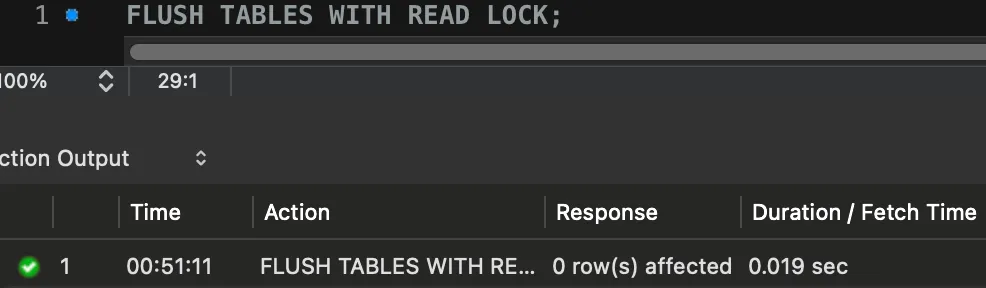
*세션 A에서 글로벌 락 획득 O*
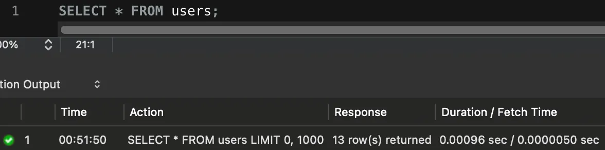
*세션 B에서 읽기 O*
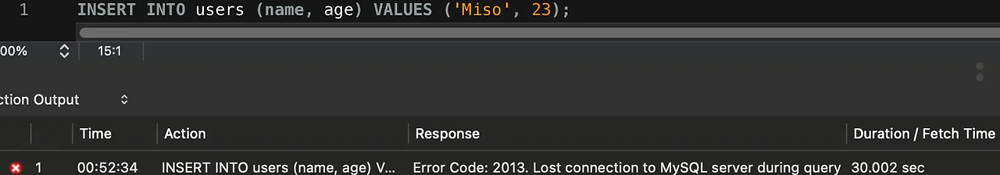
*세션 B에서 쓰기 X*

<br>

## ▶ 테이블 락(Table Lock)
**테이블 단위**로 설정되는 락이다.
- MyISAM과 같은 비트랜잭션 엔진에서 자주 사용되지만, InnoDB는 자체 트랜잭션 락을 제공하기 때문에 거의 사용되지 않는다.
- 다중 사용자 환경에서는 병목을 유발할 수 있다.

**🔽 쿼리 (명시적)**
```mysql
-- 테이블 읽기 락 획득
LOCK TABLES users READ;

-- 테이블 쓰기 락 획득
LOCK TABLES users WRITE;

-- 테이블 락 해제
UNLOCK TABLES;
```

**🔽 결과 (읽기 락)**
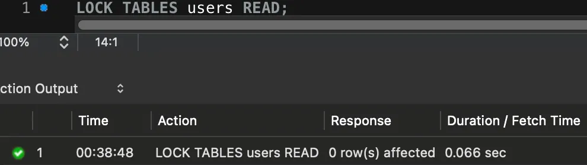
*세션 A에서 테이블 읽기 락 획득 O*
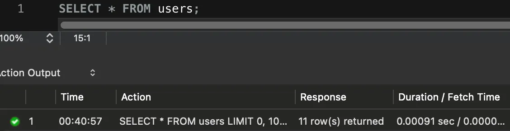
*세션 B에서 읽기 O*
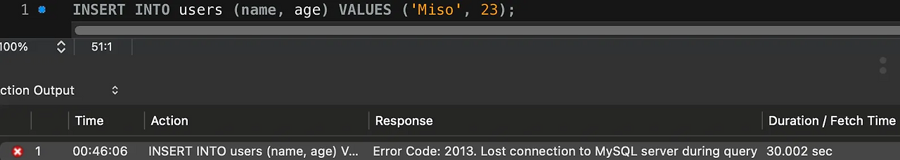
*세션 B에서 쓰기 X*

**🔽 결과 (쓰기 락)**
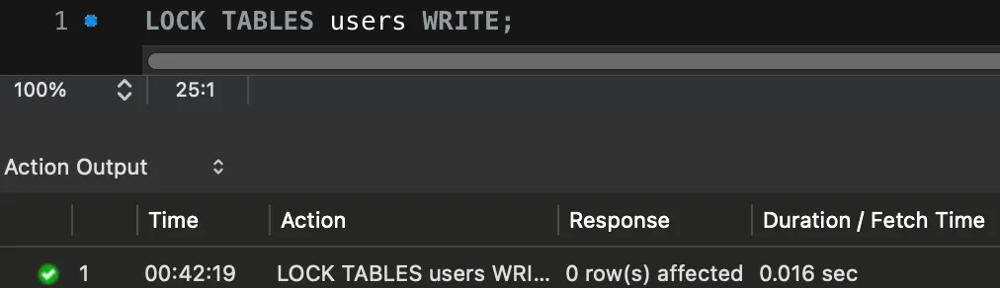
*세션 A에서 테이블 쓰기 락 획득 O*
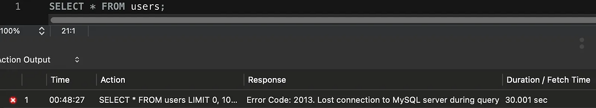
*세션 B에서 읽기 X*

*세션 B에서 쓰기 X*

<br>

## ▶ 네임드 락(Named Lock)
대상이 특정 테이블이나 레코드가 아닌, **사용자가 지정한 문자열 단위**로 설정되는 락이다.
- 데이터베이스 객체에 국한되지 않고 애플리케이션 레벨 동기화에 활용할 수 있다.
  - 예를 들어, 특정 비즈니스 로직 단위로 하나의 자원에 접근을 제한할 때 사용된다.
- 네임드 락은 단일 인스턴스 전체에 적용되고, 분산환경에서는 구조적으로 활용하기 어려워 자주 사용되지 않는다.

**🔽 쿼리 (명시적)**
```mysql
-- 'task_123' 라는 이름의 락을 10초 동안 시도
SELECT GET_LOCK('task_123', 10);

-- 락 해제
SELECT RELEASE_LOCK('task_123');
```

**🔽 결과**
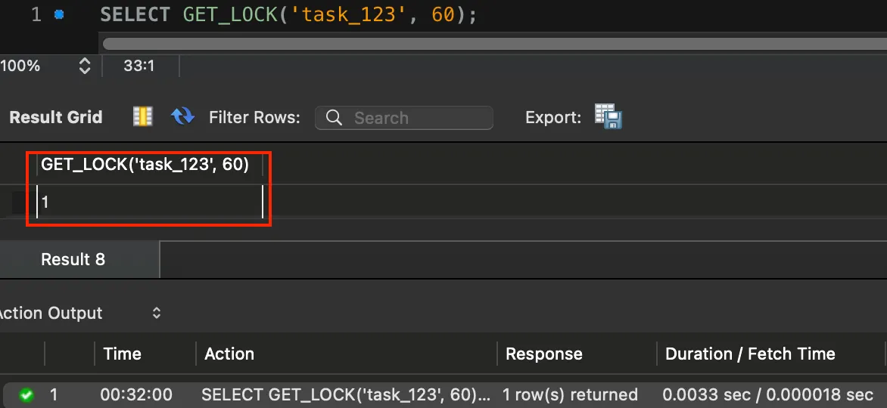
*세션 A에서 네임드 락 획득 O*
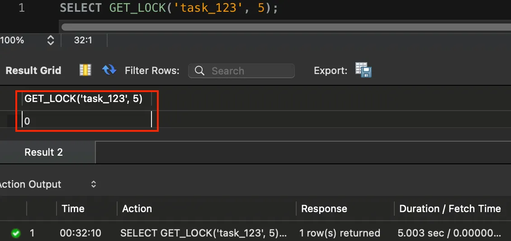
*세션 B에서 네임드 락 획득 X*

<br>

## ▶ 메타데이터 락(Metadata Lock)
**테이블의 DDL 또는 DML 시 자동으로 획득**되는 락이다.
- 목적은 DDL과 DML의 충돌을 방지하기 위한 것이다.
- 사용자가 직접 명령어로 제어하지 않으며, MySQL 엔진이 내부적으로 관리한다.

**🔽 쿼리 (암묵적)**
```mysql
-- 세션 A (Metadata Lock 획득)
SELECT * FROM users;

-- 세션 B (세션 A의 COMMIT 전 시도 시 대기 상태)
ALTER TABLE users ADD COLUMN nickname VARCHAR(50);
```

**🔽 결과**
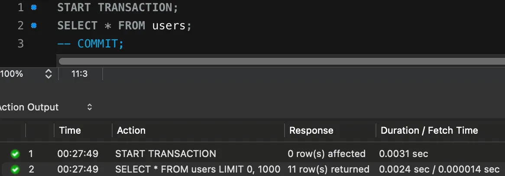
*세션 A에서 DML 후 COMMIT X*
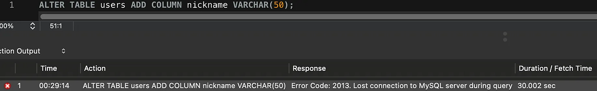
*세션 B에서 DDL 반영 X*

<br>
<br>

# ✅ InnoDB 엔진의 Lock
InnoDB는 트랜잭션과 MVCC 기반 동시성 제어를 위해 더 세밀한 레벨의 락을 제공한다.
> MVCC: 하나의 레코드에 여러 버전(스냅샷)을 유지해, 트랜잭션마다 자신만의 시점에서 일관된 데이터를 읽을 수 있게 해 주는 동시성 제어 방식이다.

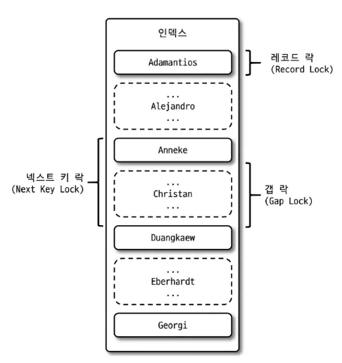

<br>

## ▶ 레코드 락(Record Lock)
**인덱스의 특정 레코드**에 설정되는 락이다.
- 다른 DBMS의 레코드 락과 유사하지만, **InnoDB는 테이블의 레코드가 아니라 인덱스의 레코드**를 잠근다.
- PK나 Unique Index가 있는 경우 정확히 한 레코드에만 적용된다.
- 인덱스가 전혀 없는 테이블이라도, InnoDB는 내부적으로 생성되는 클러스터 인덱스(Cluster Index)를 이용해 잠금을 관리한다.

**🔽 쿼리 (암묵적)**
```mysql
-- 세션 A (PK 기준으로 한 행의 Record Lock 획득)
SELECT * FROM users WHERE id = 10 FOR UPDATE;

-- 세션 B (세션 A의 COMMIT 전 시도 시 대기 상태)
UPDATE users SET age = 35 WHERE id = 10;
```

**🔽 결과**
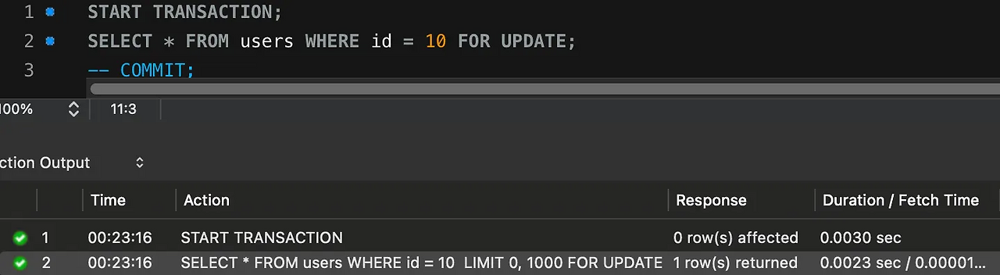
*세션 A에서 SELECT 후 COMMIT X*
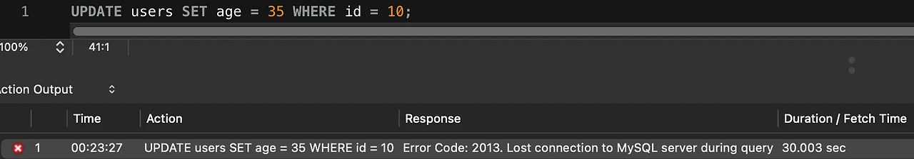
*세션 B에서 UPDATE 반영 X*

<br>

## ▶ 갭 락(Gap Lock)
**인덱스 레코드 사이의 간격(범위)** 에 설정되는 락이다.
- 특정 값이 존재하지 않는 인덱스 구간에 락을 걸어, 다른 트랜잭션이 해당 범위에 새로운 레코드를 INSERT하지 못하도록 막는다.
- 주된 목적은 Phantom Read를 방지하는 것이다.

**🔽 쿼리 (암묵적)**
```mysql
-- 세션 A (age > 30인 구간에 Gap Lock 획득)
SELECT * FROM users WHERE age > 30 FOR UPDATE;

-- 세션 B (세션 A의 COMMIT 전 시도 시 대기 상태)
INSERT INTO users (name, age) VALUES ('Boogie', 35);
```

**🔽 결과**
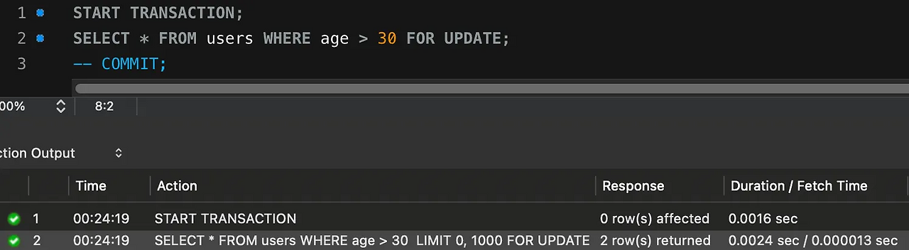
*세션 A에서 범위 SELECT 후 COMMIT X*
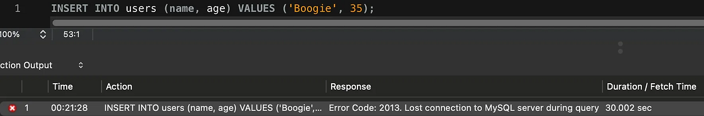
*세션 B에서 INSERT 반영 X*

<br>

## ▶ 넥스트 키 락(Next-Key Lock)
**레코드 락(Record Lock)과 갭 락(Gap Lock)을 결합**한 형태의 락이다.
- 이 락의 주 목적은 Phantom Read를 완전히 방지하고, 바이너리 로그(binlog) 기반 복제 환경에서 일관된 결과를 보장하는 것이다.
- InnoDB에서는 기본적으로 REPEATABLE READ 격리 수준에서 SELECT ... FOR UPDATE / SELECT ... LOCK IN SHARE MODE를 실행할 시 Next-Key Lock을 사용한다.

**🔽 쿼리 (암묵적)**
```mysql
-- 세션 A (20~29 사이 구간에 Next-Key Lock 획득)
SELECT * FROM users WHERE age BETWEEN 20 AND 29 FOR UPDATE;

-- 세션 B (세션 A의 COMMIT 전 시도 시 대기 상태)
INSERT INTO users (name, age) VALUES ('Miso', 23);
```

**🔽 결과**
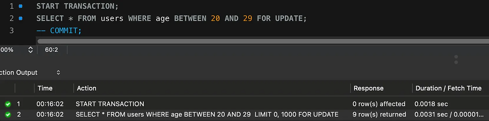
*세션 A에서 범위 SELECT 후 COMMIT X*
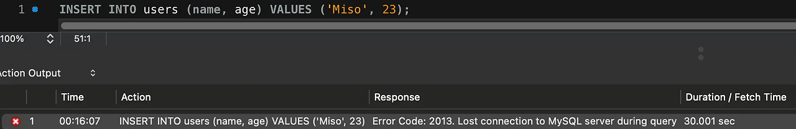
*세션 B에서 INSERT 반영 X*

<br>

## ▶ 자동 증가 락(Auto Increment Lock)
**AUTO_INCREMENT 열에 값을 INSERT할 때 사용되는 테이블 단위** 락이다.
- AUTO_INCREMENT 값이 중복되거나 충돌하지 않도록 한 번에 하나의 트랜잭션만 시퀀스를 증가시킬 수 있도록 보장한다.
- MySQL 8.0부터는 락 방식이 개선되어 병목 현상이 크게 완화되었다.
  - 설정 변수 innodb_autoinc_lock_mode의 기본값이 2(Interleaved)로 되어 있으며, 이 모드에서는 INSERT 실행 시점에만 잠깐 테이블을 잠갔다가 즉시 해제한다.
  - 따라서 이전 버전처럼 트랜잭션이 끝날 때까지 락이 유지되지 않아 병목 현상이 거의 발생하지 않는다.

**🔽 쿼리 (암묵적)**
```mysql
-- 해당 값은 MySQL 설정 파일에서 변경
-- innodb_autoinc_lock_mode = 2;

-- 세션 A (AUTO_INCREMENT Lock 획득 (테이블 단위))
INSERT INTO users (name, age) VALUES ('Miso', 23);

-- 세션 B (세션 A의 COMMIT 전 시도 시 대기 상태)
INSERT INTO users (name, age) VALUES ('Boogie', 20);
```

**🔽 결과**
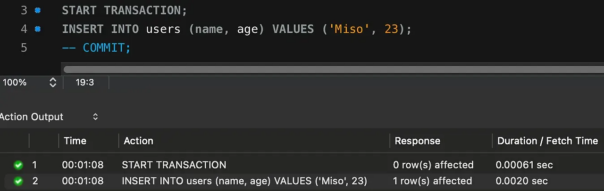
*세션 A에서 INSERT 후 COMMIT X*
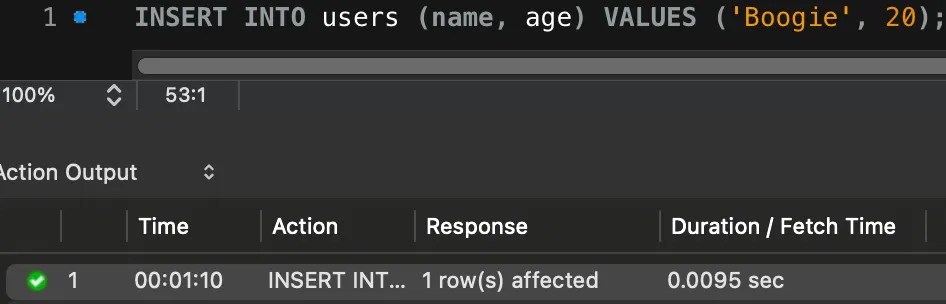
*세션 B에서 INSERT 반영 O, innodb_autoinc_lock_mode = 2 (Interleaved 모드)이기 때문*

<br>

## ▶ 공유 락(Shared Lock)
**조회(SELECT) 작업 시 사용**되는 락이다.
- 여러 트랜잭션이 동시에 같은 레코드에 대해 공유 락을 획득할 수 있다.
- 읽기는 여러 트랜잭션에서 동시에 가능하다.
- 그러나 다른 트랜잭션이 배타 락을 거는 것은 허용되지 않는다. 즉, 쓰기는 불가능하다.

**🔽 쿼리 (명시적)**
```mysql
-- MySQL 8.0 이전
-- SELECT * FROM users WHERE id = 1 LOCK IN SHARE MODE;

-- 세션 A (Shared Lock 획득)
SELECT * FROM users WHERE id = 1 FOR SHARE;

-- 세션 B (세션 A의 Lock 해제 전에도 조회 가능)
SELECT * FROM users WHERE id = 1 FOR SHARE;

-- 세션 B (세션 A의 Lock 해제 전 시도 시 대기 상태)
UPDATE users SET age = age + 1 WHERE id = 1;
```

**🔽 결과**
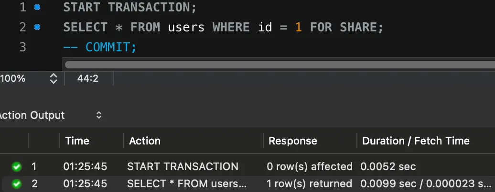
*세션 A에서 공유 락 획득 O*
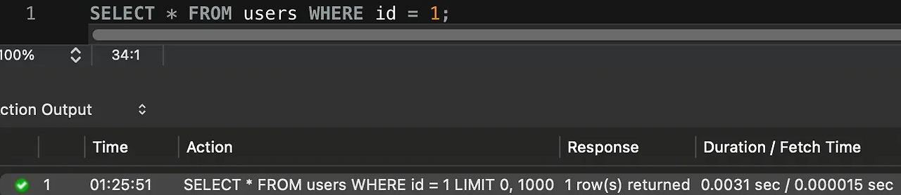
*세션 B에서 읽기 O*
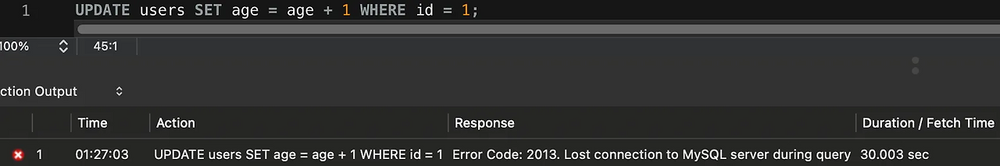
*세션 B에서 쓰기 X*

<br>

## ▶ 배타 락(Exclusive Lock)
**변경(INSERT, UPDATE, DELETE) 작업 시 사용**되는 락이다.
- 한 트랜잭션이 배타 락을 획득하면, 다른 트랜잭션은 해당 레코드에 접근할 수 없다.
- 즉, 읽기와 쓰기 모두 차단된다.

**🔽 쿼리 (명시적)**
```mysql
-- 세션 A (Exclusive Lock 획득)
SELECT * FROM users WHERE id = 1 FOR UPDATE;

-- 세션 B (세션 A의 Lock 해제 전 시도 시 대기 상태)
SELECT * FROM users WHERE id = 1 FOR UPDATE;

-- 세션 B (세션 A의 Lock 해제 전 시도 시 대기 상태)
UPDATE users SET age = age + 1 WHERE id = 1;
```

**🔽 결과**
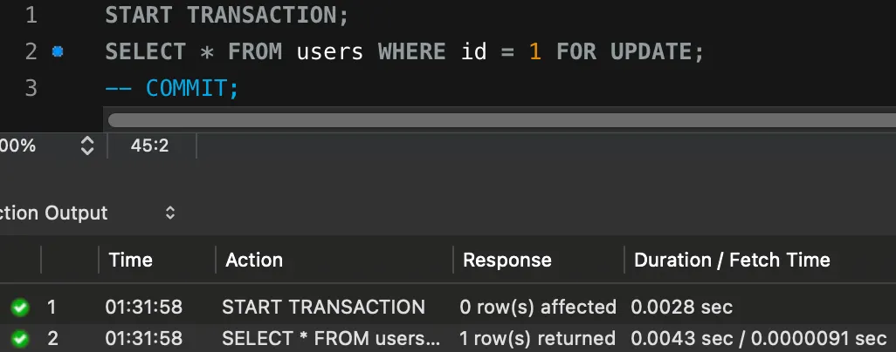
*세션 A에서 공유 락 획득 O*
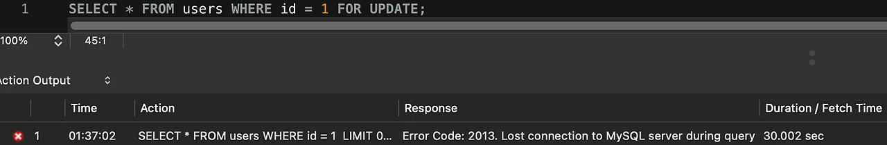
*세션 B에서 읽기 X*
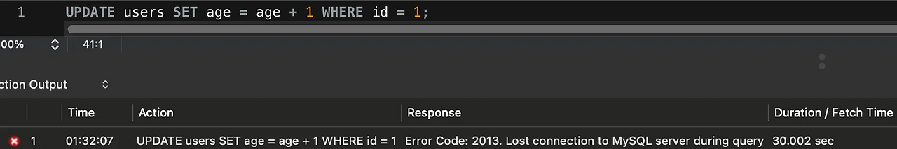
*세션 B에서 쓰기 X*

<br>

## ▶ 의도 락(Intention Lock)
**테이블 단위 락과 레코드 단위 락 간 충돌을 방지**하기 위한 락이다.
- 종류
  - **IS (Intention Shared):** 테이블 내 특정 행에 공유 락(S)을 걸 예정임을 표시한다.
  - **IX (Intention Exclusive):** 테이블 내 특정 행에 배타 락(X)을 걸 예정임을 표시한다.
  - **SIX (Shared with Intent Exclusive):** 테이블 전체에는 공유 락(S)을 걸고, 특정 행에는 배타 락(X)을 걸 예정임을 표시한다.

**🔽 쿼리 (암묵적)**
```mysql
-- IS (Intention Shared)
START TRANSACTION;
SELECT * FROM users WHERE id = 1 FOR SHARE;

-- IX (Intention Exclusive)
START TRANSACTION;
SELECT * FROM users WHERE id = 2 FOR UPDATE;

-- SIX (Shared with Intent Exclusive)
START TRANSACTION;
SELECT * FROM users FOR SHARE;   -- 테이블 전체에 S 락 계열 걸림
UPDATE users SET age = age + 1 WHERE id = 1;  -- 특정 행에 X 락 걸림
```

**🔽 결과**
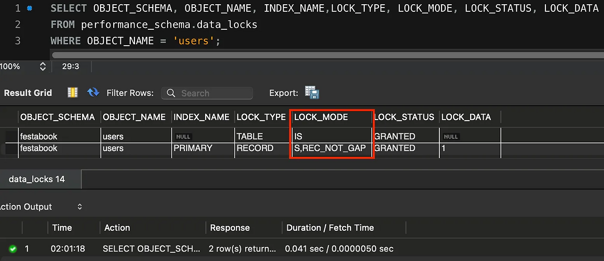
*IS 의도 락 획득 후 상태 직접 확인*
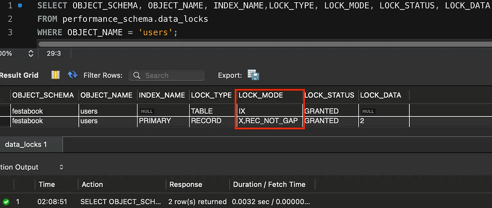
*IX 의도 락 획득 후 상태 직접 확인*
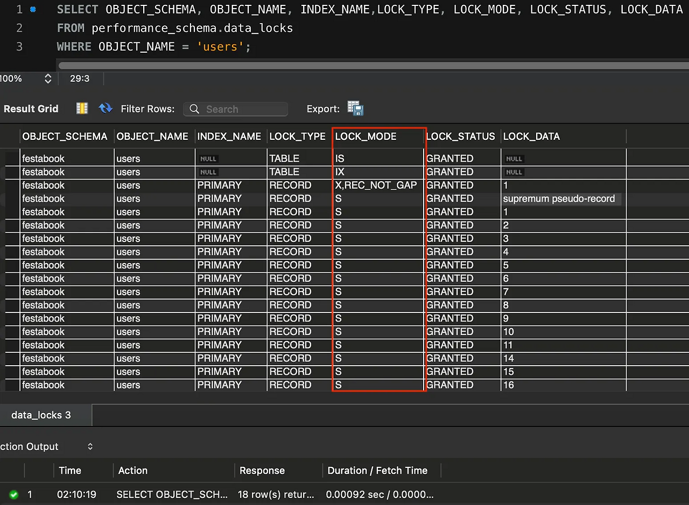
*SIX 의도 락 획득 후 상태 직접 확인*

<br>

## ▶ 삽입 의도 락(Insert Intention Lock)
**INSERT 시 해당 위치에 새로운 레코드를 삽입할 예정임을 표시**하는 락이다.
- 단순히 이 자리에 INSERT 가능 여부만 확인하기 위해 존재한다.
- 서로 다른 위치에 삽입하려는 트랜잭션끼리는 대기하지 않도록 설계되었다.

**🔽 쿼리 (암묵적)**
```mysql
-- 세션 A ((20, 40] 구간에 Next-Key Lock 획득)
START TRANSACTION;
SELECT * FROM users WHERE age BETWEEN 20 AND 40 FOR UPDATE;

-- 세션 B (세션 A의 Lock 해제 전 시도 시 대기 상태)
INSERT INTO users (name, age) VALUES ('Miso', 23);
```

**🔽 결과**
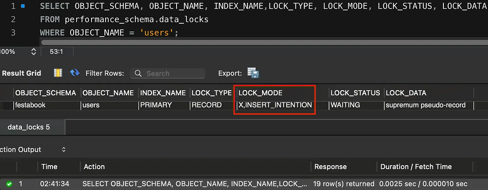
*Insert 의도 락 획득 후 상태 직접 확인*

<br>

## ▶ 조건 락(Predicate Lock for Spatial Indexes)
**공간(Spatial) 인덱스 사용 시, 범위 조건**에 따라 설정되는 락이다.
- 일반적인 레코드 락과 달리 조건 기반(Predicate)으로 락을 설정한다.
- 공간 좌표 기반 쿼리에서 동시성 제어 및 일관성 보장을 위해 사용된다.
  - 예를 들어 ST_GeomFromText() 함수나 GEOMETRY, POINT, POLYGON 등의 공간 데이터 타입을 다룰 때 자동으로 설정된다.

> 자세한 내용은 [MySQL 공식 문서](https://dev.mysql.com/doc/refman/8.0/en/innodb-locking.html#innodb-predicate-locks)를 참고하면 좋을 것 같다.

<br>
<br>

# 📍 참고 자료
- [ISO/IEC 9075-2(유료 문서)](https://www.iso.org/obp/ui/en/#iso:std:iso-iec:9075:-2:ed-6:v1:en)
- [Microsoft SQL Server 2025 - Lock granularity and hierarchies](https://learn.microsoft.com/en-us/sql/relational-databases/sql-server-transaction-locking-and-row-versioning-guide?view=sql-server-ver17#lock-granularity-and-hierarchies)
- [Microsoft SQL Server 2025 - Lock modes](https://learn.microsoft.com/en-us/sql/relational-databases/sql-server-transaction-locking-and-row-versioning-guide?view=sql-server-ver17#lock_modes)
- Real MySQL 8.0 - 5.2 MySQL 엔진의 잠금
- Real MySQL 8.0 - 5.3 InnoDB 스토리지 엔진 잠금
- [MySQL 공식 문서 - 17.7.1 InnoDB Locking](https://dev.mysql.com/doc/refman/8.0/en/innodb-locking.html)
