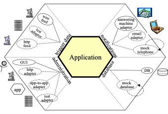
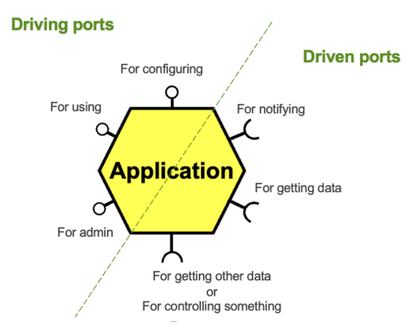
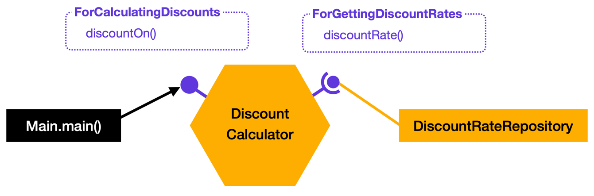
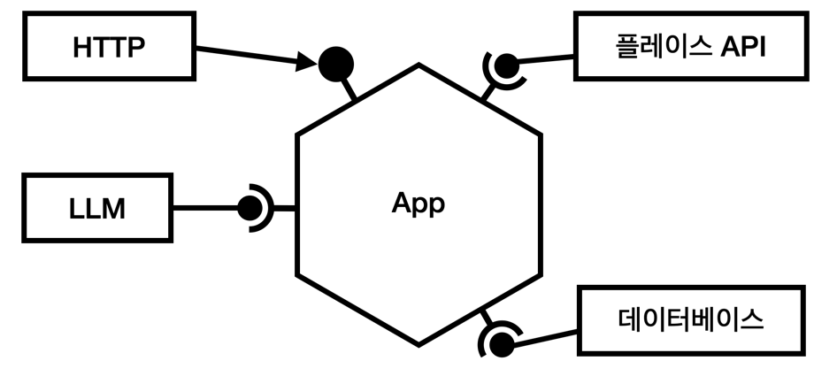
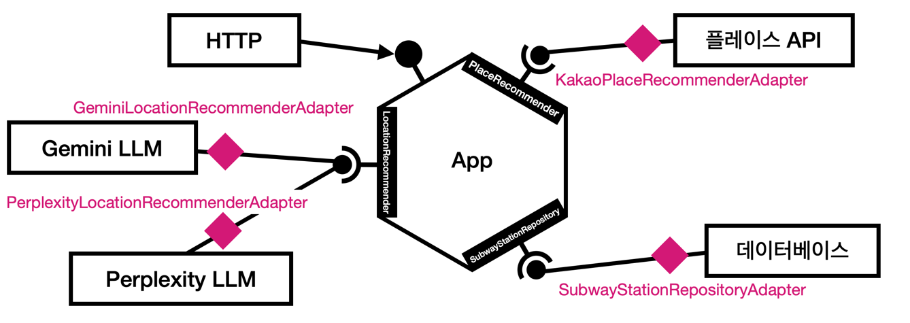
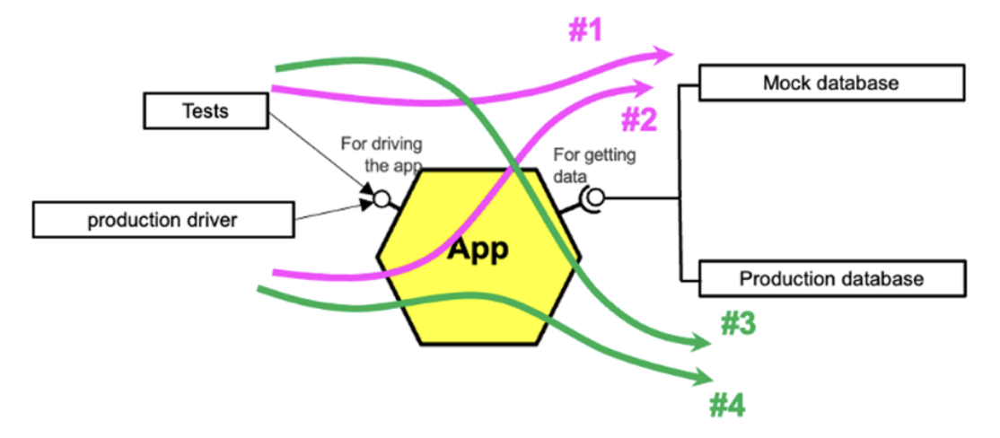

# 스프링 프레임워크에서 경험해 본 헥사고날 아키텍쳐

## 개요

사용자의 출발지점에 따라 만날 장소를 추천해주는 모잇지 서비스는 다양한 외부 API를 사용하고 있다. 공공데이터포털의 OpenAPI로부터 철도 정보를 받아오고, LLM 모델에 장소 추천을 받기 위해 Gemini와 Perplexity의 API를 쓴다. 거기에 더불어 사용자들이 방문해 볼 만한 장소를 보여주기 위한 카카오맵 API까지.. 외부 API 호출로 시작해 또다른 외부 API 호출로 끝나는 로직이 구현돼있다.

외부 API는 우리가 제어하는 영역 밖이며, 응답하는 포맷 또한 제각각이다. 사용자 입장에서 예측하기 어려운 정책 변경도 무시할 수 없을 것이다. 외부와 통신하는 부분을 코어 비즈니스 로직에서 최대한 선명하게 분리해두고, 변동사항이나 응답 실패에 최대한 방어하거나 쉽게 갈아끼울 수 있도록 설계하기 위한 고민을 거듭하던 도중 헥사고날 아키텍처를 도입해보자는 의견이 나왔다.

디자인 패턴에 대해 고민해 본 개발자라면 헥사고날을 들어본 적이 있을 것이다. 포트와 어댑터(ports and adapters) 아키텍쳐라고도 하는 헥사고날 아키텍쳐는 복잡한 서비스 도메인의 유지보수성을 높이기 위해 차용하는 구조 중 하나로 많이 알려져있다.

이번 글에서는 헥사고날 아키텍쳐에 대해 알아보고, 스프링 부트 프로젝트에 적용해본 경험을 통해 어떤 시스템에 사용하기 적합한지 고찰한다.

## 구조 설명

Alistair Cockburn이 처음 헥사고날 아키텍쳐를 제안할 때 사용한 다이어그램만 봐도 어떤 문제를 해결하기 위해 도입하게 됐는지 유추해 볼 수 있을 것이다.

### 추상화된 기본 컨셉:


### 구현 예시:



그림에서는 바깥 계층으로 보이는 영역이 중앙의 애플리케이션을 감싸고 있다. 아이콘을 통해 도메인에 속하지 않는 데이터베이스, 네트워크, 사용자 GUI 등의 외부 기술이 어댑터의 형태로 애플리케이션에 연결하는 구조임을 알 수 있다.

헥사고날은 비즈니스 로직과 외부 로직(DB 작업, HTTP 통신, 외부 프레임워크 등)을 명확하게 분리하기 위해 사용한다. 참고로 이 패턴에서 육각형이라는 모양은 아무런 의미도 내포하지 않으며, 헥사고날은 그저 포트와 어댑터 아키텍쳐의 별칭일 뿐이다. 핵심은 도형이 아닌 내부와 외부 로직이 서로 어떻게 연결되어 있는지다.

헥사고날 아키텍쳐를 이루는 세가지 주요 요소는 코어(core), 포트(port), 어댑터(adapter)다. 각 요소의 개념을 먼저 살펴보고, 예제 코드를 통해 어떻게 구현하는지 알아보겠다.

### 코어

구조의 중심에는 비즈니스 로직을 담고 있는 애플리케이션, 즉 코어(core)가 위치한다. 헥사고날 아키텍쳐에서는 외부와 상호작용하는 모든 행동을 코어가 정의한다. 이는 코드를 작성할 때 다소 혼란스러운 설계일 수 있는데, 비즈니스 로직은 온전히 애플리케이션의 주도 하에 수행된다는 점을 기억하면 도움이 될 것이다.

### 포트

포트(port)는 앞서 말한 코어가 정의하는 모든 행동을 인터페이스로 표현한 것으로, 외부와 내부 로직을 이어주는 창구다. 코어는 오로지 포트에 정의한 메서드로 바깥 세상과 통신한다.

### 어댑터

어댑터(adapter)는 코어와 상호작용하는 외부 로직을 담고 있다. 데이터 흐름의 방향에 따라 어댑터는 포트의 구현체가 될 수도, 혹은 코어가 구현한 포트 인터페이스를 호출하는 컴포넌트가 될 수도 있다.

헥사고날에서는 코어가 포트를 제공해 어댑터와 통신한다. 이러한 구조가 마치 현실에서의 USB 포트에 어댑터를 연결하는 것과도 같아서 포트와 어댑터라고 표현하는 것이다.

포트는 도메인이 외부로부터 필요한 데이터를 받아오는 외부 → 내부 흐름과, 외부로 도메인 데이터를 내보내는 내부 → 외부 흐름을 나타낼 수 있다. 이를 각각 driven ports와 driving ports라고 부르며, 아래와 같이 도식화할 수 있다.



Driving ports는 외부에서 API를 통해 애플리케이션에 데이터를 요청하거나, 애플리케이션 내부 설정을 바꾸는 역할을 한다. 이때 포트 인터페이스는 애플리케이션이 구현하고, driving 어댑터가 애플리케이션의 구현 메서드를 호출하는 구조가 된다.

반대로 driven ports는 애플리케이션이 외부 서비스로부터 데이터를 요청하는 흐름에 해당한다. 그러기 위해서는 driven 어댑터가 애플리케이션의 포트 인터페이스를 구현해 애플리케이션이 어댑터의 메서드를 호출하도록 한다.

위와 같은 패턴을 기반으로 상품의 값에 따라 할인율을 반환하는 계산기를 간단하게 구현해보자.

## 단순한 자바 프로그램에 헥사고날 아키텍쳐 적용하기

먼저 계산기 애플리케이션이 할인율을 알려주기 위해 필요한 상황, 즉 use case들을 인터페이스로 표현해보았다. 금액별로 다른 할인율을 저장할 데이터베이스까지 연동한다고 가정하면 아래와 같이 두가지 기본적인 액션 아이템이 있을 것이다. (인터페이스의 네이밍은 Alistair가 추천하는 방식을 따라 use case를 식별할 수 있는 “~을 하기 위한”이라는 표현으로 시작하도록 했다.)

```java
// Driving port: 외부에서 도메인 기능을 호출
// 할인율 계산 요청에 응답한다
public interface ForCalculatingDiscounts {

    double discountOn(double amount);

}

// Driven port: 도메인이 외부 서비스에 요청
// DB로부터 할인율을 받아온다
public interface ForGettingDiscountRates {

    double discountRate(double amount);

}
```

ForCalculatingDiscounts는 외부 호출자가 애플리케이션에게 값을 요구하는 행동이다. Driving ports에 해당하는 액션이니, 본 인터페이스는 도메인에 구현한다.

```java
public class DiscountCalculator implements ForCalculatingDiscounts {

    private ForGettingDiscountRates discountRateRepository;
    
    public DiscountCalculator(ForGettingDiscountRates discountRateRepository) {
        this.discountRateRepository = discountRateRepository;
    }
    
    @Override
    public double discountOn(double amount) {
        return amount * discountRateRepository.discountRate(amount);
    }

}

```

반면에 ForGettingDiscountRates 인터페이스는 도메인이 외부 서비스에 데이터를 요청하는 driven ports 쪽의 행동이기 때문에 DB 어댑터가 구현하도록 한다.

```java
public class DiscountRateRepository implements ForGettingDiscountRates {

    @Override
    public double discountRate(double amount) {
        return 0.10;
    }

}
```

마지막으로 도메인의 기능을 사용하는 코드를 작성한다. 예시에서는 결과물만 콘솔에서 빠르게 확인하기 위해 편의상 main 함수에 한꺼번에 작성했지만, 호출 주체가 누군지에 따라 별도의 driving 어댑터를 구현할 수도 있을 것이다.

```java
public class Main {

    public static void main(String[] args) {
        // Configuration 단계
        ForGettingDiscountRates discountRateRepository = new DiscountRateRepository();
        ForCalculatingDiscounts discountCalculator = new DiscountCalculator(discountRateRepository);
    
        // 기능 실행
        System.out.println(discountCalculator.discountOn(100));
    }

}
```



간단한 기능 하나를 코어, 포트, 어댑터로 나누어 구현해봤다. 애플리케이션 코드를 이런 방식으로 구조화하면 UI나 DB가 없어도 문제 없이 도메인을 테스트할 수 있으며, 비즈니스 관심사와 기타 기술적 관심사가 서로를 침투하지 않도록 설계할 수 있다. 이것이 Alistair가 말하는 포트와 어댑터 방식의 핵심 가치다.

물론 헥사고날 아키텍쳐가 모든 시스템에 유용한 절대적인 패턴은 아니다. 모잇지 프로젝트에서 스프링 부트 웹 애플리케이션을 헥사고날 아키텍쳐로 구현한 사례를 예시로, 어떤 상황에서 이런 패턴이 효율적인지 더 구체적으로 살펴보겠다.

## 웹 프레임워크에 헥사고날 아키텍쳐 도입

스프링 부트 프레임워크는 IoC 철학을 기반으로 코드를 작성하도록 설계되어 있다. 개발자는 스프링 MVC의 컴포넌트들을 구현하고, 해당 부품을 스프링 부트가 bean 객체로 인스턴스화해 생명주기를 직접 제어한다. 이런 프레임워크의 설계에 헥사고날 아키텍쳐를 적용하기 위해, 현재 우리 프로젝트의 구조를 포트와 어댑터의 형태로 추상화해 보았다.



스프링 MVC의 컨트롤러는 HTTP 클라이언트의 요청에 따라 내부 도메인으로부터 필요한 데이터를 받아오는 역할을 한다. 애플리케이션 서비스가 컨트롤러에 데이터를 전달하기 때문에, 컨트롤러는 driving 어댑터에 속한다고 볼 수 있다.

데이터베이스, LLM API, 플레이스 API는 공통적으로 도메인에게 외부 데이터를 제공해주는 역할을 한다. LLM은 AI가 추천한 모임 지역을, 업장 정보를 제공하는 플레이스 API는 해당 지역에서 가 볼 수 있는 장소를 응답한다. 이런 외부 서비스 API들은 driven 어댑터로 구분할 수 있다.

위 구조를 바탕으로 비즈니스 로직이 정의할 driven 면의 포트를 작성해 보았다. 아래 코드는 지역 추천에 대한 액션을 정의하는 LocationRecommender의 예시다.

```java
public interface LocationRecommender {

    RecommendedLocationsResponse recommendLocations(
            List<String> startingPlaces,
            List<String> candidatePlaces,
            String requirement
    );

}
```

도메인이 사용할 포트를 만들었으니, 다음으로 각 외부 서비스 클라이언트마다 해당 포트의 어댑터를 구현해주었다.

```java
@Component
public class GeminiRecommenderAdapter implements LocationRecommender {

    private final GoogleGeminiClient geminiClient;
    
    @Override
    public RecommendedLocationsResponse recommendLocations(
            final List<String> startingPlaces,
            final List<String> candidatePlaces,
            final String requirement
    ) {
        // 구현 로직 생략
    }

}

@Component
public class PerplexityRecommenderAdapter implements LocationRecommender {

    private final PerplexityClient perplexityClient;
    
    @Override
    public RecommendedLocationsResponse recommendLocations(
            final List<String> startingPlaces,
            final List<String> candidatePlaces,
            final String requirement
    ) {
        // 구현 로직 생략
    }
   
}
```

모잇지는 API 응답 실패에 대비해 LLM 서비스를 최소 두가지 사용하고 있다. 하여 GeminiRecommenderAdapter와 PerplexityRecommenderAdapter를 따로 구현하고, 도메인 로직에서 일관된 메서드를 호출하도록 설계했다.

데이터베이스 접근 계층은 처음부터 Spring Data MongoDB를 사용하도록 설계되어 있었기 때문에, 조합 방식으로 어댑터를 구현했다. 일반적인 스프링 부트 애플리케이션에서처럼 Spring Data의 Repository 인터페이스를 단순히 `extends MongoRepository` 형태로 구현할 경우, 포트가 특정 기술에 결합되어 도메인 계층의 추상화가 깨지게 된다.

```java
public interface SubwayStationRepository {

    Optional<SubwayStation> findByName(String name);

}

@Repository
public class SubwayStationRepositoryAdapter implements SubwayStationRepository {

    private final MongoRepository<SubwayStationEntity, String> mongoRepository;
    
    @Override
    public Optional<SubwayStation> findByName(final String name) {
        // 구현 로직 생략
    }

}
```

기존 코드를 전체적으로 리팩터링해본 결과 다음과 같은 구조가 완성되었다.



## 도입 후 느낀 점

헥사고날 아키텍쳐를 한창 개발 중인 프로젝트에 적용해 보니 크게 두 가지 이점을 취할 수 있었다.

가장 큰 장점은 외부 의존성이 많음에도 불구하고 테스트 코드를 작성하는 데에 어려움이 없었다는 것이다. 추상화된 행동을 기반으로 비즈니스 로직이 수행되다 보니 외부 API 호출은 전부 모킹(mocking)할 수 있었다. 애플리케이션의 주요 비즈니스 로직에 대한 테스트 커버리지가 높아 피쳐 개발이나 리팩터링 시에 이슈가 있어도 빠르게 문제를 파악할 수 있었다.

외부 API를 과감하게 교체하는 실험적인 작업도 가능했다. LLM 모델의 답변 퀄리티를 비교하는 과정에서 ChatGPT와 통신하는 어댑터를 구현했다가 Perplexity로 모델을 확정했는데, 이때 코어 비즈니스 로직을 한 줄도 수정할 필요가 없었다. 사용하는 서비스가 바뀌어도 도메인 입장에서는 본인이 정의한 메서드를 호출하기만 하면 되기 때문에, 개발자는 새로운 어댑터를 구현하는 데에만 집중하면 된다.

모든 외부 의존성에 대한 모킹이 가능하기 때문에 빠른 개발–테스트 사이클을 가져갈 수 있다는 점이 헥사고날이 제공하는 주요 가치 중 하나다. Alistair 또한 애플리케이션을 개발할 땐 모킹으로 테스트를 먼저 완료한 뒤, 점진적으로 프로덕션 환경으로 이전하는 방향을 제시했다.



앞서 언급했듯이, 헥사고날 또한 소프트웨어를 디자인하는 수많은 방법 중 하나기 때문에 만능이 아니다. 특히 우리 프로젝트에서 driving 포트를 정의할 때 고민이 많았다. REST API만 구현한다면 UI 역할을 하는 MVC 컨트롤러도 모두 같은 구조로 동작하니, 굳이 중간에 포트 레이어를 추가해 복잡도를 높일 필요성을 느끼지 못했다. 헥사고날 아키텍쳐를 엄격하게 지키면 지킬 수록 트레이드오프를 고려할 지점이 더 많아질 수 있다는 생각이 들었다.

추상화가 잘 녹아들어 있는 시스템은 변경에 유리하지만, 변경에 유리한 설계를 위해 중간 레이어가 불가피한 아키텍쳐다. Use case마다 인터페이스가 늘어나는 것도 하나의 관리 포인트이기 때문에, 불필요한 복잡성 추가로 인해 오히려 유지보수성이 떨어진다면 헥사고날 아키텍쳐 도입을 재고해 보아도 좋을 것 같다.

도입을 결정할 때 스프링 프레임워크의 특성도 고려해 볼 필요가 있다. Alistair가 지적한 헥사고날 아키텍쳐의 코스트 중 하나가 어댑터와 도메인을 연결하기 위한 configuration 설정 로직을 어딘가에 구현해야 한다는 점이다. 하지만 스프링은 DI 방식으로 개발자를 대신해 객체를 생성해주며, @Configuration과 같은 AOP 기능을 기본으로 지원하기 때문에 의존성 configuration에 고민을 쏟을 필요가 없다.

프레임워크가 지원하는 기술만으로 설계적인 측면에서 충분한 이점을 누릴 수 있다면 헥사고날의 장점을 제대로 활용하지 못할 수 있다.

## 마무리

모잇지는 기술적 변동사항이 많을 것이라고 예상되는 도전적인 프로젝트였기 때문에, 비즈니스 로직과 외부 의존성을 더더욱 명확하게 분리할 필요가 있었다. 헥사고날 아키텍쳐는 이런 부분을 충족시키는 설계를 제공해 비즈니스 도메인의 안정성을 높여주었다고 생각한다.

만약 현재 프로젝트의 도메인 로직이 외부 기술과의 결합으로 인해 변경에 취약한 편이라면, 헥사고날 아키텍쳐의 도입 여부를 고려해봐도 좋을 것 같다.

---

### 출처:

- Alistair Cockburn의 Hexagonal Architecture (2024) – https://www.youtube.com/watch?v=k0ykTxw7s0Y
- Alistair Cockburn의 원본 아티클 – https://alistair.cockburn.us/hexagonal-architecture
