# 외부 API와 함께 살아남기: 서킷브레이커 적용기

**외부 API 장애 관리를 위한 서킷브레이커(Circuit Breaker) 실전 도입 사례**

## 들어가며

외부 API 의존도가 높은 서비스에서 장애가 발생하면 전체 시스템이 마비될 수 있습니다. 서킷브레이커 패턴을 적용하면 외부 장애를 격리하고, 빠른 실패로 자원을 보호하며, 자동 회복을 통해 시스템 안정성을 확보할 수 있습니다. 이 글에서는 모잇지(moitz) 프로젝트에서 LLM API 연동 시 서킷브레이커를 도입한 과정과 실제 개선 효과를 공유합니다.

---

## 문제 상황: 외부 API가 우리 서버를 죽인다

약속 장소 추천 서비스 모잇지를 개발하면서 예상치 못한 문제에 직면했습니다. 사용자 조건에 맞는 만남 장소를 추천하기 위해 Gemini LLM API를 호출하는데, 간헐적으로 다음과 같은 문제가 발생했습니다.

```
- HTTP 상태코드 429 Too Many Requests 응답
- HTTP 상태코드 500 Internal Server Error 응답
- 타임아웃으로 인한 응답 지연
- 설정된 형식을 벗어난 응답
```

문제는 단순히 LLM API의 장애가 아니었습니다. **외부 API의 장애가 우리 서버 전체로 전파**될 수 있어 서비스가 위험했습니다.

### 장애 전파 시나리오

1. 사용자가 장소 추천을 요청합니다
2. 서버가 LLM API를 호출합니다
3. LLM API가 응답하지 않습니다 (타임아웃 30초)
4. 사용자가 재시도합니다
5. 요청이 누적되며 서버의 스레드 풀이 고갈됩니다
6. **전체 서비스가 중단됩니다**

이처럼 외부 의존성 하나가 전체 시스템을 무너뜨릴 수 있습니다. 이 문제를 해결하기 위해 서킷브레이커 패턴을 도입했습니다.

---

## 서킷브레이커란?

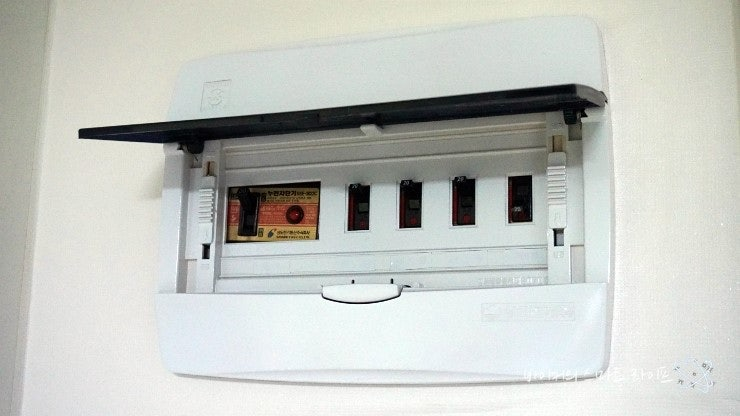

서킷브레이커는 전기 회로 차단기에서 유래한 소프트웨어 디자인 패턴입니다. 전기 회로 차단기가 과전류 발생 시 전원을 차단해 회로를 보호하듯, 서킷브레이커 패턴은 외부 시스템의 실패율이 임계치를 넘으면 요청을 차단해 시스템을 보호합니다.

### 핵심 개념

서킷브레이커는 회복탄력성과 내결함성을 갖춘 시스템을 만드는 핵심 장치입니다. 이를 이해하려면 먼저 회복탄력성과 내결함성이 무엇을 의미하는지 살펴볼 필요가 있습니다.

**회복탄력성(Resilience)**:
장애 발생 후 원래 상태로 되돌아가는 능력

**내결함성(Fault Tolerance)**:
시스템 일부가 고장나도 전체 시스템은 정상 작동을 유지하는 능력

서킷브레이커는 이 두 가지 속성을 모두 제공하여 장애가 시스템 전체로 퍼지는 것을 방지하고, 회복 여부를 자동으로 확인할 수 있는 구조를 만듭니다. 즉, 서킷브레이커는 실패를 완전히 없애는 것이 아니라 실패를 제어 가능한 형태로 관리합니다.

---

## 왜 서킷브레이커가 필요한가?

### 단일 장애 지점의 위험성

하나의 장애가 전체 시스템을 마비시키는 것은 흔한 일입니다. 온라인 쇼핑몰의 결제 시스템을 예로 들어보겠습니다.

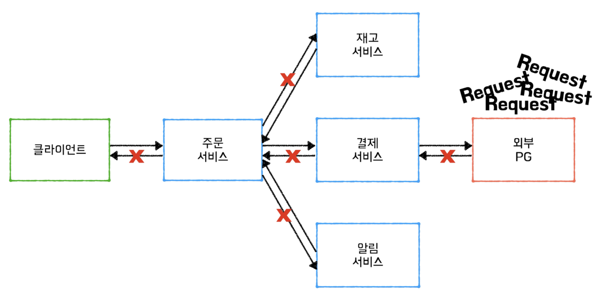

```
1. 사용자가 “주문하기” 버튼을 클릭한다.
2. 주문 서비스가 결제 서비스에 요청을 보낸다.
3. 결제 서비스는 외부 PG 서버로 요청을 전송한다.
4. 외부 PG 서버에 장애가 발생해 응답이 오지 않는다.
```

이때 서킷브레이커 유무에 따라 장애 발생 시나리오가 달라집니다.

**서킷브레이커가 없다면:**
- 외부 PG 서버 응답 없음 (30초 타임아웃)
- 사용자 재시도로 요청 누적
- 서버 스레드 풀 고갈
- 전체 서비스 중단

**서킷브레이커 적용 시:**
- 실패율 감지 후 요청 차단
- 빠른 실패 응답
- 서버 자원 보호
- 핵심 기능 유지

결론적으로 서킷브레이커가 있다면 결제 서비스가 외부 장애를 감지하고 요청을 차단해, 빠르게 실패를 반환할 수 있습니다. 즉, 부분 장애를 전체 장애로 확산시키지 않는 것, 이것이 서킷브레이커의 존재 이유입니다.

### 외부 API 응답 실패 시 요청을 다시 보낸다면?

외부 API 응답 실패에 대응하기 위해 초기에 Spring의 `@Retryable`을 사용했습니다.

```java
@Retryable(value = ExternalApiException.class, maxAttempts = 3)
public Response callExternalApi() {
    return externalApiClient.request();
}

@Recover
public Response recover(ExternalApiException e) {
    return fallbackResponse();
}
```

하지만 `@Retryable`은 실패를 확인한 후 재시도하기 때문에 다음과 같은 문제가 있었습니다.
- 이미 장애가 발생한 API에 계속 요청을 보냅니다
- 응답 시간이 지연됩니다 (재시도 횟수 × 타임아웃)
- 외부 서버에 불필요한 부하를 발생시킵니다

서킷브레이커는 실패율이 높으면 **요청 자체를 보내지 않아** 이러한 문제를 방지합니다.

---

## 서킷브레이커의 작동 원리

서킷브레이커는 세 가지 상태를 순환하며 작동합니다.

### 1. Closed (정상 상태)

- 모든 요청을 통과시킵니다
- 요청 성공/실패를 기록하고 실패율을 계산합니다
- 실패율이 임계치 이상이면 Open 상태로 전환합니다

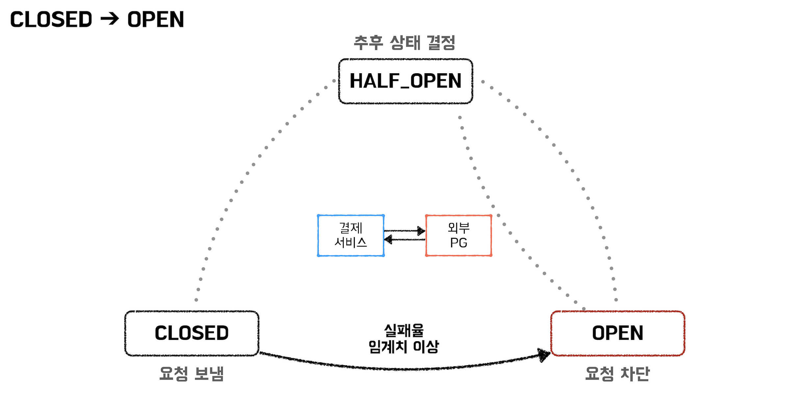

### 2. Open (차단 상태)

- 모든 요청을 즉시 차단합니다
- 외부 API를 호출하지 않고 fallback 응답을 반환합니다
- 일정 시간(대기 시간) 경과 후 Half-Open 상태로 전환합니다

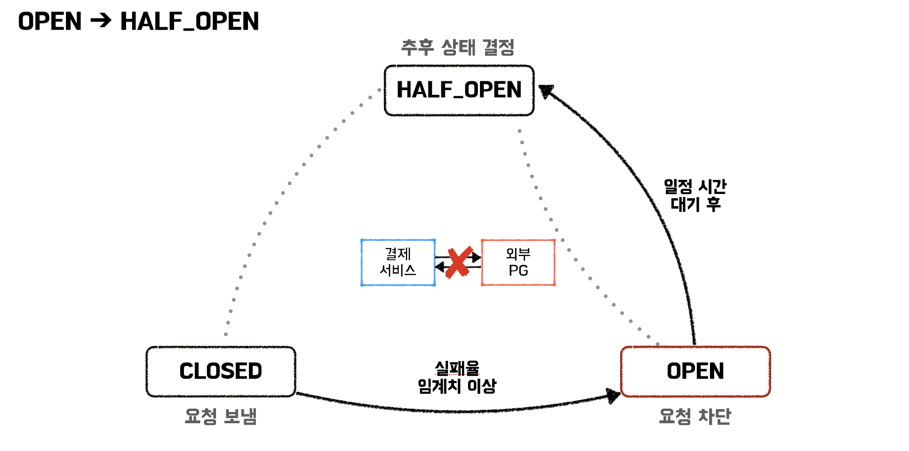

### 3. Half-Open (회복 테스트)

- 제한된 수의 요청만 허용합니다
- 허용된 요청들의 실패율을 계산해 임계치 미만이면 Closed 상태로 전환합니다
- 실패율이 임계치 이상이면 다시 Open 상태로 전환합니다

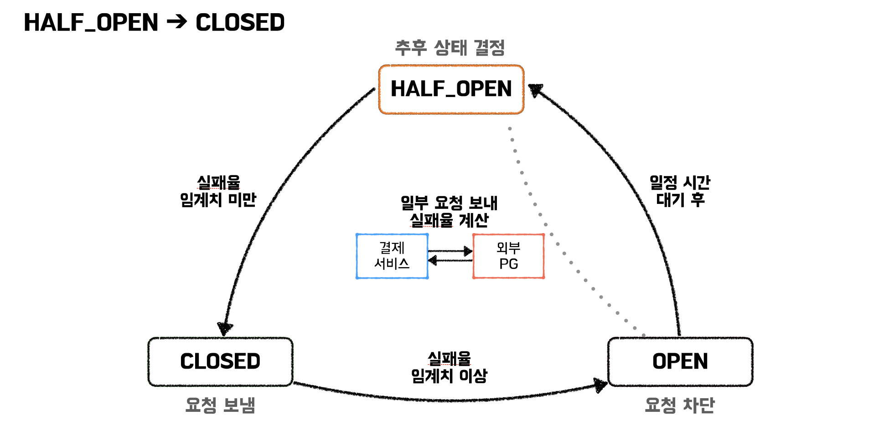

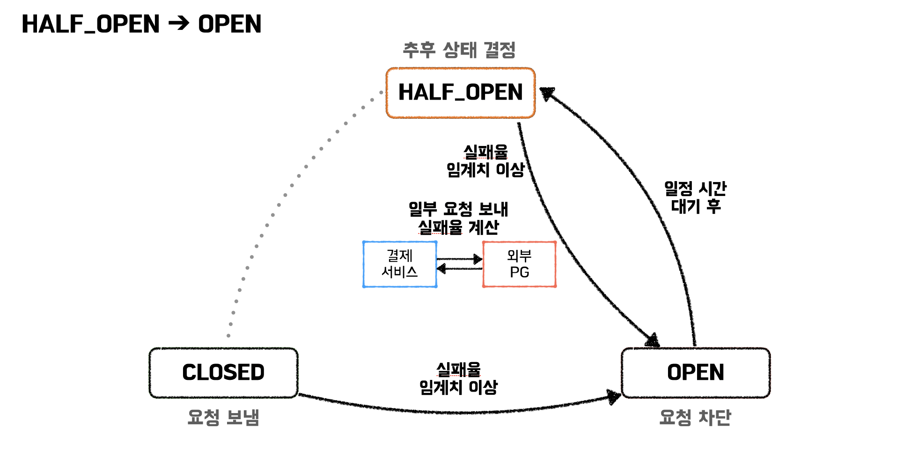

### 서킷브레이커의 상태 전환 흐름

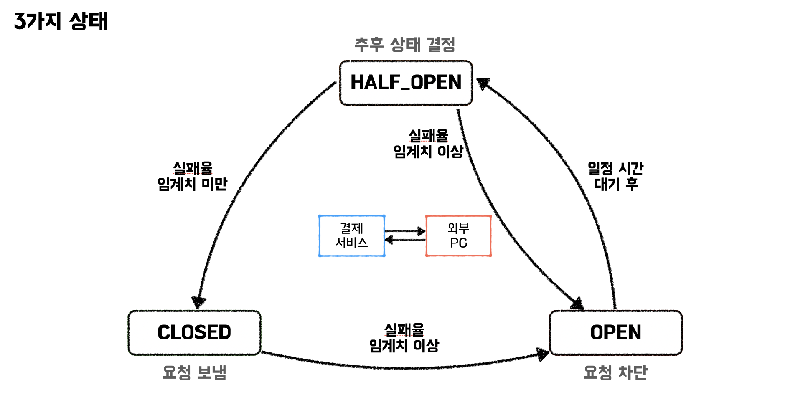

서킷브레이커는 시간에 따라 Closed → Open → Half-Open → Closed or Open 으로 순환하며 회복 여부를 자동으로 확인합니다. 이 메커니즘 덕분에 서킷브레이커는 실패의 흐름을 끊고, 시스템의 자기 회복성을 유지합니다.

---

## 프로젝트 적용 사례

### 서비스 구조

모잇지는 모임 구성원의 출발지와 만남 목적을 입력받아 최적의 약속 장소를 추천하는 서비스입니다. 이 과정에서 Kakao Map, 공공 데이터, LLM 기반의 Google Gemini 등 여러 외부 API를 사용합니다.
특히 LLM을 통한 지역 추천이 서비스의 핵심 가치였기 때문에, LLM API의 안정적인 연동이 필수였습니다.

하지만 외부 API는 예측 불가능했습니다. 429(Too Many Requests) 응답, 500(Internal Server Error) 응답, 혹은 장시간 지연이 빈번했습니다. 이런 상황은 곧 서비스 품질 저하로 이어졌습니다.

### 발생한 문제

테스트 환경에서 다음과 같은 에러가 간헐적으로 발생했습니다.

**A 타입 에러:**
- API 호출 제한 초과(429 Too Many Requests)
- 재시도해도 해결 불가능
- 제한이 풀릴 때까지 대기 필요

**B 타입 에러:**
- 외부 서버 일시적 장애(500 Internal Server Error)
- 재시도 시 성공 가능
- 응답 형식 오류 등 다양한 원인

### 외부 API 예외 분석

두 가지 에러 유형은 대응 전략이 완전히 달랐습니다. 이를 위해 **두 개의 서킷브레이커를 설계**했습니다.

```java
// A 타입: 재시도 무의미
if (response.statusCode() == 429) {
    // 즉시 차단하고 fallback 호출 필요
}

// B 타입: 재시도 가능
if (response.statusCode() == 500) {
    // 실패율 모니터링 후 판단 필요
}
```

---

## 설계 과정: 두 개의 브레이커

### 설계 전략

| 브레이커 | 대상 에러 | 동작 방식 | 목적 |
|---------|----------|---------|------|
| Breaker A | 429 Too Many Requests | 1회 실패 시 즉시 OPEN | 빠른 차단으로 자원 보호 |
| Breaker B | 500 Internal Server Error | 실패율 60% 이상 시 OPEN | 통계 기반 회복성 확보 |

### 아키텍처 설계

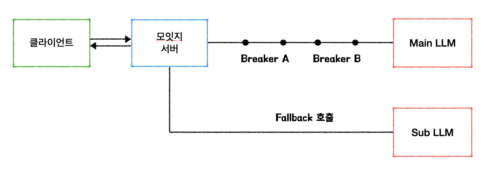

### Breaker A: 즉시 차단 전략

**핵심 로직:**
- 429 에러 발생 → 즉시 OPEN 상태
- 30초간 모든 요청 차단
- 30초 후 Half-Open으로 전환하여 회복 테스트

**설정 값:**
```yaml
resilience4j.circuitbreaker:
  instances:
    geminiBreakerA:
      failure-rate-threshold: 1        # 실패율 1%만 되어도 OPEN
      minimum-number-of-calls: 1       # 최소 1회 호출
      wait-duration-in-open-state: 30s # 30초 대기
      sliding-window-type: COUNT_BASED
      sliding-window-size: 1
```

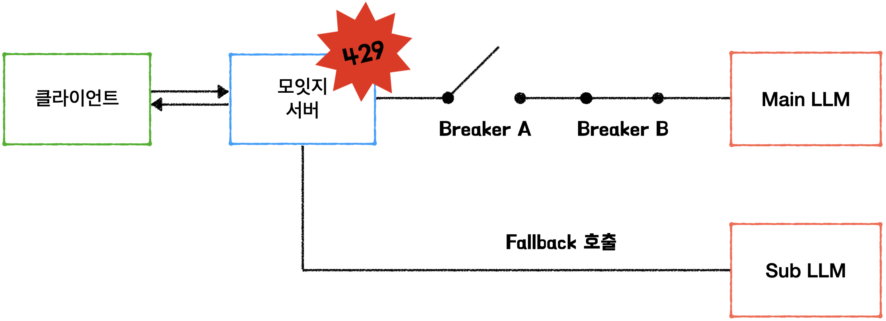

### Breaker B: 통계 기반 전략

**핵심 로직:**
- 최근 5회 중 3회 이상 실패 → OPEN 상태
- 30초간 요청 차단
- 일시적 장애는 허용하되, 지속적 장애는 차단

**설정 값:**

```yaml
resilience4j.circuitbreaker:
  instances:
    geminiServerBreaker:
      failure-rate-threshold: 60       # 실패율 60% 초과 시 OPEN
      minimum-number-of-calls: 5       # 최소 5회 호출 필요
      wait-duration-in-open-state: 30s # 30초 대기
      sliding-window-type: COUNT_BASED
      sliding-window-size: 5          # 최근 5회 호출 기준
```

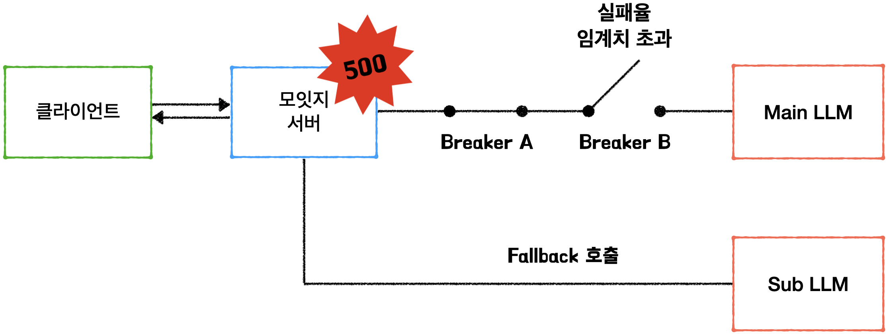

---

## 적용 효과

서킷브레이커를 적용한 뒤, 다음과 같은 변화를 체감했습니다.

**1. 빠른 실패 응답으로 사용자 경험 개선**
```
적용 전: 타임아웃 30초 대기 → 재시도 → 타임아웃...
적용 후: Circuit OPEN 감지 → 즉시 fallback
```

**2. 자원 보호**
- 스레드 풀 고갈 방지
- 메모리 사용량 안정화
- 불필요한 네트워크 호출 감소

**3. 자동 회복**
- Half-Open 상태에서 회복 여부 자동 테스트
- 외부 API 정상화 시 자동으로 Closed 상태 전환
- 수동 개입 없이 시스템 복구

실제로 테스트 결과 서킷브레이커 적용 전에는 39.28%였던 요청 실패율이 적용 후 0%로 감소했습니다.

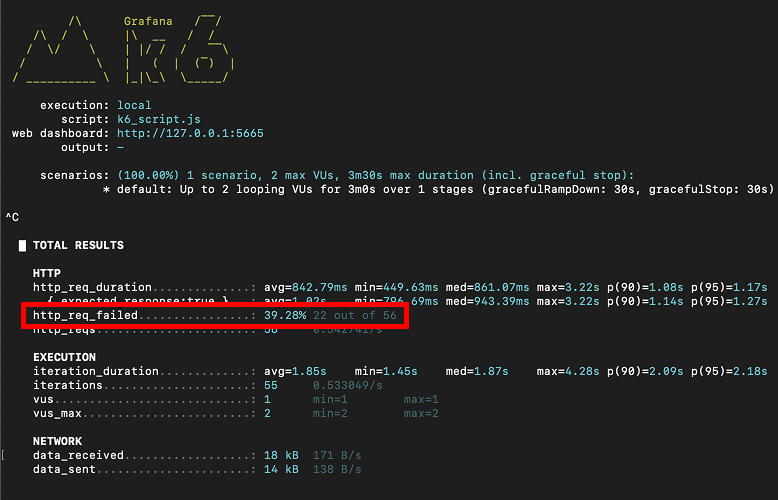
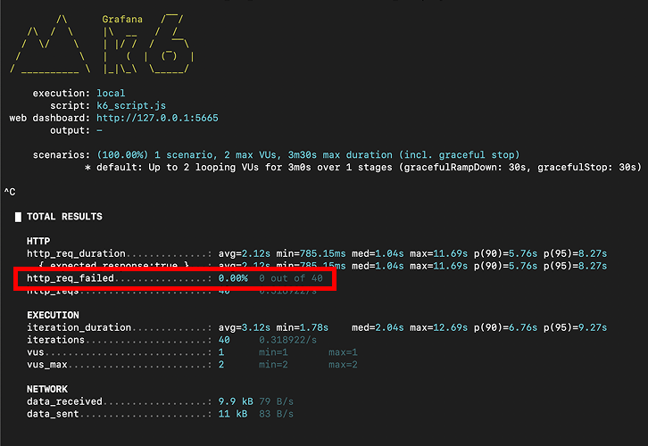

### 서킷브레이커 상태 변화 로그

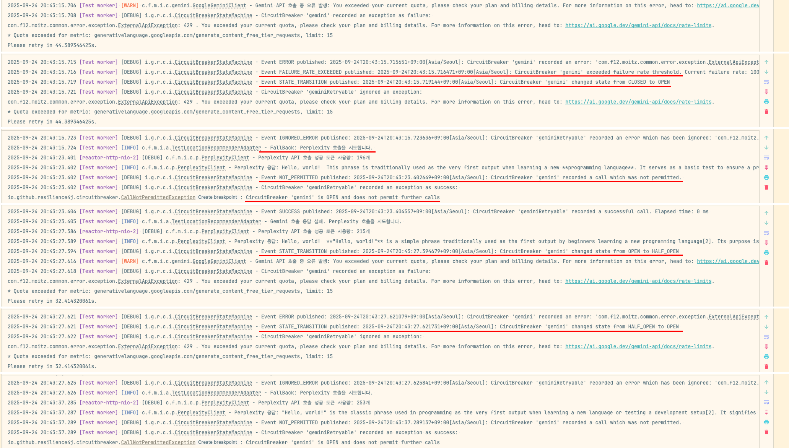

---

## 한계: 글로벌 브레이커의 함정


**Global 서킷브레이커(전역 서킷브레이커)**

서킷브레이커도 만능은 아닙니다. 특히 분산 시스템에서는 ‘부분적 실패’를 ‘전체 실패’로 잘못 판단할 수 있습니다. 아래 그림처럼 하나의 서킷브레이커를 여러 서비스 인스턴스에서 공유하면 문제가 발생할 수 있습니다. 일부 EC2만 장애가 발생했는데 글로벌 브레이커가 OPEN되면 정상 인스턴스까지 차단되어 불필요한 서비스 중단이 발생합니다.

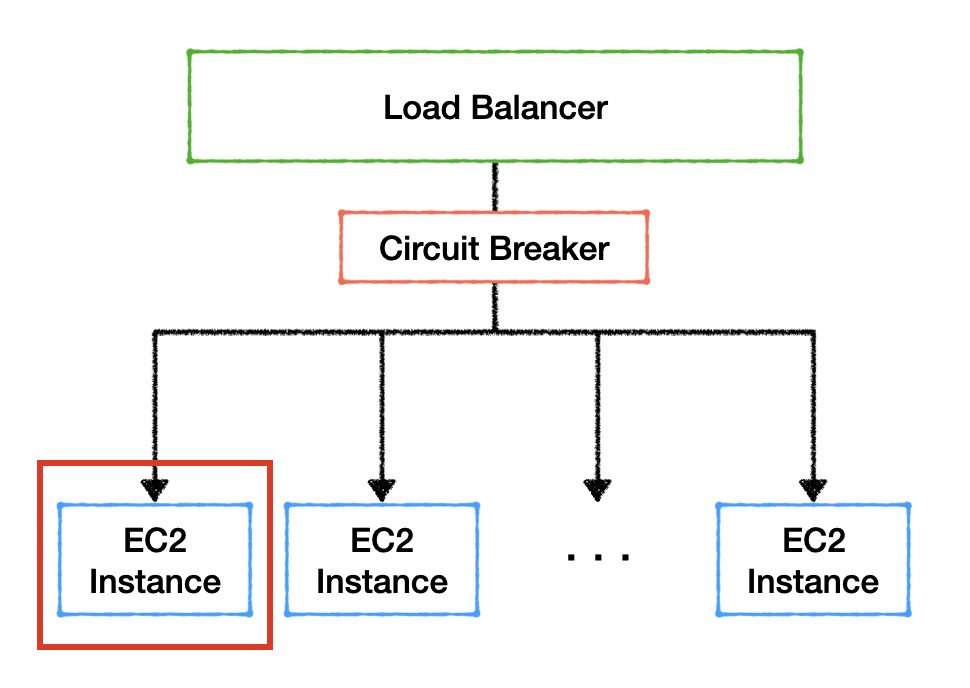

**해결책: Local 서킷브레이커(지역 서킷브레이커)**

이를 방지하려면 로컬 단위의 브레이커 설계가 필요합니다. 즉, 더 세밀한 수준의 감시와 판단이 필요합니다.

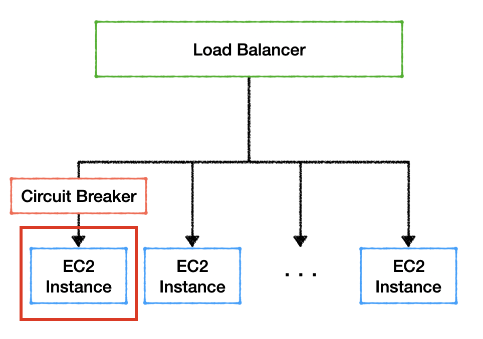


---

## 마치며

서킷브레이커를 처음 마주했을 때는 "요청을 차단하는 장치" 정도로만 이해했습니다. 하지만 실제로 적용하며 깨달은 것은, 이 패턴이 단순히 기술적 도구를 넘어 **시스템을 대하는 철학**을 담고 있다는 점입니다.
서킷브레이커는 실패를 두려워하지 않습니다. 오히려 실패를 감지하고, 인정하고, 제어합니다. 이는 완벽한 시스템을 만드는 것이 아니라, 실패를 전제로 회복 가능한 구조를 설계하는 사고방식입니다.

기술적으로 서킷브레이커는 단순하지만 그것이 남기는 메시지는 깊습니다. 우리는 장애를 완전히 없앨 수 없지만, 장애의 영향을 최소화하도록 설계할 수 있습니다. 이것이 바로 시스템의 ‘회복탄력성’이며, 백엔드 개발의 본질적인 목표가 아닐까 생각합니다.


### 서킷브레이커가 주는 교훈

**1. 실패를 전제로 설계하라**

완벽한 시스템은 없습니다. 외부 의존성은 언제든 실패할 수 있습니다. 중요한 것은 실패를 어떻게 다루느냐입니다.

**2. 빠른 실패가 느린 성공보다 낫다**

30초를 기다려 실패하는 것보다, 50ms 만에 대체 응답을 주는 것이 사용자 경험에 훨씬 좋습니다.

**3. 자동 회복 메커니즘을 구축하라**

장애는 새벽에도 발생할 수 있습니다. 자동으로 회복할 수 있는 시스템이 진정한 안정성을 제공합니다.

### 적용을 고려해야 할 때

서킷브레이커는 분산 시스템 뿐만 아니라 단일 서비스에서도 충분히 유용합니다. 다음 중 하나라도 해당된다면 서킷브레이커 도입을 검토해 보는 것을 추천합니다.

- 불안정한 외부 API에 의존도가 높은 서비스
- 사용자 체감 속도가 중요한 서비스
- 요청당 비용이 발생하는 외부 서비스 연동
- MSA 환경에서 서비스 간 통신

---

## 참고 자료

- [Resilience4j Official Documentation](https://resilience4j.readme.io/)
- [Spring Cloud Circuit Breaker](https://spring.io/projects/spring-cloud-circuitbreaker)
- [Martin Fowler - Circuit Breaker Pattern](https://martinfowler.com/bliki/CircuitBreaker.html)

### 추천 도서

- Release It! (Michael T. Nygard)

### 이미지 출처

- https://blog.naver.com/withukim/221360188542
