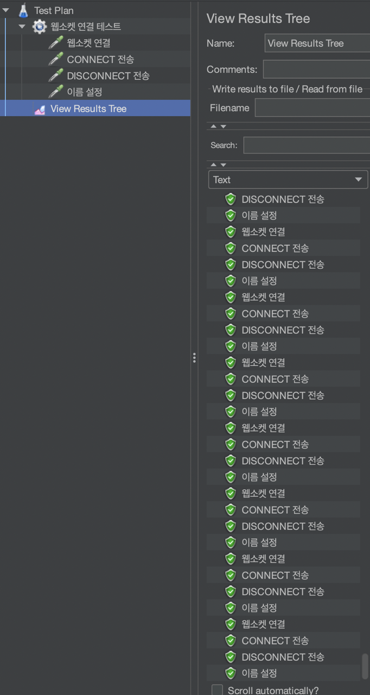
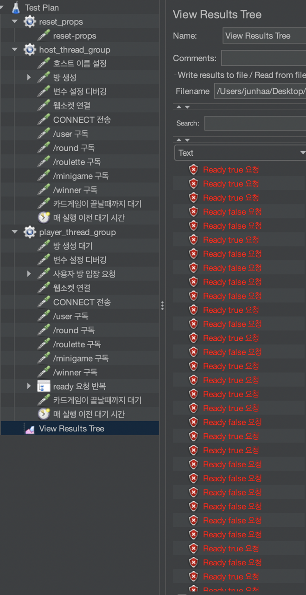
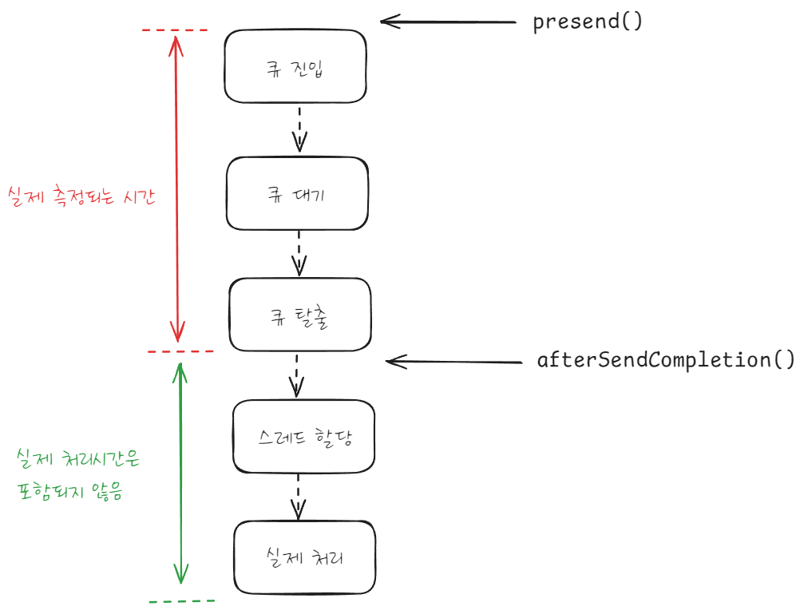
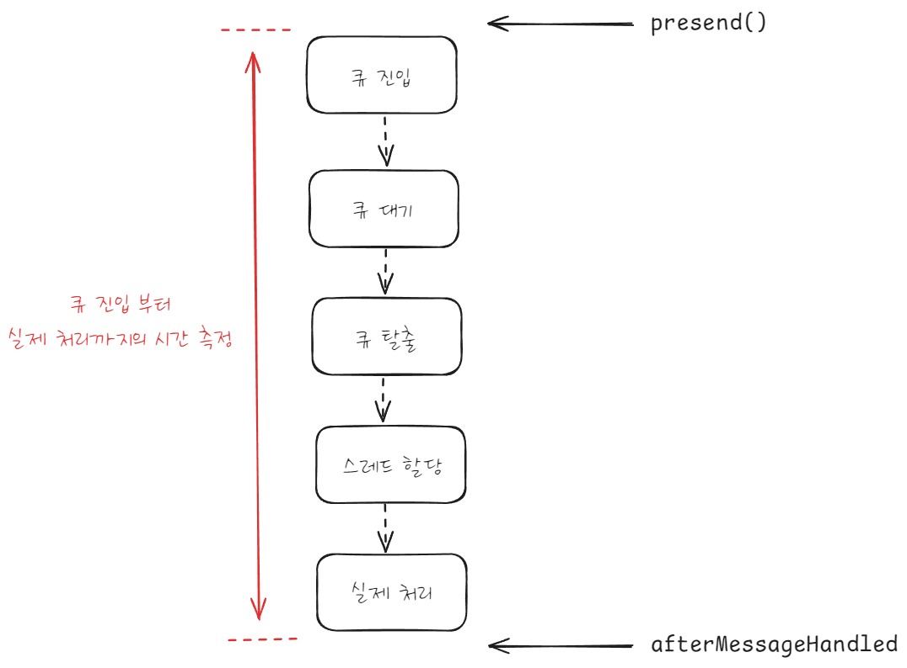
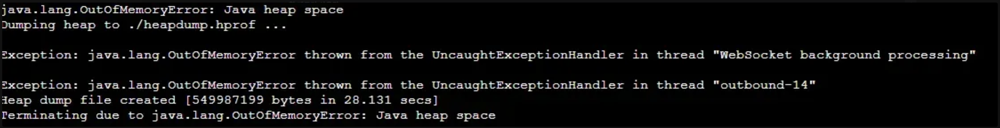
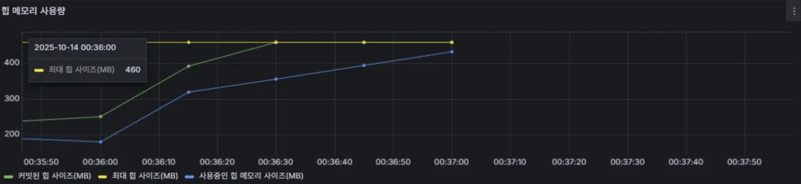
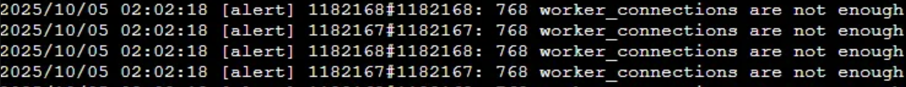
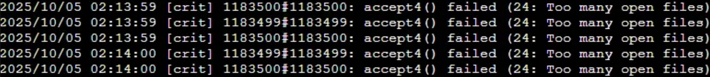

# 웹소켓 서버 최적화를 위한 부하 테스트 삽질기

## 1. 배경 및 목적

### 배경

사용자가 증가하면서 "과연 우리 서버는 점심 시간에 몰리는 사용자를 감당할 수 있을까?"라는 질문에 직면했습니다.

특히 '커피빵' 서비스 특성상 점심 시간대에 트래픽이 집중되는데, 현재 서버가 몇 명의 동시 웹소켓 연결을 안정적으로 처리할 수 있는지 정확한 수치를 파악하지 못한 상태였습니다. 서버 용량을 정확히 알지 못하면 사용자 급증 시 예상치 못한 장애가 발생할 위험이 있습니다.

### 주제 및 목표

이 글은 웹소켓 서버의 부하 테스트와 성능 최적화 과정을 다룹니다. 구체적으로 다음 목표를 달성하는 과정을 공유합니다.

1. **적절한 부하 테스트 도구 선정**: 웹소켓 환경에 맞는 도구 찾기
2. **성능 병목 지점 파악**: 스레드 풀, 메모리, 네트워크 중 어느 구간에서 병목이 발생하는지 측정
3. **목표 달성을 위한 최적 설정값 도출**: 설정한 성능 목표를 달성하기 위한 스레드 풀 크기, 큐 크기 등의 최적값 확보
4. **수용할 수 있는 동시 접속자 수 확인**: 단일 인스턴스의 한계를 파악하여 향후 인프라 확장 계획 수립

### 예상 독자

- 웹소켓 서버의 성능 한계를 측정하고 최적화가 필요한 경우
- 웹소켓 부하 테스트 도구의 선택 기준을 찾고 있는 경우
- Spring WebSocket 환경에서 스레드 풀 설정, 메모리 관리, 인프라 최적화를 진행하려는 경우

### 글의 구성

이 글에서는 다음 내용을 다룹니다.

- JMeter의 한계와 Artillery로 전환한 이유
- 정확한 메트릭 수집을 위한 인터셉터 개선
- 실제 부하 테스트 결과와 최적화 과정
- 인프라 레벨에서 마주친 문제와 해결법
- 목표 설정 및 최종 설정값

## 2. 첫 번째 시도와 실패: JMeter

부하 테스트 도구로 가장 먼저 JMeter를 선택했습니다. JMeter는 HTTP 부하 테스트에서 검증된 도구이며, WebSocket Sampler 플러그인을 통해 웹소켓 테스트도 지원한다는 점이 매력적이었습니다. JSR223 Sampler로 자바나 그루비로 테스트 스크립트를 작성할 수 있습니다. 팀에 익숙한 언어로 복잡한 테스트 로직을 구현할 수 있다는 점이 큰 장점이었습니다.

## 2.1 WebSocket Sampler 플러그인 적용

JMeter의 WebSocket Sampler 플러그인을 설치하고 테스트 시나리오를 구성했습니다. 기본적인 웹소켓 연결, 메시지 전송, 경로 구독까지는 문제없이 동작했습니다.



## 2.2 첫 번째 문제: 비동기 응답 처리 불가

본격적인 부하 테스트를 시작하자 심각한 문제가 발생했습니다. 실제 상황과 동일하게 요청/응답에 대한 시나리오로 테스트를 진행하니, 웹소켓 연결이 자동으로 끊어지는 현상이 발생했습니다.



원인을 분석해보니, JMeter WebSocket Sampler에서 다음과 같은 치명적인 문제가 발생했습니다.

1. **JMeter의 동기적 처리 방식**: JMeter WebSocket Sampler는 `readResponse()`를 호출하면 특정 응답 패턴을 찾을 때까지 블로킹 상태로 대기합니다. 이 대기 중에는 다른 메시지를 처리할 수 없습니다.

2. **클라이언트 버퍼 포화**: 서버는 비즈니스 로직에 따라 여러 메시지를 전송하지만, JMeter는 원하는 응답만 기다리며 다른 메시지들을 읽지 않습니다. 처리되지 않은 메시지들이 클라이언트의 TCP 수신 버퍼에 계속 쌓입니다.

3. **TCP Zero Window 발생**: 수신 버퍼가 가득 차면 OS는 TCP Window Size를 0으로 설정하여 서버에게 "더 이상 데이터를 받을 수 없다"라는 신호를 보냅니다.

4. **서버 측 버퍼 오버플로우**: 서버는 데이터를 보낼 수 없게 되고, 서버의 TCP 송신 버퍼와 Spring WebSocket의 SendBuffer가 차례로 가득 차게 됩니다. 결국 `SessionLimitExceededException`이 발생하여 연결이 강제로 끊어집니다.

## 2.3 두 번째 문제: 스레드 기반 부하 생성의 한계

JMeter는 테스트 사용자 한 명당 하나의 스레드를 사용합니다. 실제 사용자 시나리오를 재현하려면 수천, 수만 개의 동시 접속이 필요한데, 이는 곧 그만큼의 스레드가 필요하다는 의미입니다.

이러한 방식은 테스트 클라이언트 자체가 병목이 되는 아이러니한 상황을 만들었습니다. 수천 개의 스레드를 생성하는 것만으로도 메모리와 CPU를 엄청나게 소모했고, 실제 웹소켓의 경량 특성을 제대로 테스트할 수 없었습니다.

# 3. 도구 전환: Artillery 도입

JMeter의 한계를 확인한 후, 웹소켓 부하 테스트에 특화된 도구를 찾기 시작했습니다. 여러 도구를 검토한 결과 Artillery를 선택했습니다.

## 3.1 Artillery를 선택한 이유

Artillery는 Node.js의 이벤트 루프를 활용하여 하나의 스레드로 수많은 가상 사용자를 시뮬레이션할 수 있습니다. JMeter가 1명당 1스레드를 사용하는 것과 달리, Artillery는 1스레드로 수백, 수천 명의 사용자를 처리할 수 있습니다.

무엇보다 웹소켓을 네이티브로 지원하여 비동기 양방향 통신을 제대로 처리할 수 있었습니다. YAML 기반의 시나리오 작성도 간단하고 직관적이었습니다.

## 3.2 JMeter vs Artillery 비교

| 항목     | JMeter                      | Artillery                   |
| ------ | --------------------------- | --------------------------- |
| 동작 방식  | 스레드 기반 (1 스레드 = 1 스레드)      | 이벤트 루프 기반 (1 스레드 = N vuser) |
| 웹소켓 지원 | 플러그인 필요, 동기적 처리             | 네이티브 지원, 비동기 처리             |
| 리소스 효율 | 낮음 (많은 스레드 필요)              | 높음 (적은 스레드로 많은 연결)          |
| 설정 방식  | GUI 또는 XML                  | YAML                        |
| 학습 곡선  | 높음 (GUI는 쉬우나 복잡한 시나리오는 어려움) | 중간 (YAML 문법만 알면 됨)          |

## 3.3 Artillery 테스트 시나리오 구성

Artillery로 기본적인 웹소켓 부하 테스트 시나리오를 다음과 같이 구성했습니다.

```yaml
config:
  target: "{요청 경로}"
  processor: "./room-test.js"
  http:
    timeout: 10 # HTTP 요청 타임아웃 10초
  phases:
    - duration: 10
      arrivalCount: 300 # 10초간 총 300명의 사용자 

scenarios:
  - name: "tests"
    flow:
      # Redis 정리 (첫 번째 사용자만 실행)
      - function: "cleanupRedis"

      - function: "assignRoleAndGroup"

      # 호스트만 방 생성
      - function: "createOrJoinRoom"

      # 호스트가 Redis에 joinCode 발행
      - function: "publishInviteCode"

      # 참가자가 Redis에서 joinCode 가져오기
      - function: "getInviteCodeFromRedis"

      # 참가자만 방 참가
      - function: "createOrJoinRoom"

      # 웹소켓 연결 및 구독
      - function: "connectWebSocketAndSubscribe"
      
      # 호스트가 게임 선택
      - function: "hostSelectGame"    
    
      # 참가자 준비 완료 요청
      - function: "participantReady" 
        
      # 3. 호스트가 게임 시작      
      - function: "hostStartGame"    
         
      # 4. 모든 사용자가 카드 선택    
      - function: "allUsersSelectCard"          
        
      # 5. 호스트가 룰렛 돌리기      
      - function: "hostSpinRoulette"
```

## 3.4 Artillery로 해결된 JMeter 문제들

Artillery 테스트 결과, JMeter에서 발생했던 문제들이 해결되었습니다.

- **비동기 메시지 처리**: 서버에서 보내는 모든 메시지를 이벤트 리스너로 실시간 처리하여 클라이언트 버퍼 포화 문제 해결
- **경량 동시 접속**: 이벤트 루프 기반으로 수백 명 동시 접속을 안정적으로 시뮬레이션

Artillery로 안정적인 부하 테스트 환경을 구축했지만, 정작 서버 내부의 병목 지점을 파악할 방법이 부족했습니다.

# 4. 메트릭 수집 개선

부하 테스트를 효과적으로 수행하려면 서버의 상태를 정확히 측정할 수 있어야 합니다. 특히 웹소켓 부하 테스트에서는 Inbound와 Outbound 스레드 풀에서 병목이 발생하는지 확인하는 것이 중요했습니다.

## 4.1 첫 번째 시도: ChannelInterceptor

Spring WebSocket은 메시지 처리 과정에 개입할 수 있는 인터셉터를 제공합니다. 처음에는 `ChannelInterceptor`를 사용했습니다. 이 인터페이스가 메시지 처리 시간 측정에 적절하다고 판단했습니다.

```java
@Component
public class WebSocketMetricsInterceptor implements ChannelInterceptor {
    
    @Override
    public Message<?> preSend(Message<?> message, MessageChannel channel) {
        long startTime = System.currentTimeMillis();
        message.getHeaders().put("startTime", startTime);
        return message;
    }
    
    @Override
    public void afterSendCompletion(Message<?> message, MessageChannel channel, 
                                   boolean sent, Exception ex) {
        Long startTime = (Long) message.getHeaders().get("startTime");
        if (startTime != null) {
            long duration = System.currentTimeMillis() - startTime;
            // 메트릭 기록
            recordMetric(duration);
        }
    }
}
```

## 4.2 문제 발견: 큐 대기 시간만 측정

테스트 결과 분석 중 문제점을 발견했습니다. 서버가 명백히 부하를 받고 있는데, 측정된 처리 시간은 2ms 이하로 매우 짧게 나타났습니다.

`ChannelInterceptor`는 메시지가 채널에 들어가고 나올 때의 시간을 측정합니다. 하지만 실제 메시지 처리는 스레드 풀의 스레드가 큐에서 메시지를 꺼내 실행할 때 발생합니다.

따라서 이 방식으로는 메시지가 큐에 들어가는 시간과 메시지가 큐에서 나가는 시간만 측정할 뿐, 실제로 스레드가 메시지를 처리하는 데 걸린 시간은 측정하지 못했습니다.



## 4.3 해결: ExecutorChannelInterceptor 사용

Spring Framework는 이러한 문제를 해결하기 위해 `ExecutorChannelInterceptor`를 제공합니다. 이 인터셉터는 메시지가 실제로 스레드에서 실행되기 전후에 호출됩니다.

```java
@Component
public class WebSocketLoggingInterceptor implements ChannelInterceptor {

    private static final String START_TIME_HEADER = "startTime";

    @Override
    public Message<?> preSend(Message<?> message, MessageChannel channel) {
        StompHeaderAccessor accessor = StompHeaderAccessor.wrap(message);
        accessor.setHeader(START_TIME_HEADER, System.nanoTime());

        return accessor.getMessage();
    }

    @Override
public void afterMessageHandled(Message<?> message, MessageChannel channel, MessageHandler handler, Exception ex) {
        StompHeaderAccessor accessor = StompHeaderAccessor.wrap(message);
        Long startTime = (Long) accessor.getHeader(START_TIME_HEADER);

        if (startTime != null) {
            long durationNs = System.nanoTime() - startTime;
            long duration = TimeUnit.NANOSECONDS.toMillis(durationNs);

            // 메트릭 기록
            recordMetric(duration);
        }
    }
}

```

해당 방식을 사용해서 Inbound 메시지의 실제 처리 시간, Outbound 메시지의 실제 처리 시간과 같은 메트릭을 정확하게 수집할 수 있었습니다.



# 5. 부하 테스트 진행

Artillery와 개선된 메트릭 수집 체계로 본격적인 부하 테스트를 진행했습니다.

## 5.1 메시지 처리 부하 테스트: 스레드 풀 병목 확인

우선 가장 먼저 문제로 인식되었던 Inbound와 Outbound에서 병목이 발생하는지 알아보기 위해 테스트를 진행하였습니다.

### Inbound 스레드 풀 테스트

TPS 값을 기준으로 스레드 풀의 스레드 수를 조정해 가면서 Inbound(클라이언트→서버 요청 처리)가 요청 메시지 작업을 처리하는 데 걸리는 시간에 대해 p95(95 백분위수, 전체 요청 중 95%가 이 시간 이내에 처리됨)를 기준으로 측정하였습니다.

아래 표는 TPS별 스레드 수에 따른 p95 응답 시간(ms)입니다.

|TPS|2개|4개|8개|16개|32개|64개|
|---|---|---|---|---|---|---|
|171|285|113|22|23|22|28|
|373|7,780|1,959|235|151|113|193|
|513|15,632|7,250|3,757|2,550|1,747|3,883|

**핵심 인사이트:**
- 스레드가 32개까지 증가할수록 응답 시간이 감소하며, 32개에서 최적 성능 달성
- 64개로 증가하면 컨텍스트 스위칭 오버헤드 비용이 커져 오히려 성능 저하
- 특히 높은 TPS(513)에서 64개 스레드의 성능 저하가 뚜렷함 (1,747ms → 3,883ms)
- **최적 설정: 32개 스레드**

### Outbound 스레드 풀 테스트

실제 서비스 운영 환경에서는 Inbound 요청 수보다 Outbound(서버→클라이언트 응답 처리) 수가 훨씬 많다는 점을 고려하여, 더 높은 TPS를 기준으로 테스트를 진행했습니다.

아래 표는 TPS별 스레드 수에 따른 p95 응답 시간(ms)입니다.

|TPS|4개|8개|16개|32개|
|---|---|---|---|---|
|290|56|22|14|13|
|700|69|71|19|22|
|1,400|832|109|96|60|
|2,800|1,505|182|92|185|
|4,200|-|226|109|369|

**핵심 인사이트:**
- 스레드가 16개까지 증가할수록 응답 시간이 안정적으로 감소
- 16개에서 가장 일관되게 낮은 응답 시간 유지
- 32개부터는 성능 향상 없이 오히려 불안정해지며, TPS 2,800에서 16개(92ms) vs 32개(185ms)로 역전 현상 발생
- **최적 설정: 16개 스레드**

## 5.2 커넥션 부하 테스트: OOM 발생

웹소켓이 연결되면 서버에서는 해당 웹소켓 연결에 대한 세션과 구독 정보를 메모리에 저장하게 됩니다. 따라서 서버에 웹소켓 연결이 많아질수록 사용하는 리소스가 증가하고, 이에 대해 최대로 수용할 수 있는 웹소켓 동시 접속자 수를 테스트하였습니다.

### 테스트 시나리오
- 1초당 10명씩 접속
    - 최대한 부하량을 줄이고, 메모리 사용량에 집중하기 위해
- 1,000명씩 늘려가면서 테스트

### 결과

5,000개의 연결 요청 테스트 중, 약 4,800개 연결 지점에서 서버가 `OutOfMemoryError`를 발생시키며 중단되었습니다.



```
java.lang.OutOfMemoryError: Java heap space
Exception: java.lang.OutOfMemoryError thrown from the UncaughtExceptionHandler
```

힙 메모리 메트릭을 확인한 결과, 최대 힙 사이즈(460MB)를 초과하여 OOM이 발생했습니다.



## 5.3 웹소켓 연결 spike 테스트

서비스 특성상 점심 시간대에 사용자가 급증할 수 있다는 점을 고려하여, 특정 시간에 동시 접속이 몰리는 현상을 시뮬레이션했습니다.

10초간 요청을 기준으로, 초당 100명씩 늘려가면서 테스트를 진행하였습니다.

|초당 요청(TPS)|총요청 수(10초)|최대 커넥션 연결 시간(ms)|사용 톰캣 스레드 수|비고|
|---|---|---|---|---|
|100|1,000|14|12|안정적|
|150|1,500|22|14|안정적|
|200|2,000|18|21|안정적|
|300|3,000|151|156|지연 발생 시작|
|400|4,000|638|200 (최대)|연결 요청 1.4% 실패|
|500|5,000|1,015|200 (최대)|연결 요청 19.2% 실패|

초당 200명의 웹소켓 연결 요청에 대해서는 안정적으로 처리하였지만, 초당 300명의 요청에서는 병목이 발생하기 시작했고, 초당 400명 이상에서는 톰캣 스레드 풀이 포화해 연결 실패가 발생했습니다.

## 5.4 Nginx 문제

애플리케이션 레벨의 최적화 외에도 인프라 레벨에서 예상치 못한 문제들이 발생했습니다.

### 첫 번째 문제: Nginx Worker 부족

1,000개 연결 테스트 시 대략 200개 정도의 WebSocket 연결이 실패하기 시작했습니다. 애플리케이션 로그에는 문제가 없었지만, Nginx 로그에서 다음과 같은 에러를 발견했습니다.



Nginx의 worker_connections 수가 부족해서 발생한 에러로, 설정된 768개의 연결만 수립되고 나머지 연결은 모두 실패했습니다.

다음과 같이 worker_connection의 크기를 늘려 해당 문제를 해결할 수 있었습니다.

```nginx
# nginx.conf

# 기존 설정
worker_processes auto;  
worker_connections 768; 

# 수정된 설정
worker_processes auto;
worker_connections 32768;
```

### 두 번째 문제: 파일 디스크립터 제한

Worker 수를 늘린 후 1,500개 연결 테스트를 진행했는데, 1,024개 지점에서 다시 문제가 발생했습니다.



Linux의 파일 디스크립터 제한에 걸린 것입니다. 각 소켓 연결도 파일 디스크립터를 사용하는데, 대부분의 Linux 배포판에서 일반 사용자 프로세스의 기본 파일 디스크립터 제한은 1,024입니다.

해당 문제 또한 nginx의 설정을 추가하여 해결할 수 있었습니다.

```nginx
# nginx.conf
worker_rlimit_nofile 100000;
```

변경 후 1,000개 이상의 동시 연결을 문제없이 처리할 수 있었습니다.

# 6. 최종 개선 사항

## 6.1 목표 설정

실제 서비스 운영 환경의 웹소켓 요청/응답 수는 다음과 같았습니다.
- 평균 1초당 요청은 0.4회, 1초당 응답은 0.7회 발생 (사용자 1명 기준)
- 최대 1초당 요청은 1.3회, 1초당 응답은 6.4회 발생 (사용자 1명 기준)

최대 1초당 요청/응답 수를 기준으로, 다음과 같이 목표를 설정했습니다.
- 250명 동시 접속 가능
    - 요청 TPS 325
    - 응답 TPS 1600
- 응답속도 최대 200ms 이내

## 6.2 최종 설정값

해당 목표치를 바탕으로, 부하 테스트 결과를 이용하여 다음과 같은 설정을 통해 최적화를 진행하였습니다.

### Inbound 스레드 풀

- 스레드 32개
- Queue 크기 2048
- TPS 373 기준 최대 113ms

### Outbound 스레드 풀

- 스레드 16개
- Queue 크기 4096
- TPS 2800 기준 최대 92ms

### Tomcat

- 최소 스레드: 30개
- 최대 스레드: 200개
- Queue 크기 100
- 최대 연결 수 700  (웹소켓 250 + HTTP 요청 여분)


# 7. 결론

웹소켓 부하 테스트는 단순히 도구를 실행하는 것이 아니라, 시스템의 모든 레이어를 이해하고 최적화하는 과정입니다.

## 7.1 핵심 인사이트

가장 큰 인사이트는 **"측정할 수 없으면 개선할 수 없다"**는 것입니다. 정확한 메트릭 수집과 체계적인 테스트 접근이 없었다면, 추측에 의존한 설정으로 실제 프로덕션 환경에서 예상치 못한 문제를 겪었을 것입니다.

## 7.2 테스트 결과

부하 테스트를 통해 다음과 같은 결과를 얻었습니다.

- **성능**: 250명 동시 접속, 응답 시간 200ms 이내
- **최적 스레드 풀 설정**: Inbound 32개, Outbound 16개
- **성능 지표**: Inbound p95 113ms, Outbound p95 92ms
- **인프라 최적화**: Nginx worker_connections 32768, 파일 디스크립터 제한 해제


## 7.3 마무리

부하 테스트는 한 번으로 끝나는 작업이 아닙니다. 시스템이 변경되거나, 트래픽 패턴이 바뀌거나, 새로운 기능이 추가될 때마다 반복적으로 수행해야 합니다.

처음부터 완벽한 설정을 찾으려 하지 말고, **측정하고, 분석하고, 개선하는 사이클**을 반복하다 보면 시스템에 최적화된 설정을 찾을 수 있을 것입니다.
