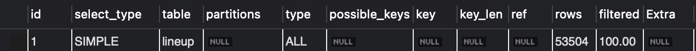
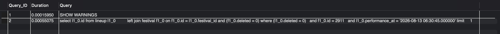

# MySQL 쿼리 성능 측정 방법

# 목차

- 개요
- Spring Data JPA 실제 쿼리 확인
- 쿼리 성능 측정 방법 EXPLAIN ANALYZE
- 쿼리 실행 계획 확인 방법 EXPLAIN
- 쿼리 전체 소요 시간 확인 방법 SHOW PROFILES
- 마치며

# 개요

Spring Data JPA와 MySQL 데이터베이스를 사용하는 프로젝트에서 데이터베이스 쿼리 성능 측정 방법을 정리한 글입니다. 데이터베이스 성능 하락을 인지하고 이를 개선하며 학습한 정보를 정리한 내용이 많습니다. 따라서 글의 내용은 문제 해결 과정 서술보다 정보의 나열이 대부분입니다. 대상 독자는 MySQL 성능 최적화 필요 여부를 확인하고 싶은 사람, MySQL 성능 최적화가 잘 이루어졌는지 확인하고 싶은 사람입니다. MySQL의 SELECT, INSERT와 같은 데이터 조작 언어(DML)와 인덱스(Index), Spring Data JPA를 경험 후 읽기를 권장합니다.

사용된 프로그램의 버전은 다음과 같습니다.

- Java: JDK21
- Spring Boot: 3.5.3
- MySQL 서버: 8.0.43

서비스를 운영하다보니 데이터베이스 문자열 조회 쿼리가 느려졌습니다. 서비스 사용자가 늘어남에 따라 데이터 양도 늘어나서 데이터베이스 쿼리 성능이 낮아졌다고 생각했습니다. 이 예측이 맞는지 확인하고자  데이터베이스에 데이터를 넣고 쿼리 성능을 측정했습니다. 프로그래밍 언어를 사용해 데이터를 삽입했습니다. 데이터 삽입은 프로그래밍 언어를 사용하였고, 쿼리 성능 측정은 MySQL에서 제공하는 `EXPLAIN`과 `EXPLAIN ANALYZE`를 사용했습니다.

# Spring Data JPA 실제 쿼리 확인

데이터베이스에서 쿼리 성능을 측정하려면 대상이 되는 쿼리가 필요합니다. 성능 문제가 발생한 서비스에서 사용하는 쿼리는 Spring Data JPA가 생성합니다. 기본 설정 값은 Spring Data JPA가 생성하는 쿼리를 콘솔에 출력하지 않습니다. Spring Data JPA가 생성하는 쿼리를 콘솔에 출력하려면 Spring 설정 값을 변경해야 합니다. 콘솔 출력은 시스템 자원을 소모하므로 운영 환경에서는 출력 관련 설정을 끄는 것을 권장합니다.

```yaml
spring:
  jpa:
    show-sql: true
    properties:
      hibernate:
        format_sql: true
        use_sql_comments: true
```

- show-sql: true 
  - Spring Data JPA 구현체 `하이버네이트(Hibernate)`가 생성하는 모든 SQL 쿼리를 콘솔에 출력합니다.
- format_sql: true 
  - 콘솔에 출력하는 SQL 문을 보기 좋게 줄바꿈과 들여쓰기를 사용하여 포맷(format)합니다.
- use_sql_comments: true 
  - 하이버네이트(Hibernate)가 생성하는 SQL에 주석을 추가합니다.

설정 값을 적용하여 API를 호출하면 콘솔에 Spring Data JPA가 생성한 SQL이 출력됩니다.

```sql
select
    l1_0.id 
from
    lineup l1_0 
left join
    festival f1_0 
        on f1_0.id=l1_0.festival_id 
        and (f1_0.deleted = 0) 
where
    (
        l1_0.deleted = 0
    ) 
    and f1_0.id=? 
    and l1_0.performance_at=? 
limit
    ?
```

다음 단계에서는 방금 확인한 쿼리를 사용하여 성능을 측정하겠습니다. 

# 쿼리 성능 측정 방법 EXPLAIN ANALYZE

`EXPLAIN ANALYZE`는 MySQL 8.0 부터 제공되는 쿼리의 실행 시간을 분석하는 도구입니다. [MySQL 공식 문서: EXPLAIN ANALYZE](https://dev.mysql.com/blog-archive/mysql-explain-analyze)

`EXPLAIN ANALYZE`는 입력한 쿼리를 실제로 실행하고 쿼리의 각 영역별 동작 시간을 분석합니다. 사용 방법은 쿼리의 접두로 `EXPLAIN ANALYZE`를 붙이는 것입니다.

```sql
# EXPLAIN ANALYZE 예시
EXPLAIN ANALYZE
select l1_0.id
from lineup l1_0 left join festival f1_0 
    on f1_0.id = l1_0.festival_id and (f1_0.deleted = 0)
where (l1_0.deleted = 0)
  and f1_0.id = 2911
  and l1_0.performance_at = '2026-08-13 06:30:45.000000' limit 1;
```

### 쿼리 동작 순서

`EXPLAIN ANALYZE`는 계층 구조의 데이터를 출력합니다. 출력된 데이터는 입력한 쿼리의 작업 영역별로 계층 구조가 나뉩니다. 작업 영역의 동작 순서는 안쪽 계층에서 바깥쪽 계층 순서로 동작합니다.

다음 결과는 `Index lookup...` -> `Filter: ...` -> `Limit: 1 row(s)...` 순서로 작업했다는 의미입니다.

```sql
-> Limit: 1 row(s)  (cost=7.09 rows=0.45) (actual time=0.0262..0.0262 rows=1 loops=1)
    -> Filter: ((l1_0.performance_at = TIMESTAMP'2026-08-13 06:30:45') and (l1_0.deleted = 0))  (cost=7.09 rows=0.45) (actual time=0.0255..0.0255 rows=1 loops=1)
        -> Index lookup on l1_0 using FK_LINEUP_ON_FESTIVAL (festival_id=2911)  (cost=7.09 rows=9) (actual time=0.0236..0.0236 rows=1 loops=1)
```

### 예상 비용과 실제 시간

예시로 하나의 계층을 통해 예상 비용과 실제 시간을 확인해보겠습니다.

```sql
-> Index lookup on l1_0 using FK_LINEUP_ON_FESTIVAL (festival_id=2911)  (cost=7.09 rows=9) (actual time=0.0236..0.0236 rows=1 loops=1)
```

출력된 데이터에서 예상 비용과 실제 시간을 확인하려면 `(cost=7.09 rows=9) (actual time=0.0236..0.0236 rows=1 loops=1)`를 보면 됩니다.

비용(Cost)은 같은 작업을 처리하는 다양한 방법이 있을 때, 우선순위를 가리기 위해 사용되는 정보입니다. 비용은 필요한 자원을 추상적으로 수치화한 값입니다. 다음 정보에서 `(cost=7.09 rows=9)` 데이터베이스는 예상 필요 자원 비용을 7.09, 예상되는 결과의 행의 개수를 9개로 판단했습니다.

실제 시간은 `(actual time=0.0236..0.0236 rows=1 loops=1)`을 살펴보면 됩니다. 

`actual time의 왼쪽` 값 0.0236은 결과 대상의 첫번째 행을 찾는데 걸린 시간입니다. `actual time의 오른쪽` 값 0.0236은 모든 결과 대상의 행을 찾는데 걸린 시간입니다. `rows=1`는 실제 결과의 행의 개수입니다. 예제는 1개의 행을 반환했기에 왼쪽과 오른쪽의 시간이 동일합니다. `loops=1`는 해당 계층이 동작한 수입니다. loops=2라면 두 번 작업이 되었다는 의미이며, `actual time의 왼쪽`과 `actual time의 오른쪽` 값은 이 반복된 작업들의 평균 시간을 나타냅니다. 따라서 `actual time의 오른쪽` * loops 가 해당 계층이 동작하는데 걸린 총 시간입니다.

### EXPLAIN ANALYZE 주의사항

`EXPLAIN ANALYZE`에서는 입력한 쿼리가 실제로 실행되고 데이터베이스에 반영됩니다. 따라서 INSERT, UPDATE, DELETE와 같은 쓰기 작업과 데이터 정의어(DDL)와 같은 오토 커밋(Auto Commit) 작업이 실제로 반영되니 트랜잭션을 사용하여 데이터베이스에 반영되지 않도록 해야 합니다.

```sql
# 트랜잭션 시작
START TRANSACTION;

EXPLAIN ANALYZE
INSERT INTO `lineup` (
    `created_at`,
    `updated_at`,
    `deleted`,
    `deleted_at`,
    `festival_id`,
    `name`,
    `image_url`,
    `performance_at`
) VALUES (
    '1970-01-01 00:00:00.000000',
    '2025-08-22 13:04:21.068731',
    0,
    NULL,
    1,
    '제임스',
    'https://kr.object.ncloudstorage.com/matilda/4.png',
    '2025-10-13 20:00:00.000000'
    );

# 롤백으로 반영하지 않음
ROLLBACK;
```

### EXPLAIN ANALYZE 정리

입력한 쿼리를 실제로 실행하여 쿼리의 각 영역별 실제 소요 시간을 확인하는 `EXPLAIN ANALYZE`을 알아봤습니다. 이 정보로 쿼리의 병목 지점을 확인하거나 목표 응답 시간 달성 여부를 확인할 수 있습니다.

# 쿼리 실행 계획 확인 방법 EXPLAIN

`EXPLAIN ANALYZE`는 쿼리를 실제로 실행하고 결과를 확인하므로 쿼리 작업이 끝날 때까지 기다려야 합니다. `EXPLAIN ANALYZE`으로 100초 걸리는 쿼리를 분석하려면 100초를 기다려야 합니다. 반면 `EXPLAIN`은 입력한 쿼리를 실제 실행하지 않고도 결과를 확인할 수 있습니다. 쿼리가 효율적으로 동작하는지 빠르게 확인하려면 `EXPLAIN`을 사용합니다.`EXPLAIN`은 MySQL이 쿼리를 실행하는 방법에 대한 정보를 제공합니다. [MySQL 공식문서: EXPLAIN](https://dev.mysql.com/doc/refman/8.0/en/explain-output.html) 

사용 방법은 쿼리의 접두로 `EXPLAIN`을 붙이는 것입니다.

```sql
# EXPLAIN 예시
EXPLAIN
SELECT * FROM festabook.lineup;
```

### 쿼리 실행 계획 

`EXPLAIN`은 행(Row)과 열(Column)로 데이터를 출력합니다. 접근하는 테이블 수만큼 행으로 표현되며, 여러가지 설명 값은 열에 표시됩니다. 다음으로 열에 있는 값 중 성능과 연관된 `type`과 `extra`를 살펴보고자 합니다.



### type

`type`은 테이블이 조인(join)되는 방법을 설명합니다. 쉽게 말해 데이터에 접근하는 방식을 알려줍니다. `type`값으로 인덱스가 잘 사용되는지 확인할 수 있습니다. 자주 등장하는 `type`값을 소개하고자 합니다. 모든 `type`값 정보를 확인하려면 [explain-join-types](https://dev.mysql.com/doc/refman/8.0/en/explain-output.html#explain-join-types)을 참고하세요.

### type 값

다음 목록은 가장 좋은 유형부터 가장 나쁜 유형 순서로 `type`값을 설명합니다. 

- `system`: 테이블에 데이터가 하나만 있는 경우입니다.

- `const`: 쿼리의 결과가 최대 한개의 행인 경우입니다. 테이블을 한 번만 읽기 때문에 쿼리 속도가 빠릅니다. `const`는 `PRIMARY KEY`, `UNIQUE INDEX`를 사용한 경우 나타납니다.

- `eq_ref`: 두 테이블의 조인 상황에서 하나의 행에 조인되는 반대쪽 테이블의 행을 하나만 읽는 경우입니다. 특별한 상황에 사용되는 `eq_ref`는 `system`, `const`이외 가능한 최상의 `type`값입니다. 반대쪽 테이블의 행을 하나만 읽는 다는 점에서 `PRIMARY KEY`또는 `UNIQUE NOT NULL INDEX`를 사용한 경우 나타납니다.

- `ref`: 두 테이블의 조인 상황, WHERE에서 하나의 행에 읽히는 반대쪽 테이블의 행이 인덱스를 사용하는 경우입니다. `eq_ref`는 인덱스에서 행을 하나만 읽으며, `ref`는 인덱스에서 여러 행을 읽습니다. 따라서 `PRIMARY KEY`또는 `UNIQUE INDEX`를 사용한 경우 나타납니다. `ref`값은 좋은 `type`값입니다.

- `index_merge`: `WHERE key1 = 10 OR key2 = 20`같은 쿼리에서 `key1= 10`의 결과 행과 `key2 = 20`의 결과 행을 합치는 것 처럼 동작할 때 나타나는 `type`값입니다. 하나의 테이블에 여러 인덱스가 있는 경우에 `index_merge`값이 사용되며, 여러 테이블간 작업에서는 `index_merge`가 사용되지 않습니다. WHERE 조건이 합집합, 교집합, 교집합의 합집합인 경우에 나타납니다. 입력한 쿼리가 `index_merge`를 예상했지만 사용되지 않는 경우 다음 항등 변환을 사용하는 것을 추천합니다.
> ```sql
> (x AND y) OR z => (x OR z) AND (y OR z)
> (x OR y) AND z => (x AND z) OR (y AND z)
> ```

- `range`: 인덱스를 사용해서 특정 범위의 행을 읽는 경우입니다. 다음 연산자를 사용한 경우 나타납니다. 

> `=`, `!=`, `>`, `>=`, `<`, `<=`, `IS NULL`, `<=>`, `BETWEEN`, `LIKE`, `IN()` 

- `index`: 인덱스의 모든 데이터를 읽는 경우입니다. 인덱스 데이터를 읽는 점을 제외하면 `ALL`과 동일합니다. 일반적으로 인덱스의 크기가 테이블 데이터보다 작으므로 `index`는 `ALL`보다 빠르지만 개선이 필요합니다.

- `ALL`: 테이블의 모든 데이터를 읽는 경우입니다. 테이블의 데이터가 일정하지 않고 증가한다면 인덱스를 사용하여 개선해야 합니다. `풀 테이블 스캔`이라고도 불립니다.

### extra

`extra`는 쿼리를 수행하는 방법에 대한 추가적인 정보를 나타냅니다. 이 정보로 쿼리를 수행하는데 느려지는 원인을 확인하고 개선해야 합니다.

### extra 값

다양한 정보가 있는 `extra`값에서 성능 개선이 도움이 될 일부 항목을 소개합니다. 모든 `extra`값 정보를 확인하려면 [explain-extra-infomation](https://dev.mysql.com/doc/refman/8.0/en/explain-output.html#explain-extra-information)을 참고하세요.

- `Using index`: 테이블 데이터 접근 없이 인덱스의 정보만으로 쿼리를 처리한 경우입니다. 쿼리가 **효율적**으로 처리됐다는 정보입니다.

- `Using index condition`: 인덱스의 정보를 사용하여 테이블 데이터 접근 여부를 판단합니다. 테이블 데이터 접근 횟수를 줄이므로 쿼리가 **효율적**으로 처리됐다는 정보입니다.

- `Using where`: WHERE 조건을 인덱스의 정보만으로 처리할 수 없어서 테이블 데이터에 접근한 경우를 나타냅니다. 인덱스를 생성하여 `Using index`로 **개선**할 수 있습니다. `type` 값이 `ALL` 또는 `index`이며 `extra` 값이 `Using where` 아닌 경우 모든 행을 읽게 됩니다. 모든 행을 읽게 되면 성능 문제가 발생하므로 의도한 것이 아니라면 **개선**해야 합니다.

- `Using filesort`: 쿼리를 처리하는데 정렬 과정이 발생했다는 정보입니다. 데이터가 적은 경우 성능 문제가 없지만, 많은 데이터를 정렬하는 경우 인덱스를 생성하여 **개선**해야 합니다.

- `Using temporary`: 쿼리를 처리하는데 임시 테이블이 생성됐다는 정보입니다. `GROUP BY`, `ORDER BY`, `DISTINCT` 작업에서 발생할 수 있으며 많은 데이터를 정렬하는 경우 인덱스를 생성하여 **개선**해야 합니다.

- `Using join buffer`: 조인 과정에서 적절한 인덱스가 없어서 메모리를 사용해 조인 작업을 처리했다는 정보입니다. 인덱스를 생성하여 **개선**해야 합니다.

### EXPALIN 정리

입력한 쿼리를 실제로 실행하지 않고 빠르게 분석하여 성능 문제 발생 여부를 파악하는 `EXPLAIN`을 알아봤습니다. `type`값과 `extra`값으로 성능 개선 필요성을 확인할 수 있습니다.

# 쿼리 전체 소요 시간 확인 방법 SHOW PROFILES

앞써 소개한 `EXPLAIN ANALYZE`과 달리 쿼리의 모든 구간을 합친 전체 소요 시간을 확인할 때는 `SHOW PROFILES`을 사용합니다. `SHOW PROFILES`을 사용하면 쿼리 파싱, 실행 계획 판단 과정, 락 등의 작업 시간이 포함된 쿼리 전체 소요 시간을 확인할 수 있습니다. 

`SHOW PROFILES`는 실제로 실행된 쿼리 정보를 기록합니다. `EXPLAIN ANALYZE`와 같이  INSERT, UPDATE, DELETE와 같은 쓰기 작업과 데이터 정의어(DDL)와 같은 오토 커밋(Auto Commit)이 발생하는 쿼리를 사용하면 실제로 반영됩니다. 쓰기 작업의 성능 측정에서는 트랜잭션을 사용하여 데이터베이스에 반영되지 않도록 해야 합니다.

`SHOW PROFILES` 사용 방법은 다음 세 가지 명령어를 사용합니다.
- `SET profiling = 1;`
- `SET profiling = 0;`
- `SHOW PROFILES;` 

다음은 `SHOW PROFILES` 예제 sql입니다.
```sql
# 쿼리 기록 시작 (이전 쿼리 기록이 사라집니다.)
SET profiling = 1;

# 전체 소요 시간을 확인할 쿼리
select l1_0.id
from lineup l1_0 left join festival f1_0 
    on f1_0.id = l1_0.festival_id and (f1_0.deleted = 0) 
where (l1_0.deleted = 0)
  and f1_0.id = 2911
  and l1_0.performance_at = '2026-08-13 06:30:45.000000' 
limit 1;

# 쿼리 기록 종료
SET profiling = 0;


# 쿼리 기록을 확인합니다.
SHOW PROFILES;
```

`SHOW PROFILES` 구문에서 아래 사진처럼 결과를 출력합니다.


쿼리 전체 소요 시간 정보를 나타내는 열(Column)은 `Duration`이며 값의 단위는 초(Second)입니다.

### SHOW PROFILES 정리

`SHOW PROFILES`으로 쿼리 전체 소요 시간을 확인하는 방법을 소개했습니다. `SHOW PROFILES` 결과와 `EXPLAIN ANALYZE` 결과 정보로 쿼리 실행 전후의 부가적인 단계에 병목이 없는지 확인할 수 있습니다. `SHOW PROFILES`에 대해 더 알고싶다면 [SHOW PROFILE Statement](https://dev.mysql.com/doc/refman/8.0/en/show-profile.html)글을 참고하세요.

# 마치며

이 글을 통해 성능을 측정하는 3가지 방법을 소개했으나, 실제로는 `EXPLAIN`과 `EXPLAIN ANALYZE`를 주로 사용했습니다. 

`EXPLAIN`을 통해 `type` 값이 `ALL`이나 `index`로 나타나는 비효율적인 쿼리를 식별하고 개선하는 과정을 거쳤고, `EXPLAIN ANALYZE`를 통해 개선 전후를 비교하니, 인덱스가 적절히 활용되는 `range` 이상의 성능에서는 100만 건의 데이터도 0.01ms 수준으로 빠르게 조회됨을 확인했습니다. 특히 `eq_ref`와 인덱스를 잘 활용하는 `type`값을 비교하며 인덱스 읽기 반복 횟수가 낮을수록 쿼리 시간이 빨라지는 것을 확인했습니다.

결론적으로는 데이터베이스에서 인덱스를 만들거나 쿼리 개선을 해도 요청 수가 많아지면 지연이 당연히 발생하기 때문에 동작 속도를 0으로 만들 수 없었습니다. 따라서 쿼리 최적화 이후에는 캐싱(Caching)이나 로드 밸런싱(Load Balancing)과 같은 부하 분산 방법도 알아보길 제안드립니다.

끝으로 이 글이 데이터베이스가 느려져서 쿼리 성능 측정의 필요성을 느끼고 개선 방법을 고민하던 분들께 실질적인 도움이 되기를 바랍니다.
