# 🔥 문제 상황
우리 보따리 프로젝트에서는 보따리 템플릿이라는 기능이 있다. 보따리 템플릿은 특정 상황에 대한 준비물 템플릿이 모아둔 장소이다. 예를 들어, 해외 여행 시 챙겨야할 준비물 목록 등이 있을 것이다. 사용자는 보따리 템플릿에서 원하는 준비물 목록을 내 보따리 즉, 나만의 체크리스트로 가져와서 만들 수 있다.
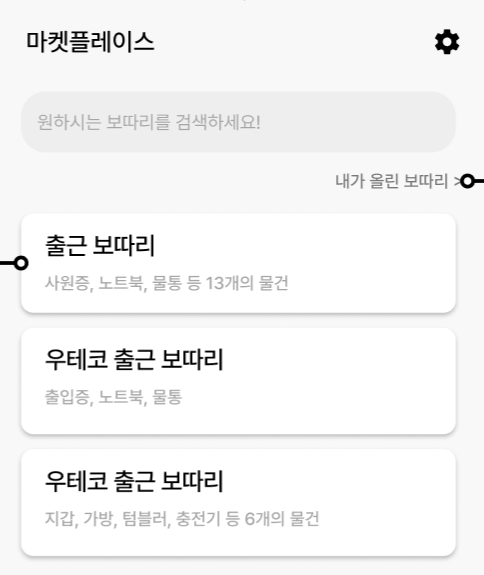

처음에는 위의 화면과 같이 구성을 하였다. 사용자 테스트(UT)를 진행하고 사용자들이 인기 있는 보따리 템플릿을 알면 신뢰성 있게 템플릿을 활용할 수 있을거같다는 피드백을 받았다. 그래서 특정 보따리 템플릿을 누군가가 가져갔을 때, 몇 명이 가져갔는지 횟수를 올리고 템플리 화면에서 가져간 횟수가 보이도록 기능을 추가하려고 하였다.
- 엔티티
```java
public class BottariTemplate {

    @Id
    @GeneratedValue(strategy = GenerationType.IDENTITY)
    private Long id;

    private String title;

    private int takenCount;
    // 다른 필드 생략
    public void increaseCount() {
        this.takenCount++;
    }
}
```


- 서비스

```java
@Transactional
public Long createBottari(
	final Long id,
	final String ssaid
) {
	final BottariTemplate bottariTemplate = bottariTemplateRepository.findById(id)
	.orElseThrow(() -> new BusinessException(ErrorCode.BOTTARI_TEMPLATE_NOT_FOUND));
	// 보따리 템플릿 정보를 바탕으로 내 체크리스트 생성하는 로직 생략
	bottariTemplate.increaseCount();
	return savedBottari.getId();
}

```


다음과 같이 가져간 횟수 필드를 추가하고, 누군가 보따리 템플릿을 가져가 자신의 체크리스트를 만드는 순간 가져간 횟수를 하나 올리는 기능을 간단하게 만들었다. 이 기능을 만들고 다음과 같이 1000번의 특정 보따리 템플릿을 가져가도록 API를 요청하였다.
```java
    public static void main(String[] args) {
        int totalCount = 1000;
        String targetUrl = "http://localhost:8080/templates/1/create-bottari";
        ExecutorService executor = Executors.newFixedThreadPool(totalCount);
        HttpClient client = HttpClient.newHttpClient();
        String token = "test_ssaid_";
        for (int i = 1; i <= totalCount; i++) {
            final int currnetToken = i;
            executor.submit(() -> {
                try {
                    HttpRequest request = HttpRequest.newBuilder()
                            .uri(URI.create(targetUrl))
                            .header("ssaid",token+currnetToken)
                            .POST(HttpRequest.BodyPublishers.noBody())
                            .build();

                    client.send(request, HttpResponse.BodyHandlers.ofString());
                } catch (Exception e) {
                    System.err.println("Thread: " + Thread.currentThread().getName() +
                                               ", Error: " + e.getMessage());
                }
            });
        }
        executor.shutdown();
    }
```

당연하게 보따리 템플릿의 가져간 횟수가 1000이 찍힐거라고 예상하였다. 하지만 결과는 다음과 같았다.
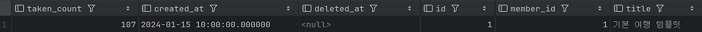
1000번의 요청 모두 개인적인 체크리스트는 만들어졌지만 TAKEN_COUNT 필드가 107 밖에 증가하지 않았다. 가져간 횟수는 어떤 템플릿이 인기가 있고, 이 템플릿이 신뢰성 있는 템플릿이라는 걸 증명하는 수치이기에 이 문제를 그냥 넘어갈 수 없었다.

# 🤔 왜 이런 일이 발생했을까?
현재는 JPA의 더티 채킹으로 가져간 횟수를 업데이트 하고 있다. 실제 쿼리를 보면 다음과 같다.
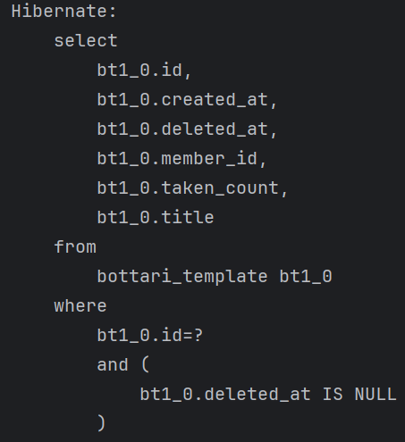
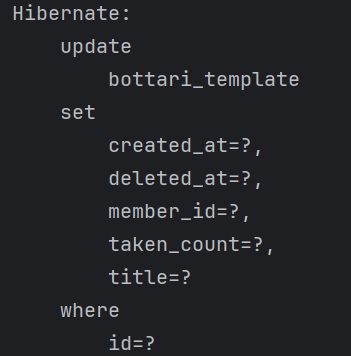

먼저 보따리 템플릿을 조회하고, 후에 increaeCount()  메서드를 호출하여 엔티티 상태를 변경하면 더티 채킹으로 트랜잭션이 커밋되는 시점에 UPDATE 문을 날려서 가져간 횟수를 업데이트를 한다.
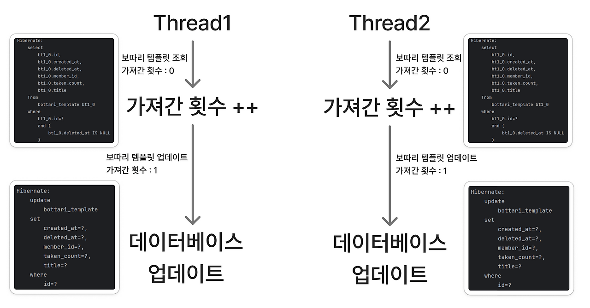

쓰레드 1과 쓰레드 2 즉, 각 다른 사용자가 거의 동시에 템플릿을 가져갔다고 가정하자. 그러면 먼저 A라는 사용자가 정말 미묘하게 빠르게 데이터베이스에서 템플릿을 조회하고 B라는 사용자도 템플릿을 조회한다. 이때, 데이터베이스에서 가져간 횟수는 0이라고 가정하자. 이 사용자(각 쓰레드1, 쓰레드2) 모두 조회를 할 때는 가져간 횟수는 0이다. 각 쓰레드 별로 가져간 횟수를 1 올리고 더티채킹으로 마지막에 업데이트 쿼리를 날리면 결국 1로 증가한 업데이트 쿼리가 쓰레드1, 쓰레드2에서 두 번 날라가게 되어 덮어써진다. 그래서 결과적으로 두 명이 가져가더라도 가져간 횟수는 1로 나오게 된다.

# 💡 동시성 문제를 해결할 수 있는 방법 
크게 5가지 방법을 시도해보았다.

- JAVA의 Synchronized
- 비관적 락
- 낙관적 락
- 네임드 락
- 직접 Update 쿼리 작성
### 1. JAVA의 Synchronized
JAVA의  Synchronized는 한 번에 한 스레드만 접근할 수 있도록 코드 블록이나 메서드를 잠그는 장치이다. 이를 사용하면 하나의 쓰레드만이 업데이트하는 메서드를 한번만 접근하기에 해결 가능해 보인다.
```java
@Transactional
public synchronized Long createBottari(
    final Long id,
    final String ssaid
) {
    final BottariTemplate bottariTemplate = bottariTemplateRepository.findById(id)
            .orElseThrow(() -> new BusinessException(ErrorCode.BOTTARI_TEMPLATE_NOT_FOUND));
    // 보따리 템플릿 정보를 바탕으로 내 체크리스트 생성하는 로직 생략
    bottariTemplate.increaseCount();
    return savedBottari.getId();
}
```
다음과 같이 서비스 계층의 createBottari 메서드에 synchronized를 붙여서 하나의 쓰레드만 접근할 수 있도록 하였다. 이렇게 변경 후 1000개의 요청을 한 결과는 다음과 같다.
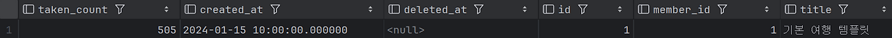

예상과는 다르게 결국 실패하였다. 그 이유는 무엇일까? 바로 @Transactional과 관련이 되어 있다.

@Transactional 애노테이션을 붙이는 순간 다음과 같이 Proxy 객체를 생성하여 트랜잭션 관련 처리를 해준다.

```java
public class BottariTemplateServiceProxy {

    private BottariTemplateSerivce bottariTemplateService;

    public BottariTemplateSerivce(BottariTemplateSerivce bottariTemplateService) {
    	this.bottariTemplateService = bottariTemplateService;
    }

    public void createBottari(Long id, Long quantity) {
	// 트랜잭션 시작 로직				
	bottariTemplateService.createBottari(id, quantity);
	// 트랜잭션 종료 로직
    }
}
```

이렇게 Proxy 클래스의 createBottari를 호출하여 트랜잭션 처리와 함께 가져간 횟수를 늘리는 로직을 실행하게 된다.

이때, 가져간 횟수의 증가가 DB에 반영되는 시점은 트랜잭션이 커밋되고 종료되는 시점이다.

즉, 가져간 횟수의 증가 로직인 bottariTemplateSerivce의 createBottari가 호출되고 트랜잭션이 종료되기 전까지는 가져간 횟수의 증가 로직이 DB에 반영되지 않는다.

synchronized는 메소드 선언부에 사용되어 해당 메소드가 종료되면 다른 스레드에서 해당 메소드를 실행할 수 있게 된다.

따라서 가져간 횟수의 증가 로직이 실행되고 트랜잭션이 종료되기 전까지의 시점에서 다른 스레드가 가져간 횟수의 증가 로직을 실행할 수 있게 된다.

이때 다른 스레드에서 보따리 템플릿을 조회했을 때는 아직 이전 가져간 횟수의 증가 로직이 실행된 스레드에서 DB에 반영되기 전이므로 증가되지 않은 보따리 템플릿을 조회하여 똑같이 가져간 횟수의 증가가 누락되는 것이다.

물론 @Transactional을 제거하면 정상적으로 작동된다. 하지만 현재 우리 서비스의 로직이 단순히 가져간 횟수만 증가하는 것이 아니라, 해당 템플릿을 통해 자신만의 체크리스트를 만드는 로직이 함께 있어 트랜잭션은 필수였다.


Synchronized는 이뿐만 아니라 다른 문제도 있다. @Transactional을 없애서 해결했다 하더라도 만약, 서버가 여러 대일때 동시성을 보장할 수 없다. 하나의 서버에서의 쓰레드 동시성을 막을 순 있지만, 다른 서버의 쓰레드의 접근을 막을 수 없기 때문이다.

### 2. 비관적 락
비관적 락은 데이터베이스에서 다른 트랜잭션이 데이터를 변경할 수 없도록 미리 잠그는 방식이다. 말 그대로, "이 데이터를 내가 수정하려고 하는데 다른 사람이 변경할 수 없도록 미리 잠근다!' 라는 접근 방식이다.

| 구분 | 내용 |
|------|------|
| **동작 방식** | 트랜잭션이 시작될 때 또는 조회 시 DB 레벨에서 행(row) 단위 락을 걸음 |
| **장점** | 동시 수정 충돌을 방지 가능 |
| **단점** | 잠금이 오래 유지되면 다른 트랜잭션이 대기 → 성능 저하 가능 |
| **사용 시점** | 중요한 데이터의 경쟁 조건이 발생할 가능성이 높을 때 |


스프링에서는 다음과 같이 구현할 수 있다.

- 레포지토리
```java
public interface BottariTemplateRepository extends JpaRepository<BottariTemplate, Long> {
    @Lock(LockModeType.PESSIMISTIC_WRITE)
    @Query("SELECT bt FROM BottariTemplate bt WHERE bt.id = :id")
    Optional<BottariTemplate> findByIdWithPessimisticLock(final Long id);
}
```
- 서비스
```java
@Transactional
public Long createBottari(
    final Long id,
    final String ssaid
) {
    // 락을 걸고 조회하도록 변경
    final BottariTemplate bottariTemplate = bottariTemplateRepository.findByIdWithPessimisticLock(id)
        .orElseThrow(() -> new BusinessException(ErrorCode.BOTTARI_TEMPLATE_NOT_FOUND));
    // 보따리 템플릿 정보를 바탕으로 내 체크리스트 생성하는 로직 생략
    bottariTemplate.increaseCount();
    return savedBottari.getId();
}
```

이를 다시 1000번의 요청을 보낸 결과, 기존의 5번 가져간 기록을 제외하고 정확하게 1000번이 올랐다.
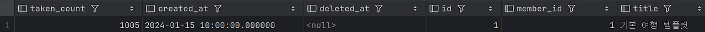
이렇게 비관적 락을 걸면 쿼리가 다음과 같이 변경이 된다.

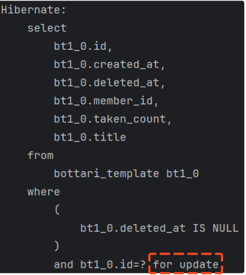
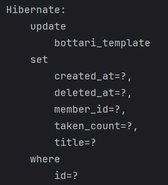

조회시에 for update 문을 사용해서 데이터 수정에 대한 락을 건다. 그 후에 이전과 마찬가지로 더티 체킹을 통해 업데이트 쿼리문을 날리게 된다.
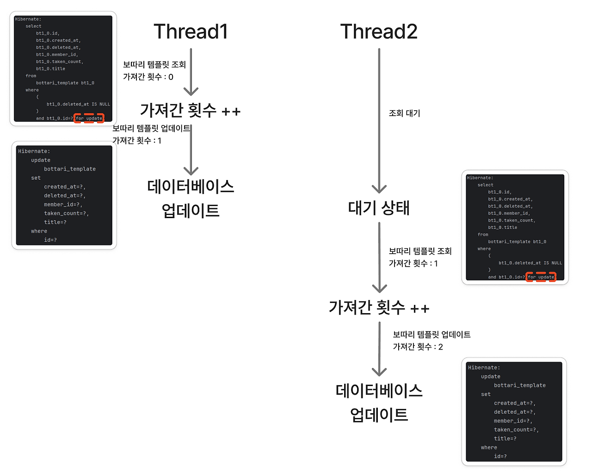

이제는 각 쓰레드가 수정 되기 전에 모두 조회를 하는 것이 아니라, 한 쓰레드가 for update 문을 통해 락을 걸고 조회를 하면 다른 쓰레드는 조회를 대기한다. 그 후에 먼저 락을 건 쓰레드가 업데이트를 완료하면 후에 기다리던 다른 쓰레드가 다시 락을 걸고 조회를 하게 된다. 이렇게 되면 동시성 이슈를 해결할 수 있다. 하지만 위에 표로 요약된거처럼 락을 걸고 조회를 한 후에, 서비스 계층에서 다른 일을 처리하느라 계속 지연이 된다면, 다른 기다리는 쓰레드는 이미 락으로 점유한 쓰레드를 기다릴 수 밖에 없으므로 성능 이슈가 생길 수 있다.

### 3. 낙관적 락
비관적 락은 충돌날 것을 대비해서 미리 데이터베이스에서 락을 걸고 조회하는 방식이다. 이와 반대로 낙관적 락은 미리 잠그지 않고 조회를 한다. 마지막 커밋 시점에서 다른 트랜잭션이 이미 해당 데이터를 변경했는지 확인(버전으로 확인)하여 만약 변경이 있는 경우 예외를 발생시키고 재시도 하는 방식이다. 즉, 이 방식은 "충돌이 잘 안 날거라고 믿고 미리 잠그지 않는 방식" 이다.

| 구분 | 내용 |
|------|------|
| **동작 방식** | 데이터를 읽을 때 잠금 없음 → 저장 시점에 버전 체크 |
| **장점** | DB 잠금 없음 → 동시 처리 성능 좋음 |
| **단점** | 충돌 발생 시 재시도 필요, 충돌 빈도 높으면 성능 오히려 떨어짐 |
| **사용 시점** | 동시 수정이 드물고, 읽기가 많을 때 적합 |

스프링에서는 @Version 애노테이션을 사용해서 구현할 수 있다.

- 엔티티
```java
public class BottariTemplate {

    @Id
    @GeneratedValue(strategy = GenerationType.IDENTITY)
    private Long id;

    private String title;

    private int takenCount;
    
    // 버전 정보 추가
    @Version
    private Integer version
    
    // 생략
    public void increaseCount() {
        this.takenCount++;
    }
}
```
- 레포지토리
```java
public interface BottariTemplateRepository extends JpaRepository<BottariTemplate, Long> {
    @Lock(LockModeType.OPTIMISTIC)
    @Query("SELECT bt FROM BottariTemplate bt WHERE bt.id = :id")
    Optional<BottariTemplate> findByIdWithOptimisticLock(final Long id);
}
```
- 서비스
```java
@Transactional
public Long createBottari(
        final Long id,
        final String ssaid
) {
    // 락을 걸고 조회하도록 변경
    final BottariTemplate bottariTemplate = bottariTemplateRepository.findByIdWithOptimisticLock(id)
            .orElseThrow(() -> new BusinessException(ErrorCode.BOTTARI_TEMPLATE_NOT_FOUND));
    // 보따리 템플릿 정보를 바탕으로 내 체크리스트 생성하는 로직 생략
    bottariTemplate.increaseCount();
    return savedBottari.getId();
}
```
이렇게 낙관적 락을 사용하여 구현할 수 있다. 이렇게 구현하고 1000개의 요청을 날리면 어떤 결과가 나올까?

실제 요청 결과.. 예외가 발생하여 어떤 요청은 성공을 하고, 어떤 요청은 실패한다.

```text
[2025-08-29 17:55:25:62618] [http-nio-8080-exec-31] ERROR [com.bottari.error.GlobalExceptionHandler.doLog:80] EXCEPTION-LOG - 
Exception Type : org.springframework.orm.ObjectOptimisticLockingFailureException
```
다음과 같이 ObjectOptimisticLockingFailureException 예외가 발생하면서 요청이 실패가 된다. 왜 그럴까?
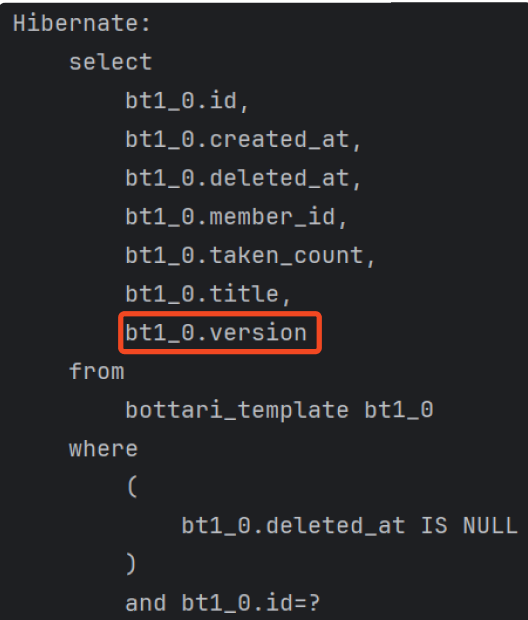
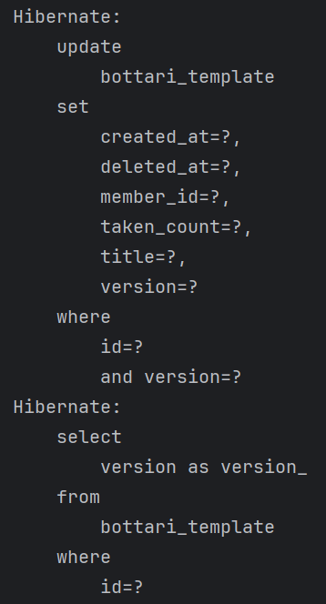

이제는 처음 조회를 할 때 version과 함께 조회를 한다. 후에 update를 할 때 이전 버전과 같은 보따리 템플릿을 업데이트한다. 이때 version도 이전 버전의 +1을 한 후 업데이트를 한다. 음.. 근데 마지막에 version select문은 뭘까? 바로 영속성 컨텍스트에 있는 보따리 템플릿의 상태를 최신화 하기 위해 가져온다. 예를 들어, 맨 처음 조회할 때 version을 3이라고 하자. 그러면 update 문에서는 version 3이고 id가 같은 보따리 템플릿을 version 4, 가져간 횟수를 업데이트한다. 하지만 영속성 컨텍스트에 있는 보따리 템플릿은 아직 version 3이기 때문에 이를 맞춰주기 위해 select  문을 한번 더 날려 최신 버전을 가져오게 된다.

예외는 바로 update 문에서 이전 버전이 바뀐 경우에 예외가 발생한다. 이를 자세하게 그림으로 살펴보자
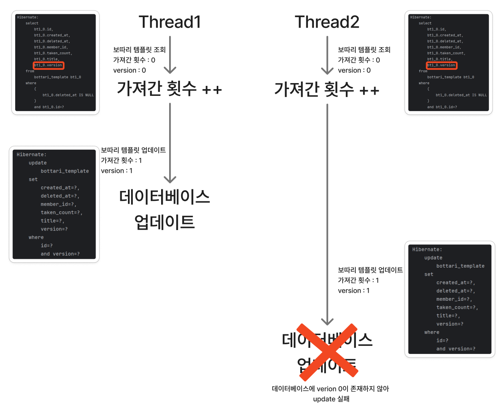

쓰레드 1과 쓰레드 2에서 보따리 템플릿을 버전 정보와 함께 가져온다. 쓰레드 1이 먼저 업데이트 쿼리문을 날려서 version을 1, 가져간 횟수를 하나 늘려서 1로 업데이트를 했다. 후에 쓰레드 2에서 마찬가지로 update 쿼리 문을 실행하려고하는데 where 절에 version은 이전 버전인 0이다. 하지만 데이터베이스에는 쓰레드 1이 이미 version을 1로 바꿨기에 해당 조건을 만족하는 보따리 템플릿이 없게 된다. 이때 업데이트는 실패하고 ObjectOptimisticLockingFailureException 예외가 발생하게 된다. 즉, 다른 트랜잭션에서 이미 업데이트를 했다는 뜻이다. 우리는 이 예외가 터졌을 때 재시도를 하면서 복구를 시도해야한다. 그래서 다음과 같이 재시도하는 로직을 추가하였다.

```java
@Service
@RequiredArgsConstructor
public class BottariTemplateFacadeService {

    private final BottariTemplateService bottariTemplateService;

    public Long createBottariWithTemplate(
            final Long id,
            final String ssaid
    ) throws Exception {
        while (true) {
            try {
                return bottariTemplateService.createBottari(id, ssaid);
            } catch (ObjectOptimisticLockingFailureException e) {
                Thread.sleep(500);
            }
        }
    }
}
```
BottariTemplateService를 가지는 다른 계층을 만들고 try-catch로 낙관적 락 예외가 발생한 경우 성공할 때까지 재시도하는 로직을 추가하였다. 해당 계층을 추가하여 실행한 결과 다음과 같이 동시성 문제 없이 잘 처리된 것을 알 수 있었다.
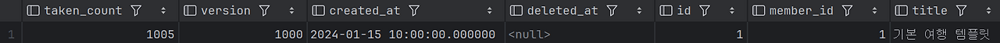
## 4. 네임드 락
네임드 락은 MySQL에서 제공하는 문자열 기반의 엔진 레벨 잠금이다. 특정 이름을 가진 락을 걸고, 다른 커넥션이 같은 이름으로 락을 걸려고 하면 대기하거나 실패하게 된다. 즉, 네임드 락은 비즈니스 로직 단위를 묶어서 보호하는 방법이다.

| 구분 | 내용 |
|------|------|
| **동작 방식** | 네임드 락 문자열 기반으로 세션 단위 락 획득 → 락 해제 시까지 다른 세션 접근 차단 |
| **장점** | 업무 단위 전체를 묶어 동시성 제어 가능, DB 스키마/테이블과 무관하게 사용 가능 |
| **단점** | 세션 유지 시간 동안 락 점유 → 장시간 작업 시 블로킹 가능, 락 해제와 트랜잭션 커밋 시점 꼬이면 동시성 문제 발생 가능 |
| **사용 시점** | 여러 테이블/스키마를 아우르는 비즈니스 단위 작업을 하나로 묶어 처리해야 할 때 적합 |

이제 스프링으로 구현하는 방법을 알아보자

- 레포지토리
```java
public interface BottariTemplateNamedLockRepository extends JpaRepository<BottariTemplate, Long> {

    @Query(value = "SELECT GET_LOCK(:key, 3000)", nativeQuery = true)
    void getLock(final String key);

    @Query(value = "SELECT RELEASE_LOCK(:key)", nativeQuery = true)
    void releaseLock(final String key);
}
```
- 서비스
```java
@Transactional
public Long createBottari(
        final Long id,
        final String ssaid
) {
    try {
    	// 네임드 락 설정
        bottariTemplateNamedLockRepository.getLock(id.toString());
        final BottariTemplate bottariTemplate = bottariTemplateRepository.findById(id)
                .orElseThrow(() -> new BusinessException(ErrorCode.BOTTARI_TEMPLATE_NOT_FOUND));
        // 보따리 템플릿 정보를 바탕으로 내 체크리스트 생성하는 로직 생략
        bottariTemplate.increaseCount();
        return savedBottari.getId();
    } finally {
    	// 네임드 락 해제
    	bottariTemplateNamedLockRepository.releaseLock(id.toString());
    }
}
```
이렇게 비즈니스 로직을 작업하기 전에 네임드 락을 설정하고, 비즈니스 로직이 끝나면 네임드 락을 해제한다.
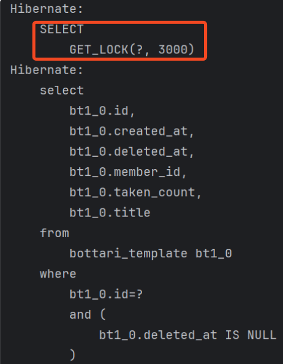
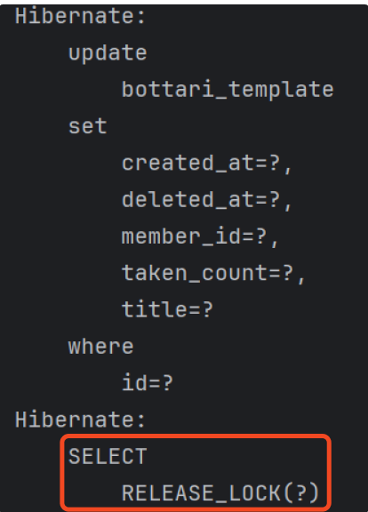
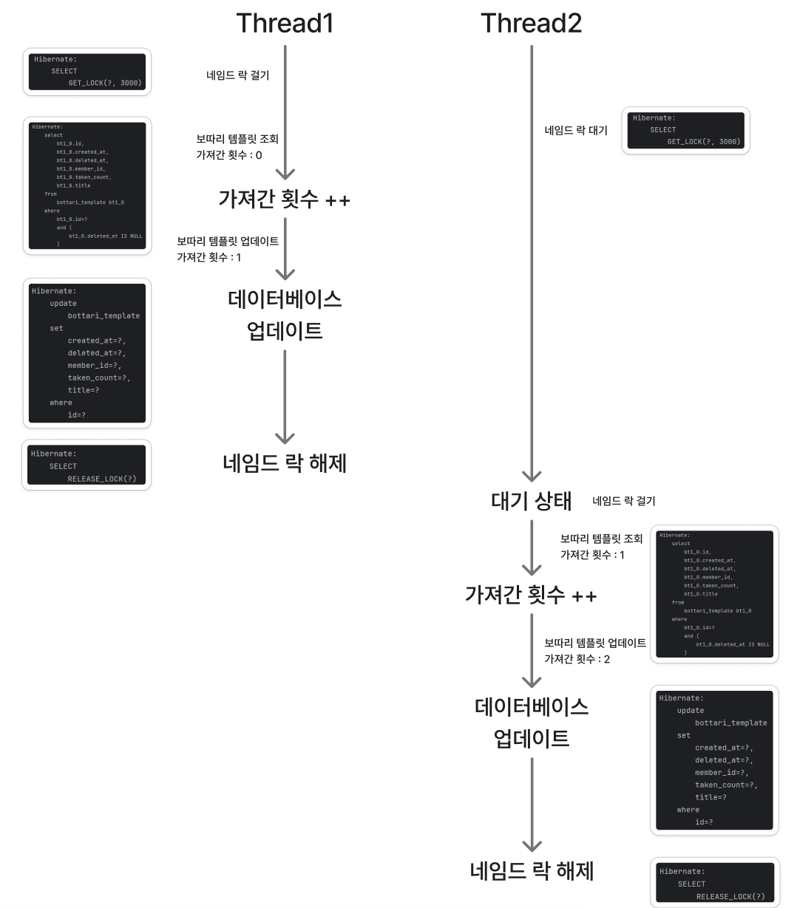
위의 그림과 같이 특정 쓰레드에서 먼저 네임드 락을 걸면, 다음 쓰레드에서 네임드 락을 얻으려고 하면 대기를 하고 있는다. 네임드 락을 먼저 건 쓰레드가 커밋이 되고 네임드 락이 해제가 되면 대기하고 있던 쓰레드는 네임드 락을 얻고 특정 작업을 수행하게 된다.

과연 다시 1000번의 요청을 하면 성공할까?
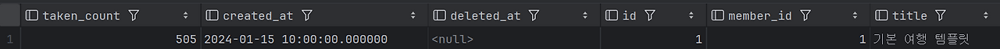

엥..? 예상과는 다르게 실패하였다.. 이유가 뭘까?

네임드 락을 걸때는 주의사항이 있다. 위의 서비스처럼 한 트랜잭션에서 네임드 락을 획득하고 반납해서는 안된다. 네임드 락은 MySQL 엔진 레벨에서 락을 거는 것이다. 트랜잭션과는 무관하게 락이 걸린다.

```java
@Transactional
public Long createBottari(
        final Long id,
        final String ssaid
) {
    try {
    	// 네임드 락 설정
        bottariTemplateNamedLockRepository.getLock(id.toString());
        final BottariTemplate bottariTemplate = bottariTemplateRepository.findById(id)
                .orElseThrow(() -> new BusinessException(ErrorCode.BOTTARI_TEMPLATE_NOT_FOUND));
        // 보따리 템플릿 정보를 바탕으로 내 체크리스트 생성하는 로직 생략
        bottariTemplate.increaseCount();
        return savedBottari.getId();
    } finally {
    	// 네임드 락 해제
    	bottariTemplateNamedLockRepository.releaseLock(id.toString());
    }
}
```
그렇기에 releaseLock 메서드가 호출되면 원래는 우리의 예상은 메서드가 호출 되고 끝날 때 커밋이 되면서 락을 해제하는거 같지만 트랜잭션과 무관하기에 커밋이 되기 전에 락을 풀어버린다. 그 후에 커밋이 된다. 그렇기 때문에 대기하고 있던 다른 쓰레드가 현재 쓰레드에서 커밋하기 전에 락을 가져가버려 업데이트 하기 전에 데이터 상태를 들고 오게 된다. 이를 해결하기 위해서는 네임드 락을 걸고 반납하는 로직을 트랜잭션 밖에 놔야한다.

```java
@Service
@RequiredArgsConstructor
public class BottariTemplateFacadeService {

    private final BottariTemplateService bottariTemplateService;
    private final BottariTemplateNamedLockRepository bottariTemplateNamedLockRepository;

    public Long createBottariWithTemplate(
            final Long id,
            final String ssaid
    ) {
        try {
            bottariTemplateNamedLockRepository.getLock(id.toString());
            return bottariTemplateService.createBottari(id, ssaid);
        } finally {
            bottariTemplateNamedLockRepository.releaseLock(id.toString());
        }
    }
}
```
위와 같이 상위 계층을 둬서 락 관리를 한다. bottariTemplateService에서는 락 관련 로직을 삭제한다. 이렇게 하면 bottariTemplateService의 createBottari 메서드가 끝나고 커밋이 정상적으로 완료가 되면 락을 반납하기에 해결이 된다.

### 5. 직접 Update 쿼리문 작성
이전까지 락은 애플리케이션 수준에서 값을 읽고 증가시켰다. 이번에는 애플리케이션 수준이 아닌 데이터베이스 수준에서 값을 증가시키도록 하였다. 즉, 더티 채킹으로 증가시키는 것이 아니라, 직접 쿼리문을 사용해서 가져간 횟수를 증가시켰다.

| 구분 | 내용 |
|------|------|
| **동작 방식** | DB가 직접 해당 행(row)에 쓰기 락(row lock)을 잡고, 동시에 다른 트랜잭션의 동일 행 UPDATE는 대기 후 순차 실행 |
| **장점** | 단일 쿼리로 바로 DB에서 처리 → 조회 후 연산 과정 없이 atomic하게 처리 가능, 간단한 카운트 증가나 상태 변경에 적합 |
| **단점** | 복잡한 비즈니스 로직(조회 → 연산 → 다른 테이블 INSERT 등)을 함께 처리할 수 없음, JPA 영속성 컨텍스트와 동기화되지 않음 |
| **사용 시점** | 단일 컬럼 카운트 증가, 상태 플래그 변경 등 단순한 동시성 보호가 필요한 경우 적합 |

- 레포지토리
```java
@Modifying(flushAutomatically = true, clearAutomatically = true)
@Query("""
        UPDATE BottariTemplate bt
        SET bt.takenCount = bt.takenCount + 1
        WHERE bt.id = :id
        """)
void plusTakenCountById(final Long id);
```
- 서비스
```java
@Transactional
public Long createBottari(
        final Long id,
        final String ssaid
) {
    try {
        // 보따리 템플릿 정보를 바탕으로 내 체크리스트 생성하는 로직 생략
        bottariTemplateRepository.plusTakenCountById();
        return savedBottari.getId();
    } finally {
    	// 네임드 락 해제
    	bottariTemplateNamedLockRepository.releaseLock(id.toString());
    }
}
```
위와 같이 데이터베이스 쿼리를 직접 날려서 MySQL 격리 수준에 의해 동시성 문제가 해결된다.

데이터베이스에서 기본 격리 수준인 READ_COMMITTED 이상에서는 트랜잭션이 다른 트랜잭션이 아직 커밋하지 않은 변경사항을 읽지 못하도록 보장한다. UPDATE 쿼리는 행 레벨 락을 동반하여 실행되며, 동일 데이터에 대한 쓰기 충돌을 DB가 자동으로 직렬화하여 순차적으로 처리한다.따라서 단일 UPDATE 문 수준에서는 동시성 문제가 발생하지 않는다.

자세한 격리 수준에 대해서는 다음 포스트를 참고하자.

[격리수준](https://mangkyu.tistory.com/299)

# ⭐ 우리 프로젝트의 선택은?
자바의 Synchronized는 트랜잭션 애노테이션을 사용할 수 없어서 기각하였다.

비관적 락은 트랜잭션 내에서 복잡한 로직과 연계 가능하다는 장점이 존재하였다. 하지만 우리 서비스에서 단순히 가져간 횟수를 늘리는 것이 아니라 중간에 보따리 템플릿으로 나만의 체크리스트를 만드는 로직이 중간에 있기에, 락 점유 시간이 오래 걸린다고 판단되어 보류하였다.

낙관적 락은 우리 서비스처럼 충돌이 드문 경우에 적합하다고 생각했다. 하지만 버전을 관리하고, 재시도 설계를 해야한다는 점에서 비용이 발생한다고 판단하여서 기각했다.

네임드 락은 트랜잭션 분리를 위해서 상위 계층 Facade 계층을 도입해야한다는 점이 계층 관리 비용이 생긴다고 판단하였다.

그래서 결국에는 지금처럼 간단히 템플릿 가져간 횟수 증가만 변경이 있는 경우에는 직접 Update 쿼리를 작성해서 구현이 간단한 방법을 선택하였다.

# 👨‍💻 락 추가 자료
[우아한 기술 블로그](https://techblog.woowahan.com/2631/)

