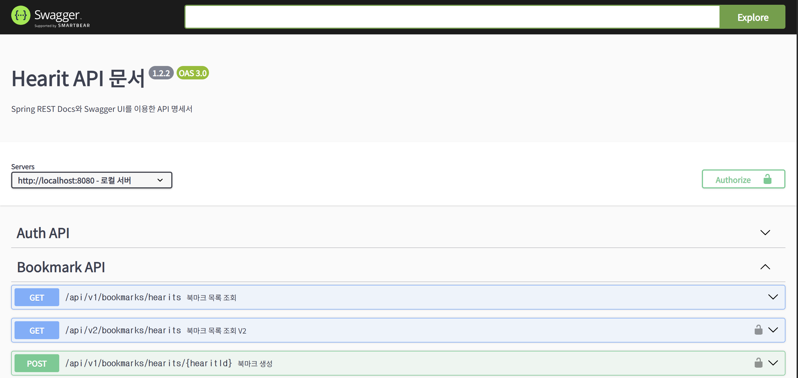
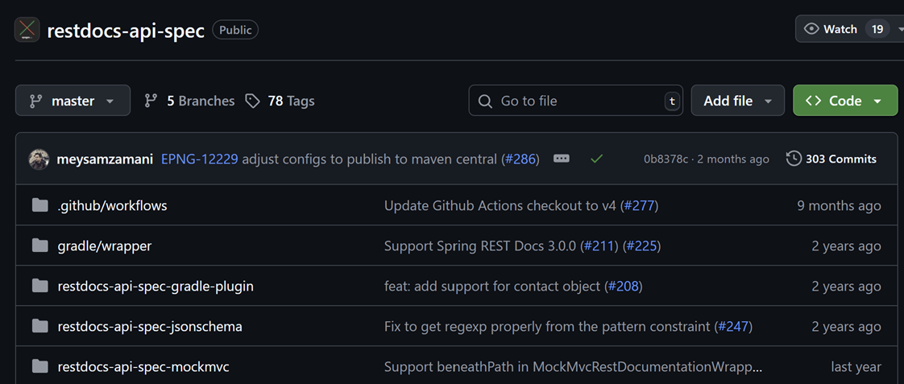

# 신뢰를 잃은 API 문서, 어떻게 살릴까?

얼마 전, API 명세의 사소한 변경 사항을 팀원에게 공유하는 것을 잊은 채 코드를 배포한 적이 있습니다. 그 결과, 안드로이드 팀원은 몇 시간 동안 원인 모를 에러와 씨름해야 했습니다.

분명 Swagger 문서에는 필드가 그대로인데, 실제 서버 응답에서는 해당 필드가 빠져 있었기 때문입니다.

원인이 제 실수였다는 것을 알았을 때의 미안함은 매우 컸습니다.

많은 개발자분들이 비슷한 경험을 해보셨을 겁니다. 이처럼 사소한 실수가 프로젝트 전체에 큰 혼란을 야기할 수 있다는 점에서 **정확하고 신뢰할 수 있는 API 문서**는 단순한 편의성 이상의 문제입니다.

이 글은 바로 그 '신뢰성'과 '편의성'이라는 두 마리 토끼를 모두 잡는 방법에 대한 이야기입니다. Spring Boot 환경에서 널리 쓰이는 두 가지 문서화 방식, **Swagger**와 **Spring REST Docs**를 비교하고, 두 방식의 장점만을 결합하여 **지속 가능하고 언제나 정확하며 사용하기 편리한** API 문서화 파이프라인을 구축하는 저의 경험을 공유하고자 합니다.

-----

## API 문서화의 두 가지 길: Swagger와 Spring REST Docs

API 문서를 만드는 여정은 보통 두 갈래 길에서 시작됩니다. 하나는 빠르고 직관적인 길, 다른 하나는 조금 번거롭지만 단단하고 확실한 길입니다. 각각 Swagger와 Spring REST Docs로 대표되는 이 두 가지 방식을 먼저 깊이 있게 살펴보겠습니다.

### 어노테이션 기반 접근법: Swagger


#### 핵심 원리: 런타임에 코드를 읽어 문서를 생성합니다

`springdoc-openapi` 라이브러리를 사용하는 Swagger 방식은 애플리케이션이 실행되는 **런타임**에 코드를 직접 분석하여 API 명세를 만들어냅니다. 애플리케이션이 구동될 때, 라이브러리는 `@RestController`, `@GetMapping` 등 프로젝트 내의 어노테이션들을 스캔하여 기계가 읽을 수 있는 **OpenAPI 3.0 명세(Specification)** 파일을 생성합니다.

이 명세 파일이 바로 Swagger 방식 문서화의 기본이 되며, 기본적으로 `/v3/api-docs` 경로를 통해 외부에 제공됩니다.

### Swagger 구현 예시

Gradle 기반 프로젝트라면 `build.gradle` 파일에 단 한 줄만 추가하면 모든 준비가 끝납니다.


```
// build.gradle
dependencies {
    implementation 'org.springdoc:springdoc-openapi-starter-webmvc-ui:2.5.0'
}
```

이 방식의 가장 큰 매력은 의존성 추가만으로 즉시 `/swagger-ui.html` 경로에서 완벽하게 동작하는 상호작용형 UI를 만나볼 수 있다는 점입니다.



#### 강점: 신속함과 상호작용성

가장 큰 강점은 **빠른 설정과 즉각적인 피드백**입니다. 의존성 하나만으로 API를 시각화하고 바로 테스트할 수 있는 환경이 만들어지므로, 특히 프로젝트 초기 개발 단계에서 대단히 효율적입니다. 내장된 **Swagger UI는 이 방식의 '핵심 기능'** 으로, 브라우저에서 직접 API를 호출하고 실시간 응답을 확인할 수 있게 하여 테스트 과정을 극적으로 단축시킵니다.

#### 약점: 편리함 뒤에 숨겨진 치명적 비용

하지만 이 편리함에는 몇 가지 무시할 수 없는 비용이 따릅니다.

- **프로덕션 코드의 오염**: 문서 설명을 자세히 추가할수록 컨트롤러는 비즈니스 로직보다 문서용 어노테이션으로 뒤덮입니다. 흔히 '크리스마스트리 현상'이라 불리는 이 문제는 코드의 가독성을 심각하게 해칩니다.

- **문서와 코드의 불일치 위험**: 서두에서 제가 겪었던 문제이자, 이 방식의 **가장 치명적인 약점**입니다. 어노테이션은 실제 코드 로직과 분리되어 있어, 그 내용이 정확한지 자동으로 검증할 수 없습니다. 개발자가 DTO 필드명을 바꾸고 `@Schema` 어노테이션 수정을 잊는 순간, 문서는 거짓말을 하기 시작합니다.

- **복잡한 시나리오 표현의 한계**: 조건에 따라 응답 필드가 달라지거나, 여러 예외 상황별 응답 차이를 어노테이션만으로 모두 표현하기에는 한계가 있습니다.

Swagger는 속도가 중요할 때 훌륭한 선택지이지만 문서 정확성을 개발자의 꼼꼼함에 전적으로 의존한다는 점을 기억해야 합니다.

-----

### 테스트 주도 접근법: Spring REST Docs


#### 핵심 원리: 테스트 결과물로 문서를 만듭니다

Spring REST Docs는 API 문서화에 대한 철학 자체가 다릅니다. 문서는 사람이 수동으로 관리하는 대상이 아니라, **테스트 과정에서 자동으로 생성되는 검증된 결과물**이어야 한다는 것입니다. 이 방식의 대원칙은 아주 간단하고 강력합니다.

> "테스트가 성공하면, 그 테스트가 만든 문서는 100% 정확하다."

Spring REST Docs는 개발자가 직접 작성한 설명(Asciidoc)과 테스트 실행 중에 자동으로 추출된 **스니펫(snippet)** 을 조합하여 최종 문서를 완성합니다.


#### RestDocs 구현 예시

`build.gradle`에 Asciidoctor 플러그인을 설정하고 다음과 같이 테스트를 작성합니다.


```java
// UserControllerTest.java
@WebMvcTest(UserController.class)
@AutoConfigureRestDocs
public class UserControllerTest {

    @Autowired
    private MockMvc mockMvc;

    @Test
    void getUserDocument() throws Exception {
        this.mockMvc.perform(get("/api/users/{id}", 1L))
            .andExpect(status().isOk())
            .andDo(document("user-get", // 스니펫 디렉토리명
                pathParameters(
                    parameterWithName("id").description("조회할 사용자의 ID")
                ),
                responseFields(
                    fieldWithPath("id").description("사용자의 고유 식별자"),
                    fieldWithPath("name").description("사용자 이름"),
                    fieldWithPath("email").description("사용자 이메일 주소")
                )
            ));
    }
}
```

핵심은 `.andDo(document(...))` 부분입니다. `responseFields`에 기술된 필드가 실제 응답에 없거나, 실제 응답에 있는데 기술되지 않은 필드가 있으면 **테스트가 즉시 실패합니다.** 이로써 문서와 코드의 일치성이 강제됩니다.

#### 강점: 정확성과 깔끔한 프로덕션 코드

- **정확성**: 문서는 실제 API 동작을 검증하는 테스트의 성공을 통해서만 생성됩니다. API 코드가 변경되면 문서 테스트도 수정해야만 빌드가 성공하므로, 문서의 최신성과 정확성이 시스템 레벨에서 강제됩니다.

- **깨끗한 프로덕션 코드**: 모든 문서화 로직은 테스트 코드에만 존재합니다. 덕분에 프로덕션 코드는 비즈니스 로직에만 집중할 수 있습니다.

- **풍부한 자유도**: AsciiDoc 포맷은 어노테이션보다 훨씬 표현력이 뛰어나, API 정책 등 서술적인 내용을 자유롭게 작성하고 그 안에 자동 생성된 스니펫을 자연스럽게 녹여낼 수 있습니다.


#### 약점: 초기 학습 곡선, 불편한 UI

- **초기 노력 필요**: 어노테이션 몇 개를 추가하는 것보다는 문서화를 위한 별도의 테스트를 작성하고 빌드를 설정하는 데 더 많은 초기 노력이 필요합니다.

- **상호작용 UI의 부재**: 기본 결과물은 정적인 HTML 파일입니다. Swagger UI처럼 그 자리에서 바로 API를 호출해볼 수 없습니다. 특히 **협업하는 동료들에게 익숙한 Swagger UI**의 부재는 API를 탐색하고 테스트하는 과정을 번거롭게 만들어, 많은 팀이 REST Docs 도입을 망설이는 가장 큰 이유가 되었습니다.

-----

### Swagger vs REST Docs 정리

| 기능 | Swagger (`springdoc-openapi`) | Spring REST Docs | 비교 우위 |
| :--- | :--- | :--- | :--- |
| **정확성 보장** | 낮음 (개발자 규율에 의존) | **매우 높음** (테스트로 강제) | **REST Docs**: 서비스 안정성이 중요한 시스템에 필수 |
| **상호작용 UI** | **기본 제공 (매우 우수)** | 기본 미제공 (정적 HTML) | **Swagger**: 빠른 프로토타이핑 및 API 탐색에 유리 |
| **프로덕션 코드 영향** | 높음 (어노테이션으로 코드 오염) | **없음** (테스트 코드에만 존재) | **REST Docs**: 코드 가독성 및 유지보수성 향상 |
| **초기 설정 노력** | **낮음** | 중간 | **Swagger**: 빠른 시작에 유리 |

-----

## 하이브리드 전략: 두 마리 토끼 잡기

### `restdocs-api-spec`으로 간극 메우기

Spring REST Docs의 정확성은 필수적이지만, 상호작용이 불가능한 정적 문서는 사용자 경험을 저해합니다. 반대로 Swagger는 훌륭한 UI를 제공하지만, 정확성을 보장하지 못합니다.

두 마리 토끼를 동시에 잡을 수는 없을까요? 꼭 한 가지 방법을 선택해야만 할까요?




**`restdocs-api-spec`** 라이브러리는 바로 이 간극을 메워줍니다. 이 라이브러리의 목표는 Spring REST Docs의 테스트 주도 방식을 그대로 사용하면서, 최종 결과물로 **Asciidoc**스니펫 대신 업계 표준인 **OpenAPI 3.0 명세** 파일을 생성하는 것입니다.


> **[TMI] `restdocs-api-spec`은 누가 만들었을까?**
> 이 라이브러리는 독일의 대표적인 **이커머스(전자상거래)** 솔루션 기업인 **ePages**에서 개발하고 관리하는 오픈소스 프로젝트입니다. 실제 프로덕션 환경에서 API 문서화의 신뢰성 문제를 해결하기 위해 직접 개발되어 지속적으로 업데이트되는 라이브러리입니다.

#### 작동 원리: 명세 생성과 표현의 분리

1. **테스트 실행**: 개발자는 Spring REST Docs와 유사한 방식으로 문서화 테스트를 작성합니다.

2. **중간 명세 생성**: 테스트가 실행될 때, `.adoc` 스니펫 대신 각 API에 대한 구조화된 정보를 담은 중간 형식의 JSON 파일이 생성됩니다.

3. **명세 취합 및 변환**: 빌드 과정에서 Gradle 플러그인이 모든 중간 명세 파일들을 수집하여, 완전한 단일 **OpenAPI 3.0 명세 파일**(`openapi3.yaml` 또는 `.json`)로 변환합니다.

이 파일이 바로 테스트로 검증된, 100% 정확한 새 API 문서가 됩니다.

-----

### 단계별 구현: OpenAPI 명세 생성하기

#### `build.gradle` 전체 설정

```groovy
// build.gradle
plugins {
    id 'java'
    id 'org.springframework.boot' version '3.3.0'
    id 'io.spring.dependency-management' version '1.1.5'
    // restdocs-api-spec 플러그인 적용
    id 'com.epages.restdocs-api-spec' version '0.19.2'
}

repositories {
    mavenCentral()
}

dependencies {
    implementation 'org.springframework.boot:spring-boot-starter-web'
    testImplementation 'org.springframework.boot:spring-boot-starter-test'
    // restdocs-api-spec의 MockMvc 지원 라이브러리 추가
    testImplementation 'com.epages:restdocs-api-spec-mockmvc:0.19.2'
}

test {
    useJUnitPlatform()
}

// OpenAPI 3.0 명세 생성 관련 설정
openapi3 {
    server = 'http://localhost:8080'
    title = 'My API'
    description = '내 서비스의 API 문서'
    version = '1.0.0'
    format = 'yaml'
    outputDirectory = "$buildDir/api-spec"
}
```

#### OpenAPI 생성을 위한 테스트 코드 수정

기존 Spring REST Docs 테스트를 `restdocs-api-spec`에 맞게 전환하는 과정은 엄청 간단합니다.


```java
// import org.springframework.restdocs.mockmvc.MockMvcRestDocumentation
// 기존의 restdocs 라이브러리를 Wrapper 클래스로 대체
import com.epages.restdocs.apispec.MockMvcRestDocumentationWrapper; 
import com.epages.restdocs.apispec.ResourceSnippetParameters;
import static com.epages.restdocs.apispec.ResourceDocumentation.resource;
import static org.springframework.restdocs.payload.PayloadDocumentation.fieldWithPath;
import static org.springframework.restdocs.request.RequestDocumentation.parameterWithName;

@Test
void apiSpecTest() throws Exception {
    this.mockMvc.perform(get("/api/users/{id}", 1L))
        .andExpect(status().isOk())
        .andDo(MockMvcRestDocumentationWrapper.document("user-get-spec", // 고유 식별자
            resource(
                ResourceSnippetParameters.builder()
                    .summary("사용자 한 명 조회") // Swagger UI에 표시될 요약
                    .description("고유 ID로 사용자 정보를 조회합니다.")
                    .tag("Users") // API 그룹 태그
                    .pathParameters(
                        parameterWithName("id").description("사용자 ID")
                    )
                    .responseFields(
                        fieldWithPath("id").description("사용자 ID"),
                        fieldWithPath("name").description("사용자 전체 이름"),
                        fieldWithPath("email").description("사용자 이메일 주소")
                    )
                    .build()
            )
        ));
}
```

**변경 사항:**

1. **`MockMvcRestDocumentationWrapper` 사용**: `restdocs-api-spec`이 제공하는 래퍼를 사용합니다.

2. **`resource` 스니펫 도입**: 모든 명세 정보를 `resource`라는 하나의 단위로 묶어 관리합니다. `pathParameters`, `responseFields` 등 기존 검증 메서드는 그대로 사용합니다.

3. **OpenAPI 전용 메타데이터 추가**: `summary`, `description`, `tag`와 같이 기존 restdocs에서는 추가하지 못했던 Swagger UI에 직접적으로 표시될 정보를 추가할 수 있습니다.

중요한 점은 `responseFields`와 같은 핵심적인 API 계약 테스트의 원리는 그대로라는 것입니다. 우리는 단지 테스트로 검증된 결과물을 OpenAPI 명세서로 만들기 위해 포장 방식을 바꾼 것뿐입니다.


-----

## 검증된 명세를 Swagger UI로 시각화하기

이제 테스트로 검증된 신뢰할 수 있는 `openapi3.yaml` 파일을 생성했으니, 사용자가 보고 상호작용할 수 있는 UI를 만들 차례입니다. 여기서는 **Swagger UI 정적 파일을 직접 호스팅하는 방식**을 설명하겠습니다.

이 방법은 Swagger UI를 우리 프로젝트의 독립적인 프론트엔드 자산처럼 직접 관리하는 방식입니다. **문서 UI를 애플리케이션 런타임 의존성에서 분리**함으로써 더 깔끔하고 유연한 아키텍처를 구성할 수 있습니다.

#### 구현 단계

1. **Swagger UI 다운로드**: Swagger UI의 [공식 GitHub 릴리즈](https://github.com/swagger-api/swagger-ui/releases)에서 최신 버전의 `dist` 폴더 내용을 `src/main/resources/static/swagger-ui`와 같은 정적 리소스 경로에 복사합니다.

![[Pasted image 20251014083526.png]]
2.  **명세 파일 복사 설정 (`build.gradle`)**: 빌드 시 `openapi3` 태스크로 생성된 `openapi3.yaml` 파일을 `bootJar`에 포함될 정적 리소스 폴더(`static/docs`)로 복사하는 Gradle 작업을 추가합니다.


    ```groovy
    // build.gradle
    tasks.register('copyOpenApiSpec', Copy) {
        dependsOn tasks.named('openapi3')
        from "$buildDir/api-spec"
        into "$buildDir/resources/main/static/docs" // 복사될 위치
    }

    tasks.named('bootJar') {
        dependsOn tasks.named('copyOpenApiSpec')
    }
    ```

3.  **UI 설정 파일 수정**: 복사한 파일 중 `swagger-initializer.js`를 열어, OpenAPI 명세 파일을 읽어올 경로를 수정합니다.

    ```javascript
    // src/main/resources/static/swagger-ui/swagger-initializer.js
    window.onload = function() {
      const ui = SwaggerUIBundle({
        // url: "https://petstore.swagger.io/v2/swagger.json", // 이 부분을 수정
        url: "/docs/openapi3.yaml", // 위 Gradle에서 복사한 파일 경로
        dom_id: '#swagger-ui',
        // ... 이하 생략
      });
      window.ui = ui;
    };
    ```

이제 `./gradlew bootJar`로 빌드하고 애플리케이션을 실행한 뒤 `http://localhost:8080/swagger-ui/index.html`로 접속하면, 직접 호스팅한 최신 버전의 Swagger UI를 확인할 수 있습니다.


-----

## 지속 가능하고 신뢰할 수 있는 문서화

지금까지 Spring Boot API 문서를 작성하는 두 가지 주요 방식을 분석하고, 이들의 장점만을 결합한 하이브리드 전략을 제시했습니다. `restdocs-api-spec`을 통해 Swagger의 상호작용성과 Spring REST Docs의 정확성 사이의 간극을 메우는 방법을 단계별로 살펴보았습니다.

하이브리드 접근법의 핵심 이점은 명확합니다.

- **항상 정확한 문서**: 모든 문서는 실제 API 동작을 검증하는 테스트로부터 생성되므로, 코드와 문서의 불일치 가능성이 원천적으로 제거됩니다.

- **깨끗한 프로덕션 코드**: 모든 문서화 로직은 테스트 코드에 위치하므로, 프로덕션 코드는 어노테이션 오염 없이 깔끔하게 유지됩니다.

- **편리한 사용성 (UI)**: 최종 결과물은 업계 표준인 Swagger UI를 통해 제공되므로, API 사용자는 문서를 읽는 데 그치지 않고 직접 API를 실행하고 테스트해볼 수 있습니다.

결론적으로 이 글에서 설명한 **`Spring REST Docs` + `restdocs-api-spec` + `Swagger UI 직접 호스팅`** 문서화 체계를 도입함으로써, 저희 프로젝트 팀은 일회성 문서 작성을 넘어 지속 가능하고 신뢰할 수 있으며 견고한 문서화 체계를 구축했습니다.
