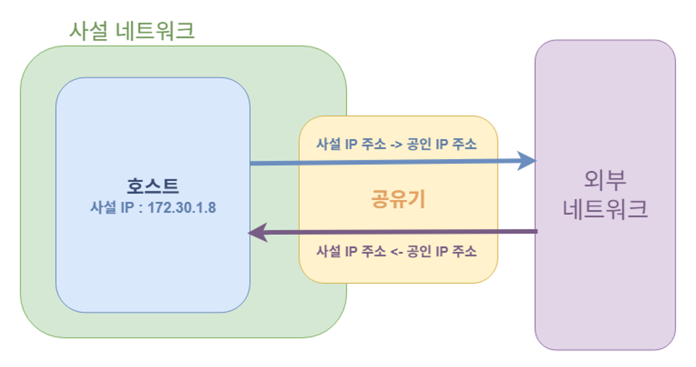
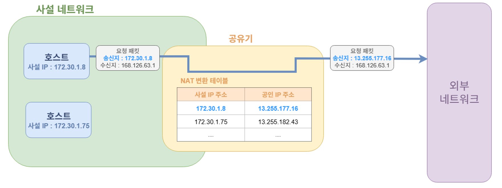
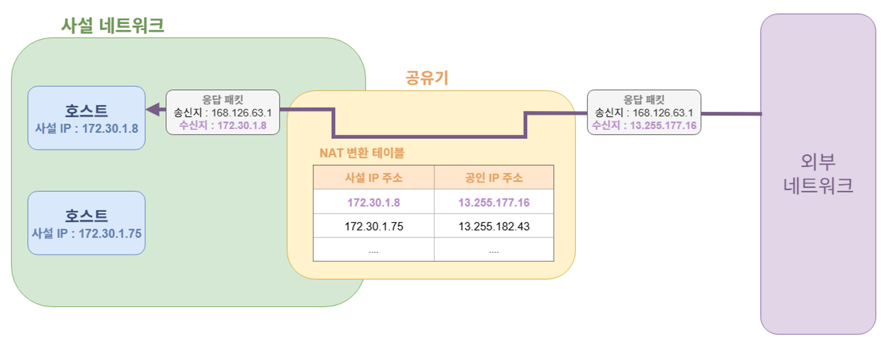
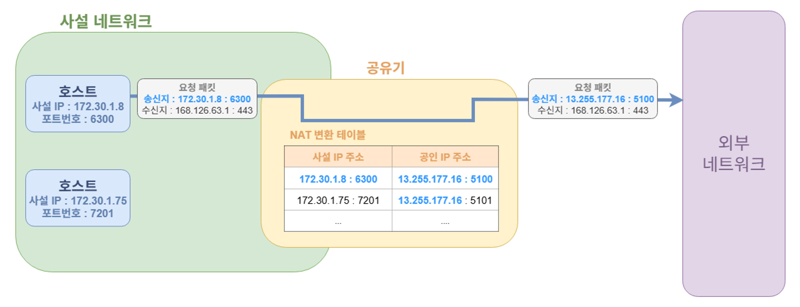
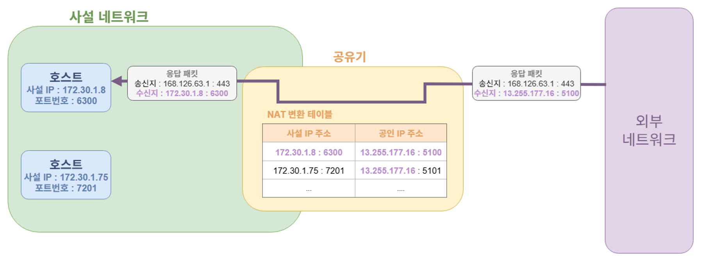

# **동일한 Wi-Fi에서 발생한 동일한 IP주소의 요청**

## **프로젝트를 진행하며 발생한 문제**

### **문제 상황**

우테코 3~4레벨 동안 백엔드 파트를 맡아 웹 서비스를 개발하던 중, 중간 점검 과정에서 코치님으로부터 트래픽 공격 테스트를 받았습니다.
해당 테스트는 서비스에 문제가 발생했을 때 모니터링과 로깅을 통해 원인을 신속하게 파악할 수 있는지,
또한 서비스가 높은 트래픽을 얼마나 견딜 수 있는지를 점검하기 위한 목적이었습니다.
하지만 저희 팀은 위와 같은 목적에서 한발 더 나아가 실제 트래픽 공격 상황에서도 최소한의 방어가 가능하도록
기초적인 트래픽 대응 로직을 구현하기로 결정했습니다.

모니터링과 로깅을 제외한 저희 프로젝트의 운영 환경은 아래 그림과 같이 구성되어 있습니다.  

이 구조를 기반으로, 저희 팀은 트래픽 공격에 대한 최소한의 방어 체계를 마련하기로 결정했습니다.
저희가 선택한 방식은 다음과 같습니다.
- Nginx limit_req 모듈을 이용해 IP 주소별로 요청 속도를 제한
- Nginx access 로그를 기반으로 Fail2ban을 적용하여 악의적인 패턴의 요청을 보내는 IP를 자동으로 차단

하지만 예상치 못한 문제가 발생했습니다. IP별 요청 제한 기준을 매우 넉넉하게 설정했음에도 불구하고,
제한 기준을 넘는 트래픽 상황이 반복적으로 발생하는 것이었습니다. 
실제로 HTTP 429(Too Many Requests) 응답이 반복적으로 발생했다는 것을 Nginx 로그를 통해 확인할 수 있었습니다.

### **문제의 원인**

문제의 원인을 파악하기 위해 Nginx access 로그를 분석했습니다. 그 결과 서로 다른 호스트에서 발생한 
요청들이 모두 동일한 IP 주소로 기록되어 있음을 발견했습니다. 즉, 실제로는 여러 클라이언트에서 요청이 
들어왔지만, Nginx에서는 이를 단일 IP로 인식하고 처리하고 있었습니다.

“””  
{ "time\_local":"13/Oct/2025:13:18:15 \+0900",  "remote\_addr":"218.39.\*\*\*.***",    
"request\_method":"GET",  "request\_uri":"/api/v1/templates",  "status":200,  "body\_bytes\_sent":81,    
"request\_time":0.006,  "upstream\_response\_time":"0.007",    
"http\_referrer":"https://dev.api.pickeat.io.kr/swagger-ui/index.html",    
"http\_user\_agent":"Mozilla/5.0 (Windows NT 10.0; Win64; x64) AppleWebKit/537.36 (KHTML, like Gecko) Chrome/141.0.0.0 Safari/537.36",    
"host":"dev.api.pickeat.io.kr" }

{ "time\_local":"13/Oct/2025:13:17:56 \+0900",  "remote\_addr":"218.39.\*\*\*.***",    
"request\_method":"GET",  "request\_uri":"/api/v1/templates",  "status":200,  "body\_bytes\_sent":81,    
"request\_time":0.006,  "upstream\_response\_time":"0.007",    
"http\_referrer":"https://dev.api.pickeat.io.kr/swagger-ui/index.html",    
"http\_user\_agent":"Mozilla/5.0 (Linux; Android 10; K) AppleWebKit/537.36 (KHTML, like Gecko) Chrome/141.0.0.0 Mobile Safari/537.36",    
"host":"dev.api.pickeat.io.kr" }  
“””

그 결과, 여러 클라이언트에서의 요청이 하나의 IP에 할당된 요청 제한 기준을 공유하게 되었고,
이에 따라 요청 제한을 초과하여 HTTP 429(Too Many Requests) 응답이 지속적으로 발생하게 된 것이었습니다.

그렇다면 여러 클라이언트에서 보낸 요청이 Nginx 로그에 단일 IP 주소로 기록되는 이유는 무엇일까요?
디버깅 과정에서, 동일한 Wi-Fi에 연결된 여러 호스트가 모두 동일한 IP 주소로 요청을 전송하고 있음을 확인했습니다.
이 관찰을 통해 “왜 같은 Wi-Fi에 연결된 호스트들은 모두 동일한 IP 주소를 사용해 요청을 보내는 것일까?”라는 의문이 생겼습니다.
이 질문에 대한 답을 찾기 위해 관련 내용을 조사하고 학습을 진행했으며, 그 결과를 정리해보고자 합니다.

## **공인 IP주소와 사설 IP 주소**

### **들어가며**

본격적인 원인 분석에 앞서, 이해를 돕기 위해 배경 지식을 정리하고자 합니다.
먼저 사설 IP 주소와 공인 IP 주소의 개념부터 정리해보겠습니다.

### **공인 IP 주소 (Public IP Address)**

공인 IP란 무엇일까요? 공인 IP 주소란 전 세계에서 유일하게 식별 가능한 IP 주소를 의미합니다.
즉, 전 세계 어디에서든 특정 호스트를 고유하게 구분하기 위해 호스트에 부여된 IP 주소라고 할 수 있습니다.
이러한 공인 IP 주소는 IANA(Internet Assigned Numbers Authority) 인터넷 할당 번호 관리
기구에 의해 관리되며, ISP(Internet Service Provider) 인터넷 서비스 공급자에 의해 할당받을 수 있습니다.

우리나라의 대표적인 ISP로는 KT, U+, SKT 등이 있습니다. 저희는 이러한 ISP로부터 공인 IP 주소를
할당받아 인터넷에 접속하고 있습니다. 실제로 ISP와 인터넷 서비스를 계약하면 제공되는 공유기에 공인 IP 
주소가 할당되며, 이러한 공유기를 통해 저희는 핸드폰이나 노트북으로 인터넷에 접속할 수 있게 됩니다.

그러면 ISP로부터 할당받은 공인 IP 주소는 어떻게 확인할 수 있을까요?
일반적인 가정용 공유기에 할당된 공인 IP 주소는 ISP에서 제공하는 공유기 관리 페이지에서 확인할 수 있습니다.
실제로 공유기 관리 페이지에서 직접 확인한 공인 IP 주소 입니다.

한가지 알아두면 좋을 점은, 가정용 공유기는 일반적으로 DHCP 프로토콜을 통해 공인 IP 주소를 
동적으로 할당받고 있다는 점입니다. 이러한 특성 때문에, 공유기에 할당된 공인 IP 주소는 시간이 
지남에 따라 언제든 변경될 수 있습니다. 

### **사설 IP 주소 (Private IP Address)**

그렇다면 사설 IP 주소는 무엇일까요? 사설 IP 주소는 사설 네트워크 내에서 사용하기 위해 만들어진 IP 주소를 
의미합니다. 즉, 사설 네트워크상에서 내부에 연결된 호스트들을 고유하게 식별하기 위해서 만들어진 IP 주소라고 할 수 있습니다.
이러한 사설 IP 주소는 공인 IP 주소와 달리 다음과 같은 특징을 가집니다.
- 사설 네트워크 내부에서만 유효하며, 외부 인터넷에서는 사용할 수 없습니다.
- 서로 다른 사설 네트워크 간에는 동일한 사설 IP 주소가 중복되어 존재할 수 있습니다.

이러한 사설 IP 주소가 필요한 이유는 무엇일까요? 크게 두 가지로 정리할 수 있습니다.

1. 공인 IP 주소는 한정된 자원이기 때문입니다.
    - IPv4 주소는 약 43억 개로 수량이 제한되어 있어, 전 세계의 모든 기기에 고유한 공인 IP를 할당하기 어렵습니다. 
    - 따라서 사설 네트워크 내에서는 공인 IP 대신 사설 IP를 사용함으로써 공인 IP의 사용량을 줄일 수 있습니다.

2. 공인 IP 주소를 사용하기 위해서는 비용이 발생한다는 점입니다.
    - 공인 IP는 일반적으로 ISP로부터 임대받는 형태로 제공되며, 이에 따른 비용이 청구됩니다.
      그렇기에 사설 네트워크 내부의 모든 호스트에서 공인 IP 주소를 부여하면 많은 네트워크 비용이 발생하게 됩니다.
    - 이에 반해 사설 네트워크 내부의 모든 호스트에 사설 IP 주소를 부여하면,
      공인 IP 주소는 공유기 한 대에만 할당하면 되므로 전체 네트워크 운영 비용을 절감할 수 있습니다.

그렇다면 호스트에게 할당된 사설 IP 주소는 어떻게 확인할 수 있을까요?
실제로 공유기가 구성한 사설 네트워크에 연결된 각 호스트는 공유기로부터 사설 IP 주소를 자동으로 할당받습니다.
따라서 해당 호스트의 네트워크 설정 메뉴를 통해 자신에게 할당된 사설 IP 주소를 손쉽게 확인할 수 있습니다.

(컴퓨터에 할당된 사설 IP 주소)  
   
(핸드폰에 할당된 사설 IP 주소)  

한가지 알아두어야 할 중요한 점은 RFC 1918 표준에 따라 사설 IP 주소로 사용 가능한 IP 주소 범위가 명확히 
정해져 있다는 점입니다. RFC 1918에 명시된 사설 IP 주소의 범위는 다음과 같습니다.

- 10.0.0.0/8 (10.0.0.0 \~ 10.255.255.255)
- 172.16.0.0/12 (172.16.0.0 \~ 172.31.255.255)
- 192.168.0.0/16 (192.168.0.0 \~ 192.168.255.255)

따라서 IP 주소가 위 범위 내에 속한다면, 해당 주소는 사설 IP 주소임을 한눈에 구분할 수 있습니다.

## **NAT과 NAPT를 활용한 공인/사설 IP주소 변환**

### **들어가며**

지금까지 공인 IP 주소와 사설 IP 주소의 개념을 살펴보았습니다.
사설 IP 주소에 대해 읽으면서, 아마 한 가지 의문이 생겼을 것입니다.

> 사설 네트워크의 호스트들은 공인 IP 주소 대신 사설 IP 주소를 사용하여 공인 IP 자원을 절약하고 비용을 줄인다고
했는데, 이때 사설 IP 주소는 외부 네트워크에서 사용할 수 없다면 어떻게 인터넷과 통신할 수 있을까?

사실 사설 IP 주소를 사용하는 호스트는 직접적으로 외부 네트워크(인터넷)과 통신할 수 없습니다.
그럼에도 불구하고 우리가 인터넷을 사용할 수 있는 이유는, NAT(Network Address Translation)과 
NAPT(Network Address Port Translation) 기술 덕분입니다.

### **NAT(Network Address Transition)**

NAT 기술은 사설 네트워크 내부에서 사용되는 사설 IP 주소를 공인 IP 주소로 변환하는 기술을 의미합니다.
이 기술을 통해 사설 IP 주소를 할당받은 내부 호스트가 외부 네트워크와 통신할 수 있으며,
외부에서는 공유기의 공인 IP 주소만 보이게 됩니다.
그 기본적인 동작 과정은 아래 그림과 같습니다.

  

이러한 변환 과정은 사설 네트워크를 구성하고 있는 공유기에서 수행되며, 사용되는 공인 IP 주소는 
공유기에 할당된 공인 IP 주소를 사용하게 됩니다.  

NAT 변환에 대한 자세한 원리는 다음과 같이 정리할 수 있습니다.  

- 내부 호스트에서 외부로 요청을 보내는 경우 (사설 IP 주소 \-\> 공인 IP 주소)
    - 사설 네트워크의 호스트가 외부로 요청을 보냅니다.
    - 요청 패킷이 공유기로 전달되면, 공유기는 송신지에 명시된 사설 IP 주소를 확인합니다.
    - 공유기는 해당 사설 IP 주소에 매핑할 공인 IP 주소를 선택합니다.
    - 사설 IP와 공인 IP 쌍을 NAT 변환 테이블에 저장합니다.
    - 요청 패킷의 송신지 주소를 공인 IP 주소로 변경하여 외부 네트워크로 전송합니다.

- 외부에서 내부 호스트로 응답을 보내는 경우 (공인 IP 주소 \-\> 사설 IP 주소)
    - 외부 네트워크에서 응답 패킷이 공유기로 전달됩니다.
    - 공유기는 수신지 주소에 명시된 공인 IP 주소를 확인합니다.
    - NAT 변환 테이블을 참조하여 해당 공인 IP 주소에 매핑된 사설 IP 주소를 찾습니다.
    - 응답 패킷의 수신지 주소를 사설 IP 주소로 변환합니다.
    - 변환된 패킷을 내부 사설 네트워크의 대상 호스트로 전달합니다.

NAT 기술을 통해 사설 IP 주소를 가진 호스트도 외부 네트워크와 통신할 수 있게 되었습니다.
하지만 여기서 한 가지 새로운 의문이 생깁니다.

> NAT 변환 테이블을 보면, 사설 IP 주소와 공인 IP 주소가 1:1로 매핑되는 구조를 가지고 있습니다.
그렇다면 사설 네트워크 내의 각 호스트가 통신할 때마다 공인 IP 주소를 하나씩 소비하게 되는 것 아닐까?

이 경우, 공인 IP 주소의 사용량을 줄이기 위해 사설 IP 주소를 사용하는 본래의 목적이 무의미해집니다.
즉, 사설 네트워크의 모든 호스트가 동시에 인터넷에 접속하려면 여전히 그만큼의 공인 IP 주소가 필요하게 됩니다.
이러한 문제를 해결하기 위해 등장한 기술이 바로 NAPT(Network Address Port Translation) 입니다.

### **NAPT(Network Address Port Transition)**

NAPT는 기존 NAT을 확장한 형태로, 여러 개의 사설 IP 주소를 하나의 공인 IP 주소로 매핑하는 기술입니다.
즉, NAT이 사설 IP 주소와 공인 IP 주소를 1:1로 매핑하는 기술이라면, NAPT는 포트 번호를 함께 사용하여 
사설 IP 주소와 공인 IP 주소를 N:1로 매핑하는 기술이라고 할 수 있습니다.
이러한 NAPT 기술을 통해 사설 네트워크 내부의 여러 호스트가
하나의 공인 IP 주소를 공유하면서도 동시에 외부 네트워크와 통신할 수 있습니다.

실제로 다음과 같은 과정을 통해 NAPT의 매핑과 변환 과정이 진행됩니다.  

- 내부 호스트에서 외부 네트워크로 요청을 보내는 경우 (사설 IP 주소 \-\> 공인 IP 주소)
    - 사설 네트워크의 호스트에서 외부 서버로 요청을 보냅니다.
    - 요청 패킷이 공유기에 도착하면, 송신지 주소(사설 IP와 포트 번호)를 확인합니다.
    - 공유기는 “사설 IP:포트”에 매핑할 “공인 IP:포트”를 선택하고, 이를 NAT 변환 테이블에 저장합니다.
    - 패킷의 송신지 주소를 선택된 “공인 IP:포트”로 변경합니다.
    - 변환된 패킷이 외부 네트워크로 전송됩니다.

- 외부에서 내부 호스트로 응답을 보내는 경우 (공인 IP 주소 \-\> 사설 IP 주소)
    - 외부 네트워크에서 공유기로 응답 패킷이 도착합니다.
    - 공유기는 응답 패킷의 수신지 주소와 포트 번호(공인 IP:포트)를 확인합니다.
    - NAT 변환 테이블을 조회하여 해당 "공인 IP:포트"에 매핑된 "사설 IP:포트"를 찾습니다.
    - 패킷의 수신지 주소를 사설 IP:포트로 변환합니다.
    - 변환된 패킷을 내부 사설 네트워크의 대상 호스트로 전달합니다.

NAPT 기술은 사설 IP 주소와 공인 IP 주소를 N:1로 매핑함으로써 NAT 기술의 한계점을 보완했습니다. 
그렇다면 NAPT 기술의 한계점은 무엇일까요? 그 내용은 다음과 같습니다.

- P2P 통신의 어려움
    - NAPT 환경에서는 내부 호스트가 사설 IP 주소를 사용하므로 외부 네트워크에서 
      내부 호스트로 직접 접근할 수 없습니다.
    - 즉, 외부 호스트는 내부 호스트의 실제 주소를 알 수 없기 때문에,
      양방향 직접 연결이 필요한 P2P 통신이 어렵습니다.
    - 이를 해결하기 위해서는 정적 NAPT, 포트포워딩, UPnP 등의 추가 기술이 필요합니다.
- 포트 자원 부족
    - NAPT는 하나의 공인 IP 주소에 여러 사설 IP를 연결하기 위해 포트 번호를 식별자로 사용합니다.
    - 그렇기에 네트워크 규모가 커질수록 사용 가능한 포트가 고갈될 수 있으며,
      이로 인해 새로운 연결을 생성하지 못하는 문제가 발생할 수 있습니다.
- 트래픽 추적 및 디버깅의 어려움
    - 여러 내부 호스트가 동일한 공인 IP 주소를 공유하므로,
      로그 분석이나 네트워크 트래픽 추적 시 개별 호스트를 구분하기 어렵습니다.

이러한 한계에도 불구하고 NAPT는 여전히 폭넓게 사용되고 있습니다.
그 이유는 무엇보다도 내부 네트워크의 IP 주소 체계를 자유롭게 설계할 수 있고,
기존 IPv4 환경과 완벽하게 호환되며, 이미 전 세계적으로 널리 보급되어 있어
손쉽게 적용할 수 있기 때문입니다.

### **NAPT가 적용된 모습을 확인해보자**

실제로 현재 대부분의 가정용 공유기에는 NAPT 기술이 기본적으로 적용되어 있습니다.
하지만 보안상의 이유로 가정용 공유기의 관리자 페이지에서는 NAPT 기술에 
사용되는 NAT 변환 테이블을 직접 확인할 수 없습니다.
이러한 제약으로 인해 NAPT의 동작 여부를 직접적으로 확인할 수 는 없었지만,
Nginx의 커스텀 Access 로그를 통해 간접적으로 이를 확인해 볼 수 있었습니다.

기본적으로 Nginx의 Access 로그에는 클라이언트의 IP 주소만을 기록하지만,
요청이 발생한 포트 번호까지 함께 확인할 수 있도록 로그 포맷을 커스터마이징하였습니다.
이를 위해 nginx.conf 파일에 다음과 같은 커스텀 로그 설정을 추가했습니다.

“””  
log\_format custom '$remote\_addr:$remote\_port \- $remote\_user \[$time\_local\] '   
'"$request" $status $body\_bytes\_sent '   
'"$http\_referer" "$http\_user\_agent"';

access\_log /var/log/nginx/access.log custom;  
“””

동일한 Wi-Fi에 연결된 핸드폰과 노트북으로 Nginx 서버에 요청을 보냈을 때, 
다음과 같은 로그가 출력되는 것을 확인할 수 있었습니다.

“””  
211.195.\*\*\*.***:64133 \- \- \[13/Oct/2025:16:02:35 \+0000\]   
"GET /dsf HTTP/1.1" 200 2 "-"   
"Mozilla/5.0 (Windows NT 10.0; Win64; x64) AppleWebKit/537.36 (KHTML, like Gecko) Chrome/141.0.0.0 Safari/537.36"

211.195.\*\*\*.***:58410 \- \- \[13/Oct/2025:16:03:58 \+0000\]   
"GET /dsf HTTP/1.1" 200 2 "android-app://com.slack/"   
"Mozilla/5.0 (Linux; Android 10; K) AppleWebKit/537.36 (KHTML, like Gecko) Chrome/141.0.0.0 Mobile Safari/537.36"  
“””

서로 다른 기기에서 접속했음에도 불구하고, 로그에 표시된 IP 주소는 동일하고 
포트번호만 서로 다른 것을 확인할 수 있습니다.
이를 통해, 공유기 내부의 여러 기기가 하나의 공인 IP 주소를 사용하면서 포트 번호를 다르게 매핑하는 
NAPT 기술이 동작하고 있음을 간접적으로 확인할 수 있었습니다.

## **정리하면**

### **동일한 WIFI에 연결된 호스트들이 모두 동일한 IP주소로 요청을 보내는 이유**

공유기는 공인 IP 주소의 낭비를 막고 네트워크 비용을 최소화하기 위해, 내부 네트워크에 연결된 
각 호스트에게 사설 IP 주소를 할당합니다. 또한, 공유기는 NAPT 기술을 이용하여, 사설 IP 주소를 
사용하는 내부 호스트들도 외부 인터넷과 정상적으로 통신할 수 있도록 중계 역할을 수행합니다.
이러한 NAPT 기반의 네트워크 구조 덕분에, 동일한 공유기에 연결된 여러 호스트가 
외부 서버로 요청을 보낼 때, 외부에서는 모두 동일한 공인 IP 주소에서 요청이 들어오는 것처럼 
보이게 된 것입니다.

### **해당 트러블 슈팅 과정에서 새롭게 배운 점**

이번 트러블슈팅 과정을 통해 사설 IP와 공인 IP의 개념적 차이를 명확히 이해할 수 있었습니다.
또한, 사설 네트워크에 속한 호스트가 외부 네트워크로 요청을 전송하는 실제 동작 과정을 직접 
관찰하면서 네트워크 동작 원리에 대한 이해를 한층 깊게 할 수 있었습니다.
이 경험을 통해 “웹서버에 요청을 보내는 모든 호스트는 서로 다른 IP 주소를 가질 것이다”라는 
고정관념을 깨뜨릴 수 있었습니다.

또한 이번 학습을 통해 얻은 지식은 실제 인프라 환경 이해에도 큰 도움이 되었습니다.
예를 들어, AWS 리소스에 할당되는 Public IP와 Private IP의 의미를 명확히 구분할 수 있게 되었고,
VPC와 사설 네트워크 개념의 연관성을 이해할 수 있었습니다.
더 나아가 Docker 컨테이너에 할당된 IP 주소가 모두 사설 IP 범위에 속한다는 점을 깨달았으며,
Docker 내부 네트워크 또한 일종의 가상 사설 네트워크 구조로 동작한다는 사실을 또한 알 수 있었습니다.
이러한 학습 경험은 현재 진행 중인 프로젝트의 인프라 환경을 더 깊이 이해하고 분석하는 데 큰 도움이 되었습니다. 

### **트러블슈팅 결과**

마지막으로 진행 중이던 악의적인 트래픽 제한 작업은 팀 차원에서 잠시 중단하게 되었습니다.
그 이유는 IP 기반으로 트래픽을 제한할 경우, 정상적인 사용자의 접근까지 차단될 가능성이 
있다고 판단했기 때문입니다. 특히 현재 애플리케이션의 주된 사용자는 동일한 캠퍼스 내에서 
동일한 Wi-Fi를 사용하는 크루들이기 때문에, 여러 사용자가 동일한 공인 IP를 통해 요청을 
보내는 상황이 매우 빈번하게 발생하고, 이로인해 IP만을 기준으로 요청을 제한하면 정상적인 
트래픽까지 차단되는 위험이 존재한다고 판단했기 때문입니다. 또한 애플리케이션이 3초 폴링 방식을 사용하고 있어,
요청 빈도가 높다는 애플리케이션 특성상 단순한 IP 기반 제약은 더욱 부적절하다고 판단했습니다.
따라서 현재는 해당 작업을 일시 중단하고, 우선순위가 높은 다른 작업을 마친 후 개선 방향을 재검토할 예정입니다.
추후에는 IP 단독 기준이 아닌 IP + 포트번호 + 요청 헤더 정보 등을 조합한 보다 세밀한 기준으로
요청 제한 정책을 설계하는 방안을 고려하고 있습니다.

## **참고**

- 이것이 취업을 위한 컴퓨터 과학이다 wish CS 기술 면접 도서
- RFC 1918 – Address Allocation for Private Internets
- RFC 2663 - "IP Network Address Translator (NAT) Terminology and Considerations"
