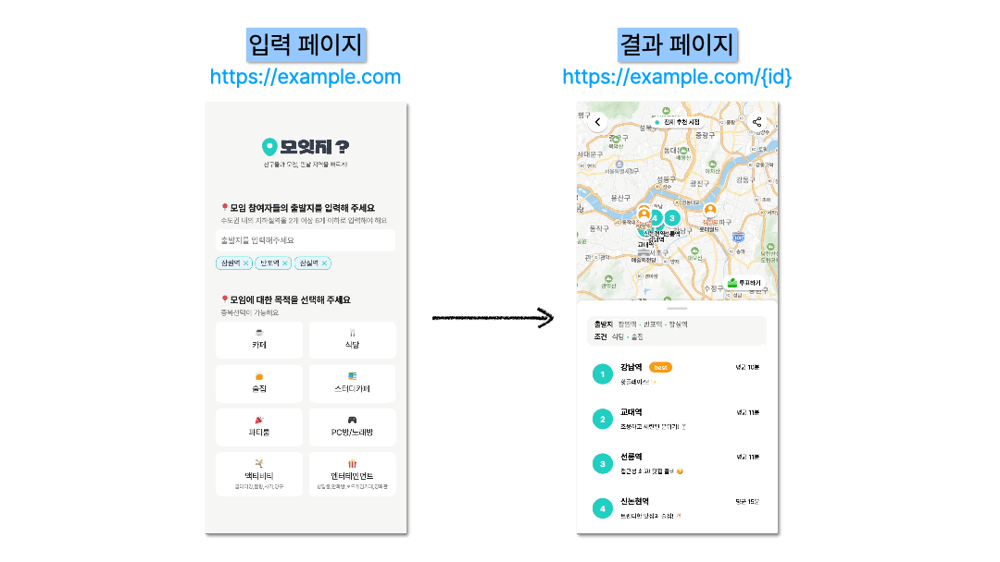

# 프론트엔드에서 에러를 '잘' 다루는 방법


오늘은 '모잇지' 서비스를 개발하며 마주했던 에러 핸들링 경험을 공유하고자 합니다.

우리는 개발을 하며 수많은 에러를 마주합니다. 하지만 에러를 단순히 '고쳐야 할 버그'로만 보고 계시진 않나요? 오늘은 에러를 시스템의 일부로 받아들이고, 어떻게 체계적으로 관리했는지 이야기해 보겠습니다.

## 1. Why: 왜 에러 처리에 집중하게 되었나?

모잇지 서비스를 개발하며 에러 처리의 중요성을 뼈저리게 느꼈습니다. 가장 큰 이유는 서비스가 가진 독특한 구조와 외부 의존성 때문이었습니다.

### 외부 API, 특히 LLM에 대한 높은 의존도

먼저 '모잇지'에 대해 간략히 설명해 드리자면, 수도권 내 지하철을 기반으로 모임 구성원의 출발지와 목적을 분석해 모두에게 공평한 중간 지점과 장소를 추천해 주는 서비스입니다.

이 핵심 기능인 '추천' 과정에서 Gemini API나 Perplexity API와 같은 외부 LLM을 적극적으로 활용하고 있습니다. 문제는 여기서 발생했습니다. 외부 LLM 서비스는 우리의 통제 범위를 벗어나 있었습니다.

- 응답 속도가 느려 타임아웃이 발생하거나

- 서버 상태에 따라 500 에러를 반환하거나

- 예상과 다른 형식의 데이터를 줄 때가 빈번했습니다.

이런 상황에서 단순히 "에러가 났습니다"라고만 띄우는 것은 최악의 사용자 경험이었습니다. 우리는 정확히 어디서 문제가 발생했는지 파악하고, 이를 바탕으로 유저에게 "재시도하세요" 혹은 "다른 방법을 쓰세요"와 같은 명확한 행동 가이드를 주는 것이 필수적이었습니다.

### 모니터링의 부재

초기에는 에러가 발생해도 로그가 명확하지 않았습니다. "사용자가 추천이 안 된대요"라는 피드백을 받아도, 개발자는 "LLM이 문제인지, 네트워크가 문제인지, 프론트 로직이 문제인지" 알 수 없는 답답한 상황이 반복되었습니다.

결국, 안정적인 서비스를 위해서는 체계적인 예외 처리와 에러의 원인을 추적할 수 있는 트래킹 시스템 구축이 필요했습니다.

## 2. What: 에러, 알고 대처하자

본격적인 적용에 앞서, 우리가 다루는 대상이 무엇인지 명확히 정리하고 넘어갔습니다.

### 에러(Error)와 예외(Exception)

흔히 혼용해서 쓰지만, 미묘한 차이가 있습니다.

- 에러(Error): 런타임에 발생하는 문제 그 자체를 담은 객체입니다. (Stack Trace 정보를 포함하여 디버깅의 핵심이 됩니다.)

- 예외(Exception): 정상적인 코드 흐름을 중단시키는 이벤트입니다.

우리는 "적절한 시점에 예외를 발생시켜(throw), 에러 객체를 통해 원인을 파악하고 처리(catch)한다"는 관점으로 접근했습니다.

### 프론트엔드의 에러 분류

프론트엔드에서 발생하는 에러는 크게 두 가지 영역으로 나눌 수 있습니다. 이 구분이 중요한 이유는 에러를 잡는 방법(접근 방식)이 완전히 다르기 때문입니다.

1. 렌더링 중 발생하는 에러

React가 컴포넌트를 그리고(Render), 화면에 반영(Commit)하는 도중에 발생하는 오류입니다. React의 특성상, 여기서 에러가 처리되지 않으면 컴포넌트 트리가 전체 해제되어 화면 전체가 하얗게 변하는(White Screen) 치명적인 상황이 발생합니다.

2. 렌더링 밖에서 발생하는 에러

React의 렌더링 사이클과 무관하게 발생하는 오류들입니다.

- 이벤트 핸들러: 버튼 클릭 등 사용자 상호작용 시 발생하는 오류
- 비동기 로직: API 호출(fetch, axios) 실패
- 기타: setTimeout, 서버 사이드 렌더링(SSR) 등

### 에러 종류별 접근 방법

각긱의 에러 상황에 맞는 접근법이 필요합니다.

#### 접근 방법1: try - catch

명령형 처리 이벤트 핸들러나 비동기 로직은 React의 렌더링 사이클과 무관하게 동작합니다. 따라서 전통적인 try-catch 문을 사용하여 명시적으로 에러를 잡아내야 합니다.

```javascript
const handleClick = async () => {
  try {
    await fetchData();
  } catch (error) {
    // 여기서 에러를 잡아서 사용자에게 알림을 줍니다.
    alert('데이터를 불러오지 못했습니다.');
  }
};
```

#### 접근 방법2: ErrorBoundary

반면, 렌더링 중에 터지는 에러는 try-catch로 잡을 수 없습니다. 이때 등장하는 것이 React의 ErrorBoundary입니다. ErrorBoundary는 하위 컴포넌트 트리에서 발생하는 에러를 포착하여, 깨진 화면 대신 미리 준비해 둔 Fallback UI(에러 화면)를 보여줍니다.

가장 기본적인 형태의 ErrorBoundary 코드는 아래와 같습니다.

```javascript
import React from 'react';

class ErrorBoundary extends React.Component {
  constructor(props) {
    super(props);
    this.state = { hasError: false };
  }

  // 에러가 발생하면 state를 업데이트하여 Fallback UI를 보여줌
  static getDerivedStateFromError(error) {
    return { hasError: true };
  }

  // 에러 정보를 로깅하거나 리포팅 서비스로 전송
  componentDidCatch(error, errorInfo) {
    console.error('Uncaught error:', error, errorInfo);
  }

  render() {
    if (this.state.hasError) {
      // 커스텀 Fallback UI
      return <h1>무언가 잘못되었습니다.</h1>;
    }

    return this.props.children;
  }
}

export default ErrorBoundary;
```

이렇게 감싸주면, 특정 컴포넌트에서 에러가 발생하더라도 전체 앱이 죽지 않고 해당 부분만 에러 처리가 가능해집니다.

## 3. How: 모잇지에서의 에러 핸들링 전략

이제 이론을 바탕으로 모잇지에 실제로 적용한 방법을 소개합니다.

### 3-1. 모잇지의 서비스 플로우

에러를 정의하기 전, 모잇지 서비스의 흐름을 먼저 짚고 넘어가겠습니다.

모잇지의 플로우는 '입력'과 '결과', 크게 두 단계로 나뉩니다.



- 입력 페이지: 사용자가 모임 참여자들의 각 출발지와 모임의 목적(예: 스터디, 회식 등)을 작성합니다.

- 추천 로직 수행: 입력된 데이터를 바탕으로 LLM(Gemini)과 대중교통 API가 최적의 중간 지점을 계산합니다.

- 결과 페이지: 추천된 지역과 상세 장소 정보를 리스트업 하여 보여줍니다.

단순해 보이지만, 2번 단계에서 Gemini(LLM), Perplexity(LLM), Kakao Map 등 다수의 외부 API가 동시에 얽히며 복잡한 예외 상황을 만들어냅니다.

### 3-2. 에러 상황 정의

무작정 코드를 짜기 전, 우리 서비스에서 발생할 수 있는 에러를 식별하고 분류하는 과정이 선행되었습니다. 우리는 서버 팀과 협의하여 에러 코드를 크게 사용자 입력 실수와 외부 시스템 문제로 나누고, 핵심은 "사용자에게 어떤 피드백을 줄 것인가?"였습니다.

#### 1. 클라이언트 입력 예외 (Client Side)

출발지나 모임 조건 등 사용자가 정보를 잘못 입력한 경우입니다. 이는 시스템의 오류가 아니므로, 즉시 직관적인 피드백을 주어 사용자가 스스로 수정할 수 있도록 유도합니다.

#### 2. 외부 API 예외 (Server Side & Third Party)

모잇지의 핵심 기능은 Gemini(LLM)와 Kakao Map API에 의존하고 있습니다. 외부 서비스의 에러는 우리가 통제할 수 없으므로, 즉시 에러 페이지를 띄우고 관리자에게 알림을 보내는 방식으로 처리했습니다.

- LLM (Gemini) 관련 에러
- 지도 정보 (Kakao Map) 관련 에러

이처럼 에러를 "사용자가 해결할 수 있는가?"를 기준으로 나누면, 각 상황에 적절한 UX를 제공할 수 있습니다.

### 3-3. 에러 객체의 역할 분담

이제 이 관점을 코드로 옮기기 위해 복잡한 로직을 걷어내고 '에러 객체'와 '전파 방식'에 집중했습니다.

서버에서 내려오는 수많은 에러 코드를 프론트엔드에서 필요한 두 가지 클래스로 매핑했습니다.

```javascript
// 1. 사용자가 실수한 경우 (Toast용)
class ClientInputError extends Error { ... }

// 2. 시스템이 문제인 경우 (Fallback용)
class ServiceError extends Error { ... }
```

이제 프론트엔드 로직은 에러 코드를 몰라도 됩니다. 오직 "이게 ClientInputError인가?"만 알면 됩니다.

### 3-4. 상황에 따른 UI 분기 처리

이제 컴포넌트에서는 아주 직관적인 흐름을 갖게 됩니다.

핵심은 try-catch와 ErrorBoundary의 역할 분담입니다.

```javascript
const handleRecommendation = async () => {
  try {
    await getRecommendation();
  } catch (error) {
    // 1. Toast로 보여줄 에러라면? -> 여기서 잡아서 토스트 띄우기
    if (error instanceof ClientInputError) {
      showToast(error.message);
      return;
    }

    // 2. 그 외의 에러라면? -> 다시 던져서 ErrorBoundary가 잡게 하기
    throw error;
  }
};
```

- ClientInputError: catch 블록에서 잡아서 토스트를 띄우고 끝냅니다. 사용자는 다시 시도할 수 있습니다.

- ServiceError: throw로 다시 던집니다. 그러면 상위에 있는 ErrorBoundary가 이를 감지하고 에러 페이지(Fallback UI)로 화면을 전환합니다.

### 3-5. 선언적인 에러 처리 (ErrorBoundary)

심각한 에러가 발생했을 때 보여줄 UI는 컴포넌트 내부 로직에서 분리했습니다. React의 ErrorBoundary를 사용하여 선언적으로 처리했습니다.

```javascript
// App.tsx
<ErrorBoundary fallback={<ErrorPage />}>
  <Pages />
</ErrorBoundary>
```

이제 Pages 내부에서 throw된 ServiceError는 자동으로 <ErrorPage />를 보여주게 됩니다. 개발자는 비즈니스 로직 안에서 "에러 페이지로 이동시킨다"는 코드를 작성할 필요가 없어졌습니다.

## 4. So: 무엇이 좋아졌나?

이렇게 구조를 단순화하니 다음과 같은 이점을 얻었습니다.

- 코드가 읽기 쉬워짐: 복잡한 에러 코드 분기 처리가 사라지고, Toast냐 Throw냐만 남았습니다.

- 일관된 사용자 경험: 어떤 에러가 발생하든 사용자는 "수정 요청(Toast)" 혹은 "시스템 안내(Fallback)" 중 하나의 명확한 피드백을 받습니다.

- 유지보수 용이: 새로운 에러가 추가되어도, 그것이 'Toast용'인지 'Fallback용'인지만 정의하면 별도 UI 수정 없이 처리가 가능합니다.

## 마치며

"복잡함은 줄이고, 명확함은 남기자."

에러 핸들링을 개선하며 얻은 가장 큰 교훈입니다. 기술적인 구현보다 중요한 것은 "사용자가 이 상황을 어떻게 받아들여야 하는가"를 정의하는 것이었습니다.

여러분의 프로젝트에서도 에러 코드를 나열하기보다, "사용자에게 어떤 경험을 줄 것인가"를 먼저 고민해 보시길 추천합니다.

감사합니다.

## 참고자료

- [Error - JavaScript | MDN](https://developer.mozilla.org/en-US/docs/Web/JavaScript/Reference/Global_Objects/Error)
- [Errors vs Exceptions in JS | stackoverflow](https://stackoverflow.com/questions/75636288/errors-vs-exceptions-in-js-are-there-exceptions-in-javascript)
- [Exception | MDN](https://developer.mozilla.org/en-US/docs/Glossary/Exception)
- [Error Boundaries](https://legacy.reactjs.org/docs/error-boundaries.html)
- [토스 SLASH21 프론트엔드 웹 서비스에서 우아하게 비동기 처리하기](https://velog.io/@devjeenie/%EC%9A%B0%EC%95%84%ED%95%98%EA%B2%8C-%EB%B9%84%EB%8F%99%EA%B8%B0-%EC%B2%98%EB%A6%AC%ED%95%98%EA%B8%B0)
- [프론트엔드 에러 핸들링 전략](https://blog.review-me.page/blog/fe-error-handleing)
- [백엔드 개발자의 웹 프론트엔드 개발기| 우아한형제들 기술 블로그](https://techblog.woowahan.com/2683/)
- [선언적으로 에러처리하기 | velog](https://velog.io/@mmmdo21/%EC%84%A0%EC%96%B8%EC%A0%81%EC%9C%BC%EB%A1%9C-%EC%97%90%EB%9F%AC%EC%B2%98%EB%A6%AC%ED%95%98%EA%B8%B0react-error-boundary)
- https://happysisyphe.tistory.com/52
- https://happysisyphe.tistory.com/66
