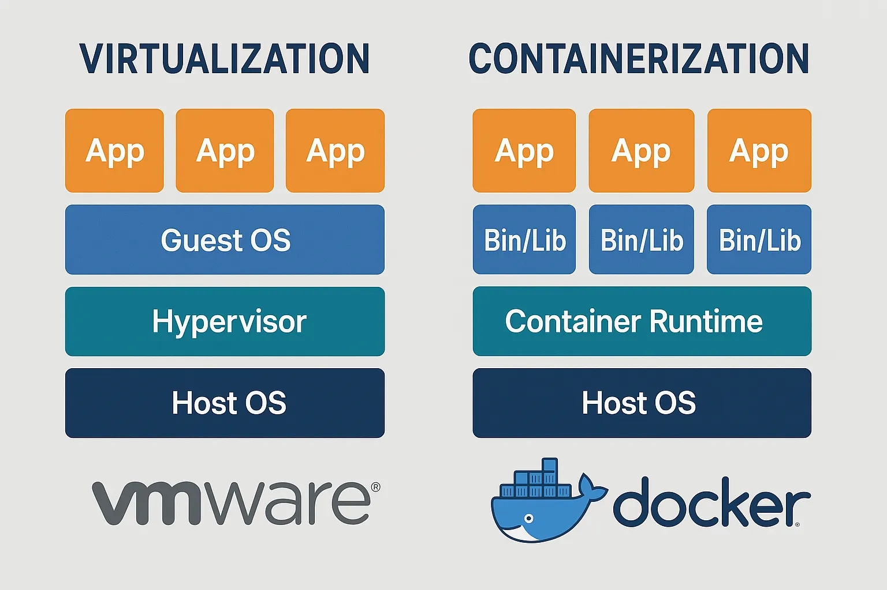
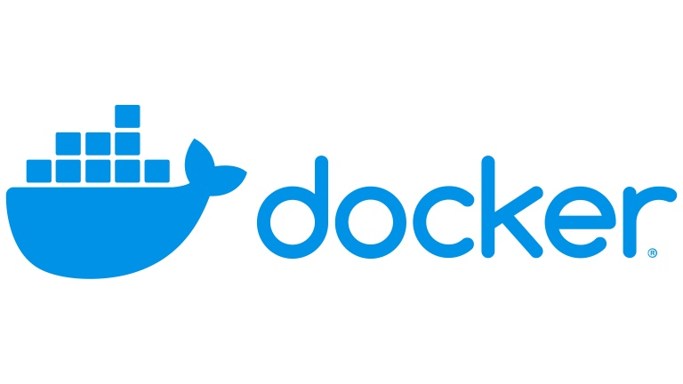
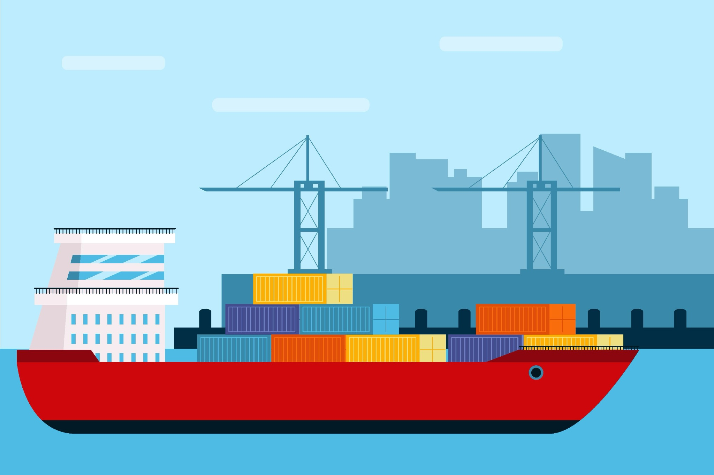
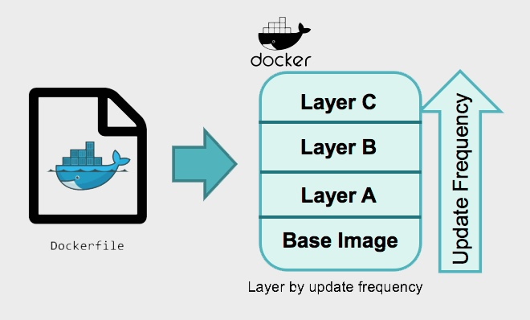

# 왜 도커를 사용하는가

## 도커 도입 배경

팀 프로젝트에서 CI/CD(Continuous Integration/Continuous Deployment, 지속적 통합 및 배포) 기반 배포 자동화를 구축하면서 중요한 과제를 마주했습니다. 개발, 테스트, 운영 환경에서 애플리케이션이 동일하게 동작하도록 보장하는 문제였습니다.

개발 환경에서 정상적으로 작동하던 애플리케이션이 운영 서버에서는 다르게 동작하거나 오류가 발생하는 경우가 있었습니다. 라이브러리 버전 차이, 운영체제 차이, 환경 변수 설정 차이 등이 원인이었습니다.

도커(Docker)를 도입하여 애플리케이션을 실행 환경과 함께 패키징했습니다. 패키징한 애플리케이션은 어느 서버에서든 동일하게 배포하고 실행할 수 있었습니다.

---

## 도커에 대한 흔한 오해

도커를 가벼운 가상머신(Virtual Machine, VM)이라고 생각하는 경우가 많습니다. 기존 가상머신처럼 격리된 환경을 제공하면서도 더 가볍고 빠르게 동작한다는 인상 때문입니다.

명령어 한 줄로 서버나 데이터베이스를 실행하는 경험은 가상머신과 유사해 보입니다. 하지만 도커와 가상머신은 동작 원리가 근본적으로 다릅니다.

---

## 가상머신과 도커의 차이: 게스트 운영체제



가상머신과 도커의 결정적인 차이는 게스트 운영체제(Guest OS) 포함 여부입니다.

가상머신은 호스트 운영체제 위에 하이퍼바이저를 통해 가상 하드웨어를 만들고, 그 위에 독립된 운영체제를 설치합니다. 하이퍼바이저는 CPU, 메모리 같은 물리 자원을 분할하여 여러 개의 가상 환경을 만드는 소프트웨어입니다. 각 가상머신은 자체 커널을 포함한 완전한 운영체제를 실행하므로, 시작 시간이 수 분 정도 소요되고 수 GB 이상의 디스크 공간을 차지합니다.

도커 컨테이너는 별도의 운영체제를 설치하지 않습니다. 호스트 운영체제의 커널을 공유하며, 프로세스를 논리적으로 격리합니다. 커널은 운영체제의 핵심으로, 하드웨어와 소프트웨어 간 통신을 담당합니다. 컨테이너는 애플리케이션과 필요한 라이브러리만 포함하므로 시작 시간이 수 초 이내이고 디스크 공간도 수십 MB에서 수백 MB 정도만 사용합니다.



도커는 운영체제를 통째로 실행하는 단독 주택이 아니라, 건물의 기반 시설(커널)은 공유하되 각 세대가 완벽히 분리된 아파트와 같습니다. 도커 로고에 고래가 여러 개의 컨테이너를 싣고 있는 모습은 이러한 구조를 나타냅니다.

---

## 컨테이너의 개념

도커는 가상머신을 만드는 기술이 아니라 애플리케이션을 격리하는 컨테이너 기술을 편리하게 사용하도록 돕는 플랫폼입니다.



컨테이너는 항구의 화물선에 실린 표준 규격 컨테이너와 유사합니다. 화물 컨테이너가 내용물과 관계없이 규격화되어 어디서든 동일하게 운송되는 것처럼, 소프트웨어 컨테이너는 애플리케이션이 어떤 환경으로 이동하더라도 동일하게 실행될 수 있도록 격리된 실행 공간을 제공합니다.

컨테이너 덕분에 "제 컴퓨터에서는 잘 되는데요?"라는 문제를 해결할 수 있습니다.

---

## 도커 이미지 구성

컨테이너는 이미지(Image)라는 템플릿으로부터 생성됩니다. 이미지는 컨테이너 실행에 필요한 모든 것을 담고 있는 읽기 전용 템플릿입니다.

Java와 Spring Boot 애플리케이션을 기준으로 이미지 구성 요소를 살펴보겠습니다.

- 애플리케이션 실행 파일(JAR/WAR)

    Maven이나 Gradle로 빌드하여 생성한 실행 가능한 .jar 파일입니다. 예를 들어 my-application-0.0.1-SNAPSHOT.jar 파일이 여기에 해당합니다.


- 자바 런타임(JVM)

    .jar 파일을 실행하기 위한 자바 가상 머신입니다. 이미지에는 OpenJDK 21 같은 특정 버전의 JDK 또는 JRE가 설치되어 있습니다.


- 운영체제 파일 및 시스템 도구

    JVM 동작에 필요한 최소한의 운영체제 파일입니다. Java 애플리케이션은 운영체제 의존성이 낮아서 Alpine Linux나 distroless 같은 경량 운영체제 이미지를 베이스로 사용하는 경우가 많습니다.


- 설정 파일 및 환경 변수
    Spring Boot 애플리케이션 동작을 제어하는 application.properties 또는 application.yml 파일입니다. 데이터베이스 접속 정보, 서버 포트, 외부 API 키 등을 환경 변수로 설정할 수 있습니다.


- 시작 명령어(Startup Command)
    컨테이너가 시작될 때 자동으로 .jar 파일을 실행하는 명령어입니다. `java -jar my-application-0.0.1-SNAPSHOT.jar`와 같은 형태입니다.


이미지를 다운받고 실행하는 것만으로 컨테이너를 실행할 수 있습니다.

---

## 레이어 구조의 효율성



도커 이미지는 레이어(Layer)라는 독특한 구조를 가집니다. 이미지는 하나의 거대한 파일이 아니라 여러 개의 얇은 층이 쌓인 형태입니다.

유니온 파일 시스템(Union File System)이라는 기술을 통해 구현되며, 각 레이어는 바로 아래 레이어로부터 변경된 부분만 담고 있습니다.

### Dockerfile과 레이어 생성

Dockerfile의 각 명령어는 기본적으로 하나의 레이어를 생성합니다.

```dockerfile
# 1. 베이스 이미지 레이어
FROM openjdk:21-jdk

# 2. 빌드 시 사용할 변수 정의
ARG JAR_FILE=/build/libs/*.jar

# 3. JAR 파일을 app.jar로 복사하는 레이어
COPY ${JAR_FILE} app.jar

# 4. 컨테이너 시작 명령어 설정
ENTRYPOINT ["java","-Dspring.profiles.active=prod","-Djava.net.preferIPv4Stack=true","-jar","/app.jar"]
```

*토독토독 서비스의 Dockerfile.prod*

위 Dockerfile로 이미지를 빌드하면 각 단계가 별도의 레이어로 쌓입니다.

`FROM openjdk:21-jdk` 명령어는 openjdk:21-jdk 이미지가 가진 모든 레이어를 가져와 기초로 사용합니다.

`COPY ${JAR_FILE} app.jar` 명령어는 파일 시스템에 app.jar 파일을 추가하므로 새로운 레이어를 생성합니다. 이 레이어에는 app.jar 파일만 포함됩니다.

`ARG`와 `ENTRYPOINT`는 레이어를 만들지 않습니다. `ARG`는 빌드 과정에서만 사용되는 변수이고, ENTRYPOINT는 이미지의 실행 방법을 정의하는 메타데이터입니다. 파일 시스템을 직접 변경하지 않는 명령어는 새로운 레이어를 생성하지 않습니다.

소스 코드가 변경되어 `COPY` 명령어만 다시 실행해야 할 경우, 도커는 `FROM` 단계의 기존 레이어를 재사용(캐싱)하고 변경된 `COPY` 단계부터 새로운 레이어를 만듭니다. 빌드 속도가 빨라지는 이유입니다.

### 컨테이너 실행과 쓰기 가능 레이어

이미지는 여러 개의 읽기 전용 레이어로 구성된 설계도입니다. 읽기만 가능한 이미지로부터 애플리케이션이 로그를 남기거나 파일을 수정하는 실행이 가능한 이유는 컨테이너가 실행될 때 추가되는 쓰기 가능한 레이어 때문입니다.

이미지로 컨테이너를 실행(`docker run`)하면, 도커는 읽기 전용 이미지 레이어들 위에 쓰기 가능한(Writable) 레이어를 하나 추가합니다.

컨테이너가 파일을 읽을 때는 아래쪽의 읽기 전용 레이어에서 데이터를 가져옵니다. 컨테이너 안에서 파일을 수정하거나 새로운 파일을 생성하면, 변경 사항은 맨 위의 쓰기 가능한 레이어에만 기록됩니다.

이 방식을 Copy-on-Write(CoW)라고 부릅니다. 원본 이미지 레이어는 건드리지 않고, 변경이 필요할 때만 해당 파일을 쓰기 가능한 레이어로 복사한 뒤 수정합니다. 원본 이미지는 항상 보존되며, 하나의 이미지로부터 수백 개의 컨테이너를 실행해도 원본은 하나만 존재합니다.

---

## 실제 프로젝트 적용 사례

프로젝트에서는 배포 자동화를 위해 GitHub Actions를 사용했습니다. CI Job에서는 코드를 테스트하고 빌드하여 Docker 이미지를 만들어 Docker Hub에 업로드합니다. CD Job에서는 서버에서 이미지를 받아 실행합니다.

```yaml
name: Backend CI/CD

on:
  push:
    branches: [ "main" ]
    paths:
      - 'backend/**'

jobs:
  ci:
    runs-on: ubuntu-latest

    defaults:
      run:
        shell: bash
        working-directory: ./backend

    permissions:
      contents: read

    steps:
      - name: Checkout repository
        uses: actions/checkout@v4
        with:
          fetch-depth: 0
          submodules: recursive
          token: ${{ secrets.SECRETS_SUBMODULE_ACCESS_TOKEN }}

      - name: Set up JDK 21
        uses: actions/setup-java@v3
        with:
          java-version: '21'
          distribution: 'temurin'
          cache: gradle

      - name: Grant execute permission to gradlew
        run: chmod +x gradlew

      - name: Clean Project
        run: ./gradlew clean

      - name: Run Unit Tests
        run: ./gradlew test

      - name: Assemble Build
        run: ./gradlew build

      - name: Login to Docker Hub
        uses: docker/login-action@v3.3.0
        with:
          username: ${{ secrets.DOCKERHUB_DEPLOY_USERNAME }}
          password: ${{ secrets.DOCKERHUB_DEPLOY_TOKEN }}

      - name: Docker Image Build & Push
        run: |
          docker buildx build -f Dockerfile.prod --platform linux/arm64 -t woowajeff/todoktodok:prod --push .

  cd:
    needs: ci
    runs-on: [self-hosted, prod]
    steps:
      - name: Cleanup backend log and promtail data directory before checkout
        run: |
          sudo rm -rf backend/promtail_data || true
          sudo rm -rf backend/log || true

      - name: Checkout repository
        uses: actions/checkout@v4
        with:
          token: ${{ secrets.SECRETS_SUBMODULE_ACCESS_TOKEN }}

      - name: Login to Docker Hub
        uses: docker/login-action@v3.3.0
        with:
          username: ${{ secrets.DOCKERHUB_DEPLOY_USERNAME }}
          password: ${{ secrets.DOCKERHUB_DEPLOY_TOKEN }}

      - name: Stop running Container (without removing)
        run: |
          echo "prod 컨테이너 중지 중..."
          docker stop prod && echo "prod 컨테이너 중지 완료" || echo "prod 컨테이너 없음"
          echo "promtail_prod 컨테이너 중지 중..."
          docker stop promtail_prod && echo "promtail_prod 컨테이너 중지 완료" || echo "promtail_prod 컨테이너 없음"

      - name: Docker Compose Pull & Up (no-build)
        env:
          ENV_ID: ${{ github.run_id }}
        run: |
          cd backend
          echo "ENV_ID: $ENV_ID"
          docker compose -f config/docker-compose-prod.yml pull
          docker compose -f config/docker-compose-prod.yml up -d --no-build
          echo "docker compose-prod up"

      - name: Docker image Prune
        run: |
          echo "24시간 이상 사용되지 않은 Docker 이미지 정리 중..."
          sudo docker image prune -f --filter "until=24h"
          echo "이미지 정리 완료"
```

*backend-ci-cd-prod.yml*

도커를 도입하여 스크립트를 간결하게 작성할 수 있었습니다.

### 도커를 사용하지 않는 경우의 복잡성

도커를 사용하지 않고 .jar 파일만으로 배포한다면 CD Job은 다음과 같은 작업을 수행해야 합니다.

#### 1. 빌드 결과물 전달 방식 변경

현재 CI Job은 빌드가 끝난 환경 전체(jar + JVM + OS)를 `docker push` 명령어로 Docker Hub에 업로드합니다.

도커를 사용하지 않으면 CI Job 마지막에 `.jar` 파일을 `upload-artifact`를 사용해 GitHub 저장소에 업로드해야 합니다. CD Job에서는 `download-artifact`로 파일을 서버에 다운로드해야 합니다.

#### 2. 서버 환경 동기화 문제

현재 Dockerfile에 `FROM openjdk:21`이 명시되어 있으므로, 어떤 서버에서 실행하든 항상 JDK 21 환경이 보장됩니다.
    
도커를 사용하지 않으면 CD를 실행하는 self-hosted 서버에 JDK 21이 미리 설치되어 있어야 합니다. JDK 17이 설치되어 있거나 다른 시스템 라이브러리 버전이 맞지 않으면 배포가 실패합니다. 

  Java 버전을 22로 업그레이드하려면 코드 수정뿐만 아니라 서버의 Java를 수동으로 업그레이드해야 합니다.

#### 3. 프로세스 관리 복잡성

현재 `docker compose up -d` 명령어 하나가 모든 것을 처리합니다. 기존 컨테이너를 중지하고, 새로운 이미지를 받아 새 컨테이너를 시작하는 전 과정이 원자적으로(atomically) 이루어집니다.

도커를 사용하지 않으면 CD Job 스크립트에 여러 셸 명령어를 직접 작성해야 합니다.


  - 기존 프로세스 PID를 찾기 위해 `ps -ef | grep 'java -jar todoktodok.jar' | grep -v grep | awk '{print $2}'`와 같은 명령어를 실행해야 합니다.
  - 기존 프로세스를 종료하기 위해 `kill -15 [PID]` 명령어를 사용해야 합니다. 프로세스가 즉시 종료되지 않을 경우를 대비해 `sleep`을 추가하거나 강제 종료(`kill -9`) 로직을 작성해야 합니다.
  - 새로운 프로세스를 실행하기 위해 `nohup java -jar todoktodok.jar &`와 같은 명령어로 백그라운드 실행을 설정해야 합니다.
  - Promtail도 별도의 프로세스이므로 systemd 같은 서비스로 등록하거나 PID를 찾아 수동으로 관리해야 합니다.


#### 4. 롤백 어려움

현재 배포에 문제가 생기면 이전 버전의 이미지 태그(예: woowajeff/todoktodok:prod-v1.1)를 다시 pull 받아 `docker compose up`을 실행하면 즉시 롤백됩니다.

도커를 사용하지 않으면 서버에 이전 버전의 .jar 파일(todoktodok-v1.1.jar)을 보관해야 하며, 롤백 스크립트를 별도로 작성해야 합니다. 버전 관리가 복잡해집니다.

---

## 마치며

도커를 도입하고 얻은 가장 큰 변화는 '본질에 집중할 시간'을 확보한 것입니다.

개발자들은 환경 설정, 의존성 충돌, 복잡한 배포 스크립트와의 씨름에서 벗어나, 온전히 서비스의 비즈니스 로직을 고민하고 더 나은 코드를 작성하는 데 시간을 쓸 수 있었습니다.

결국 도커는 개발자가 인프라의 복잡함에 얽매이지 않고, 더 중요한 문제에 집중할 수 있도록 도와주는 강력하고 필수적인 도구라고 할 수 있습니다. 
이 글이 여러분의 프로젝트에 도커를 적용하는 데 작은 도움이 되었기를 바랍니다.

---

## 참고 자료

- Docker 공식 문서: https://docs.docker.com/get-started/
- GitHub Actions 가이드: https://docs.github.com/en/actions/tutorials/publish-packages/publish-docker-images
