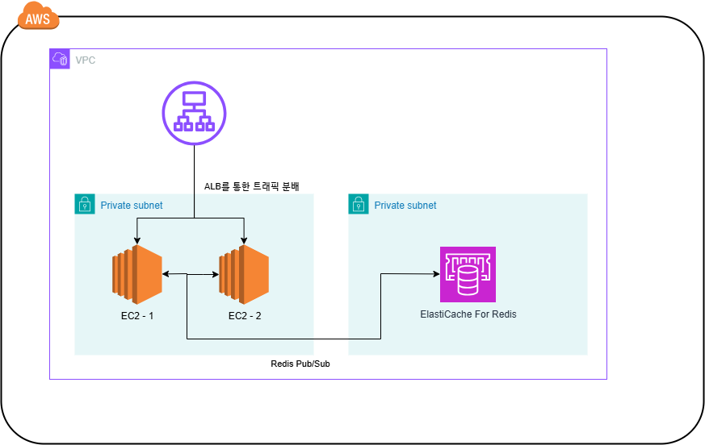
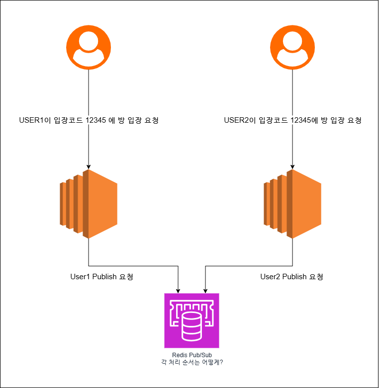
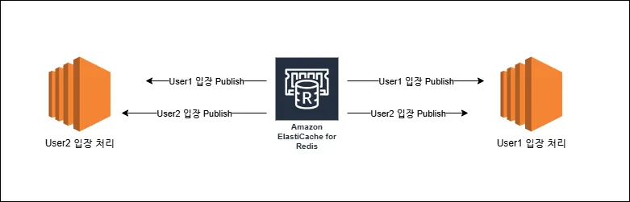
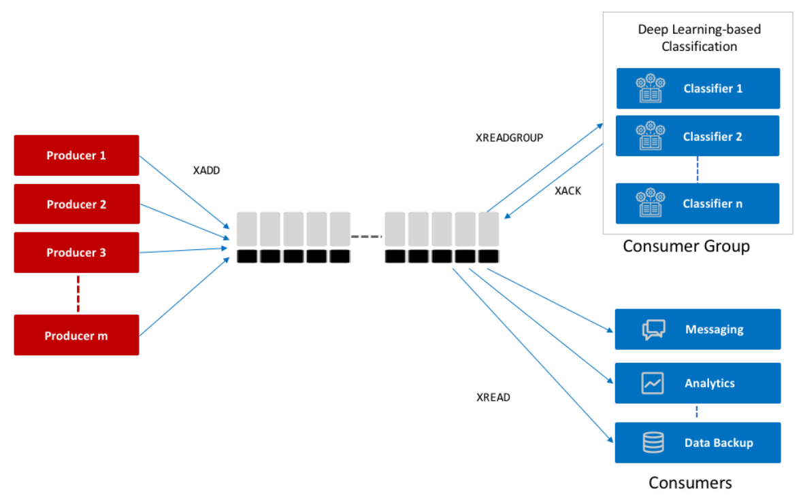
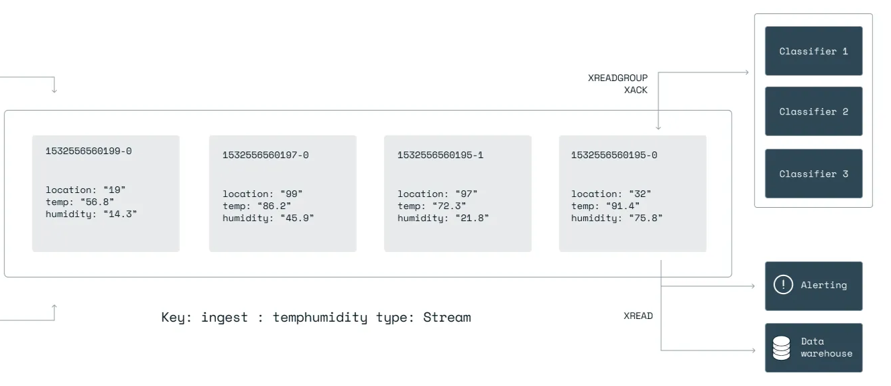
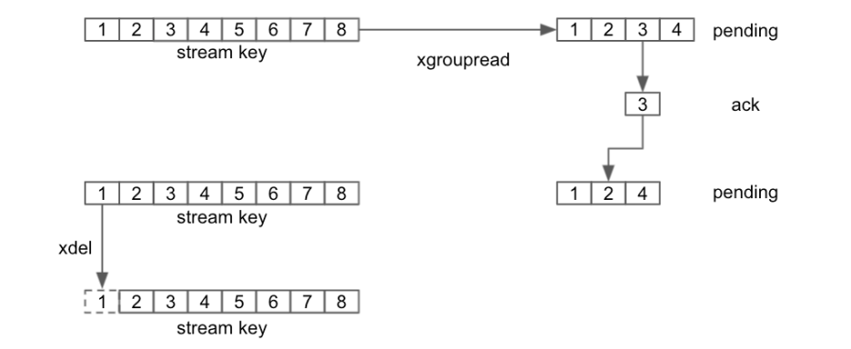
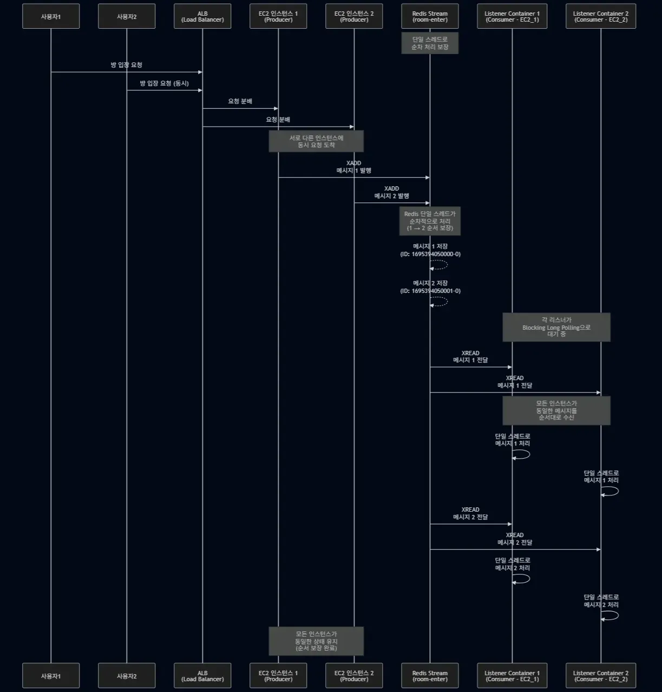
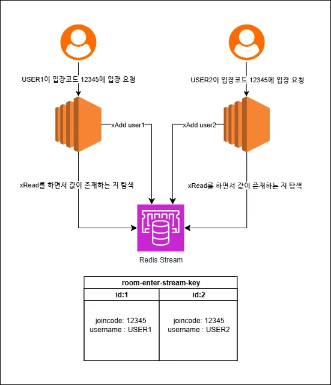

# 커피빵 Redis Stream 도입기

현재 우아한테크코스에서 팀 프로젝트인 커피빵 서비스에 Redis Stream을 도입기를 작성하고자 합니다.

커피빵 서비스는 웹소켓을 사용한 실시간 게임 서비스입니다. 레벨 4에 들어가서 사용자가 많아지면 어떻게 처리할 것인가에 대해 고민하였고, 수평 확장이라는 선택 아래에서 다음과 같은 구조로 설계했습니다.



현재 커피빵 서비스는 여러 대의 인스턴스를 활용해서 수평 확장을 하였습니다. ALB를 활용해서 사용자들을 적절하게 분배하게 됩니다. 

하나의 방이 생성되었을 때, 방장(방을 생성한 사람)이 연결된 인스턴스에만 사용자가 입장하는 것이 아니라, 각기 다른 인스턴스에서도 접속할 수 있습니다. 하나의 인스턴스에 몰리는 것을 방지하고자 다음과 같은 방법을 사용하였습니다.

서로 다른 인스턴스에 연결되었기에 서로의 상태를 알 수 없습니다. 이러한 상태 불일치를 해소하기 위해 Redis Pub/Sub을 활용했습니다.

](images/redis_pub_sub.png)

각 인스턴스가 Redis를 구독(Subscribe)하며, 상태 변경이 필요할 때 이벤트를 발행(Publish)하여 모든 구독 인스턴스가 함께 상태를 갱신함으로써 데이터 일관성 문제를 해소했습니다.

그러나 Redis Pub/Sub에도 다음과 같은 한계가 존재합니다.

### 영속성 문제

Redis Pub/Sub은 기본적으로 fire-and-forget 방식입니다. Redis는 메시지를 구독자들에게 전달 후 삭제합니다.  따라서 메시지가 유실될 수 있습니다.

메시지가 유실될 수 있는 상황은 다음과 같습니다.

- 메시지를 발행했지만 구독된 클라이언트가 없는 경우
- 클라이언트가 연결이 끊겼을 때

만약 중요한 메시지이거나 메시지 유실이 허용되지 않는 시스템에는 적합하지 않습니다. 

 

### 피드백 메커니즘 문제

재처리 문제는 영속성 문제의 직접적인 결과입니다. Redis 내부에서 메시지가 사라지기 때문에, 해당 메시지 처리가 성공했는지 실패했는지에 대한 피드백 메커니즘이 없습니다. 유실되었다면, 개발자가 실패 원인을 파악하고 재처리해야 합니다.

### 동시성 문제

이번에 Redis Stream을 추가한 근본적인 이유입니다. 

문제 상황은 아래 그림과 같습니다.



만약 게임 방 자리가 하나 밖에 없는데, 서로 다른 인스턴스에서 방 입장 요청을 동시에 한다면 어떻게 될까요?



Redis는 단일 스레드로 동작하기 때문에 내부에서는 순차 처리가 가능하지만, 네트워크와 클라이언트의 처리 속도에 따라 다른 결과가 나올 수 있습니다. 그렇게 된다면 인스턴스들의 데이터 일관성을 보장할 수 없게 됩니다.

이러한 문제점을 해소하기 위해 Redis Stream을 도입하게 되었습니다.

아래는 Redis Pub/Sub과 비교하여 Redis Stream이 가지고 있는 차이점을 정리한 표입니다.

| 특징 | Redis Stream | Redis Pub/Sub |
| --- | --- | --- |
| **메시지 영속성** | **O** (메시지를 Redis에 저장) | **X** (메시지를 저장하지 않음) |
| 메시지 ID | **O** (고유한 ID로 순서 보장) | **X** (별도 ID 없음) |
| 메시지 재처리 | **O** (처리 실패 시 재처리 가능) | **X** (메시지 유실 시 복구 불가능) |
| 확인 응답(ACK) | **O** (소비자가 처리 완료를 알림) | **X** (확인 메커니즘 없음) |
| 적합한 용도 | **영속성과 신뢰성이 중요한 시스템** (로그, 이벤트 소싱, 대기열) | **실시간성이 중요한 시스템** (채팅, 알림, 즉각적인 데이터 전송) |
| 부하 분산 | **O** (소비자 그룹을 통한 부하 분산) | **X** (모든 구독자에게 메시지 방송) |
| 메시지 처리 방식 | **Pull 방식** (소비자가 메시지를 가져감) | **Push 방식** (Redis가 구독자에게 푸시) |

영속성보다 실시간성이 더 중요하다면 Redis Pub/Sub을 사용하고, 그것이 아니고 순서 보장과 재처리가 필요로 한다면 Redis Stream을 활용한다면 좋을 것 같습니다.

## Redis Stream 말고 다른 기술은 없을까?

Redis Stream 말고도 메시지 브로커 시스템은 유명한 것이 많습니다. 대표적으로는 Kafka와 RabbitMQ입니다.

커피빵에서는 다음과 같은 이유로 Redis Stream을 선택했습니다.

### 기존 시스템과의 병합

Redis를 이미 사용하고 있었기 때문에 추가적인 시스템 구축을 할 필요가 없습니다. 기존 시스템을 재사용해 환경 구축에 대한 시간과 추가적인 비용을 아낄 수 있게 됩니다. 

### 빠른 속도

Redis는 메모리 기반 데이터베이스이며 싱글 스레드 아키텍처를 사용하여 빠른 처리가 가능합니다. 반면, RabbitMQ와 Kafka는 메시지를 디스크에 저장하므로 상대적으로 오버헤드가 있습니다. Redis는 단일 스레드로 순차 처리되기 때문에 락이나 컨텍스트 스위칭에 따른 동시성 문제도 줄일 수 있습니다. I/O 멀티플렉싱 기술 덕분에 IO가 블로킹되지 않고 다른 요청과 응답도 바로 처리할 수 있는 이점이 있습니다.

빠른 반응 속도가 필요한 서비스인 만큼 Redis를 최대한 활용하는 것이 적절하다고 판단하였습니다.

### 복잡도

RabbitMQ는 웹소켓의 STOMP 플러그인을 공식적으로 지원하여 설정과 관리가 비교적 간단합니다. 커피빵은 웹소켓 기반 기능이 많아 처음에는 적합해 보였습니다. 그러나 AMQP 프로토콜 학습과 추가 작업이 필요했고, HTTP 통신 지원에도 별도 작업이 요구되어 현재는 사용하지 않기로 결정했습니다.

Kafka는 별도의 게이트웨이와 커넥터를 구축하고 여러 브로커를 관리해야 하므로 구조가 복잡합니다. 현재 커피빵 서비스에서는 이러한 처리가 필요하지 않아 Kafka는 적합하지 않다고 판단했습니다.

정리된 표는 다음과 같습니다.

| 기술 | 저장 방식 | 지연(Latency) | 구조/복잡도 | 웹소켓 STOMP 지원 | Redis 사용 여부 | 적합한 용도 |
| --- | --- | --- | --- | --- | --- | --- |
| **Redis Stream** | 메모리 + 영속 옵션 | 매우 낮음, 실시간 처리 가능 | 단순, 기존 Redis 재사용 가능 | 직접 구현 가능 | 이미 사용 중 | 실시간 알림, 빠른 응답이 필요한 서비스 |
| **RabbitMQ** | 디스크 기반 | 낮음~중간, AMQP 오버헤드 존재 | 간단, 관리 용이 | 공식 STOMP 지원 | 별도 필요 | 웹소켓 기반 메시지, 소규모/중규모 이벤트 |
| **Kafka** | 디스크 기반 | 중간, 디스크 기록/ack 지연 있음 | 구조 복잡, 운영 비용 높음 | 직접 구현 가능 | 별도 필요 | 로그 수집, 대용량 이벤트 파이프라인, 스트리밍 처리 |

종합하자면, 커피빵에서는 빠른 속도와 단순한 구조, 기존 Redis 활용 가능성 때문에 Redis Stream이 적합하다고 보았습니다.

## 설정하기

Redis Stream은 Redis Pub/Sub과 달리 소비자가 메시지를 가져가는 구조이기에 메시지가 존재하는지 탐색해야 합니다. 이때 스케줄링 방식으로 메시지를 읽고 처리하는 구조를 만들 수도 있습니다.

```java
@Scheduled(fixedDelay = 5000)
public void pollMessages() {
List<MapRecord<String, Object, Object>> messages =
        redisTemplate.opsForStream().read(
                StreamReadOptions.empty().count(10).block(Duration.ofSeconds(2)),
                StreamOffset.create(streamKey, ReadOffset.lastConsumed())
        );

if (messages != null) {
	// 메시지 처리 후 ACK 요청...
}
```

해당 방식은 단순해보이지만, 수동으로 ACK 요청과 재시도를 직접 구현해야 하기 때문에 코드가 복잡해지고 반복될 수 있습니다. 폴링 간격이 짧으면 Redis에 부하를 주고, 길면 메시지 지연이 발생하게 됩니다. 이러한 방식은 실시간성을 보장하기 어렵게 만듭니다.

이러한 문제를 해소하기 위해 `StreamMessageListenerContainer`를 활용합니다. (이하 ‘스트림 컨테이너’라 부르겠습니다) 스트림 컨테이너는 Blocking Long Polling 방식을 지원합니다. Long Polling은 연결을 유지하다가 새로운 데이터가 생기면 즉시 응답하기에 실시간성을 챙길 수 있습니다. Blocking은 스레드가 요청한 동안 대기 상태에 들어가게 됩니다. 다른 작업을 수행하지 않고 대기하므로, 이러한 특성이 실시간성을 확보하는 데 도움이 됩니다.

```java
@Bean
public StreamMessageListenerContainer<String, ObjectRecord<String, String>> roomEnterStreamContainer(
        RedisConnectionFactory redisConnectionFactory) {
    StreamMessageListenerContainerOptions<String, ObjectRecord<String, String>> options = StreamMessageListenerContainerOptions
            .builder()
            .batchSize(10) // 한 번에 처리할 메시지 수
            .executor(roomEnterThreadExecutor()) // 스레드 설정
            .pollTimeout(Duration.ofSeconds(2)) // 폴링 주기
            .targetType(String.class)
            .build();

    StreamMessageListenerContainer<String, ObjectRecord<String, String>> container = StreamMessageListenerContainer.create(
            redisConnectionFactory, options);

    container.start();
    return container;
}
```
`batchSize`는 하나의 요청으로 여러 메시지를 한 번에 가져와 처리할 수 있게 해주는 설정입니다. 시간 순서대로 쌓이는 메시지들을 한 번에 몇 개씩 가져올지 정하는 것이죠. 크기를 작게 설정하면 가져오는 크기가 작은 만큼 메시지 처리가 빨라 지연 시간이 단축됩니다. 하지만 전체 처리량과 네트워크 I/O 횟수가 많아지는 만큼 성능에서 손해를 볼 수 있으므로, 서비스의 특성에 맞는 적절한 값을 찾는 것이 중요합니다.

`executor`를 사용하면 스레드의 개수, 이름 등을 세밀하게 제어할 수 있습니다. 처리량에 맞게 스레드 개수를 설정해서 시스템의 부하를 최적화할 수 있습니다. 커피빵은 순서 보장이 필요한 경우에는 단일 스레드로 처리하였습니다.

```java
private ThreadPoolTaskExecutor roomEnterThreadExecutor() {
    ThreadPoolTaskExecutor ex = new ThreadPoolTaskExecutor();

    ex.setCorePoolSize(1); // 순서 보장을 위해 단일 스레드
    ex.setMaxPoolSize(1);
    ex.setQueueCapacity(100);
    ex.setThreadNamePrefix("redis-room-enter-");
    ex.setWaitForTasksToCompleteOnShutdown(true);
    ex.setAwaitTerminationSeconds(10);
    ex.initialize();

    return ex;
}
```
스레드를 여러 개 사용하게 된다면 병렬적으로 작업을 처리하게 되기 때문에 애플리케이션 레벨에서 순서 보장이 안 될 수 있습니다. 이를 해결하기 위해서는 락을 사용할 수도 있지만, 블로킹으로 인한 CPU 낭비와 데드락 위험이 있기 때문에 단일 스레드를 활용했습니다.

`pollTimeout`은 롱 폴링을 구현하는 핵심 설정입니다. Stream에 메시지가 없을 때 무작정 재요청하는 대신, 설정된 시간만큼 대기하여 시스템 효율을 높입니다. 너무 짧게 설정하면 불필요한 요청이 많아져 서버와 클라이언트의 CPU 부하를 증가시키고, 너무 길게 설정하면 중간의 네트워크 장비(방화벽 등)가 유휴 연결로 판단해 접속을 끊어버려 장애를 즉시 인지하지 못할 수 있습니다. Spring Data Redis 라이브러리의 기본값은 대부분의 환경에서 효율적인 2초로 설정되어 있습니다.

이 외에도 중앙 예외 처리를 위한 `errorHandler` 와 원하는 타입으로 변환하는 `targetType` 과 같은 설정이 있으니 알아두면 좋을 것 같습니다.

[Spring Docs : StreamMessageListenerContainerOptionsBuilder](https://docs.spring.io/spring-data/redis/reference/3.4-SNAPSHOT/api/java/org/springframework/data/redis/stream/StreamMessageListenerContainer.StreamMessageListenerContainerOptionsBuilder.html)

## Producer-Consumer


*출처: [Devopedia, "Redis Streams"](https://devopedia.org/redis-streams)*

설정이 완료되었다면, 이제 Redis Stream을 사용하기 위해 두 개의 역할을 지정해야 합니다.

Producer는 XADD 명령어를 통해서 Stream에 데이터(Record)를 추가합니다. 이때, Stream-key를 지정해서 작업을 하게 되는데 Redis Stream에서는 여러 개의 Stream으로 나누어서 작업을 할 수 있습니다.

커피빵에서는 `Spring-Data-Redis` 라이브러리를 사용하기에 스프링이 지원하는 RedisTemplate을 활용해 해당 작업을 직접 명령어 입력 없이 사용할 수 있었습니다.

```java
// Converter를 사용해서 Event를 플랫 Map으로 변환
Map<String, String> flatMap = roomJoinEventConverter.toFlatMap(event);
 
 RecordId recordId = stringRedisTemplate.opsForStream().add(
                    redisStreamProperties.roomKey(), // Stream 키
                    flatMap, // 전달할 메시지
                    XAddOptions.maxlen(redisStreamProperties.maxLength()).approximateTrimming(true)
            );
```

마지막에 xAddOptions는 Redis Stream에 데이터 추가할 때 다양한 동작을 지정할 수 있습니다.

xAddOptions이 단순한 옵션 설정이라고 생각할 수 있지만 Redis Stream은 메모리에 데이터를 보관하기 때문에, 지속적으로 데이터를 쌓으면 성능 저하나 Out of Memory 문제가 발생할 수 있습니다. 따라서 반드시 `maxLen`을 통해 스트림의 최대 길이 제한 옵션을 활용해 메모리를 관리하며, `approximateTrimming`을 활용하면 CPU 부담을 최소화하면서도 효율적인 트리밍이 가능하도록 합니다. Redis를 운영할 때는 메모리 사용량과 스트림 관리 전략을 사전에 설계하는 것이 필수입니다.

이 외에도 `MINID`, `NOMKSTREAM` , `LIMIT` 등 다양한 명령어가 있으니 공식 문서를 확인해보시면 도움이 될 것 같습니다.

[Redis 공식 문서 XADD](https://redis.io/docs/latest/commands/xadd/)


*출처: [redis 공식 문서, "Manage streams and consumer groups in Redis Insight"](https://redis.io/docs/latest/develop/tools/insight/tutorials/insight-stream-consumer/)*

Consumer는 XREADGROUP나 XREAD 명령어를 통해서 처리합니다. 커피빵은 XREAD를 활용하였지만 간단하게 XREADGROUP에 대해서 설명해드리겠습니다.

### XREADGROUP


*출처: [jayeon Baek, 「[Redis] Stream 사용 방법」](https://jybaek.tistory.com/935)*

XREADGROUP는 Consumer Group을 활용합니다. 해당 그룹이 메시지를 받아와서 Consumer Group 안에 있는 Consumer들끼리 메시지를 분배하여 처리합니다. 처리 후에는 ACK 요청을 전달해 처리 완료를 표시합니다.

ACK 요청 전이나 시간 초과가 되었을 경우 Pending Entires List(PEL)에 보관합니다. PEL은 각 Consumer Group 내부에서 관리됩니다.  해당 Consumer가 다시 XREADGROUP 명령어를 통해 재처리를 하거나, 다른 Consumer가 `XCLAIM` 이나 `XAUTOCLAIM`  명령어를 통해 처리할 수 있습니다.

Consumer Group 내부에서는 각 Consumer가 분배해서 처리하지만, 각 Consumer Group은 서로 다른 방식으로 처리하기에 중복 처리를 할 수 있습니다.

### XREAD

XREAD는 Redis Pub/Sub과 유사하게 구독(fan-out) 방식으로 동작합니다. 즉, 여러 소비자가 동일 스트림에 대해 같은 메시지를 모두 받아 처리하게 됩니다.

커피빵 서비스의 경우, 특정 유저가 입장하는 이벤트는 여러 소비자 간 메시지를 분배하는 분산 처리가 아니라, 모든 인스턴스가 동일하게 알아야 하는 브로드캐스트 성격을 가집니다. 그렇기에 요구 사항에 맞게 XREAD를 선택하였습니다.
```java
@RequiredArgsConstructor
public class RoomBroadcastStreamConsumer implements StreamListener<String, MapRecord<String, String, String>> {

	...
		
	@PostConstruct
	public void registerListener() {
	    // 단독 소비자 패턴으로 스트림 리스너 등록
	    listenerContainer.receive(
	            StreamOffset.latest(redisStreamProperties.roomKey()), // 메시지 읽는 위치와 키 설정
	            this // 클래스 등록 
	    );
	
	    log.info("Registered broadcast stream listener for: {}", redisStreamProperties.roomKey());
	}
	
	...
	
```

스프링에서 사용 방법은 단순합니다. `StreamMessageListenerContainer` 에 receive에 Consumer를 지정하지 않는다면 XREAD의 형태로 동작합니다. Consumer 설정을 추가하게 된다면 XREADGROUP를 통해서 동작하게 됩니다.

receive를 할 때 클래스를 등록해야 하는데 위의 코드처럼 StreamListener 인터페이스를 구현하고 등록해야 합니다. 해당 클래스의 Override 메서드인 onMessage를 통해 처리 작업을 하게 됩니다.

```java
  /**
   * StreamListener 인터페이스 구현 - 메시지가 도착하면 자동 호출
   */
  @Override
  public void onMessage(MapRecord<String, String, String> mapRecord) {
      try {
          log.info("Received broadcast message: id={}, value={}",
                  mapRecord.getId(), mapRecord.getValue());
          processBroadcastRecord(mapRecord);
      } catch (Exception e) {
          log.error("Failed to process broadcast message", e);
      }
  }
```

`StreamOffset.latest`는 현재 시점 (생성된 시점) 이후에 추가되는 메시지만 읽어올 수 있습니다. 

이 외에도 다양한 옵션이 존재합니다.

| 옵션 (ReadOffset) | 의미 | 사용 예시 |
| --- | --- | --- |
| `latest()` | 최신 메시지 이후 들어오는 메시지 | `StreamOffset.create("mystream", ReadOffset.latest())` |
| `fromStart()` / `0` | Stream 처음부터 | `StreamOffset.create("mystream", ReadOffset.from("0"))` |
| `lastConsumed()` | 해당 Consumer Group이 마지막으로 ACK한 메시지 다음부터 | `StreamOffset.create("mystream", ReadOffset.lastConsumed())` |
| 특정 메시지 ID (`"1695394050000-0"`) | 해당 ID부터 읽기 | `StreamOffset.create("mystream", ReadOffset.from("1695394050000-0"))` |

XREAD의 경우에는 스트림에 보관을 하지만, PEL과 같은 재처리 메커니즘이 없기 때문에 직접 구현해야 해서 복잡도가 늘어날 수 있습니다. 커피빵에서는 처리 과정 중 예외가 발생하면 Spring Retry를 통해 재시도를 하도록 구성했습니다. PEL을 통한 완벽한 재처리 보장보다는 실시간성 확보를 우선적으로 생각하여 다음과 같이 구성하였습니다.

모든 리스너가 처리를 해야 한다면 XREAD를, 분산 처리와 메시지 유실 없는 안정적인 처리가 필요하다면 XREADGROUP 사용을 추천합니다.

## 아키텍처 정리



Redis Stream을 통해 동시에 방 입장 요청을 하게 되더라도 저장될 room-enter 스트림에 순서대로 큐에 들어와 처리를 하게 됩니다. 이는 앞서 말했던 Redis의 단일 스레드로 `XADD` 명령을 통해 처리하기에 순차적으로 처리할 수 있습니다.

각 인스턴스는 `XREAD` 명령어를 통해 room-enter 스트림에 새로 추가된 값을 읽어와 순서대로 처리를 하게 됩니다. 이를 통해 순서에 대한 일관성을 지키며 각 다른 인스턴스들끼리 동일하게 처리할 수 있게 합니다. 또한, 각 리스너 컨테이너에서 읽었던 부분 이후로 작업을 하기 때문에 데이터의 누락 없이 순차적으로 처리할 수 있습니다.

현재는 단일 소비자를 활용해서 순서 보장을 하고 있습니다. 이러한 방식이 아니라도 Consumer Group을 통해서 분산 처리나 중요한 데이터를 재처리할 수 있는 DLQ 재처리 시스템을 구축하는 방법으로도 활용하면 좋을 것 같습니다.

## 마무리

Redis가 단순한 캐시 저장소가 아니라 다양한 메시징 및 이벤트 처리에도 활용될 수 있음을 확인했습니다. 커피빵은 빠른 메시지 처리와 순서 보장을 위해 Redis Stream을 활용했다는 것을 강조하고 싶습니다.

물론, Redis의 장점인 ‘속도’ 뒤에는 메모리 관리와 싱글 스레드 모델의 위험성을 가지고 있습니다. Stream에 메모리가 누적되기 때문에 `MAXLEN` 과 같은 옵션을 통해 메모리를 지속적으로 관리해야 합니다. 또한,  O(N) 이상의 복잡도를 가진 명령어를 사용하게 되면 대기 상태에 빠지게 되므로 이를 유의해야 합니다.

해당 글을 통해 Redis Stream을 실제 사용 기준을 잡는 것과 동작 방식을 개략적으로 이해하는 데 도움이 되었기를 바랍니다. Redis Stream은 명확한 장단점을 지니므로, 서비스 요구 사항에 맞춰 신중히 도입하는 것이 중요합니다.

긴 글을 읽어주셔서 감사합니다. 잘못된 내용이 있다면 알려주시면 감사하겠습니다!
