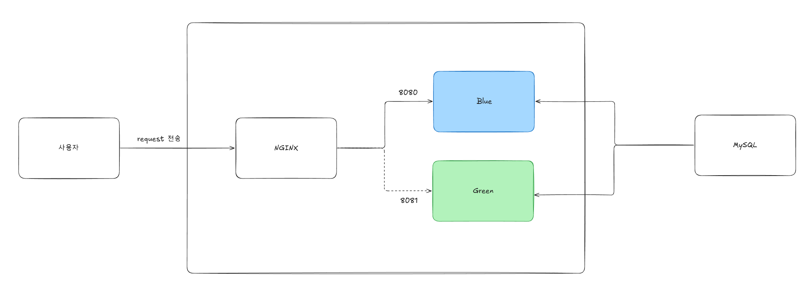
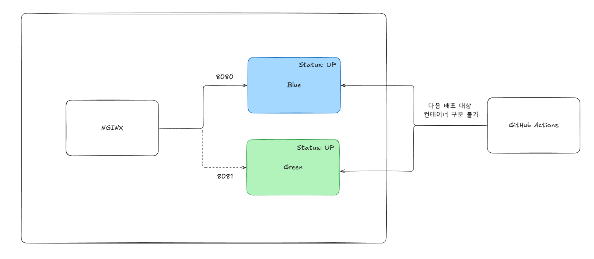
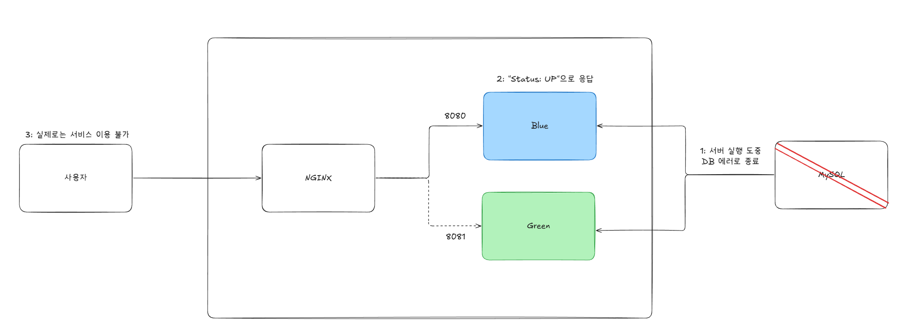
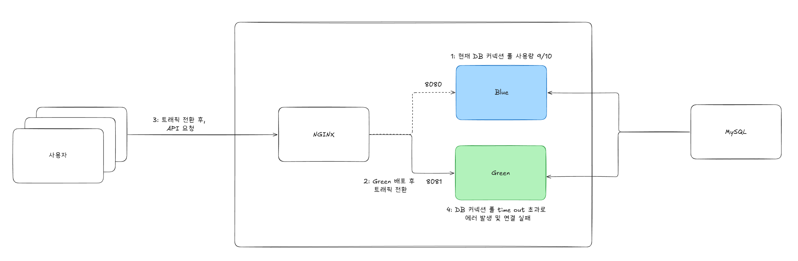
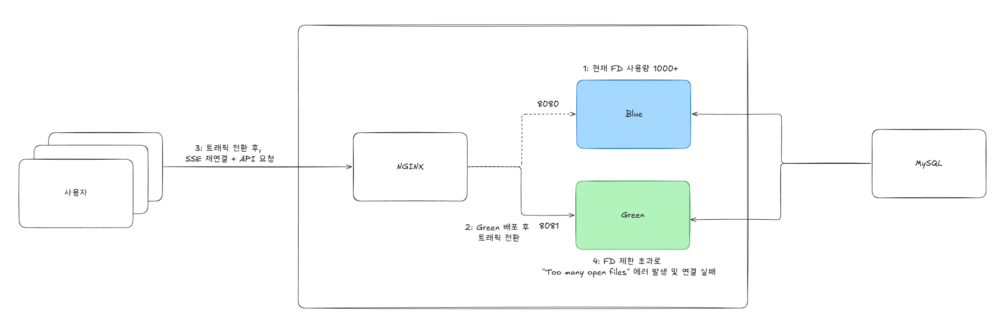
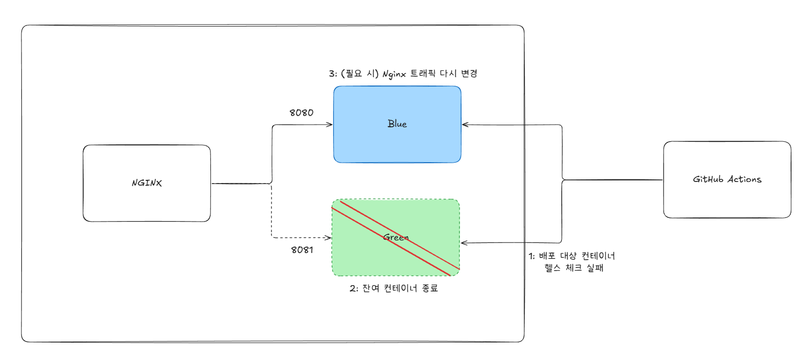
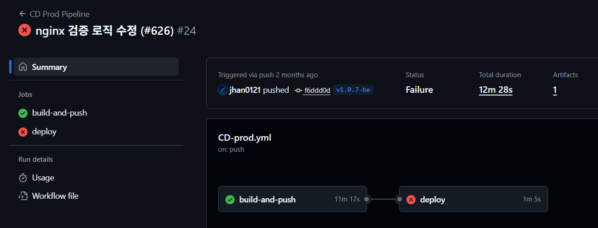
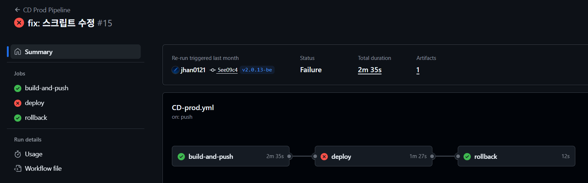

# 진정한 무중단 배포를 위한 블루-그린 배포 적용기

### 1. 서론: 무중단 배포를 향한 여정

#### 1.1 프로젝트 배경과 배포 방식의 변화

우리 팀은 SSE(Server-Sent Events)를 활용한 실시간 일정 조율 서비스를 개발하고 있습니다. 사용자들은 웹 페이지에 접속하여 가능한 일정 투표 정보를 실시간으로 받아볼 수 있고, 새로운 투표가 등록되거나 기존 투표가 수정되면 즉시 화면에 반영됩니다. 이러한 실시간 통신의 특성상, 배포 시점에 서비스가 중단되면 많은 수의 사용자 연결이 동시에 끊기는 문제가 발생합니다.

초기에는 단순한 배포 방식을 사용했습니다. 새로운 버전을 배포할 때마다 기존 서버를 중지하고, 새 버전의 컨테이너를 시작한 후, 다시 서비스를 재개하는 방식이었습니다. 이 과정에서 평균 1분에서 2분 정도의 다운타임이 발생했고, 실시간으로 투표를 확인하던 사용자들은 배포 시점마다 연결이 끊기는 불편함을 겪어야 했습니다.

여기서 블루-그린 배포를 고려하였습니다. 블루-그린 배포란 이름 그대로 두 개의 동일한 운영 환경, 즉 Blue와 Green을 준비하여 무중단 배포를 수행하는 배포 전략입니다. 사용자의 트래픽은 Nginx를 통해 두 환경 중 하나로만 향하게 됩니다. 예를 들어, 현재 Blue 환경이 실제 서비스를 운영하고 있다면, Green 환경은 다음 버전을 배포하고 테스트하기 위한 대기 공간이 됩니다. Green 환경의 배포와 검증이 완료되면, Nginx 설정 변경만으로 전체 트래픽을 Blue에서 Green으로 순간적으로 전환합니다. 이 방식은 다운타임이 거의 없고, 문제가 발생했을 때에도 트래픽을 다시 Blue로 되돌리기만 하면 되므로 빠르고 안전한 롤백이 가능하다는 장점이 있습니다. 이론적으로는 다운타임 없이 배포가 가능하다는 점이 장점이라고 생각하여 이를 적용하기로 결정하였습니다

#### 1.2 초기 블루-그린 배포 구현

블루-그린 배포를 구현하기 위해 다음과 같은 아키텍처를 구성했습니다. 배포 방식은 GitHub Actions를 이용하여 배포 자동화를 위한 CI/CD 파이프라인을 구성하였습니다.



여기서 배포 플로우는 다음 6단계로 구성했습니다.

1. Blue/Green 환경 감지
현재 Nginx가 어느 환경을 바라보는지 확인합니다.

2. 새 이미지 Pull
Docker Hub에서 최신 이미지를 다운로드합니다.

3. Target 환경 배포
현재 연결된 환경을 확인하고 다음 배포 환경을 판정합니다. 현재 Blue면 Green에, Green이면 Blue에 배포합니다.

4. Health Check
`/actuator/health` 응답을 12회 시도하여 총 60초동안 주기적으로 확인하여 새로운 환경 컨테이너가 정상적으로 실행되는지 확인합니다.

5. Nginx 트래픽 전환
Nginx 트래픽을 전환하기 위해 Nginx 설정을 새 환경으로 변경 후 리로드합니다.

6. 이전 환경 종료
배포 이후 롤백 상황을 빠르게 대처하기 위해 사용하지 않는 환경의 컨테이너 중지합니다.

이 구조를 GitHub Actions 워크플로우로 구현하여, be/prod 브랜치 기반 tag 푸시가 발생하면 자동으로 배포가 진행되도록 설정했습니다.

---

### 2. 문제 발견: 겉으로는 완벽해 보였던 배포 시스템

#### 2.1 헬스체크 실패 시 수동 복구

블루-그린 배포를 처음 적용할 때에는 성공 케이스만 고려한 상황이었습니다. 그러다보니 실패했을 때, 기존 블루 컨테이너로 트래픽을 이동시켜야 하지만 제대로 적용되지 않았습니다.

```yaml
if [ "$STATUS" -eq 200 ]; then
echo "배포 성공!"
exit 0
fi
echo "헬스체크 실패"
exit 1  # 여기서 종료. 롤백 진행 X
```

배포 흐름을 따라가보면 문제가 되는 부분이 존재합니다. 여기서 배포 실패 시, nginx 트래픽을 기존 블루 컨테이너로 이동하지 않는 문제가 있어 무중단 배포의 고가용성을 만족할 수 없는 문제가 있습니다. 또한 실패한 컨테이너 정리 과정도 실행하지 않게 되어 추후 배포에서 블루, 그린 컨테이너 모두 UP 상태가 되는 문제가 있었습니다. 이로 인해 앞으로의 배포에서 블루 컨테이너만 대상이 되어 무중단 배포를 만족할 수 없게 됩니다.

블루-그린 실패 시, 시나리오 흐름을 정리하면 아래와 같습니다.

1. Blue/Green 환경 감지
2. 새 이미지 Pull
3. Target 환경 배포
4. Health Check (12회 시도, 60초)
   └─ 실패 시 → exit 1 여기서 중단
5. Nginx 트래픽 전환 X (도달 불가)
6. 이전 환경 종료 X (도달 불가)



위 이미지를 보시면 블루와 그린 컨테이너가 모두 UP 상태로 유지되기 때문에 추후 다음 배포 대상 컨테이너를 구분하지 못하는 문제가 발생하게 되고 이로 인해 정상 동작 중인 컨테이너를 종료하게 될 가능성이 존재하여 무중단 배포를 수행할 수 없습니다.

#### 2.2 얕은 수준의 헬스체크

블루-그린 트래픽 전환이 잘 되었는지 확인하기 위해 spring actuator를 활용하여 서버 컨테이너가 살아있는지 검증하는 과정이 필요합니다. 여기서 기본으로 제공하는 `/actuator/health`를 활용하고 있는데요. 하지만 이런 기본 헬스체크만으로 진짜 컨테이너가 정상적으로 실행할 수 있다고 보증할 수 있을까요?



한 가지 시나리오를 가정해보겠습니다. 서버 배포에는 성공했는데 그 직후에 DB 연결에 문제가 생긴 상황에서, 헬스체크는 어떻게 동작할까요? 정답은 Spring Boot Actuator의 `management.endpoint.health.show-details` 설정에 따라 다르게 동작합니다. 기본값은 `never`로 되어 있기 때문에 헬스체크가 단순히 HTTP 200 상태 코드와 `{"status":"UP"}` 만 반환합니다. 내부 컴포넌트(DB, 디스크, 메모리 등)의 상태를 확인하지는 않습니다.

```yaml
# application.yml
...
management:
  endpoint:
    health:
      show-details: never
```

결과적으로 배포 과정에서는 헬스체크를 통과해서 배포가 진행되고 정상적으로 되었다고 표시되지만, 실제로는 사용자는 API를 사용할 수 없는 상황이 발생하게 됩니다. 즉, 기본 설정의 헬스체크는 애플리케이션이 실행만 되면 UP을 반환하기 때문에, DB 연결 실패, 커넥션 풀 고갈 등의 실제 장애 상황을 감지하지 못합니다.

따라서 이번 프로젝트에서 어떤 부분에서 문제가 발생할 수 있을지 고민해보았습니다. 기본 헬스체크가 확인하지 못하는 주요 장애 지점을 분석한 결과, 다음 두 가지 영역에서 심각한 문제가 발생할 수 있음을 발견했습니다.

1. DB 연결 상태 미확인



기본 헬스체크는 DB 커넥션 풀의 여유 상태를 정확히 파악하지 못합니다. 예를 들어, 서버가 HikariCP로 DB 커넥션 풀을 10개 생성했고, 현재 9개를 사용하고 있는 상황을 가정해보겠습니다. 이때 헬스체크 요청이 들어오면 남은 1개의 커넥션을 획득할 수 있기 때문에 헬스체크는 200 OK를 반환합니다.

하지만 이 상태에서 동시에 5개의 사용자 요청이 들어온다면 어떻게 될까요? 첫 번째 요청만 커넥션을 획득하고, 나머지 4개 요청은 커넥션을 얻기 위해 대기하거나 타임아웃으로 실패하게 됩니다. 헬스체크는 "1개라도 커넥션을 획득할 수 있으면" 정상으로 판단하지만, 실제로는 "동시 요청을 처리할 수 있는 충분한 커넥션"이 있는지를 확인하지 못하는 것입니다.

더 큰 문제는 블루-그린 배포 시점입니다. Green 환경이 방금 시작되어 커넥션 풀 사용률이 0/10이라면 헬스체크는 당연히 통과합니다. 하지만 Nginx가 트래픽을 Green으로 전환하는 순간, 500명의 사용자가 동시에 재연결을 시도한다면 10개의 커넥션으로는 처리할 수 없어 490명의 요청이 실패하게 됩니다. 헬스체크는 통과했지만, 실제 서비스는 장애 상황인 것입니다.

2. 파일 디스크립터 고갈 위험



마지막으로 [파일 디스크립터](https://www.kernel.org/doc/html/latest/filesystems/files.html) (File Descriptor, FD) 사용량을 살펴보겠습니다. 기본 헬스체크는 FD 사용 상태를 확인하지 않습니다. 우리 프로젝트는 SSE(Server-Sent Events)를 사용하여 실시간 가능 시간 투표 변화 여부를 클라이언트에 전달하는데, 각 SSE 연결마다 1개의 FD를 사용합니다. 현재 800명의 사용자가 SSE로 연결되어 있고, Spring Boot와 DB 연결 등 기타 리소스가 200개의 FD를 사용한다면, 총 1000개의 FD를 사용하는 상황입니다. 시스템의 기본 FD 제한이 1024개(`ulimit -n`)라면, 현재 여유 FD는 단 24개뿐입니다. 이때 헬스체크 요청이 들어오면 FD를 획득할 수 있기 때문에 헬스체크는 200 OK를 반환합니다.

하지만 이 상태에서 새로운 사용자 연결이나 DB 쿼리가 발생하면 어떻게 될까요? 25번째 연결 시도부터는 "Too many open files" 에러가 발생하며 연결에 실패하게 됩니다. 헬스체크는 "FD를 하나라도 획득할 수 있으면" 정상으로 판단하지만, 실제로는 "서비스를 안정적으로 운영할 수 있는 충분한 FD 여유"가 있는지를 확인하지 못하는 것입니다.

특히 블루-그린 배포 시점에는 이 문제가 더욱 심각하게 볼 수 있습니다. Green 환경이 시작될 때 기본 리소스로 200개의 FD를 사용합니다. 이 상태에서 헬스체크는 당연히 통과합니다. 하지만 Nginx가 트래픽을 Green으로 전환하는 순간, 기존 Blue 환경에 연결되어 있던 800명의 사용자가 SSE 재연결을 시도한다면 어떻게 될까요? Green 환경은 200(기본) + 800(SSE) = 1000개의 FD가 필요하지만, 제한이 1024개이므로 여유가 24개뿐입니다. 재연결 과정에서 일시적으로 더 많은 FD가 필요하거나, 새로운 사용자가 접속하면 즉시 FD가 고갈되어 "Too many open files" 에러가 발생합니다. 헬스체크는 통과했지만, 실제로는 사용자가 연결에 실패하는 장애 상황이 발생하는 것입니다.

따라서 위에서 발견한 문제들을 해결하기 위해 두 가지 개선 방안을 생각했습니다.

1. 자동 롤백

현재는 배포 실패 시 수동으로 개입해야 하는 문제가 있습니다. 헬스체크가 실패하면 GitHub Actions 워크플로우가 중단되고, 개발자가 직접 서버에 접속하여 실패한 컨테이너를 정리하고 Nginx 설정을 복원해야 합니다. 배포가 실패한다면 해결할 때 까지 시스템이 불안정한 상태로 방치될 수 있습니다.

따라서 배포 실패 시 사람의 개입 없이 자동으로 이전 환경으로 복구하는 메커니즘이 필요합니다. 구체적으로는 아래의 flow를 적용하여 문제를 해결하고자 하였습니다.
- Nginx를 이전 환경으로 자동 복원
- 실패한 컨테이너 자동 정리
- 이전 환경이 중지되었다면 자동 재시작
- 롤백 결과를 GitHub Actions UI에 명확히 표시

2. 심층 헬스체크

기본 헬스체크는 애플리케이션이 실행 중인지만 확인할 뿐, 실제로 서비스를 제공할 수 있는 상태인지는 확인하지 못합니다. 앞서 살펴본 것처럼 DB 커넥션 풀 여유, FD 사용량 등을 확인하지 않아 배포 후 장애가 발생할 수 있습니다.

따라서 단순 HTTP 200 응답이 아닌, 실제 서비스 가능 여부를 검증하는 심층 헬스체크가 필요하다고 판단하였습니다. 구체적으로 아래의 flow를 적용하여 문제를 해결하고자 하였습니다.

1. DB 연결 상태 및 커넥션 풀 사용률 확인
2. DB 쿼리 응답 시간 측정
3. FD 사용률 모니터링
4. 각 항목별 임계값 설정 (예: 커넥션 풀 80% 이상 사용 시 경고)

이 두 가지 개선을 통해 "진정한 무중단 배포"를 실현하고자 하였습니다.

---

### 3. 자동 롤백 프로세스 구현

초기 배포 파이프라인은 성공 케이스만 가정했기 때문에 롤백 기능이 전혀 없었습니다. 헬스체크 실패 시 배포 프로세스가 그저 중단될 뿐, 새로 띄운 비정상 컨테이너는 그대로 방치되고 트래픽은 이전 버전을 유지하는 불안정한 상태가 되었습니다. 더 심각한 문제는 Nginx 트래픽 전환 후 문제가 발견될 경우, 서비스는 그대로 장애 상황에 놓인다는 점이었습니다.



처음에는 `deploy` Job 내에 `if: failure()` 조건을 사용하는 롤백 `step`을 추가하는 것이었습니다. 이 step은 이전 단계들의 실패를 감지하면 Nginx 설정 복원, 실패한 환경 정리, 이전 환경 재시작 등의 롤백 프로세스를 수행하도록 설계되었습니다. 테스트 결과, 기능적으로 롤백 자체는 의도대로 작동했습니다. 



하지만 이 방식은 기능적으로는 문제없이 롤백을 수행하였으나, 운영상 배포 실패 여부와 롤백 실패 여부가 같은 job에서 처리하는 구조라 이 둘을 구분하는데 어려움이 있었습니다. 롤백의 성공 여부와 무관하게 GitHub Actions UI에는 단지 `deploy` Job의 실패를 알리는 붉은 `X` 표시만 나타났기때문에 배포 실패 알림을 받았을 때 서비스가 자동으로 복구된 것인지, 아니면 즉시 개입이 필요한 심각한 장애 상황인지 파악하기 위해 항상 상세 로그를 확인해야만 했습니다. 이러한 불확실성은 운영상의 불편함을 초래하였습니다.

이 문제를 해결하기 위해 우리는 롤백 로직을 별도의 `rollback` Job으로 분리하는 결정을 내렸습니다. 기능의 동작만큼이나 그 상태를 명확하게 보여주는 것이 얼마나 중요한지를 알 수 있는 기회가 되었습니다. `deploy` Job과 별개로, `needs: deploy`와 `if: failure()` 조건을 갖는 `rollback` Job을 새로 정의했습니다. 이를 통해 `deploy` Job이 실패했을 때만 독립적으로 실행되도록 구성했습니다.

```yaml
jobs:
  deploy:
    # ... 배포 단계 ...

  rollback:
    runs-on: [ self-hosted, estime-prod ]
    needs: deploy
    if: failure() && needs.deploy.outputs.current != 'none'
    steps:
      - name: Rollback to previous environment
        # ... 롤백 스크립트 ...
```

`deploy` Job이 실패했을 때만 실행되는 독립적인 Job으로 만들자, GitHub Actions UI에는 `deploy`의 실패와 `rollback`의 성공/실패 여부가 명확하게 분리되어 표시되었습니다.



 이제 '배포는 실패했지만, 롤백은 성공하여 서비스는 안정화되었다'는 사실을 즉시 인지할 수 있게 되었습니다. 이러한 가시성 확보는 단순한 편의를 넘어, 장애 대응 시간을 로그를 찾아 헤매는 시간에서 상태를 즉시 인지하는 시간으로 단축시키는 실질적인 개선을 가져왔습니다.

---

### 4. 심층 헬스체크 구현

심층 헬스체크를 구현하기 위해 Spring Boot Actuator가 제공하는 `HealthIndicator` 인터페이스를 구현하는 방법을 사용할 수 있습니다. 이 접근 방식의 핵심은 각 검증 로직을 독립된 `HealthIndicator` 구현체로 만드는 것입니다. 예를 들어, 'DB 응답 시간용 Indicator', '커넥션 풀용 Indicator'처럼 각자 책임이 명확한 컴포넌트를 여러 개 구성하였습니다. 아래는 FD 사용량을 확인할 수 있는 `HealthIndicator` 구현체 예시입니다.

```java
import org.springframework.boot.actuate.health.Health;
import org.springframework.boot.actuate.health.HealthIndicator;
...

@Component
public class FileDescriptorHealthIndicator implements HealthIndicator {

    @Override
    public Health health() {
        try {
            OperatingSystemMXBean os = ManagementFactory.getOperatingSystemMXBean();

            if (os instanceof UnixOperatingSystemMXBean unixOs) {
                long openFd = unixOs.getOpenFileDescriptorCount();
                long maxFd = unixOs.getMaxFileDescriptorCount();
                double usage = (double) openFd / maxFd * 100;

                // 사용량 80% 이상일 시, down으로 표시
                if (usage > 80) {
                    return Health.down()
                            .withDetail("openFileDescriptors", openFd)
                            .withDetail("maxFileDescriptors", maxFd)
                            .withDetail("usage", String.format("%.2f%%", usage))
                            .build();
                }

                return Health.up()
                        .withDetail("openFileDescriptors", openFd)
                        .withDetail("maxFileDescriptors", maxFd)
                        .withDetail("usage", String.format("%.2f%%", usage))
                        .build();
            }

            return Health.unknown().withDetail("os", "Not Unix-based").build();
        } catch (Exception e) {
            return Health.down().withException(e).build();
        }
    }
}
```

위와 같이 `Indicator`를 구현하면 아래와 같이 상세한 헬스체크를 수행할 수 있습니다.

```json
{
  "status": "UP",
  "components": {
    "databaseResponseTime": {
      "status": "UP",
      "details": {
        "responseTime": "7ms"
      }
    },
    "fileDescriptor": {
      "status": "UP",
      "details": {
        "openFileDescriptors": 25,
        "maxFileDescriptors": 1048576,
        "usage": "0.00%"
      }
    }
    // 기타 Indicator 추가 가능
  }
}
```

이렇게 하면, 배포 스크립트에서는 기존처럼 `/actuator/health` 엔드포인트 하나만 호출하면 됩니다. Spring Boot가 자동으로 모든 `HealthIndicator` 구현체를 찾아 실행하고, 그 결과를 종합하여 전체 상태를 알려주기 때문입니다. 이 방식을 통해 우리는 배포 로직의 변경 없이도, 헬스체크의 깊이를 유연하고 확장 가능하게 추가할 수 있었습니다.

#### 4.1 DB 응답 시간 확인

심층 헬스체크의 첫 단계로 DB 응답 시간을 측정하는 과정에서, 어떤 쿼리를 실행할 것인지에 대한 결정이 필요했습니다. 이는 '완벽한 검증'과 '실용적인 안정성' 사이에서의 고민이었습니다.

처음에는 실제 비즈니스 로직과 가장 유사한 `SELECT COUNT(*) FROM rooms WHERE ...` 같은 쿼리를 헬스체크에 사용하는 것을 고려했습니다. 이 방식은 테이블의 존재 여부를 넘어 인덱스의 동작까지 검증할 수 있었기 때문에 가장 완벽한 검증처럼 보였습니다.

하지만 이내 실용적이지 못하다는 결론에 도달하게 되었는데요. `COUNT(*)`처럼 테이블 전체를 스캔하는 쿼리는 데이터가 많아질수록 DB에 큰 부하를 줍니다. 특히 배포처럼 시스템이 민감한 시점에 상태를 확인하기 위한 헬스체크가 오히려 시스템 성능을 저해하는 원인이 될 수 있는 역설적인 상황이 발생할 수 있었습니다.
이러한 문제 때문에 우리는 헬스체크의 본질에 다시 집중했습니다. 헬스체크의 진짜 목적은 'DB가 살아있고, 핵심 테이블에 접근이 가능한가?'를 '최소한의 비용'으로 확인하는 것이라고 재정의했습니다.

따라서 우리는 `SELECT 1 FROM rooms LIMIT 1`이라는 매우 가볍고 실용적인 쿼리를 대안으로 고려하였습니다. 이 쿼리는 1ms 내외의 빠른 속도로 실행되어 DB에 거의 부하를 주지 않으면서도, DB 연결, 테이블 존재성, 접근 권한이라는 헬스체크의 핵심 목표를 충분히 달성할 수 있었습니다.

최종적으로 `SELECT 1 FROM rooms LIMIT 1` 쿼리를 사용하기로 결정했습니다. 이는 완벽한 검증이라는 이상을 일부 포기하는 대신, 시스템에 미치는 영향을 최소화하고 안정적으로 헬스체크의 본질적인 목적을 달성할 수 있었습니다.

#### 4.2 DB 커넥션 풀 상태 확인

기본적인 DB 헬스체크는 커넥션을 하나라도 맺을 수 있으면 '정상'으로 판단합니다. 하지만 커넥션 풀이 거의 다 사용 중인 상태라면 어떨까요? 헬스체크는 통과하겠지만, 순간적으로 많은 사용자 요청이 들어오면 커넥션 부족으로 대규모 장애가 발생할 수 있습니다.

따라서 전체 커넥션 풀에서 현재 사용 중인 'Active 커넥션'의 비율을 확인하는 과정이 반드시 필요합니다. 이 비율이 지속적으로 80~90%를 넘는다면, 잠재적인 장애 상황으로 판단하고 배포를 중단하거나 롤백을 고려해야 합니다.

#### 4.3 FD 사용량 확인

우리 서비스처럼 SSE를 통해 다수의 클라이언트와 실시간 연결을 유지하는 애플리케이션에서는 FD 상태를 고려해야 합니다. 모든 네트워크 연결은 FD를 하나씩 사용하기 때문입니다. FD가 고갈되면 더 이상 새로운 사용자 연결을 받아들일 수 없음은 물론, 로그 파일조차 기록하지 못하는 위험한 상태에 빠집니다.

따라서 프로세스가 사용할 수 있는 최대 FD 개수 대비 현재 사용 중인 개수의 비율을 확인해야 합니다. 이 비율이 임계치에 가까워지면, 심각한 장애가 임박했다는 신호로 보았습니다.

---

### 5. 결론

블루-그린 배포를 처음 도입했을 때, 우리는 무중단이라는 목표에 가까워졌다고 생각했습니다. 하지만 안정적인 배포 시스템을 향한 여정은 거기서부터가 진짜 시작이었습니다. 이번 개선 과정은 단순히 배포 파이프라인을 구축하는 것을 넘어, 실패를 어떻게 정의하고 감지하며 자동으로 복구할 것인지에 대한 선택의 연속이었습니다.

헬스체크 실패 시 롤백이 되지 않던 문제를 해결하는 과정에서, 우리는 기능이 동작하는 것만큼이나 그 상태를 명확히 확인할 수 있다는 것이 중요하다는 가시성의 가치를 깨달았습니다. 또한 단순한 `UP/DOWN` 확인을 넘어 DB 커넥션 풀, FD 등 애플리케이션의 생명과 직결된 리소스들을 종합적으로 확인하는 헬스체크의 중요성을 알게 되었습니다. 완벽한 검증을 위해 시스템에 부담을 주는 대신, 실용적이면서도 핵심을 짚는 검증 방식을 선택하는 방식의 중요성도 배울 수 있었습니다.

결국 진정한 무중단 배포란 한 번의 구축으로 완성되는 것이 아니라, 우리 서비스의 특성을 이해하고 잠재적인 실패 요소를 계속해서 찾아내며 다듬어가는 과정이었습니다. 이 글이 저희와 비슷한 고민을 하고 있는 분들의 시행착오를 조금이나마 줄여주고, 더 안정적인 시스템을 만들어나가는 여정에 작은 도움이 되었으면 좋겠습니다.

### 참고 자료

- [File management in the Linux kernel](https://www.kernel.org/doc/html/latest/filesystems/files.html)
- [Spring Boot Actuator Docs](https://docs.spring.io/spring-boot/docs/3.0.5/reference/html/actuator.html#actuator.endpoints.health.writing-custom-health-indicators)
- [Toss Tech - Spring Boot Actuator의 헬스체크 살펴보기](https://toss.tech/article/how-to-work-health-check-in-spring-boot-actuator)