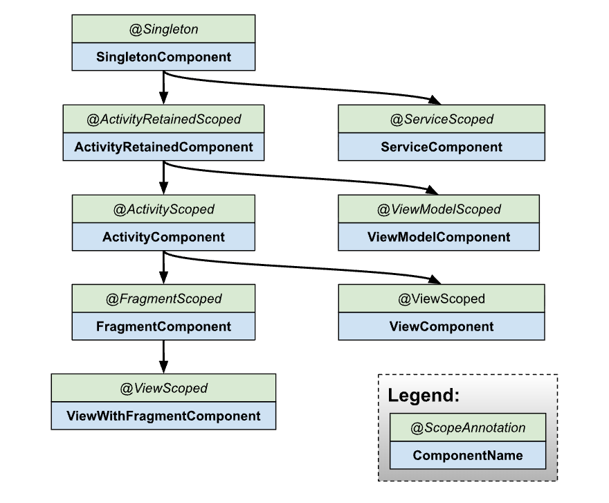

# Hilt


## Hilt 학습 배경
안드로이드 미션 중 DI(Dependency Injection) 미션이 있었다.
이 미션에서는 Hilt 같은 기존 DI 라이브러리를 사용하지 않고, 의존성 주입을 직접 자동화하는 로직을 구현해야 했다.

의존성 주입을 라이브러리 없이 자동화하는 것은 처음이었기 때문에 접근 방법조차 막막했다.
그래서 먼저 Hilt의 구현 원리와 사용 방식을 이해해야 자동화 로직을 설계할 수 있다고 판단했다.

## Hilt를 사용한 의존성 주입

Hilt는 안드로이드 전용 DI(Dependency Injection) 라이브러리로, 의존성 주입 시 발생하는 보일러플레이트 코드를 줄여준다.

수동으로 의존성을 주입할 경우, 모든 객체를 직접 생성하고 관리해야 하며, 이를 위해 컨테이너를 두어야 한다.

```kotlin
class AppContainer(
    application: Application,
) {
    val festivalNotificationLocalDataSource: FestivalNotificationLocalDataSource by lazy {
        FestivalNotificationLocalDataSourceImpl(prefs)
    }

    val festivalLocalDataSource: FestivalLocalDataSource by lazy {
        FestivalLocalDataSourceImpl(prefs)
    }

    private val scheduleDataSource: ScheduleDataSource by lazy {
        ScheduleDataSourceImpl(scheduleService)
    }
    private val noticeDataSource: NoticeDataSource by lazy {
        NoticeDataSourceImpl(noticeService)
    }
```

반면 Hilt는 안드로이드 컴포넌트의 생명주기와 맞춘 컨테이너를 자동으로 생성하고, 그 안에서 의존성을 관리한다.
즉, Hilt가 제공하는 컨테이너가 의존성을 보관하는 상자 역할을 하며, 개발자는 직접 인스턴스를 관리하지 않아도 된다.

Hilt는 널리 사용되는 DI 프레임워크인 Dagger 위에 구축되어 있다.

## 의존성 추가하기

1. project 단위 `build.gradle` 파일에 `hilt-android-gradle-plugin` 플러그인을 추가한다.
    
    ```kotlin
    plugins {
      ...
      id("com.google.dagger.hilt.android") version "2.57.1" apply false
    }
    ```
    
2. app 단위 `build.gradle` 파일에 Gradle 플러그인을 적용하고 다음 의존성을 추가한다.
    
    ```kotlin
    plugins {
      id("com.google.devtools.ksp")
      id("com.google.dagger.hilt.android")
    }
    
    android {
      ...
    }
    
    dependencies {
      implementation("com.google.dagger:hilt-android:2.57.1")
      ksp("com.google.dagger:hilt-android-compiler:2.57.1")
    }
    ```
    
    Hilt는 Java 8 을 사용한다. 프로젝트에서 Java 8을 활성화하려면 app 단위 `build.gradle` 파일에 다음을 추가한다.
    
    ```kotlin
    android {
      ...
      compileOptions {
        sourceCompatibility = JavaVersion.VERSION_1_8
        targetCompatibility = JavaVersion.VERSION_1_8
      }
    }
    ```
    

## Hilt Application Class

Hilt를 사용하는 앱은 `@HiltAndroidApp` 어노테이션이 붙은 `Application class`를 포함해야한다.

```kotlin
@HiltAndroidApp
class ExampleApplication : Application() { ... }
```

1. `@HiltAndroidApp`의 역할
    
    `@HiltAndroidApp`을 `Application class`에 붙이면, Hilt가 Annotation Processing(KSP/Annotation Processor)을 통해 코드를 자동으로 생성한다. 위와 같이 하면 Hilt_ExampleApplication클래스가 생성된다. 
    
    Hilt가 앱 시작 시 Singletoncomponent(전역 범위 DI 그래프)를 생성한다. 이 그래프는 `@Singleton`으로 지정된 객체를 관리하며, 앱이 실행되는 동안 유지된다.
    
    이후 `@AndroidEntryPoint`가 붙은 `Activity`, `Fragment`, `ViewModel` 등이 전역 DI 그래프에 자동으로 연결된다. 즉, 의존성을 주입 받을 수 있는 통로가 열리는 셈이다.
    
2. 컨테이너를 Application 수준에서 만드는 이유
    
    Application은 앱 전체에서 가장 오래 살아남는 컴포넌트이다. 따라서 여기서 컨테이너를 만들면 앱 전체에서 공유해야 하는 의존성인 Retrofit, Room, Repository 등 을 전역적으로 제공할 수 있다.
    

## 클래스에 의존성 주입하기

`Application class`에 Hilt가 설정되고 Application 수준의 컴포넌트가 준비되면, Hilt는 `@AnroidEntryPoint` 어노테이션이 붙은 다른 클래스에 의존성을 제공할 수 있다.

```kotlin
@AndroidEntryPoint
class ExampleActivity : AppCompatActivity() { ... }
```

Hilt가 현재 지원하는 클래스는 다음과 같다.

- Application (`@HiltAndroidApp` 사용)
- ViewModel (`@HiltViewModel` 사용)
- Activity
- Fragment
- View
- Service
- BroadcastReceiver

클래스에 `@AndroidEntryPoint`를 붙인다면, 그 클래스에 의존하는 클래스에도 반드시 어노테이션을 붙여야 한다. 

예를 들어, 어떤 프레그먼트에 어노테이션을 붙였다면, 해당 프래그먼트를 사용하는 액티비티에도 어노테이션을 붙여야 한다.

```kotlin
@AndroidEntryPoint
class MainActivity : AppCompatActivity() {
}

@AndroidEntryPoint
class MyFragment : Fragment() {
}
```

<aside>
➕

참고: Hilt를 사용하는 클래스는 다음과 같은 예외 사항이 있다.

- Hilt는 `CoponentActivity(AppCompatActivity)`를 상속 받는 `Activity`만 지원한다.
- Hilt는 `androidx.Fragment`를 상속받는 `Fragment`만 지원한다.
</aside>

`@AndroidEntryPoint`는 프로젝트의 각 클래스마다 개별적인 Hilt 컴포넌트를 생성한다.이 컴포넌트들은 각각의 상위 클래스에서 의존성을 받을 수 있다. 컴포넌트로부터 의존성을 얻으려면 `@Inject` 어노테이션을 사용하여 필드 주입을 수행한다.

```kotlin
// 액티비티
@AndroidEntryPoint
class MainActivity : AppCompatActivity() {

    @Inject
    lateinit var userRepository: UserRepository // 액티비티 컴포넌트에서 주입 가능

    override fun onCreate(savedInstanceState: Bundle?) {
        super.onCreate(savedInstanceState)
        setContentView(R.layout.activity_main)
        
        if (savedInstanceState == null) {
            supportFragmentManager.beginTransaction()
                .replace(R.id.fragment_container_view, HomeFragment())
                .commit()
        }
    }
}

// 프래그먼트
@AndroidEntryPoint
class HomeFragment : Fragment() {

    @Inject
    lateinit var userRepository: UserRepository // 액티비티(MainActivity)에서 제공하는 의존성을 사용 가능

    override fun onViewCreated(view: View, savedInstanceState: Bundle?) {
        super.onViewCreated(view, savedInstanceState)
    }
}
```

```
ApplicationComponent (앱 전체)
       │
       ▼
ActivityComponent (MainActivity)
       │
       ▼
FragmentComponent (HomeFragment)
```

Hilt에 의해 주입되는 프로퍼티는 `private`가 불가능하다. `private` 프로퍼티에 Hilt 주입을 하면 컴파일 에러가 발생한다. Hilt는 `@Inject`를 통해 프로퍼티에 의존성을 주입할 때, 컴파일 시 생성되는 코드에서 해당 필드에 직접 접근해서 값을 넣는다. 이 때 Kotlin은 컴파일 시점에 JVM 바이트 코드로 변환될 때 `private` 필드로 변환되기 때문에, 외부 클래스에서 접근이 불가하다.

상위 클래스(부모클래스)의 의존성을 사용할 때, 상위클래스가 추상클래스라면 @AndroidEntryPoint 어노테이션을 붙일 필요가 없다.

```kotlin
// 상위 클래스 (추상 클래스)
abstract class BaseActivity : AppCompatActivity() {
    @Inject
    lateinit var userRepository: UserRepository
}

// 하위 클래스
@AndroidEntryPoint
class MainActivity : BaseActivity() {
    override fun onCreate(savedInstanceState: Bundle?) {
        super.onCreate(savedInstanceState)
        // 여기서 BaseActivity의 userRepository도 이미 Hilt가 주입해줌
    }
}
```

Hilt는 주입 대상 클래스마다 컴포넌트를 생성하고, 그 클래스 안에 선언된 `@Inject`프로퍼티를 초기화한다. `BaseActivity`는 추상클래스라 인스턴스가 생성 불가하기 때문에 직접 실행되지 않고 필드와 메서드만 JVM이 포함시킨다. 그래서 `MainActivity`가 실제로 실행되고, Hilt 컴포넌트가 만들어질 때 `BaseActivity` 안에 있는 `userActivity`까지 자동으로 초기화된다. 따라서 상위 클래스는 주입대상이지만 컴포넌트를 만들 필요가 없다.

## Hilt 바인딩 정의하기

필드 주입을 하려면, Hilt는 해당 컴포넌트에서 필요한 의존성의 인스턴스를 어떻게 제공할지 알아야한다.

바인딩은 특정 타입의 인스턴스를 의존성으로 제공하기 위해 필요한 정보를 담고 있다.

Hilt에 바인딩 정보를 제공하는 방법중 하나는 생성자 주입이 있다. 클래스의 생성자에 `@Inject` 어노테이션을 사용하면, Hilt에게 해당 클래스의 인스턴스를 어떻게 제공할지 알려줄 수 있다.

```kotlin
class AnalyticsAdapter @Inject constructor(
  private val service: AnalyticsService
) { ... }
```

위의 코드에서 어노테이션이 붙은 생성자의 파라미터는 해당 클래스의 의존성이다. 즉, `AnalyticsAdapter`는 `AnalyticsService`를 의존성으로 갖는다. 따라서 Hilt는 `AnalyticsService`의 인스턴스를 어떻게 제공할지도 알아야한다.

## Hilt 모듈

하지만 생성자 주입을 할 수 없는 경우도 있다. 예를 들면 인터페이스나 외부 라이브러리의 클래스가 있다. 생성자 주입은 생성자를 호출해서 인스턴스를 만들어야하는데 인터페이스는 인스턴스화를 할 수 없고, 외부 라이브러리의 클래스는 소스 코드의 수정이 불가하기 때문에 @Inject constructor 키워드를 붙여줄 수 없다.

이럴 때, Hilt 모듈을 사용하여 Hilt에 바인딩정보를 제공해줄 수 있다.

### 인터페이스 인스턴스 주입하기(@Binds)

AnalyticsService를 생성자 주입하려면 AnalyticsModule 추상클래스를 생성하여 @Binds 어노테이션이 붙은 추상 함수를 만들어서 Hilt에 바인딩 정보를 제공하면 된다. @Binds 어노테이션은 Hilt에게 인터페이스 인스턴스가 필요할 때 어떤 구현체를 사용할지 알려준다.

- 함수의 반환타입이 Hilt에게 어떤 인터페이스를 제공하는지 알려준다.
- 함수의 파라미터가 Hilt에게 어떤 구현체를 제공할지 알려준다.

```kotlin
interface AnalyticsService {
  fun analyticsMethods()
}

// AnalyticsServiceImpl도 생성자 주입 가능
// Hilt가 AnalyticsServiceImpl의 인스턴스를 제공하는 방법을 알아야 하기 때문
class AnalyticsServiceImpl @Inject constructor(
  ...
) : AnalyticsService { ... }

@Module
@InstallIn(ActivityComponent::class)
abstract class AnalyticsModule {

  @Binds
  abstract fun bindAnalyticsService(
    analyticsServiceImpl: AnalyticsServiceImpl
  ): AnalyticsService
}
```

AnalyticsModule은 @InstallIn(ActivityComponent::class)로 어노테이션이 되어 있다. 이는 Hilt가 ExampleActivity에 해당 의존성을 주입하도록 하기 위함이다. 이 어노테이션은 AnalyticsModule 안의 모든 의존성이 앱의 모든 Activity에서 사용 가능하다는 것을 의미한다.

AnalyticsModule은 상속시키지 않아도 @InstallIn이 Hilt에게 의존성 제공용 클래스임을 자동 등록해준다.

### 외부 라이브러리 클래스 주입하기(@Provides)

이전 예제를 살펴봤을 때, 만약 AnalyticsService 클래스를 Retrofit 같이 외부라이브러리라서 직접 소유하지 않는다면, Hilt 모듈 안에 함수를 만들고 그 함수에 @Provides 어노테이션을 붙여서 Hilt에게 이 타입의 인스턴스를 어떻게 제공할지 알려줄 수 있다.

- 함수의 반환타입이 Hilt에게 어떤 타입의 인스턴스를 제공하는지 알려준다.
- 함수의 파라미터가 해당 타입의 의존성이 무엇인지 알려준다.
- 함수의 본문에서 Hilt에게 실제 인스턴스를 어떻게 생성할지 알려준다. Hilt는 이 타입의 인스턴스가 필요할 때마다 함수 본문을 실행한다.

```kotlin
@Module
@InstallIn(ActivityComponent::class)
object AnalyticsModule {

  @Provides
  fun provideAnalyticsService(
    // Potential dependencies of this type
  ): AnalyticsService {
      return Retrofit.Builder()
               .baseUrl("https://example.com")
               .build()
               .create(AnalyticsService::class.java)
  }
}
```

### 같은 타입의 서로 다른 구현체를 Hilt로 주입하기

하나의 타입(예: OkHttpClient)에 대해 여러 가지 구현체를 Hilt가 의존성으로 제공해야 하는 경우가 있다. 이럴 땐 Hilt에 여러 개의 바인딩을 제공해야 하며, 이를 구분하기 위해 @Qulifier를 사용한다.

<aside>
❓

Qulifier란?

특정 타입에 대해 여러 개의 바인딩이 정의되어 있을 때, 그중 어떤 구현체를 주입할지 식별하는 역할을 하는 어노테이션이다. 

</aside>

예를 들어 AnalyticsService로 가는 네트워크 요청을 인터셉트해야 하는 경우가 있다고 가정하자. 이 때 하나의 OkHttpClient에는 AuthInterceptor를, 다른 OkHttpClient에는 다른 종류의 OtherInterceptor를 넣고 싶을 수 있다. 

1. Qualifier 정의하기
    
    먼저 @Binds 또는 @Provides 메서드에서 사용할 Qualifier 어노테이션을 정의한다.
    
    ```kotlin
    @Qualifier
    @Retention(AnnotationRetention.BINARY)
    annotation class AuthInterceptorOkHttpClient
    
    @Qualifier
    @Retention(AnnotationRetention.BINARY)
    annotation class OtherInterceptorOkHttpClient
    ```
    
    @Qualifier는 해당 어노테이션이 Hilt의 바인딩 구분용임을 나타낸다.
    
    @Retention(AnnotationRetention.BINARY)은 런타임이 아닌 바이트 코드 수준에서 유지되도록 설정하는 역할을 한다. Hilt가 컴파일 시점에 처리하기 때문이다.
    
2. 각 Qualifier에 맞는 구현체 제공하기
    
    ```kotlin
    @Module
    @InstallIn(SingletonComponent::class)
    object NetworkModule {
    
      @AuthInterceptorOkHttpClient
      @Provides
      fun provideAuthInterceptorOkHttpClient(
        authInterceptor: AuthInterceptor
      ): OkHttpClient {
          return OkHttpClient.Builder()
                   .addInterceptor(authInterceptor)
                   .build()
      }
    
      @OtherInterceptorOkHttpClient
      @Provides
      fun provideOtherInterceptorOkHttpClient(
        otherInterceptor: OtherInterceptor
      ): OkHttpClient {
          return OkHttpClient.Builder()
                   .addInterceptor(otherInterceptor)
                   .build()
      }
    }
    ```
    
3. 주입 시 Qualifier로 구분하기
    
    Qualifier를 이용하면 아래와 같이 필드, 생성자, 다른 모듈의 의존성 주입 시점에서 원하는 구현체를 지정할 수 있다.
    
    1. 다른 클래스의 의존성으로 사용하는 경우
        
        ```kotlin
        @Module
        @InstallIn(ActivityComponent::class)
        object AnalyticsModule {
        
          @Provides
          fun provideAnalyticsService(
            @AuthInterceptorOkHttpClient okHttpClient: OkHttpClient
          ): AnalyticsService {
              return Retrofit.Builder()
                       .baseUrl("https://example.com")
                       .client(okHttpClient)
                       .build()
                       .create(AnalyticsService::class.java)
          }
        }
        ```
        
    2. 생성자 주입 시 사용하는 경우
        
        ```kotlin
        class ExampleServiceImpl @Inject constructor(
          @AuthInterceptorOkHttpClient private val okHttpClient: OkHttpClient
        ) : ExampleService { ... }
        ```
        
    3. 필드 주입 시 사용하는 경우
        
        ```kotlin
        @AndroidEntryPoint
        class ExampleActivity: AppCompatActivity() {
        
          @AuthInterceptorOkHttpClient
          @Inject lateinit var okHttpClient: OkHttpClient
        }
        ```
### 컴포넌트에 모듈 설치
Hilt에서는 모듈을 특정 컴포넌트에 `@Install`하면 그 컴포넌트 내에서 정의된 바인딩들을 사용할 수 있다. 그리고 하위 컴포넌트에서도 부모 컴포넌트의 바인딩을 그대로 참조할 수 있다.


## Hilt와 Dagger

Hilt는 Dagger 기반의 Android 전용 DI 프레임워크이다.
Dagger의 강력한 기능을 유지하면서도, Android 환경에 맞게 보일러플레이트를 자동화한다.


Hilt의 목적은 다음과 같다.
- Android 앱에서 Dagger 관련 인프라를 단순화하기.
- 표준화된 컴포넌트와 스코프 세트를 만들어,설정 과정을 더 쉽고, 코드의 가독성과 앱 간 코드 공유성을 높이기.
- 빌드 타입(test, debug, release 등) 에 따라 서로 다른 바인딩을 쉽게 제공할 수 있는 방법을 만들기.


Android 시스템은 많은 프레임워크 클래스들을 스스로 인스턴스화하기 때문에,
Dagger를 그대로 Android 앱에 적용하려면
상당히 많은 보일러플레이트 코드를 직접 작성해야 한다.

Hilt는 이런 반복적이고 복잡한 Dagger 설정 코드를 줄여준다.
즉, Hilt는 Android 애플리케이션에서 Dagger를 사용할 때 필요한
여러 가지 요소를 자동으로 생성하고 제공한다.


## Hilt의 제공
- Android 프레임워크 클래스들을 Dagger와 통합하기 위한 컴포넌트 자동 생성
(원래는 직접 만들어야 함)
- Hilt가 자동으로 생성하는 컴포넌트에 맞는 스코프 애너테이션(@Singleton 등)
- Application, Activity 등 Android 클래스에 대한 기본 바인딩
- `@ApplicationContext`, `@ActivityContext `같은 기본 제공 Qualifier


Dagger와 Hilt는 같은 코드베이스 안에서 공존할 수도 있다.
하지만 대부분의 경우, Android에서 Dagger를 완전히 Hilt로 통합하는 것이 가장 좋다.
