# 테크니컬 라이팅

이번 글에서는 **처리량을 높일 수 있는 가장 쉬운 방법 중 하나**, 바로 **가상 스레드(Virtual Thread)** 에 대해 다뤄보겠다.

가상 스레드는 **Project Loom**에 의해 개발되었는데, 이번 글에서는 Project Loom이 **왜 가상 스레드를 개발했는지**, 개발 과정에서 **어떤 어려움**이 있었는지, 그리고 그 어려움을 **어떻게 극복**했는지를 살펴본다.

### 기존의 Java 스레드 모델

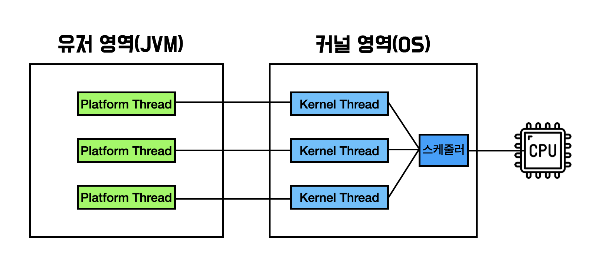

기존의 Java 스레드 모델은 위 그림과 같이 유저 영역에 Platform Thread가 커널 영역의 Kernel Thread와 1대1로 매핑되어 있는 구조이다. 즉, Platform 스레드의 개수와 Kernel Thread의 개수는 언제나 같다는 뜻이다.

### **Platform Thread의 한계와 Project Loom의 등장 배경**

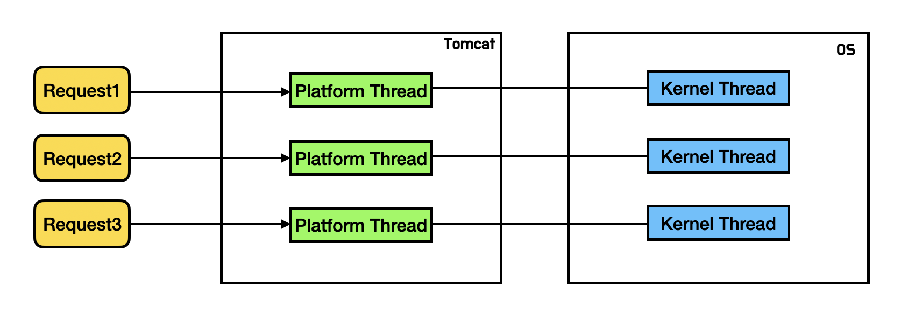

기존의 Java 애플리케이션에서는 **요청 하나당 하나의 Platform Thread**가 할당되는 구조를 사용한다.

이때 하나의 요청을 처리하는 데 평균 **0.05초**가 걸린다고 가정해보자.

1초에 **200개의 요청**을 처리하려면 약 **10개의 스레드**가 필요하고, 1초에 **2000개의 요청**을 처리하려면 **100개의 스레드**가 필요하다.

즉, 요청 처리 동안 해당 스레드가 계속 점유되어 있는 구조에서는 **처리량이 늘어날수록 스레드 수도 비례하여 증가**해야 한다는 것을 알 수 있다.

### **스레드 수는 왜 무한히 늘릴 수 없을까?**

문제는 **스레드 수가 제한적**이라는 점이다. 그 이유는 **Platform Thread**와 **Kernel Thread**가 **1:1로 매핑**되어 있기 때문이다.

즉, 사용자 영역의 스레드를 늘리면 커널 영역에서도 동일한 수의 스레드가 생성되어야 하며, 커널 스레드는 생성 및 관리 비용이 매우 높기 때문에 무한히 늘릴 수 없다.

결국 **CPU나 메모리가 남아 있더라도 스레드 수가 먼저 병목 지점이 된다.**

### **스레드 풀로 해결되지 않는 문제**

많은 애플리케이션이 **스레드 풀(Thread Pool)** 을 사용해 스레드 생성 비용을 줄이지만, 이 방법은 **이미 존재하는 스레드를 재사용할 뿐**, **전체 스레드 수 자체를 늘려주지는 않는다.**

따라서 근본적인 해결책은 아니다.

### **Project Loom의 시작: “커널 스레드를 늘리지 않고 처리량을 높이려면?”**

**Project Loom**은 바로 이 지점에서 출발했다.

“커널 스레드 수를 늘리지 않으면서도 더 많은 요청을 처리할 수 있는 방법은 없을까?” 라는 고민에서다.

그 답은 의외로 간단했다. 바로 **“놀고 있는 스레드를 활용하자”** 였다.

### **대부분의 스레드는 사실 ‘놀고 있다’**

대부분의 웹 애플리케이션 서버는 CPU 연산보다 **I/O 작업**에 더 많은 시간을 쓴다.

예를 들어, 데이터베이스 조회, 외부 API 호출, 파일 입출력 등은 I/O가 완료될 때까지 스레드가 아무 일도 하지 못한 채 기다리게 된다.

그렇다면 **I/O를 기다리는 동안 스레드를 다른 요청이 사용하도록 재활용할 수 있다면**, 스레드 수를 늘리지 않고도 처리량을 높일 수 있다.

### **스레드를 공유하는 방식**

기존에는 **요청당 하나의 스레드**가 처음부터 끝까지 요청을 처리했지만, 이제는 **스레드를 여러 요청이 공유**하도록 바꾸는 것이다.

요청이 CPU 연산을 수행하는 동안에는 스레드를 점유하지만, **I/O 대기 상태에 들어가면 스레드를 풀로 반환**하여

다른 요청이 해당 스레드를 사용할 수 있도록 한다.

즉, **“계산할 때만 스레드를 쓰고, 기다릴 때는 반납한다”** 는 방식이다. 이렇게 하면 **적은 수의 커널 스레드로도 많은 요청을 동시에 처리**할 수 있다.

### **하지만 대가도 따른다**

이 접근 방식은 **처리량 향상**이라는 분명한 장점을 제공하지만, 대신 **개발 복잡도**라는 대가를 치러야 한다.

이 구조를 제대로 활용하려면 **비동기 프로그래밍 스타일**을 사용해야 한다. 즉, 기존의 **순차적 프로그래밍 모델**을 포기하고 Callback, Future, CompletableFuture, Reactor, RxJava 같은 복잡한 비동기 API로 코드를 작성해야 한다.

또한 하나의 요청이 여러 스레드에서 처리되다 보니 **스택 트레이스가 분산되어 디버깅이 어려워지고**, 요청 처리 흐름을 직관적으로 파악하기 힘들어진다.

무엇보다 **Java 공식 문서**에서도 지적하듯, 비동기 프로그래밍은 **Java 플랫폼의 기본 철학**과도 충돌한다.

왜냐하면 비동기 방식에서는 더 이상 Java의 기본 동시성 단위인 **스레드(Thread)** 를 직접 사용하는 것이 아니기 때문이다.

**결국 Project Loom은 이런 비동기 프로그래밍의 복잡함 없이도, 스레드 수를 늘리지 않고 높은 동시성을 달성하기 위한 시도**로 시작된 프로젝트다.

### **동기 코드의 단순함을 유지하면서도, 처리량을 늘릴 수 없을까?**

**Project Loom**의 출발점은 단순했다.

“**동기 코드의 단순함을 유지하면서도 더 많은 요청을 처리할 수는 없을까?**”

비동기 프로그래밍은 효율적이지만, 코드 복잡도와 디버깅 난이도가 크다. 그래서 Project Loom은 처음에 **커널 스레드를 더 효율적으로 만드는 방법**을 고민했다.

하지만 이는 현실적으로 불가능했다. 커널 스레드는 **운영체제가 관리하는 영역**이며, 각 프로그래밍 언어나 런타임마다 스레드를 사용하는 방식이 다르기 때문에 운영체제가 스레드 내부 동작을 세밀하게 최적화할 수 없기 때문이다. 즉, **커널 스레드는 Project Loom이 제어할 수 없는 영역**이었다.

그렇다면 Project Loom이 직접 제어할 수 있는, **사용자 영역의 Platform Thread를 더 효율적으로 만드는 방법은 없을까?** 라는 생각으로 방향을 전환했다.

하지만 앞서 이야기했듯이, **Platform Thread를 많이 생성할수록 커널 스레드도 1:1로 함께 늘어난다.** 결국 이 방식으로는 스레드 수 증가에 따른 한계를 피할 수 없었다.

그래서 Project Loom이 내린 결론은 다음과 같다.

> “그렇다면 커널 스레드와 **1:1로 매핑되지 않는 새로운 스레드**, 즉 **가상의 스레드(Virtual Thread)** 를 만들면 되지 않을까?”

이 아이디어가 바로 **Virtual Thread의 핵심 개념이다.**

물론 **가상 스레드(Virtual Thread)** 역시 실제로 실행되려면 결국 **CPU 위에서 동작해야** 한다.

따라서 Project Loom은 **커널 스레드와 연결된 Platform Thread가 여러 개의 가상 스레드를 실행하는 역할**을 하도록 설계했다.

즉, 하나의 Platform Thread가 여러 Virtual Thread를 번갈아가며 실행하는 구조다.

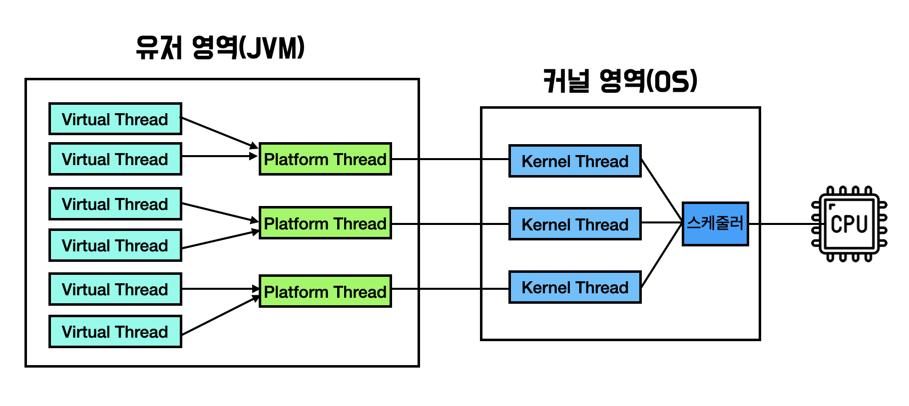

하지만 이 구조에도 새로운 문제가 생겼다.

가상 스레드들은 각각 수행해야 할 **작업(task)** 을 가지고 있는데, 하나의 Platform Thread는 **동시에 여러 Virtual Thread를 실행할 수 없다는 점**이었다.

이 문제를 해결하기 위해 Project Loom은 다음과 같은 아이디어를 떠올렸다.

> “Platform Thread 앞단에 **작업 큐(Task Queue) 를 두고,** 가상 스레드가 자신의 작업을 큐에 넘기면 Platform Thread가 **작업이 도착한 순서대로 하나씩 실행하자.”**

즉, **Virtual Thread는 실제 연산을 Platform Thread에 위임하고**, Platform Thread는 큐에서 작업을 가져와 **CPU에서 순차적으로 실행**하는 구조다.

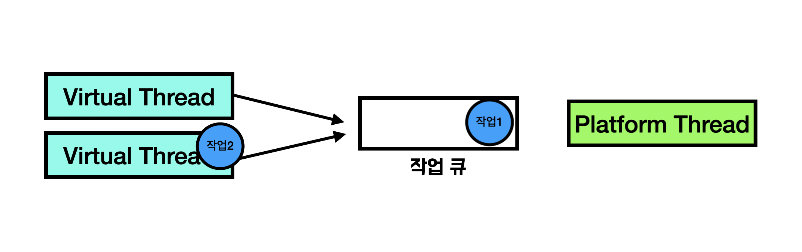

### **Virtual Thread의 스케줄링 구조**

이걸 실제 코드상으로 본다면 다음과 같다

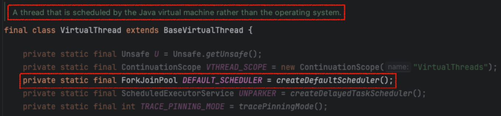

먼저, 관련 소스 코드의 주석을 보면 **Virtual Thread는 OS가 아닌 JVM 내부에서 스케줄링된다**는 사실을 확인할 수 있다. 즉, 운영체제 수준이 아니라 **JVM 레벨에서 직접 가상 스레드의 실행 순서를 관리**한다는 의미다.

아래 코드를 살펴보면, createDefaultScheduler() 메서드를 통해 **기본 스케줄러(default scheduler)** 를 생성하는데, 그 타입이 바로 **ForkJoinPool** 인 것을 확인할 수 있다.

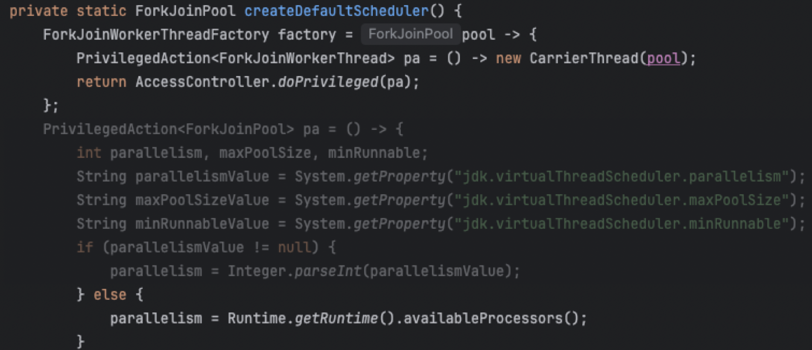

createDefaultScheduler() 내부를 좀 더 들여다보면, 이 스케줄러가 **CarrierThread** 를 생성하고 있음을 알 수 있다.

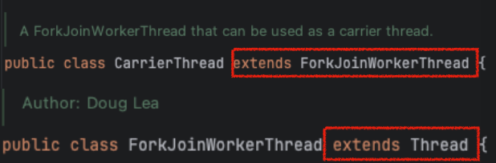

CarrierThread는 **ForkJoinWorkerThread** 를 상속받고 있고, ForkJoinWorkerThread는 다시 **Thread** 클래스를 상속받는다. 즉, CarrierThread는 결국 우리가 기존에 알고 있던 **Platform Thread**인 셈이다.

또한 메서드 하단을 보면, **CPU 코어 수만큼 CarrierThread를 생성**하고 있음을 확인할 수 있다. 이는 곧 **각 CPU 코어가 하나의 Carrier Thread를 담당**하게 된다는 의미다.

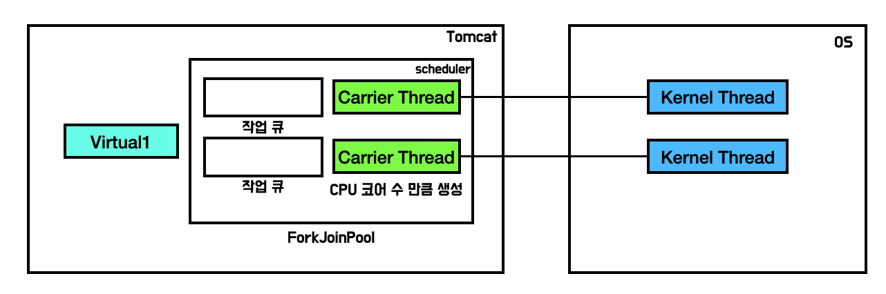

이 구조를 그림으로 표현하면 다음과 같다. 예를 들어, 해당 컴퓨터가 **2코어**라고 가정하면 **2개의 Carrier Thread**가 각각 **자신의 작업 큐(Task Queue)** 를 가지고 생성된다.

### **Virtual Thread를 사용하면 정말 처리량이 늘어날까?**

그렇다면 이렇게 Virtual Thread 구조로 바꾸었을 때, **기존의 Platform Thread 기반 방식보다 처리량이 실제로 늘었다고 할 수 있을까?**

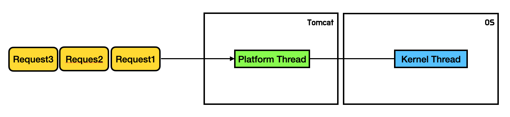

앞서 살펴본 기존 구조에서는 **요청당 하나의 Platform Thread**가 할당된다. 예를 들어, Request1이 들어오면 새로운 Platform Thread가 생성되어 요청을 처리한다. 그런데 만약 Thread Pool에 스레드가 **1개뿐**이라면,Request1이 처리되는 동안 새로 들어온 Request2는 스레드를 할당받지 못해 **대기 상태**가 된다.

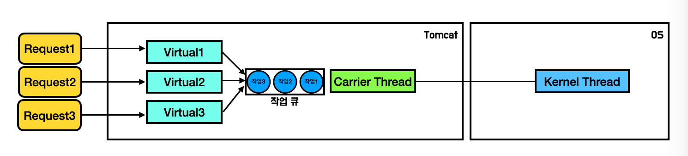

이제 Virtual Thread의 경우를 보자.

Virtual Thread는 요청마다 하나씩 생성되며, 자신의 작업을 **Carrier Thread의 작업 큐(Task Queue)** 에 넘긴다.

하지만 Carrier Thread는 앞서 설명했듯이 **작업 큐에 들어온 순서대로 하나씩 작업을 처리**한다.

즉, 먼저 들어온 Virtual Thread의 작업이 끝나기 전까지는 뒤에 들어온 Virtual Thread의 작업은 큐에서 **대기 상태**로 남게 된다.

결국 이 구조만 놓고 보면, **기존의 Platform Thread 방식과 Virtual Thread 방식의 처리량은 동일하다.**

둘 다 한 시점에 **Thread**가 **하나의 작업만 실행**할 수 있기 때문이다.

### **Virtual Thread는 어떻게 처리량을 높일까?**

그렇다면 **Virtual Thread는 어떻게 기존 방식보다 더 많은 요청을 처리할 수 있을까?**

그 차이는 바로 **I/O 요청 시점**에서 드러난다.

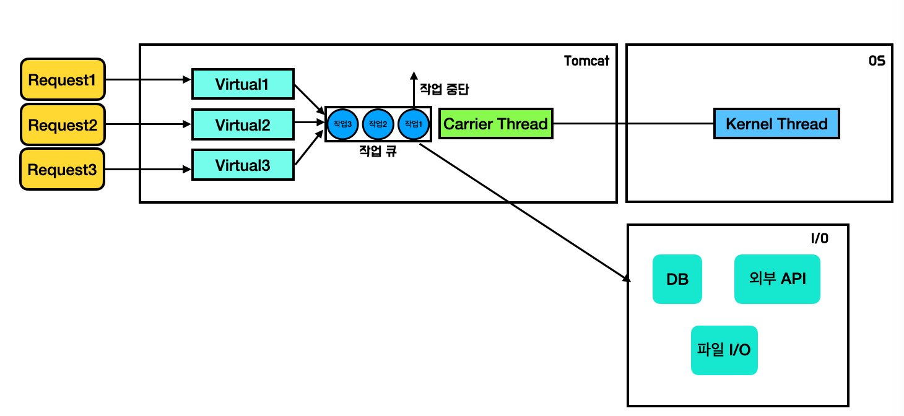

예를 들어, 하나의 Virtual Thread(작업1)가 실행 중 **I/O 요청**을 만나게 되면, 이를 담당하던 **Carrier Thread**는I/O 응답을 받을 때까지 기다리지 않고 **작업을 중단(suspend)** 한다.

이때 Carrier Thread는 더 이상 놀지 않고, 작업 큐에서 다음에 대기 중이던 **작업2를 실행할 수 있게 된다.**

즉, **이전 작업이 I/O 대기 중이라도 새로운 작업을 바로 처리할 수 있는 것**이다.

이 구조 덕분에, CPU는 I/O 응답을 기다리는 동안에도 계속해서 다른 Virtual Thread의 작업을 수행할 수 있고,결과적으로 **동일한 수의 커널 스레드로 훨씬 더 많은 요청을 처리할 수 있게 된다.**

### **중단 가능하고, 다시 실행 가능한 Virtual Thread**

여기서 중요한 사실 하나를 알 수 있다.

Virtual Thread의 작업은 **중단 가능해야(suspendable)** 하고, 한 번 중단된 뒤에는 **다시 재실행(resumable)** 될 수 있어야 한다는 점이다.

Project Loom은 바로 이 기능을 구현하기 위해 **Continuation**이라는 기술을 도입했다.

Continuation은 말 그대로 **실행 흐름을 일시 중단하고 나중에 이어서 실행할 수 있는 기술**이다. 이 덕분에 Virtual Thread는 I/O 대기 시점에 실행을 멈추고 Carrier Thread를 반납한 뒤, I/O가 완료되면 다시 중단했던 지점부터 실행을 재개할 수 있다.

### **Continuation의 동작 원리**

그렇다면 Virtual Thread의 핵심 기술인 **Continuation**은 내부적으로 어떻게 동작할까?

일반적인 스레드는 **호출 스택(call stack)** 을 가지고 있다.

스택에는 현재 실행 중인 메서드와 그 안에서 사용되는 지역 변수들이 저장되어 있다.

보통 스레드가 실행을 멈추면 이 스택은 사라지거나 유지되지 않는다. 즉, **중단된 지점에서 다시 이어서 실행하는 것은 불가능**하다.

하지만 **Continuation**은 이 제약을 깨뜨린다. Continuation은 실행 도중 스택의 상태를 **저장(save)** 해두고, 나중에 필요할 때 그 지점부터 **복원(restore)** 하여 다시 이어서 실행할 수 있도록 한다.

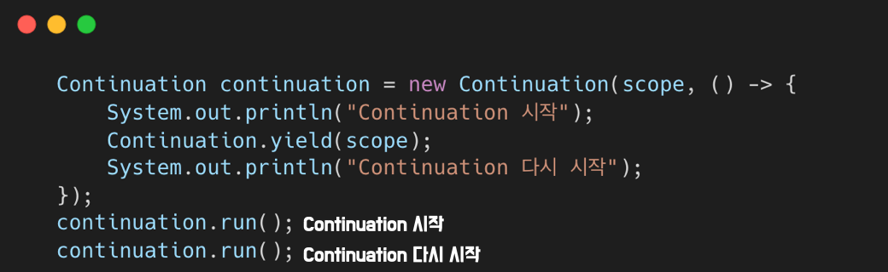

위와 같이 run() 메서드를 통해 정의한 람다 함수를 실행하면, yield() 메서드를 만나기 전까지만 코드가 실행된다.
따라서 "Continuation 시작"만 출력되고 그 이후의 코드는 일시 중단된 상태로 남게 된다.

이후 다시 run() 메서드를 호출하면, 이번에는 yield() 이후의 코드부터 이어서 실행된다.
즉, Continuation은 실행 도중 멈췄다가 나중에 중단된 지점부터 다시 이어서 실행할 수 있는 구조인 것이다.

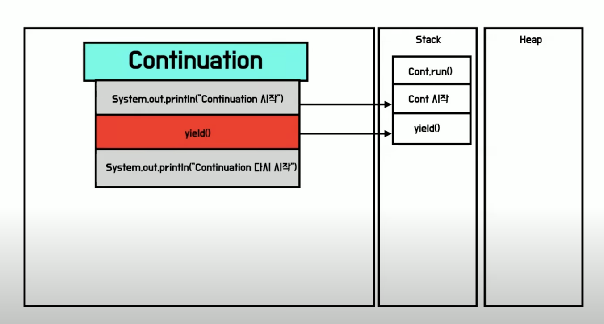

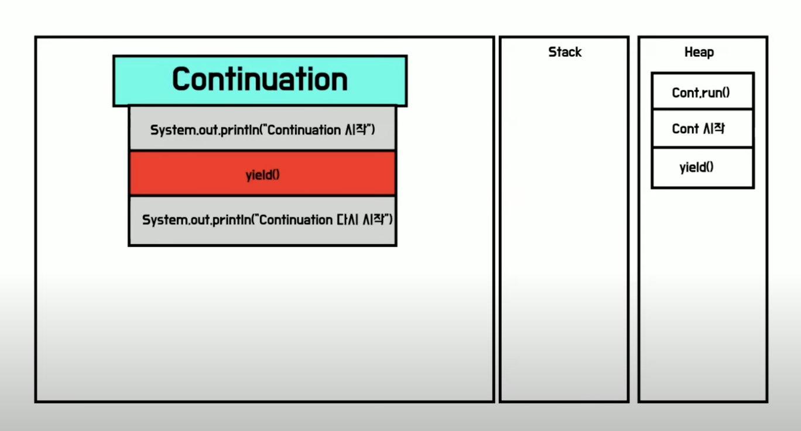

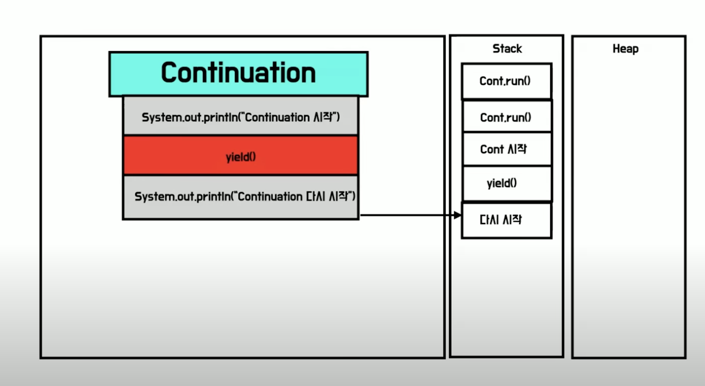

이 동작을 호출 스택 관점에서 보면 다음과 같다. yield()를 만나는 순간, 현재까지의 호출 스택에 쌓인 정보가 모두 **Heap 메모리**로 저장된다.

그리고 다시 run()을 실행할 때, 이전에 저장해 두었던 스택 정보를 Heap에서 꺼내와 **Stack 메모리**에 복원한 뒤, yield() 이후의 코드부터 다시 실행을 이어가는 것이다.

### **Continuation과 Virtual Thread의 결합**

앞서 살펴본 **Continuation**의 핵심은

> 실행 도중 스택을 저장하고, 나중에 저장된 지점부터 다시 이어서 실행할 수 있다 는 점이다.

이 개념을 **Virtual Thread**에 적용한다면 다음과 같은 과정으로 실행된다.

1. Virtual Thread가 실행 중이다.
2. I/O 요청을 만나면 yield()를 호출하여 현재 실행을 **중단**한다.
3. Continuation이 현재 스택 상태(메서드 호출, 지역 변수 등)를 **저장**한다.
4. Carrier Thread는 해당 Virtual Thread의 실행을 멈추고 다른 작업을 수행한다.
5. I/O가 완료되면 Continuation이 저장된 스택 상태를 **복원**하고,

   Virtual Thread는 **중단했던 지점부터 재개**한다.

이 구조 덕분에 Virtual Thread는 다음과 같은 장점을 얻는다

1. **스레드 재사용**: I/O 대기 중인 Virtual Thread가 CPU를 점유하지 않으므로,

   적은 수의 Carrier Thread로 많은 Virtual Thread를 동시에 처리할 수 있다.

2. **동기 코드 유지**: 개발자는 여전히 기존과 같은 동기 코드 스타일로 작성할 수 있다.
3. **효율적인 동시성**: I/O가 많은 웹 서버 환경에서 처리량을 크게 향상시킬 수 있다.

### **Virtual Thread의 단점**

Virtual Thread는 효율적인 I/O 처리와 동기 코드 유지라는 장점을 제공하지만, 몇 가지 단점이 존재한다.

1. **CPU 바운드 작업에서 효율이 떨어짐**

   CPU 연산이 많은 작업에서는 Virtual Thread가 제공하는 I/O 효율을 활용할 수 없어, 기존 Platform Thread와 성능 차이가 거의 없다.

2. **Carrier Thread가 블록되면 전체 처리에 영향**

   Virtual Thread가 CPU 연산이나 블록되는 작업을 수행하면, 이를 실행 중인 Carrier Thread가 점유된다.

   이 경우 다른 Virtual Thread의 실행이 지연되어 **처리량 감소**나 병목 현상이 발생할 수 있다.

3. **배압(backpressure) 조절이 어려움**

   기존 스레드 풀은 최대 스레드 수가 정해져 있어, 뒷단의 DB 커넥션이나 외부 API 요청도 자연스럽게 제한되며, 과부하가 걸리지 않도록 조절할 수 있다.

   하지만 Virtual Thread는 **요청마다 생성되기 때문에**, 스레드 수나 요청 수에 제한이 없고, 결과적으로 DB 커넥션 등 하위 자원에 과부하가 걸릴 수 있다.

### 결론

결국 Virtual Thread는 **I/O 중심 서버 환경에서 큰 성능 이점을 제공**하지만, 모든 상황에서 만능 해결책은 아니다.

장단점을 이해하고 적절한 상황에서 Virtual Thread를 활용하는 전략을 세워야 한다.
