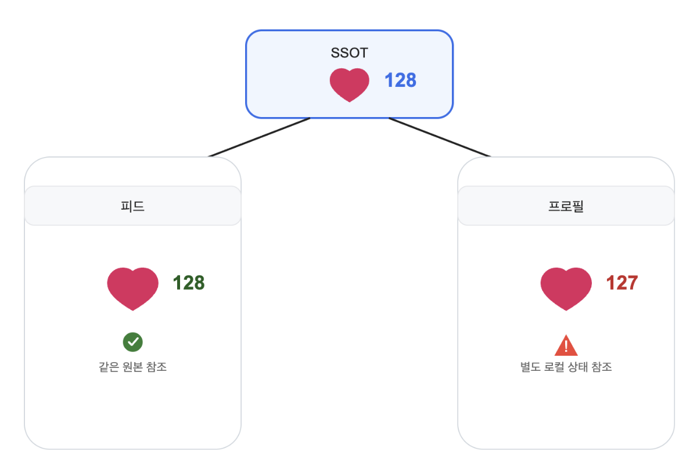
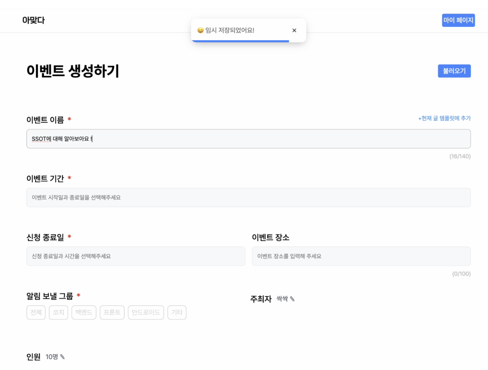
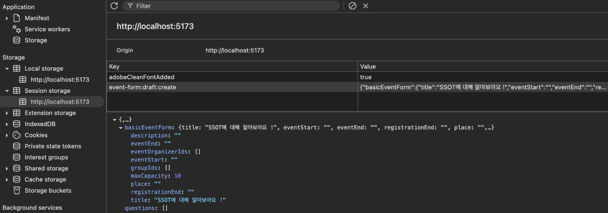
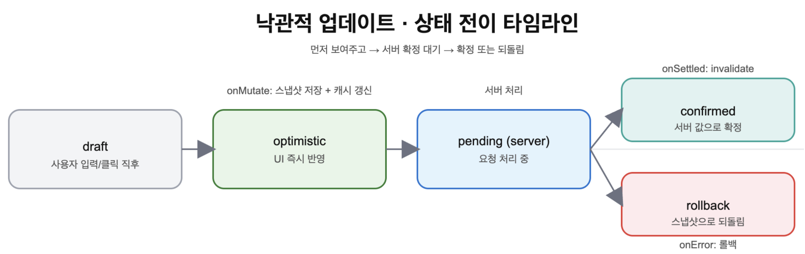
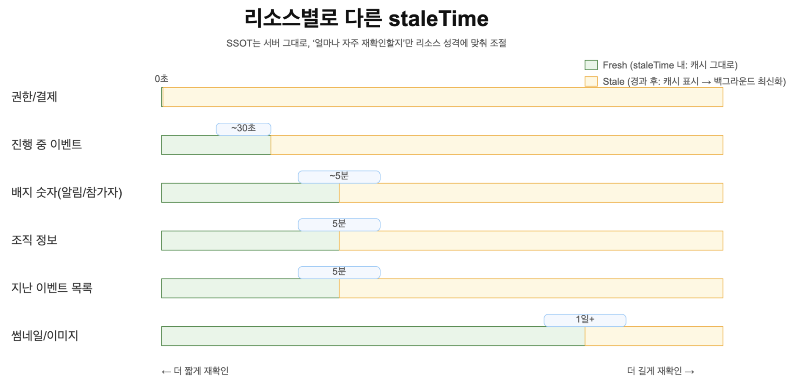

# 🍎 SSOT in Frontend

서비스를 만들다 보면, 수많은 데이터와 상태를 다루게 된다. 그런데 동일한 정보를 여러 곳에서 따로 관리하고 있다면 언젠가 불일치가 생기기 마련이다.


인스타그램에서 에리얼이 올린 게시글의 “좋아요 수”를 예로 들어보자. 피드에서는 128개로 보이는데, 프로필 화면에서는 127개로 보인다면, 사용자는 즉시 혼란과 불신을 느낄 것이다. 이처럼 작은 불일치는 사용자 경험을 해치고 서비스의 신뢰도까지 떨어뜨린다.

이러한 문제를 해결하기 위한 중요한 원칙이 바로 SSOT(Single Source of Truth), 즉 단일 진실의 원천 개념이다. 뜻 그대로 데이터의 진짜 원본은 한 곳에만 존재해야 한다는 약속이다. 모든 화면, 모든 모듈은 그 단일한 원본을 참조하도록 설계되어야 한다.
이 글에서는 프론트엔드 개발의 관점에서 SSOT를 어떻게 이해하고 구현할 수 있을지 탐구한다.

대상 독자

- 상태 불일치 문제를 겪어본 사람
- SSOT를 프론트엔드 관점에서 고민해보고 싶은 사람
- 최신성을 적절히 운용해 신뢰감 있는 화면을 만들고 싶은 사람

목차

- 원본은 어디에 둘까?
- 낙관적 업데이트
- 항상 최신이어야 할까? (리소스별로 “얼마나 최신해야 하는지” 기준 정하기)
- queryKey 규약과 Invalidation

## 🍏 원본은 어디에 둘까?

### 온라인: 서버가 SSOT

프론트엔드는 대부분 서버(백엔드 API)에서 데이터를 받아 화면에 보여준다. 따라서 서버의 데이터베이스가 원본(SSOT)이 되고, 프론트엔드의 값(state, props 등)은 대부분 사본(캐시/파생값)이다.

서버가 SSOT일 때 장점

- 데이터 신뢰도가 높고, 여러 사용자·디바이스가 동시에 같은 데이터를 보더라도 일관성을 유지하기 쉽다.

### 오프라인/초안: 클라이언트가 임시 SSOT

모바일/약한 네트워크 환경처럼 서버와 연결이 끊길 수 있다. 이때는 잠시 클라이언트가 ‘임시 원본’이 되어 변경 사항을 쌓아두고, 다시 온라인이 되면 서버와 동기화(reconcile) 한다.

인스타 ‘좋아요’ 예시

- 서버 값이 128일 때, 오프라인에서 “좋아요”를 누르면 로컬에서 +1(129)로 먼저 보여준다(낙관적 업데이트). 연결이 복구되면 서버에 반영하고, 서버 응답으로 최종 확정하거나 실패 시 되돌린다(롤백).

이벤트 생성 폼 ‘초안’ 예시

- 폼 입력을 로컬(sessionStorage 등)에 자동 저장해 두고(임시 원본), 제출 버튼을 누를 때 서버에 전송하여 서버가 최종 원본이 되도록 한다.




‘아맞다’ 서비스에서는 이벤트 생성 중 5초마다 폼 내용을 sessionStorage에 저장한다(오프라인/새로고침 대비).
폼을 모두 작성하고 생성 버튼을 누를 때 API 호출로 서버에 저장하며, 최종 원본은 서버가 된다.

## 🍏 낙관적 업데이트

위에서 가볍게 언급했던 낙관적 업데이트에 대해 좀 더 자세히 살펴보려고 한다. 낙관적 업데이트(Optimistic UI)는 서버의 응답을 기다리지 않고, 사용자가 기대하는 결과를 먼저 화면에 반영하는 기법이다. 요청이 성공한다고 가정하고, 사용자의 조작 직후 즉시 UI를 바꾼 뒤, 서버 응답 결과에 맞춰 확정하거나 복구한다.

사용자가 좋아요를 누르거나 제목을 수정할 때마다 네트워크 왕복을 기다리면, 화면이 느리고 답답하게 느껴진다.
이때 낙관적 업데이트를 적용하면 `눌렀다 = 바로 반응한다`는 부드러운 인터랙션 감각을 줄 수 있다. 스피너나 깜빡임 없이 즉시 피드백이 오기 때문에 사용자 경험(UX)이 개선된다.

낙관적 업데이트는 실패해도 피해가 작은 조작에 적합하다.
좋아요·팔로우 토글, 할 일 완료 체크, 태그 수정 등은 실패 시 간단히 복구할 수 있으므로 과감히 적용해도 된다.
반면 결제·환불, 권한·재고 수정처럼 실패 시 손실이 큰 작업에는 비관적(pessimistic) 접근이 더 안전하다. 즉, 서버에서 성공 응답을 받은 뒤에 화면을 갱신하는 편이 낫다.

낙관적 업데이트의 상태 전이는 아래 순서로 이뤄진다.

> `draft(입력)` → `optimistic(UI 즉시 변경)` → `pending(서버 처리 대기)` → `confirmed(확정) / rollback(실패 시 복구)`



구현 시 핵심 단계는 세 가지다.

1. 현재 캐시를 백업(스냅샷 저장)해서 실패 시 롤백할 수 있게 한다.
2. 진행 중인 같은 쿼리를 잠시 cancel해서 캐시 일관성이 깨지지 않게 한다.
3. 성공·실패와 관계없이 invalidate를 호출해 서버(SSOT) 상태로 다시 수렴시킨다.

### 예시 코드: 좋아요 버튼 구현

```tsx
// useLike.ts — 먼저 +1을 보여주고, 실패 시 스냅샷으로 복원한다
export const useLike = (postId: number) =>
  useMutation({
    mutationFn: async () => {
      const res = await fetch(`/api/posts/${postId}/like`, { method: "POST" });
      if (!res.ok) throw new Error("like failed");
      return res.json();
    },
    onMutate: async () => {
      const key = ["post", postId] as const;
      await queryClient.cancelQueries({ queryKey: key }); // (1) 레이스 방지
      const prev = queryClient.getQueryData<any>(key); // (2) 스냅샷 저장
      if (prev)
        queryClient.setQueryData(key, {
          ...prev,
          likes: prev.likes + 1,
          liked: true,
        }); // (3) 먼저 반영
      return { prev, key };
    },
    onError: (_e, _v, ctx) => {
      if (ctx?.prev) queryClient.setQueryData(ctx.key!, ctx.prev); // (4) 실패 시 원복
      toast.error("좋아요 반영에 실패했다. 네트워크를 확인해 달라.");
    },
    onSettled: (_d, _e, _v, ctx) => {
      if (ctx?.key) queryClient.invalidateQueries({ queryKey: ctx.key }); // (5) 서버 값으로 재수렴
    },
  });
```

```tsx
await queryClient.cancelQueries({ queryKey: key });
```

이 코드는 TanStack Query(React Query)에서 같은 키로 진행 중인 서버 fetch(쿼리)를 취소하는 역할을 한다.
낙관적 업데이트 시 UI에 임시 변경을 먼저 반영하고, 캐시에 값을 직접 넣지만, 만약 서버에서 같은 데이터를 위한 fetch가 동시에 진행 중이면, 그 fetch가 끝날 때 서버로부터 온 값이 낙관적으로 변경한 캐시를 덮어쓸 수 있다.
이렇게 되면, 사용자가 방금 한 조작이 UI에 제대로 반영되지 않고, 옛날 값으로 돌아가는 버그가 발생한다.

이를 레이스 컨디션(race condition)이라고 하는데, 진행 중인 fetch를 먼저 cancel해 두면 낙관적으로 바꾼 캐시가 서버 fetch에 의해 덮여쓰이는 것을 막을 수 있다.
따라서, 낙관적 업데이트 단계에서 항상 진행 중 쿼리를 cancel해서 중복되는 서버 응답이 캐시를 엇갈리게 바꾸는 현상을 방지하는 것이 좋다.

아래와 같은 안전장치를 사용하면 “먼저 보여주되, 틀리면 즉시 원복되고, 결국엔 서버의 진실(SSOT)에 수렴되는” 신뢰성 높은 사용자 경험을 구현할 수 있다.

- 사용자 안내 메시지: 요청이 실패하면 명확한 문구로 알려주고, 가능하다면 되돌리기(Undo)나 재시도 버튼을 제공한다.

- 멱등 키(Idempotency-Key): 서버가 중복 요청을 한 번만 처리하도록 보장한다.

- ETag / If-Match: 동시 수정 충돌을 방지해 안전하게 업데이트를 실패시키는 기준이 된다.

조금 더 자세히 살펴보자면,

- 멱등 키(Idempotency-Key): 클라이언트가 서버에 요청을 보낼 때 "이 요청은 한번만 처리해달라"고 고유 ID(키)를 넣는 방식이다. 서버는 이 키로 들어온 요청을 기억해서, 같은 키가 다시 오면 기존에 처리했던 결과를 재사용한다. 결제와 같은 작업이 네트워크 문제 등으로 중복 발송되어도, 멱등 키를 쓰면 한 번만 처리되고 안전하다.

- ETag, If-Match: ETag는 서버가 보내주는 버전 식별자(문자열)이다. 클라이언트는 데이터를 수정할 때 ‘내가 가진 ETag(버전)가 서버랑 같을 때만 갱신해달라’고 If-Match 헤더에 붙여 보낸다. 서버의 ETag가 다르면 ‘누가 먼저 수정했음’을 서버가 감지하고, 오류(412 Precondition Failed)를 내려준다. 이렇게 하면 동시에 여러 곳에서 수정될 때 충돌을 안전하게 방지할 수 있다.

즉, 멱등 키는 "중복 처리 방지", ETag/If-Match는 "동시 수정 충돌 감지 및 실패" 장치다.

React 19에서는 `useOptimistic` 훅을 도입하여 낙관적 상태 처리 과정을 더 쉽고 안전하게 만들었다. 이 훅을 사용하면, 기존 서버 상태와 낙관적으로 예상한 상태(optimistic state)를 명확히 분리해 UI에 동시 반영할 수 있다.

### 예시 코드

```tsx
import { useOptimistic } from "react";

function LikeButton({ post }) {
  const [optimisticLikes, addOptimisticLike] = useOptimistic(
    post.likes,
    (state, newLike) => state + newLike
  );

  async function handleLike() {
    // UI에 먼저 반영
    addOptimisticLike(1);
    // 서버 실제 처리
    await fetch(`/api/posts/${post.id}/like`, { method: "POST" });
    // 이후 서버 응답 따라 재조정 (실패 시 롤백 등)
  }

  return <button onClick={handleLike}>좋아요 {optimisticLikes}</button>;
}
```

낙관적 업데이트의 핵심 가치는 속도와 반응성이다.

이를 안전하게 유지하려면 스냅샷, cancel, invalidate, 멱등 키, ETag 같은 장치로 보완해야 한다.

가벼운 상호작용엔 적용하되, 민감한 작업엔 비관적으로 접근하는 균형감각이 필요하다.

## 🍏 항상 최신이어야 할까?

우리는 흔히 ‘데이터는 항상 최신이어야 한다’고 생각하지만, 실제 사용자 경험은 조금 다르게 작동한다.

권한·결제·재고처럼 실수하면 큰 피해가 나는 민감 리소스는 즉시 최신이 중요하다. 하지만 그 외 다수의 비민감 리소스는, 화면을 열 때마다 로딩/깜빡임이 발생하거나 목록 순서가 바뀌는 것보다 연속성(화면 안정감)과 즉시 반응이 더 큰 만족을 준다.

특히 저대역폭/불안정 네트워크 환경에서는 짧은 주기의 잦은 요청이 체감 품질을 떨어뜨리기 쉽다.
또한, 너무 잦은 요청은 서버에 부하를 줄 수 있다.

따라서 SSOT(서버가 최종 권위)를 유지하되, 그 권위를 얼마나 자주 재확인할지를 리소스별로 다르게 설정하곤 한다.
이것을 SWR(stale-while-revalidate) 전략이나 staleTime 옵션을 통해 코드로 표현할 수 있다.



‘아맞다’에서는 실제로 변경이 드물고 조금 오래돼도 되는 데이터(조직 정보, 지난 이벤트 목록)에 5분의 staleTime을 주었고, 변동이 잦은 데이터(진행 중 이벤트)는 기본 신선도로 더 자주 최신화되도록 했다.

### ‘아맞다’의 일부 코드

```tsx
// 조직 정보: 변경이 드물고 읽기 빈도가 높음 → 5분까지 캐시를 "신선"으로 취급
const { data: organizationData } = useSuspenseQuery({
  ...organizationQueryOptions.organizations(String(organizationId)),
  staleTime: 5 * 60 * 1000, // 5분
});

// 진행/지난 이벤트 목록: 진행 중은 더 신선하게(기본), 지난 이벤트는 5분 캐시 허용
const [{ data: currentEventData }, { data: pastEventData }] =
  useSuspenseQueries({
    queries: [
      {
        ...eventQueryOptions.ongoing(organizationId), // 변동 잦음 → 기본 신선도
      },
      {
        ...eventQueryOptions.past(organizationId),
        staleTime: 5 * 60 * 1000, // 과거 데이터 → 5분 캐시 허용으로 즉시 표시 + 백그라운드 갱신
      },
    ],
  });
```

결론적으로, SSOT는 항상 유지하되, 최신성 예산은 리소스별로 다르게 설정해야 UX와 기술적 균형을 모두 지킬 수 있다.
즉각 최신화가 중요한 리소스와, 일시적으로 약간 오래된 값을 써도 되는 리소스를 현명하게 구분하면, 사용자 만족도와 효율, 신뢰성을 모두 높일 수 있다.

## 🍏 queryKey 규약과 Invalidation

"무엇을 바꾸면 무엇을 새로고침할까?"라는 질문은 SSOT(단일 진실의 원천) 원칙을 실전에서 구현할 때 가장 중요한 순간이다.

화면에 보이는 데이터와 서버의 진실이 항상 일치하도록, 특히 쓰기(삭제·수정·등록 등) 작업 이후에는 어떤 쿼리들을 invalidate(무효화)해서 갱신할지를 일관된 규칙으로 관리해야 한다.

TanStack Query(React Query) 환경에서는 각 리소스별로 일관된 접두사(queryKey)를 설정하는 것이 invalidate 전략의 핵심이다.

예를 들어, 모든 조직 관련 데이터는 `['organization', ...]` 형태의 키를 가지므로, `invalidateQueries({ queryKey: ['organization'] })` 한 줄로 조직에 관련된 모든 쿼리(상세, 프로필, 멤버, 참여 목록, 그룹 등)를 일괄 무효화할 수 있다
이 규칙이 모든 곳에서 동일하게 적용되므로, 어떤 작업 이후 어느 화면을 갱신해야 할지 직관적으로 판단할 수 있다.

```tsx
export const useDeleteOrganization = () => {
  const queryClient = useQueryClient();
  return useMutation({
    mutationFn: (organizationId: number) => deleteOrganization(organizationId),
    onSuccess: () => {
      queryClient.invalidateQueries({ queryKey: ["organization"] });
    },
  });
};
```

이 코드는 ‘조직 삭제’ 이후 조직과 관련된 모든 조회 캐시를 한 번에 invalidate한다.

queryKey를 중앙에서 규약화하면, 아래처럼 각 종류의 데이터를 예측 가능하게 관리할 수 있다.

```tsx
export const organizationQueryKeys = {
  all: () => ["organization"],
  profile: () => [...organizationQueryKeys.all(), "profile"],
  members: () => [...organizationQueryKeys.all(), "organization-members"],
  // ...다른 키들도 그대로 추가
};
```

해당 규약 덕분에, 어떤 조직 관련 작업을 하든 접두사가 같으므로 일괄 invalidate가 가능하다.

queryKey 규약이 주는 일관성과 중앙집중형 invalidation 관리는 팀 생산성은 물론, 서버–클라이언트 간 SSOT 원칙을 구현하는 핵심 기반이다.

## 🍏 마무리

SSOT(Single Source of Truth)는 프론트엔드에서 서버를 단일 진실의 원천으로 두고, 클라이언트는 그 값을 캐시로 영리하게 운영한다는 원칙이다.

최신성은 리소스 특성에 맞춰 staleTime/SWR로 조절해 끊김 없이 즉시 반응하는 화면을 만들고, 쓰기 이후에는 반드시 invalidate 해서 캐시가 서버 상태로 수렴하도록 보장한다.

낙관적 업데이트는 다음 절차를 지킨다.

`입력 → 캐시 스냅샷 → 진행 중 쿼리 취소 → UI 즉시 반영 → 실패 시 롤백 → 성공/종료 시 invalidate.`

여기에 멱등 키(Idempotency-Key)와 ETag/If-Match 같은 서버 안전장치를 병행하면 중복 요청과 동시 수정 충돌을 효과적으로 막을 수 있다.

queryKey 규약은 리소스별 접두사 통일이다.\
예를 들어 모든 조직 관련 쿼리를 `['organization', …]`로 시작하게 하면, 변경 후 `invalidateQueries({ queryKey: ['organization'] })` 한 줄로 상세·프로필·멤버 등 연관 캐시를 일괄 무효화해 서버 진실과 자동 동기화된다.\
이러한 규약 + 중앙화된 관리는 팀 일관성과 생산성을 높이며, SSOT 구현의 핵심 토대가 된다.

결론적으로, 서버를 명확한 SSOT로 삼아 최신성 예산을 리소스에 맞게 조율하고 안전한 낙관적 업데이트를 적용하며, queryKey 규약과 일괄 invalidation 전략을 팀 표준으로 확립하는 것이 신뢰성과 성능을 갖춘 현대적 프론트엔드 상태 관리의 핵심이다.\
이러한 리듬만 잘 지키면 빠르고 일관된 데이터 기반 사용자 경험을 안정적으로 제공할 수 있다.
