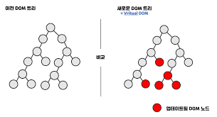
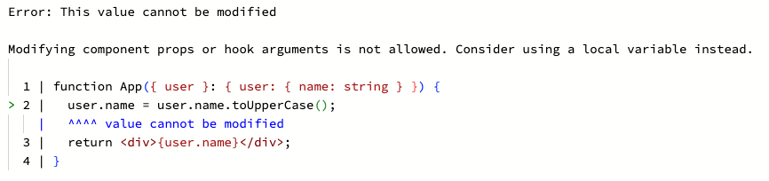
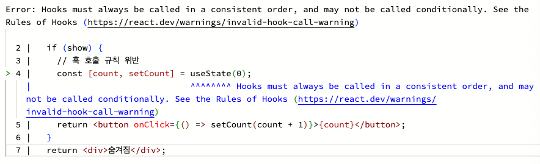
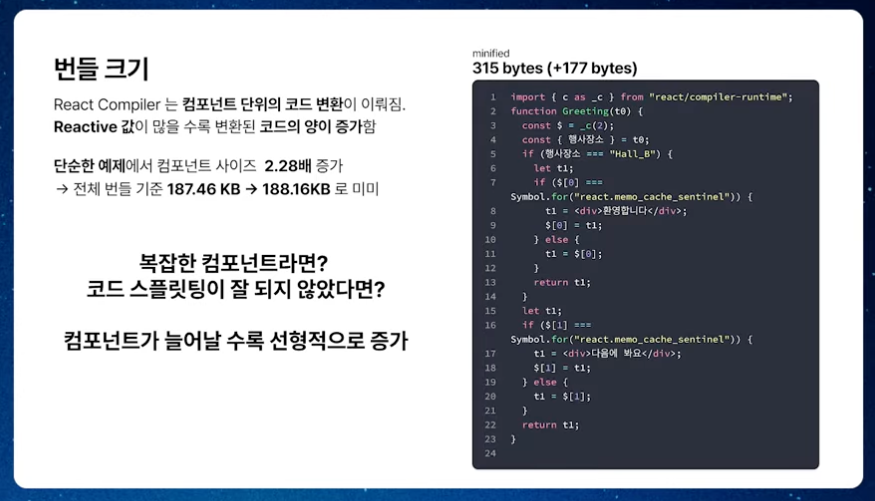
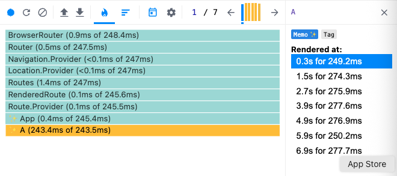
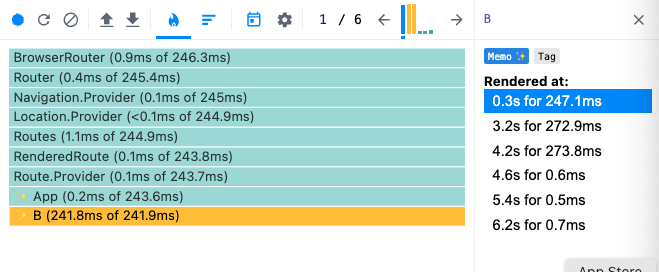

# React Compiler 제대로 이해하기: 자동 최적화의 원리와 한계

## 들어가며

React를 사용하다 보면 누구나 한 번쯤 마주치는 고민이 있습니다.

바로 **“`useMemo`, `useCallback`, `React.memo`는 언제 사용하는 게 가장 좋을까?”** 하는 문제죠.

공식 문서에서도 일부 상황에서는 이를 활용한 최적화를 권장합니다. 예를 들어, 커스텀 훅을 만들 때 `useCallback`을 사용해 함수가 **매 렌더링마다 재생성되지 않도록 하는 것**은 대표적인 사례입니다. ([공식 문서 참고](https://ko.react.dev/reference/react/useCallback#optimizing-a-custom-hook))

하지만 이런 예시 외의 경우에는 명확한 기준을 찾기 어렵습니다. 어떤 개발자는 적극적으로 사용하는 편이고, 어떤 팀은 불필요한 복잡성을 만든다며 거의 쓰지 않기도 합니다. 결국 이 결정은 단순한 문법 지식을 넘어 **개발자의 경험, 팀의 코드 스타일, 그리고 상황마다 달라지기 때문에** 매번 쉽지 않은 선택이 됩니다. 저 역시 프로젝트를 진행하며 이 고민 앞에서 자주 멈칫하곤 했습니다.

그런데 최근 이 고민을 **근본적으로 줄여 줄 수 있는 새로운 접근 방식**이 등장했습니다. 바로 **React Compiler**입니다.

React Compiler는 기존처럼 개발자가 일일이 수동으로 메모이제이션을 설정하지 않아도, **컴파일 단계에서 자동으로 최적화를 적용**합니다. 코드 구조를 유지한 채 성능을 개선할 수 있다는 점에서 큰 변화를 예고하며, 저는 이 새로운 접근 방식이 어떤 원리로 동작하는지 깊이 들여다보고 싶어졌습니다.

## React의 렌더링 구조와 최적화의 필요성

React에서 렌더링은 기본적으로 **부모 컴포넌트가 리렌더링되면 자식 컴포넌트도 함께 리렌더링되는 구조** 로 동작합니다.
이는 React가 지향하는 **선언형 UI의 일관성**을 유지하기 위한 설계 철학 때문입니다.
데이터가 변경되면 트리 전체를 다시 그려 항상 최신 상태를 화면에 반영하도록 보장하는 것이죠.



하지만 이런 구조는 때때로 **불필요한 리렌더링**을 유발합니다. 예를 들어, 부모의 상태가 변경되었지만 자식의 UI에는 아무런 영향을 주지 않는 경우에도 자식 컴포넌트가 다시 렌더링되는 일이 발생하죠. 이러한 불필요한 리렌더링이 쌓이면 곧 **성능 저하**로 이어집니다.

이 문제를 해결하기 위해 React는 몇 가지 **수동 최적화 도구**를 제공합니다.

- `React.memo` – props가 변하지 않은 경우 자식 컴포넌트 전체의 리렌더링을 건너뜁니다.
- `useMemo` / `useCallback` – 특정 값이나 함수의 **재계산을 방지**해 연산 비용이 큰 로직의 실행을 최소화합니다.

즉, 컴포넌트 단위의 리렌더링을 줄이는 방법(`React.memo`)과, 로직 수준에서 불필요한 재계산을 줄이는 방법(`useMemo`, `useCallback`)을 통해 성능을 개선할 수 있습니다.

그러나 이런 수동 최적화에는 명확한 한계도 존재합니다.

먼저, **코드 복잡도가 증가**합니다. 의존성 배열을 신중히 관리해야 하고, 이를 잘못 다루면 오히려 예기치 못한 버그나 유지보수 어려움을 초래할 수 있습니다. 또한 메모이제이션은 결과를 캐시에 저장하기 때문에 **메모리 사용량도 증가**하게 됩니다.

따라서 이러한 도구들을 **무조건적으로 모든 곳에 적용하는 것은 오히려 성능을 악화시키거나 복잡도를 높이는 결과**를 낳을 수 있습니다. 결국 “어디에, 언제” 사용할지 판단하는 것은 여전히 개발자의 몫이 됩니다.

## React Compiler 원리와 동작 방식

### React Compiler란 무엇인가

**React Compiler**는 React 팀이 최근 공개한 새로운 자동화 도구로, 코드 실행 전 **컴파일 단계에서 메모이제이션을 자동으로 적용하는 컴파일러**입니다.

기존에는 개발자가 `React.memo`, `useMemo`, `useCallback` 같은 도구를 직접 사용해 불필요한 리렌더링이나 재계산을 줄여야 했습니다. 하지만 이제는 그런 과정을 수동으로 처리하지 않아도 됩니다. React Compiler가 코드를 정적으로 분석하고 안전한 범위 안에서 **자동으로 캐싱과 재사용 로직을 삽입**하기 때문입니다.

즉, 개발자가 “여기서 memo를 써야 하나?”를 고민하지 않아도, Compiler가 알아서 의존성을 추적하고 필요한 최적화를 적용해 줍니다. 이로써 우리는 최적화에 신경 쓰는 대신 **비즈니스 로직과 사용자 경험에 집중할 수 있는 환경**을 얻게 됩니다.

### 메모이제이션 동작 방식 이해하기

React Compiler의 핵심은 **정적 분석(Static Analysis)**을 통해 코드의 데이터 흐름과 가변성을 파악하고, 이를 기반으로 **자동 메모이제이션을 수행한다는 점**입니다.

컴파일러는 빌드 시점에 Babel이 생성한 **AST(Abstract Syntax Tree, 추상 구문 트리)**를 받아 이를 자체적인 **HIR(High-level Intermediate Representation)**로 변환합니다. 이후 여러 차례의 **컴파일러 패스(Compiler Pass)**를 거치며 코드가 어떻게 데이터를 전달하고 어떤 값이 변경될 수 있는지를 세밀하게 분석합니다.

이 과정에서 React Compiler는 “어떤 값이 변하지 않는지”를 판단하고, 변하지 않는 값에 대해서는 다시 계산하지 않도록 **자동으로 캐싱 로직을 삽입**합니다.

> 심지어 기존의 수동 메모이제이션으로는 불가능했던 조건부 렌더링 이후의 코드까지도 안전하게 메모이제이션할 수 있습니다.

```tsx
import { use } from 'react';

export default function ThemeProvider(props) {
  if (!props.children) {
    return null;
  }
  // 조건부 반환 이후의 코드도 자동으로 메모이제이션
  const theme = mergeTheme(props.theme, use(ThemeContext));
  return (
    <ThemeContext value={theme}>
      {props.children}
    </ThemeContext>
  );
}
```

또한 Compiler는 단순히 메모이제이션을 적용하는 것에 그치지 않고, **React 규칙(Rules of React)**을 검증하는 **검증 패스(validation pass)**도 함께 수행합니다. 이를 통해 데이터 흐름이나 상태 변경에서 React의 규칙이 어겨진 부분을 찾아내어 경고를 제공하며, 이는 `eslint-plugin-react-hooks`를 통해 노출됩니다. 이러한 진단 기능은 코드 속에 잠재해 있던 버그를 조기에 발견하는 데에도 도움이 됩니다.

결과적으로 React Compiler는 다음과 같은 과정을 통해 동작합니다:

1. Babel이 생성한 AST를 자체 HIR로 변환
2. 여러 컴파일러 패스를 통해 **데이터 흐름과 가변성 분석**
3. 안전한 범위에서 **자동 메모이제이션** 로직 삽입
4. **React 규칙 검증**을 통한 잠재적 오류 진단

이처럼 React Compiler는 정적 분석을 통해 성능 최적화를 자동화하는 동시에 코드의 안정성까지 확보합니다. 이를 통해 개발자는 복잡한 의존성 관리나 최적화 포인트 고민에서 벗어나, 핵심 로직과 사용자 경험에 더욱 집중할 수 있습니다.

### 실제 코드로 동작 확인하기

[React Compiler Playground](https://playground.react.dev/)를 사용하면 **내 코드가 어떤 형태로 변환되는지**를 직접 눈으로 확인할 수 있습니다.

예를 들어 아래처럼 단순한 컴포넌트를 작성한다고 해봅시다.

```tsx
function App({ name }: { name: string }) {
  return <div>{expensiveCalculation(name)}</div>;
}
```

이 컴포넌트는 `name`이 변하지 않아도 렌더링될 때마다 `expensiveCalculation()`이 다시 실행됩니다. 하지만 Compiler는 정적 분석을 통해 **“같은 입력값이라면 결과도 같다”**는 사실을 추론하고, 이를 자동으로 캐시하도록 코드를 변환합니다.

React Compiler가 실제로 생성하는 코드는 다음과 같습니다

```tsx
import { c as _c } from "react/compiler-runtime";

const App = (t0) => {
  const $ = _c(4); // 4개의 캐시 슬롯 생성
  const { name } = t0;
  let t1; // expensiveCalculation(name)의 결과를 담을 변수
  if ($[0] !== name) { // 새로운 입력값이라면 계산을 다시 수행하고 결과를 저장
    t1 = expensiveCalculation(name);
    $[0] = name;
    $[1] = t1;
  } else { // 이전과 동일한 입력이라면 저장된 결과를 재사용
    t1 = $[1];
  }
  let t2; // JSX 엘리먼트(<div>{t1}</div>)를 담는 변수
  if ($[2] !== t1) { // 계산 결과(t1)가 달라졌다면 새로운 JSX를 생성
    t2 = <div>{t1}</div>;
    $[2] = t1;
    $[3] = t2;
  } else { // 이전과 동일하다면 저장된 JSX를 재사용
    t2 = $[3];
  }
  return t2;
};
```

위 코드는 React Compiler가 자동으로 삽입한 **메모이제이션 로직**을 보여줍니다.

핵심은 `_c(4)`와 `$[0]`~`$[3]` 슬롯입니다:

- `_c(4)` → 4개의 캐시 슬롯을 가진 저장소를 생성
- `$[0]` → 가장 최근 입력값(`name`)
- `$[1]` → 해당 입력에 대한 계산 결과(`expensiveCalculation`의 반환값)
- `$[2]` → JSX 생성 시 사용된 계산 결과
- `$[3]` → 생성된 JSX 엘리먼트 자체

결과적으로 동일한 `name`이 다시 들어오면:

- `expensiveCalculation()`은 다시 호출되지 않고 `$[1]`의 값을 재사용
- `<div>{t1}</div>` JSX도 다시 생성하지 않고 `$[3]`의 결과를 재사용

즉, **비싼 연산과 JSX 생성 과정 모두를 건너뛰고** 이전 결과를 즉시 반환할 수 있게 되는 것입니다.

이런 구조 덕분에 매 렌더링마다 일어날 수 있는 불필요한 연산이 사라지고, 성능이 효율적으로 개선됩니다.

## React Compiler의 한계와 주의사항

### 자동화에도 불구하고 신경 써야 할 부분

[React 공식 블로그](https://react.dev/blog/2025/10/07/react-compiler-1?utm_source=chatgpt.com#how-does-react-compiler-work)에서도 강조하듯이, React Compiler가 많은 최적화를 자동으로 처리해주지만 **모든 코드를 자동으로 최적화하는 것은 아닙니다.**  Compiler는 코드의 **데이터 흐름(data-flow)**과 **가변성(mutability)**을 정적으로 분석해 안전하다고 판단되는 경우에만 메모이제이션을 적용합니다. 즉, 코드가 React의 규칙을 벗어나거나, 변경 가능성이 불명확한 값을 다룬다면 **자동 최적화 대상에서 제외**됩니다.

예를 들어 다음과 같은 경우에는 Compiler가 메모이제이션을 적용하지 않습니다.

- **직접적인 상태 변경(mutation)**
    
    상태를 직접 변경하거나 객체를 변형하는 코드는 값의 안정성을 보장할 수 없어 캐시 대상에서 제외됩니다.
    
    ```tsx
    function App({ user }: { user: { name: string } }) {
      user.name = user.name.toUpperCase();
      return <div>{user.name}</div>;
    }
    ```
    
    
    

---

- **사이드 이펙트(side effect)를 포함하는 로직**
    
    렌더링 과정에서 네트워크 요청, DOM 조작, 전역 변수 접근 등의 부작용이 발생하면 Compiler는 이를 안전하지 않다고 판단하고 최적화를 수행하지 않습니다.
    
    ```tsx
    function App({ name }: { name: string }) {
      console.log('Rendering...'); // 사이드 이펙트
      return <div>{expensiveCalculation(name)}</div>;
    }
    ```
    
    Playground에서 컴파일된 코드를 보면, 아래처럼 캐시 로직이 적용되지 않은 채 `console.log`가 그대로 남아 있는 것을 확인할 수 있습니다.
    
    ```tsx
    function App(t0) {
      const $ = _c(4);
      const { name } = t0;
      console.log("Rendering..."); // 최적화에서 제외
      // ...
    }
    ```
    

---

- **React 규칙(Rules of React)을 위반하는 코드**
    
    훅의 호출 순서가 조건에 따라 달라지거나, 컴포넌트 외부에서 상태를 직접 조작하는 경우에도 Compiler는 개입하지 않습니다.
    
    ```tsx
    function App({ show }: { show: boolean }) {
      if (show) {
        // 훅 호출 규칙 위반
        const [count, setCount] = useState(0);
        return <button onClick={() => setCount(count + 1)}>{count}</button>;
      }
      return <div>숨겨짐</div>;
    }
    ```
    
    
    

---

이러한 제한은 단점이라기보다 **React Compiler의 안전 장치**라고 보는 것이 맞습니다. Compiler는 무조건 성능만을 추구하는 대신, 애플리케이션의 동작이 깨지지 않는 선에서만 자동 최적화를 수행합니다.

따라서 **자동화에만 의존하기보다는**, 우리가 작성하는 코드가 React의 규칙을 지키고 불필요한 부작용을 포함하지 않도록 신경 쓰는 것이 중요합니다. 이러한 기본 전제를 지켜야만 Compiler가 제 성능을 발휘하고, 자동 메모이제이션의 이점을 온전히 누릴 수 있습니다.

### 번들 크기 증가 가능성

React Compiler는 컴포넌트를 분석해 각 값의 변화를 추적하고, 이를 캐시하기 위한 추가 코드를 삽입합니다. 이 과정에서 원본 코드보다 **약 2~2.5배 정도 코드 크기가 증가**할 수 있으며, 실제로 아래 예시처럼 138B였던 코드가 315B로 늘어난 것을 확인할 수 있습니다.

특히 컴포넌트가 복잡하거나 조건 분기, reactive 값이 많을수록 자동으로 생성되는 코드가 많아져 **초기 번들 크기에 영향을 줄 수 있습니다.**



### 코드 스타일에 따라 효과가 달라진다

React Compiler가 자동으로 메모이제이션을 적용한다고 해도, **코드의 구조와 표현 방식에 따라 최적화 효과는 달라질 수 있습니다.**

즉, 같은 UI를 그리는 코드라도 “어떻게 작성했는가”에 따라 Compiler의 분석 방식이 달라지고, 생성되는 코드의 복잡도나 캐시 전략 또한 달라집니다.

다음 두 가지 예제를 비교해보면 그 차이를 직관적으로 확인할 수 있습니다.

---

예제 A – 단순한 구조, 간결한 코드

```tsx
type Props = {
  name: '권씨' | '오씨' | '박씨';
};

const A = ({ name }: Props) => {
  return <div>{expensiveCalculation(name)}</div>;
};
```

이 컴포넌트는 매우 단순합니다. Compiler는 `expensiveCalculation(name)`이 **입력이 같으면 결과도 같다**는 점을 쉽게 추론하고, 이를 자동으로 캐시하여 재계산을 방지합니다.

컴파일된 코드도 아래처럼 간결합니다.

```tsx
const A = (t0) => {
  const $ = _c(4);
  const { name } = t0;
  let t1;
  if ($[0] !== name) {
    t1 = expensiveCalculation(name);
    $[0] = name;
    $[1] = t1;
  } else {
    t1 = $[1];
  }
  let t2;
  if ($[2] !== t1) {
    t2 = <div>{t1}</div>;
    $[2] = t1;
    $[3] = t2;
  } else {
    t2 = $[3];
  }
  return t2;
};
```

- `_c(4)` → 단 4개의 캐시 슬롯만 필요
- **장점**: 구조가 단순해 Compiler가 손쉽게 추론하고 최적화 가능
- **단점:** 값이 순환(`권씨 → 오씨 → 밖씨 → 권씨`)할 때마다 매번 연산이 다시 실행됨



---

예제 B – 조건문 구조, 더 많은 캐시

```tsx
type Props = {
  name: '권씨' | '오씨' | '박씨';
};

const B = ({ name }: Props) => {
  if (name === '권씨') {
    return <div>{expensiveCalculation(name)}</div>;
  } else if (name === '오씨') {
    return <div>{expensiveCalculation(name)}</div>;
  } else {
    return <div>{expensiveCalculation(name)}</div>;
  }
};
```

이번에는 조건문을 사용했습니다. Compiler 입장에서는 분기마다 **별개의 경로(branch)**를 가진다고 판단해 각 분기별로 별도의 캐시를 생성합니다.

그 결과 코드 복잡도는 높아지지만, 캐시 전략은 더 정교해집니다.

```tsx
const B = (t0) => {
  const $ = _c(12);
  const { name } = t0;
  if (name === "\uAD8C\uC528") {
    let t1;
    if ($[0] !== name) {
      t1 = expensiveCalculation(name);
      $[0] = name;
      $[1] = t1;
    } else {
      t1 = $[1];
    }
    let t2;
    if ($[2] !== t1) {
      t2 = <div>{t1}</div>;
      $[2] = t1;
      $[3] = t2;
    } else {
      t2 = $[3];
    }
    return t2;
  } else {
    if (name === "\uC624\uC528") {
      let t1;
      if ($[4] !== name) {
        t1 = expensiveCalculation(name);
        $[4] = name;
        $[5] = t1;
      } else {
        t1 = $[5];
      }
      let t2;
      if ($[6] !== t1) {
        t2 = <div>{t1}</div>;
        $[6] = t1;
        $[7] = t2;
      } else {
        t2 = $[7];
      }
      return t2;
    } else {
      let t1;
      if ($[8] !== name) {
        t1 = expensiveCalculation(name);
        $[8] = name;
        $[9] = t1;
      } else {
        t1 = $[9];
      }
      let t2;
      if ($[10] !== t1) {
        t2 = <div>{t1}</div>;
        $[10] = t1;
        $[11] = t2;
      } else {
        t2 = $[11];
      }
      return t2;
    }
  }
};
```

- `_c(12)` → 캐시 슬롯이 3배로 증가
- 장점: 각 분기마다 독립적인 캐시를 유지
- 단점: 코드가 복잡해지고 번들 크기가 증가할 수 있음

하지만 이 구조에는 **중요한 장점**이 있습니다.

한 번 계산한 결과는 해당 분기에서 **다시 돌아왔을 때 재계산하지 않고 재사용**됩니다. 즉, `'권씨 → 오씨 → 박씨 → 권씨'`처럼 값이 순환하더라도, 이미 `'권씨'` 분기의 캐시가 존재한다면 재계산이 일어나지 않습니다.



---

결국 이 차이는 Compiler가 **값을 어떻게 관찰하는가**와 관련이 있습니다.

- A의 경우 `name`이 어떤 값이 올지 몰라 **모든 가능성을 하나의 슬롯에 중첩**시킵니다.
    
    → 한 번이라도 다른 값이 들어오면 캐시를 무효화하고 다시 계산합니다.
    
- B의 경우 분기별로 값을 “확정”하여 **각 분기별 캐시를 별도로 관리**합니다.
    
    → 조건문이 많아져도 이전 분기의 결과를 그대로 재사용할 수 있습니다.
    

## 마무리하며

React Compiler는 단순히 “자동으로 memo를 붙여주는 도구”가 아닙니다. 우리가 매번 고민하던 최적화 코드를 작성하지 않아도 **안전한 범위 내에서 React가 스스로 성능을 극대화할 수 있도록 하는 새로운 패러다임**입니다.

하지만 “자동화”는 “무조건 알아서 잘 해준다”는 뜻이 아닙니다. **데이터 흐름이 불명확하거나 사이드 이펙트를 포함한 코드, React 규칙을 어긴 코드에서는 Compiler가 개입하지 않습니다.** 또한 코드 스타일에 따라 캐시 전략과 번들 크기, 렌더링 특성이 달라질 수 있다는 점도 반드시 염두에 두어야 합니다.

즉, React Compiler를 제대로 활용하기 위해서는 우리가 작성하는 코드가 **예측 가능하고, 불변성을 유지하며, React의 규칙을 따르도록 설계**되어야 합니다. 그런 토대 위에서만 Compiler의 자동 메모이제이션이 진가를 발휘하고, 우리가 원하는 수준의 성능 향상을 경험할 수 있습니다.

앞으로 React Compiler가 점차 발전하면서 “성능 최적화”라는 주제는 개발자가 의식적으로 신경 쓰는 영역에서 벗어나 **React 자체의 역할**로 자리 잡게 될 것입니다. 이제 우리에게 필요한 것은 “최적화 자체”가 아니라, **최적화를 잘 활용할 수 있는 코드**를 작성하는 역량입니다.