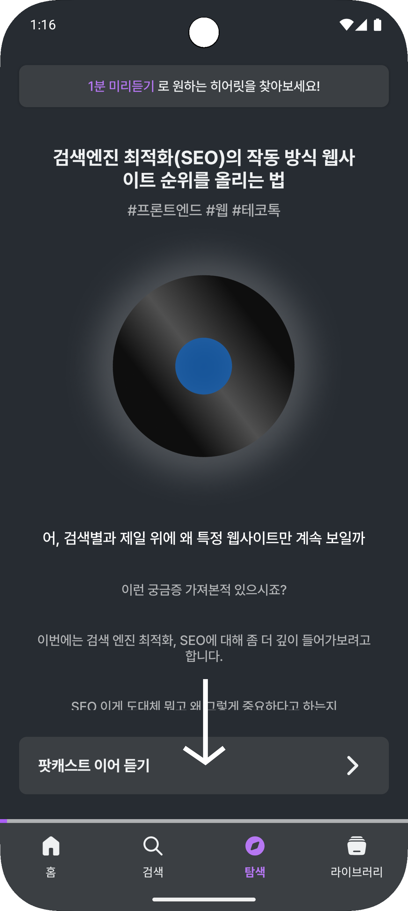
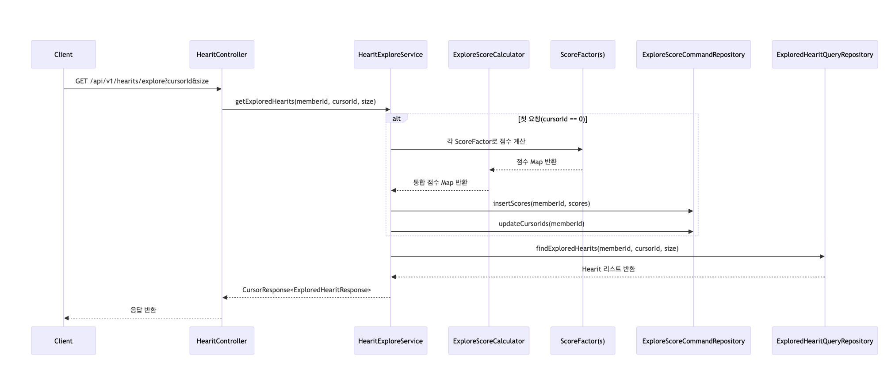

# 무한 스크롤 환경에서 추천 알고리즘 도입하기

## 1. 서론

### 1.1 프로젝트 소개

현재 약 3개월간 개발 중인 **hEARit(히어릿)** 은 개발자 및 IT 종사자에게 유용한 팟캐스트 콘텐츠를 제공하는 모바일 서비스입니다.
사용자는 출퇴근길, 운동 중, 혹은 잠깐의 휴식 시간 동안 CS 지식이나 IT 트렌드 등 다양한 기술 주제를 음성으로 학습할 수 있습니다.
저희 팀은 **"사용자에게 오디오 콘텐츠를 쉽고 다양하게 제공하자"** 라는 공통의 목표를 가지고 기획 및 개발을 진행하고 있습니다.

앱에는 홈, 검색, 북마크 등 여러 화면이 존재하지만, 가장 핵심적인 화면은 **탐색(Explore) 탭** 입니다.
이 화면은 사용자가 스크롤을 내릴 때마다 새로운 콘텐츠를 끝없이 탐색할 수 있는 구조, 즉 **무한 스크롤(Infinite Scroll)** 방식으로 팟캐스트를 제공합니다.
<div style="text-align: center;">
  
</div>

### 1.2 무한 스크롤이란?

무한 스크롤은 사용자가 페이지의 끝에 도달할 때마다 자동으로 다음 데이터를 불러오는 UX/UI 패턴입니다.
대표적으로 인스타그램, 유튜브와 같은 콘텐츠 플랫폼에서 많이 볼 수 있으며,
사용자가 페이지 이동 없이 콘텐츠를 '끊임 없이' 소비할 수 있다는 점에서 체류 시간을 증가시키는데 큰 장점이 있습니다.

히어릿에서는 초기 개발 단계부터 지속적으로 콘텐츠를 업로드하고 있습니다.
따라서 제공할 개발 팟캐스트가 많아질수록,
탐색 화면에서 사용자가 관심 있는 주제의 팟캐스트를 자연스럽게 발견할 수 있는 경험을 줄 수 있습니다.
즉, **무한 스크롤 방식은 사용자가 다양한 콘텐츠를 경험하도록 돕는 핵심 기능**입니다.

| **항목** | **장점**                   |
|--------|--------------------------|
| 사용자 경험 | 콘텐츠 몰입도 향상, 다양한 주제 탐색 가능 |
| 서버 측면  | 페이지 이동 최소화로 요청 단순화       |
| 디자인    | 직관적인 UI 제공               |

## 2. 본론

> 본론에 나오는 코드 구현 환경은 SpringBoot와 JPA 입니다.

### 2.1 단순 랜덤 정렬 기반 추천

히어릿이 서비스 초기에 보유한 팟캐스트 콘텐츠는 약 50개, 카테고리는 5개 남짓이었습니다.
또한 북마크나 재생기록 같은 사용자 활동 데이터가 충분히 쌓이지 않아, 사용자의 취향을 반영한 추천은 사실상 불가능한 상태였습니다.
그래서 우선 서비스의 최소한의 핵심 기능(MVP, Minimum Viable Product)를 빠르게 완성하기 위해
**랜덤 정렬(Random Order) 기반의 추천 방식**을 사용했습니다.
이는 MySQL의 `RAND()` 함수를 이용하여 사용자가 화면에 진입할 때마다 매번 다른 콘텐츠 순서를 보여주는 방식으로 간단하게 구현할 수 있습니다.

```java

@Query("SELECT h FROM Hearit h ORDER BY function('RAND')")
Page<Hearit> findRandom(Pageable pageable);
```

Spring Boot와 JPA 환경에서 이 방식은 빠르게 구현이 가능했지만,
무한 스크롤 환경에서는 **성능적 한계**와 **사용자마다 불필요한 추천이 빈번하게 발생**한다는 심각한 문제점이 있습니다.

| **문제점**       | **설명**                               |
|---------------|--------------------------------------|
| COUNT 쿼리 오버헤드 | 오프셋 기반 페이지네이션에서 불필요한 쿼리 수행           |
| 불안정한 일관성      | 스크롤 수행 시, 콘텐츠 순서가 달라져 클라이언트 측 개발 어려움 |
| 개인화 부재        | 사용자의 개인 취향이나 관심사 반영 확장성 저하           |

이 문제점들은 히어릿 팀의 본질적인 목표인 **"사용자가 진짜 원하는 콘텐츠를 발견하게 하자"** 를 달성하기 어렵습니다.
따라서 탐색 화면의 무한 스크롤 구현 방식을 변경하고 히어릿 만의 개인화 추천 알고리즘을 설계했습니다.

### 2.2 페이지네이션 전략 개선

Spring Data JPA에서는 페이지네이션(Pagination)을 지원하는 `Pageable` 인터페이스를 제공합니다.
이를 통해 쉽게 오프셋(offset) 기반 페이지네이션을 적용할 수 있습니다.
원한는 정보를 얻기 위해 지정한 정보를 Pageable 구현체에 전달한다면 `Page` 객체를 반환할 수 있습니다.
이 객체는 조회된 데이터와 페이지 정보(다음 페이지 존재 여부, 전체 콘텐츠 수 등)를 함께 갖습니다.
이는 클라이언트가 콘텐츠 리스트에 대한 많은 정보를 확인하기에 편리하지만,
전체 컨텐츠 수를 계산하기 위한 불필요한 `COUNT(*)` 쿼리가 반복 실행되어 성능에 부담을 줍니다.

하지만 탐색 탭의 무한 스크롤 방식에서는 전체 콘텐츠 개수를 알 필요가 없습니다.
클라이언트는 오직 **마지막으로 본 콘텐츠 이후의 데이터**만 알면 됩니다.
이 문제를 해결하기 위해 **커서 기반 페이지네이션(Cursor Pagination) 방식을 도입**할 수 있습니다.
커서 기반 페이지네이션은 마지막으로 조회한 데이터의 위치(cursor)를 기준으로 다음 데이터를 가져오는 방식으로,
오프셋(offset) 방식과 달리 전체 `COUNT(*)` 쿼리가 필요하지 않아, 불필요한 DB 연산이 제거됩니다.

```java

@Query("""
        SELECT h AS hearit, es.cursorId AS cursorId
        FROM ExploreScore es
        JOIN Hearit h ON es.hearitId = h.id
        WHERE es.userUuid = :userUuid AND es.cursorId > :cursorId
        ORDER BY es.cursorId ASC
        """)
List<ExploredHearitProjection> findExploredHearits(@Param("userUuid") String userUuid,
                                                   @Param("cursorId") Long cursorId,
                                                   Pageable pageable);
```

이처럼 커서 기반 페이지네이션을 사용하면, `cusorId`와 조회 시 사용되는 컬럼(`userUuid`)에 복합 인덱스(Composite Index)를 적용할 수도 있습니다.
이 인덱스를 사용해 조회 성능을 크게 향상시킬 수 있으며, 데이터가 많아지더라도 일정한 속도를 유지할 수 있게 합니다.
실제로 히어릿의 각 콘텐츠에 커서 ID를 부여하고 (user_uuid, cursor_id) 조합으로 관리해
복합 인덱스를 적용하여 조회 속도가 **851ms → 0.133ms**로 개선되었습니다.

```sql
CREATE INDEX idx_explore_score_user_cursor ON explore_score (user_uuid, cursor_id);
```

### 2.3 사용자 선호도 기반 점수(Score) 시스템 도입

랜덤 정렬 기반의 추천의 가장 큰 한계는 사용자가 어떤 카테고리를 좋아하는지,
어떤 콘텐츠를 관심있어 할 지에 대해 반영되지 않는다는 점입니다.
이는 개인화된 추천 알고리즘으로 확장할 수 없습니다.
따라서 히어릿 팀은 '각 콘텐츠가 사용자에게 얼마나 적합한가'를 수치화한 **선호도 점수 시스템**을 설계했습니다.

| **점수 항목**    | **설명**                             |
|--------------|------------------------------------|
| 북마크 카테고리 선호도 | 사용자가 많이 북마크한 카테고리에 속한 컨텐츠일수록 높은 점수 |
| 콘텐츠 최신성      | 작성일이 최근일수록 높은 점수                   |
| 랜덤성          | 개인화로 인한 일관된 추천을 막기 위해 무작위 가중치      |

이 시스템에서 중요한 계산 로직은 각 점수 항목을 계산하고 콘텐츠마다 점수 총합을 계산하는 것입니다
이때, 기능이 계속 추가되고 사용자 데이터가 빠르게 증가하는 서비스 초기 단계에 점수에 대한 항목들은 빠른 시일 내에 추가될 가능성이 높습니다.
따라서 새로운 추천 요소가 추가되더라도 기존 합산 로직은 건드리지 않도록 인터페이스 상속을 통한 **다형성을 활용**했습니다.
먼저, 합산 항목에 대한 인터페이스를 생성합니다.

```java
public interface ScoreFactor {
    Map<Long, Double> calculate(String uuid, List<Hearit> hearits);

    boolean isSupported(UserType userType);
}
```

북마크 카테고리 선호도의 경우는 다음과 같이 구현할 수 있습니다.
추후 재생 기록이나 조회수에 대한 항목을 추가하려면 **ScoreFactor 인터페이스를 구현**하기만 하면 됩니다.

```java

@Component
public class BookmarkScoreFactor implements ScoreFactor {
    @Override
    public Map<Long, Double> calculate(String uuid, List<Hearit> hearits) {
        // 사용자의 북마크 패턴 기반 가중치 계산
    }

    @Override
    public boolean isSupported(UserType userType) {
        return userType == UserType.MEMBER;
    }
}
```

계산 로직에서는 이렇게 생성된 ScoreFactor들의 합산을 구하고
**JdbcTemplate의 Batch Insert로 저장**하여, JPA의 반복 INSERT 호출로 인한 오버헤드를 줄였습니다.

### 2.4 회원/비회원 전략 분리

개인화 추천을 위해서는 사용자 데이터가 필요합니다.
하지만 히어릿 앱에서는 서비스 기획 상, 비회원에 대한 북마크나 재생기록 같은 사용자 데이터를 저장하지 않습니다.
따라서 회원과 비회원에게 동일한 로직을 적용하면 **불필요한 DB 접근과 연산 낭비가 발생**합니다.
이를 해결하기 위해 회원/비회원에 대한 로직 분리가 필요했고,
`if-else` 문보다 코드 변경시 변경 지점을 찾기 쉬운 회원과 비회원 로직 구분에 **전략 패턴(Strategy Pattern)** 을 적용했습니다.

회원과 비회원은 동일한 목적으로 **"콘텐츠마다 점수를 계산한다"** 라는 역할을 가지므로 다음과 같이 행동을 인터페이스화 할 수 있습니다.

```java
public interface ExploreScoreProcessor {
    void refreshScores(UserInfo userInfo, long cursorId);

    List<ExploredHearitResponse> getExploreHearits(UserInfo userInfo, long cursorId, int size);
}
```

이후 **회원(Member)과 비회원(Guest)의 점수 계산 전략을 완전히 분리**하여 로직 변경 지점을 하나로 통합할 수 있습니다.

```java

@Component
public class MemberExploreScoreProcessor implements ExploreScoreProcessor {
    // 북마크 + 최신성 + 랜덤 요소 반영
}

@Component
public class GuestExploreScoreProcessor implements ExploreScoreProcessor {
    // 최신성 + 랜덤 요소만 반영
}
```

```java

@Service
@RequiredArgsConstructor
public class HearitExploreService {

    private final List<ExploreScoreProcessor> exploreScoreProcessors;

    public CursorResponseV2<ExploredHearitResponse> getExploredHearits(UserInfo userInfo, CursorRequest cursorRequest) {
        ExploreScoreProcessor exploreScoreProcessor = getExploreScoreProcessor(userInfo);
        exploreScoreProcessor.refreshScores(userInfo, cursorRequest.cursorId());
        List<ExploredHearitResponse> exploreHearitsResponses = exploreScoreProcessor.getExploreHearits(...);
        ...
        // 응답 반환
    }

    private ExploreScoreProcessor getExploreScoreProcessor(UserInfo userInfo) {
        for (ExploreScoreProcessor exploreScoreProcessor : exploreScoreProcessors) {
            if (exploreScoreProcessor.isSupported(userInfo)) {
                return exploreScoreProcessor;
            }
        }
        throw new IllegalStateException("지원하지 않는 유저입니다.");
    }
}
```

### 2.5 최종 탐색 화면 흐름

<div style="text-align: center;">
  
</div>

히어릿의 탐색 화면은 최종적으로 사용자가 앱을 사용하면서 쌓아온 데이터들을 기반으로 팟캐스트를 추천하고 있습니다.
정리하면 다음과 같습니다.

1. 클라이언트 요청 발생
    - 사용자가 탐색 탭을 열거나 스크롤을 내려 다음 콘텐츠를 요청합니다.
    - 클라이언트는 마지막으로 본 콘텐츠 `cursorId`와 불러올 콘텐츠 개수(`size`)를 서버로 전달합니다.
2. 적절한 추천 프로세서 선택
    - 서버에서는 사용자 유형(UserInfo)를 확인합니다.
    - 회원(Member)의 경우 북마크한 카테고리 점수 등을 비롯한 개인화된 요소를 함께 계산합니다.
    - 비회원(Guest)의 경우 랜덤성에 대한 항목을 고려한 점수를 계산합니다.
3. 계산된 점수는 합산 후 Batch Insert로 `ExploreScore` 테이블에 저장됩니다.
4. 서버는 클라이언트에게 받은 `cursorId` 이후 항목만 조회하여 반환합니다.

이 구조 덕분에, 사용자는 탐색을 하는 동안 자연스럽게 새 콘텐츠를 경험할 수 있으며, DB의 부하를 줄이면서 개인화 추천을 제공할 수 있습니다.

## 3. 결론

지금까지 추천 알고리즘 구현 방식을 프로젝트 초기 단계에서 발전시키는 과정을 설명했습니다.
초기 MVP 단계에서는 단순히 RAND() 기반으로 화면을 채웠지만,
커서 페이지네이션과 점수 기반 개인화, 회원/비회원 전략 분리 등 여러 개선을 통해 안정적이면서도 확장 가능한 구조를 만들 수 있었습니다.
추후 다양한 사용자 경험 데이터들이 쌓인다면 이를 접목한 탐색 알고리즘 요소를 더할 수 있어 사용자에게 더욱 의미있는 추천을 할 수 있다고 기대합니다.

이 과정을 통해 느낀 핵심은 빠른 MVP 구현과 점진적 개선의 중요성입니다.
처음부터 많은 데이터를 가질 수 없습니다. 그렇다고 사용자가 우리의 앱을 사용하기를 기다릴 수만은 없습니다.
이런 환경에서 점진적으로 복잡성을 늘리며 안정성을 확보하는 전략이 효과적이었습니다.

이후에도 다음과 같은 발전 방향을 계획하며 사용자 피드백과 데이터 분석을 기반으로 더 많은 사용자의 관심사를 반영할 수 있는 시스템을 만들겠습니다.

- **실시간 점수 반영**: 재생 기록, 조회수 등 다양한 데이터를 실시간으로 점수에 반영하여 추천 정확도 향상
- **서비스 확장성 확보**: 콘텐츠 및 사용자 증가에도 일정한 응답 속도 유지와 DB 부하 최소화
