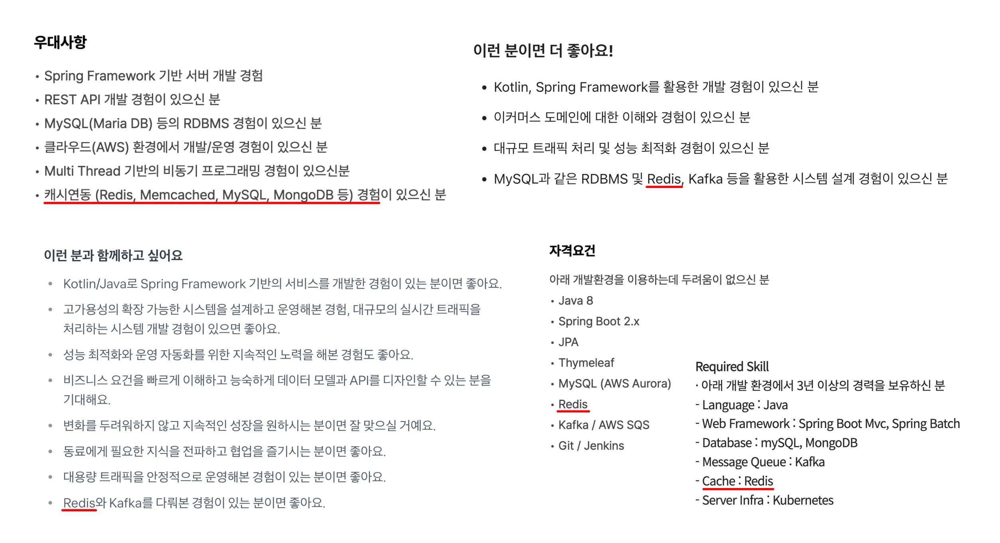
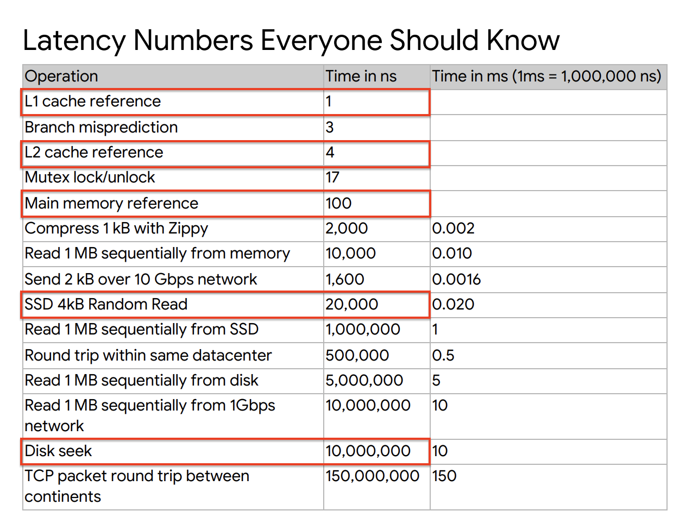
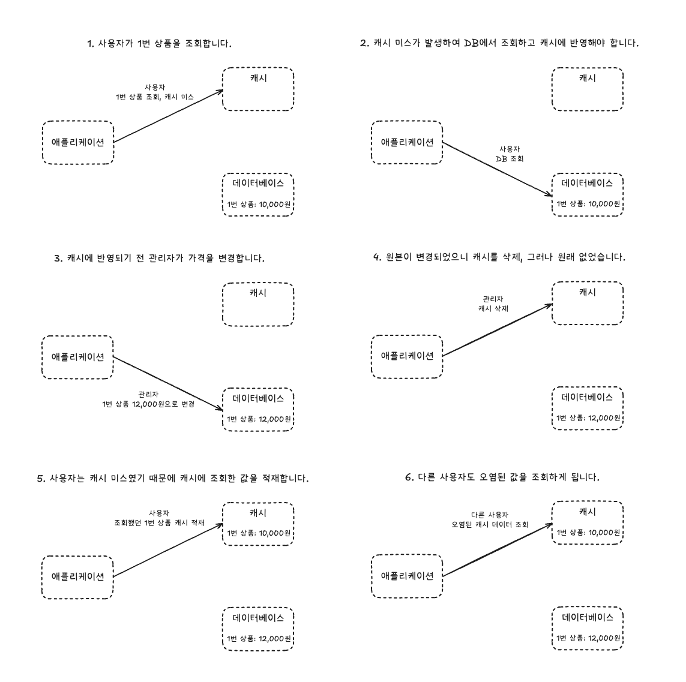
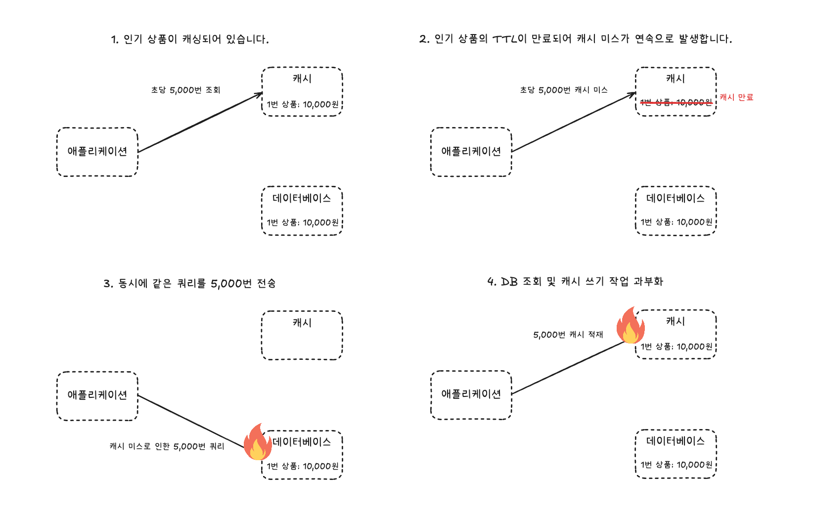
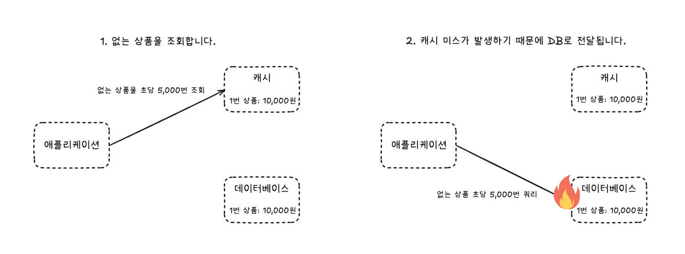
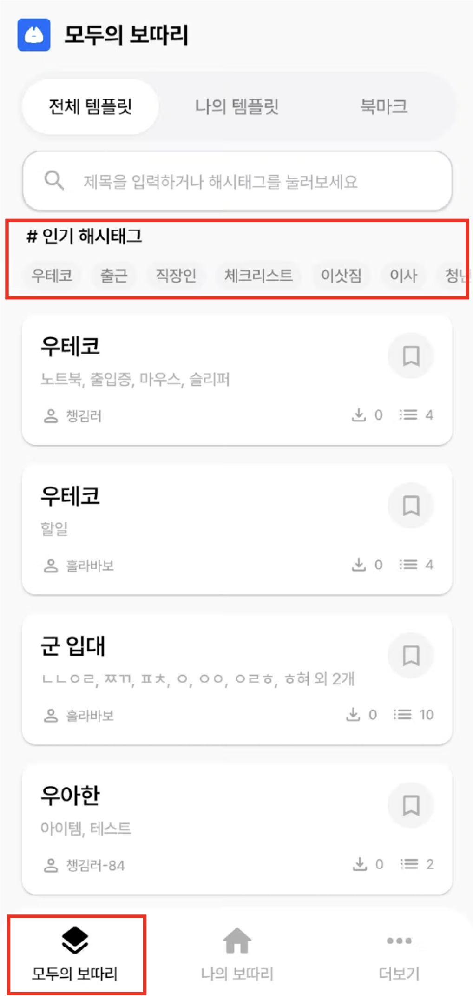
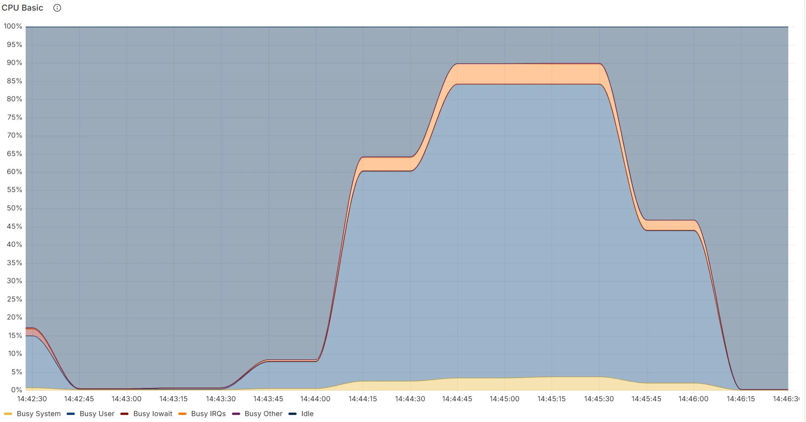

# Redis로 살펴보는 캐시 전략 설계 가이드 - 우리 서비스에 진짜 필요한 캐시는 무엇인가?

## 들어가며

서비스 트래픽이 늘어나면서 사용자는 점점 더 빠른 응답을 기대합니다. 반복적인 읽기 요청이 데이터베이스에 부담을 주기 시작하면, 개발자는 가장 먼저 캐시 도입을 떠올립니다.



실제로 Redis와 같은 캐시 솔루션은 많은 기업에서 필수 기술로 자리 잡았습니다.
하지만 캐시가 모든 문제를 해결해주지 않는다는 점을 명심해야 합니다.
성능 향상이라는 명확한 이점 뒤에는 데이터 정합성, 운영 복잡도, 장애 전파라는 까다로운 문제가 숨어 있습니다.
잘못 도입한 캐시는 오히려 시스템 전체를 위협하는 기술 부채가 될 수도 있습니다.

이 글은 캐시를 적용하면 빠르다는 단순한 결론을 넘어, 캐시가 왜 필요한지, 어떤 트레이드오프가 있는지, 그리고 우리 서비스 상황에 맞는 전략은 무엇인지 단계별로 살펴봅니다. 그리고 마지막으로 저희 보따리 팀이 어떤 캐시 전략을 선택했는지 그 경험을 공유합니다.

> ### 보따리
>
> 어떤 순간에도 빠짐없이 챙길 수 있도록 돕는 체크리스트 및 알림 서비스입니다. 
> 우아한테크코스에서 백엔드 4명, 안드로이드 3명으로 구성된 팀으로 서비스를 개발하고 있습니다.
>
> 플레이스토어에서 [보따리](https://play.google.com/store/apps/details?id=com.bottari.bottari&hl=ko)를 만날 수 있어요!

## 대상 독자

이런 분들께 추천합니다.

- 성능 개선과 부하 감소를 위해 캐시 도입을 고민하는 개발자
- 이미 캐시를 쓰고 있지만, 현재 전략이 최선인지 점검하고 싶은 분
- 캐시를 단순한 도구를 넘어, 시스템 아키텍처 관점에서 이해하고 싶은 분

## 목차

- [캐시란 무엇인가](#캐시란-무엇인가)
- [왜 캐시가 필요한가, 그리고 캐시는 왜 빠른가](#왜-캐시가-필요한가--그리고-캐시는-왜-빠른가)
- [캐싱 전략의 설계와 트레이드오프](#캐싱-전략의-설계와-트레이드오프)
- [실전 운영: 예측 가능한 문제와 방어 전략](#실전-운영-예측-가능한-문제와-방어-전략)
- [보따리에서는 캐시를 어떻게 적용했을까?](#보따리에서는-캐시를-어떻게-적용했을까)
- [마치며](#마치며)

# 캐시란 무엇인가

## 원칙: 느린 원본을 두고, 빠른 복사본을 사용한다

자주 사용하는 물건은 가까운 곳에 두는 것이 효율적입니다. 
예를 들어, 매일 마시는 커피 캡슐을 보관하는 위치를 생각해봅시다. 
매번 마트에 가서 사오는 대신, 집 안 쉽게 손에 닿는 서랍에 두는 것이 훨씬 편리합니다.

```
마트 (멀고 느림)
  ↓
주방 캐비닛 (가깝지만 찾는 시간 필요)
  ↓
머신 옆 서랍 (바로 꺼낼 수 있음)
```

컴퓨터 시스템의 데이터 접근 원리도 마찬가지입니다. 데이터는 속도가 다른 여러 저장소에 계층적으로 존재합니다.

```
CPU 레지스터 (수 나노초)
   ↓
L1/L2 캐시 (수십 나노초)
   ↓
메모리/RAM (수백 나노초)
   ↓
디스크/SSD (수 밀리초)
   ↓
네트워크/DB (수십~수백 밀리초)
```

> 이 계층 구조는 단일 컴퓨터 안의 메모리 구조를 넘어, 서버 간 네트워크 요청에도 그대로 확장됩니다. 즉, CPU와 RAM 사이의 캐시는 한 프로세스 내부에서의 ‘로컬 캐시’라면, Redis는 여러 서버가 데이터를 공유하기 위한 ‘네트워크 레벨의 메모리 캐시’ 역할을 합니다.

캐시는 이 계층 구조를 이용해 느린 원본과 빠른 애플리케이션 사이의 속도 차이를 해결합니다. 자주 사용하는 데이터의 빠른 복사본을 원본(데이터베이스)보다 훨씬 가까운 메모리에 임시로 저장해 두는 기술입니다.

궁극적인 목표는 데이터베이스 같은 느린 원본 저장소 접근을 최소화해서, 시스템 전체 응답 속도를 높이고 부하를 줄이는 겁니다. 하지만 이 복사본이 항상 원본과 같다고 보장할 순 없고, 바로 여기서부터 캐시의 복잡성이 시작됩니다.

## 이 문서에서 다루는 캐시

컴퓨터 과학에는 다양한 종류의 캐시가 있지만, 이 글에서는 애플리케이션 레벨의 캐시, 특히 Redis를 이용한 캐시 전략을 다룹니다.

**다루지 않는 것**

- Redis 설치 방법이나 기본 명령어 튜토리얼
- Memcached, Hazelcast 등 다른 솔루션과의 상세 비교
- Redis Cluster 구성의 세부 설정

이 글은 단순한 기술 사용법을 알려주는 것을 넘어, 우리 서비스에 맞는 캐시 전략을 선택하고 운영하는 데 필요한 지식과 관점을 공유하는 것이 목표입니다.

# 왜 캐시가 필요한가, 그리고 캐시는 왜 빠른가

캐시 도입을 고민하게 되는 이유는 대부분 같습니다.
느린 데이터베이스가 빠른 애플리케이션의 발목을 잡기 시작했기 때문입니다.
이 병목이 어떤 과정을 통해 발생하는지, 그리고 왜 캐시가 근본적인 해결책이 될 수 있는지를 구체적인 사례를 통해 살펴보겠습니다.

## 느린 원본이 만든 병목

온라인 쇼핑몰의 인기 상품 상세 페이지를 생각해 봅시다.

- 평시: 응답 시간 300ms로 쾌적하게 서비스 중
- 이벤트 진행 후: 응답 시간이 1초 이상으로 급증하며 사용자 불만 발생
- 원인 분석: 동일한 SELECT 쿼리가 데이터베이스에서 초당 5,000번씩 반복 실행 중

```sql
SELECT id, name, price FROM products WHERE id = 12345;
SELECT id, name, price FROM products WHERE id = 12345;
SELECT id, name, price FROM products WHERE id = 12345;
... (초당 5,000번)
```

이 상품 정보는 거의 변하지 않는 정적 데이터에 가깝지만,
요청이 들어올 때마다 매번 데이터베이스까지 다녀오면서 데이터베이스 커넥션과 I/O가 불필요하게 소모됩니다.
이런 반복 조회가 쌓이면 `데이터베이스 커넥션 고갈 → 응답 지연 → 서비스 전체 장애`와 같은 연쇄 반응이 일어납니다.

문제의 본질은 단순합니다.

> 변하지 않는 데이터를 매 요청마다 데이터베이스에서 읽어오는 구조 자체가 병목을 만든다.

즉, 단순한 스케일업이나 인덱스 튜닝으로는 문제를 일시적으로 완화할 뿐, 데이터베이스가 다시 한계에 도달하는 시점은 시간 문제입니다.

## 빠른 복사본으로 병목 해소

자주 조회되는 데이터를 더 가까운 곳에 두는 것으로 문제를 해결할 수 있습니다.

**첫 요청 (Cache Miss)**

```
App → Redis (데이터 없음) → 데이터베이스 → Redis에 저장 → 사용자 응답
```

**이후 요청 (Cache Hit)**

```
App → Redis (데이터 있음) → 사용자 응답
```

캐시가 한 번 채워지면, 이후 요청은 데이터베이스를 거치지 않고 빠르게 응답할 수 있습니다.
데이터베이스 부하가 크게 줄고, 사용자는 눈에 띄게 짧은 응답 시간을 경험합니다.

## 캐시는 왜 빠른가, 메모리와 디스크의 물리적 차이

캐시가 빠른 이유는 기술적으로 최적화가 잘 되어 있어서가 아닙니다.
메모리와 디스크가 가진 물리적 구조 자체가 완전히 다르기 때문입니다.

메모리(RAM)는 전기 신호로 직접 데이터를 읽고 쓰는 반면,
디스크는 내부에서 헤드를 움직여 특정 위치를 찾아가는 물리적 동작이 필요합니다.
이 차이는 미세한 수준이 아니라, 수백~수천 배 이상의 속도 차이를 만들어냅니다.



출처: [Latency Numbers Everyone Should Know, Google SRE](https://static.googleusercontent.com/media/sre.google/ko//static/pdf/rule-of-thumb-latency-numbers-letter.pdf)

| 저장소 계층 | 지연 시간 (ns) | 상대 속도 (직관적 비유) |
| :--- | :--- | :--- |
| **L1 캐시** | 1 ns | 1초 |
| **L2 캐시** | 4 ns | 4초 |
| **메인 메모리 (RAM)** | 100 ns | 1분 40초 |
| **SSD (4KB 랜덤 읽기)** | 20,000 ns | **약 5.5시간** |
| **HDD (Disk Seek)** | 10,000,000 ns | **약 115일** |

CPU가 L1 캐시에서 데이터를 가져오는 시간을 1초라고 한다면, 메모리에서 가져오는 건 1분 40초 정도입니다. 
하지만 SSD에서 읽어오는 건 5.5시간, HDD는 115일이 걸리는 것과 마찬가지입니다.

트래픽이 몰릴 때, 이 단순한 물리적 차이가 시스템 전체의 성능을 결정짓습니다.

## 빠름의 대가: 트레이드오프 3가지

캐시는 분명 빠릅니다.
하지만 그 빠름에는 피해야 할 함정과 함께 고려해야 할 비용이 존재합니다.
캐시를 도입하기 전에 반드시 이 세 가지를 함께 생각해야 합니다.

**1. 데이터 정합성 (Consistency)**

캐시의 데이터는 특정 시점의 복사본(스냅샷)일 뿐, 원본의 최신 상태를 100% 보장하진 않습니다. 
데이터베이스에 가격이 12,000원으로 바뀌어도 캐시엔 여전히 10,000원이 남아 있을 수 있습니다.

"얼마나 오래된 데이터를 허용할 것인가?" 이 질문은 기술이 아닌, 비즈니스가 답해야 할 문제입니다.

**2. 운영 복잡도 (Complexity)**

이제 우리는 데이터베이스뿐 아니라 Redis라는 관리 포인트가 하나 더 늘었습니다.
데이터 갱신, 장애 대응, 만료 정책 같은 새로운 고민거리가 생깁니다.

**3. 비용 (Cost)**

당연하지만, 메모리는 디스크보다 비쌉니다. 
캐시 서버를 운영하고 모니터링하는 데도 돈과 인력이 추가로 듭니다.

## 도입 전 스스로 던져야 할 질문들

| 구분 | 캐시 도입이 유리한 경우 | 캐시 도입이 위험한 경우 |
| :--- | :--- | :--- |
| **데이터 특성** | 조회가 잦고 갱신이 드문 데이터<br>예: 상품 정보, 카테고리, 공지사항 | 변경이 잦고 일관성이 중요한 데이터<br>예: 장바구니 수량, 실시간 재고, 결제 상태 |
| **트래픽 패턴** | 동일 요청이 반복되는 API<br>예: 메인 페이지, 인기 상품 목록 | 읽기보다 쓰기가 많아 캐시 부하가 적은 경우<br>예: 사용자 업로드 데이터 |
| **비즈니스 요구** | 약간의 데이터 불일치 허용 가능<br>예: 조회수, 좋아요 수 | 데이터 정확성이 절대적<br>예: 포인트 잔액, 주문 금액 |
| **장애 대응** | 캐시 미스 시에도 데이터베이스에 여유 있음 | 캐시 미스 시 데이터베이스가 즉시 병목 |

**핵심 질문**

1.	데이터는 얼마나 자주 바뀌는가?
2.	사용자가 잠시 이전 데이터를 봐도 괜찮은가?
3.	캐시가 없어도 시스템이 버틸 수 있는가?

## 관점의 전환: 캐시는 ‘속도’가 아니라 ‘부하 분산’이다

캐시는 단순히 응답 시간을 줄이는 기술이 아닙니다.
본질은 데이터베이스가 감당하던 반복적인 읽기 부담을 대신 흡수하는 완충 장치에 가깝습니다.

빠른 응답은 이 과정에서 자연스럽게 따라오는 결과일 뿐, 캐시 도입의 진짜 목적은 시스템 전체의 안정성과 자원의 효율적 분배에 있습니다.

예를 들어 1초에 5,000건의 상품 상세 요청이 들어올 때, Cache Hit 비율이 90%라면 데이터베이스는 5,000건이 아닌 500건만 처리하면 됩니다. 즉, DB 커넥션, I/O, 락 경합 등에 소모되던 리소스가 10분의 1로 줄어드는 셈입니다.

이처럼 부하 분산(Load Distribution)이야말로 캐시의 진짜 가치이며, 단순한 속도 향상보다 훨씬 근본적인 시스템 개선 효과를 가져옵니다.

# 캐싱 전략의 설계와 트레이드오프

캐시를 도입하기로 결정했다면, 이제 **어떻게 데이터를 읽고 쓸지 구체적인 방법**을 정해야 합니다. 
캐싱 전략에는 여러 이름이 있지만, 용어를 외우는 것보다 각 방식이 어떤 문제를 해결하고 어떤 트레이드오프를 갖는지 이해하는 것이 훨씬 중요합니다.

이 장에서는 데이터 **정합성**, **성능**, **구현 복잡도**라는 세 가지 축을 기준으로 우리 상황에 맞는 전략을 설계하는 방법을 살펴봅니다.

## 기본 전략 — Cache-Aside (가장 일반적인 방식)

이런 상황에 좋습니다.

- 읽기 요청이 쓰기보다 압도적으로 많은 경우
- 데이터가 아주 잠깐 틀려도 서비스에 큰 문제가 없는 경우

이름은 생소할 수 있지만, 사실상 대부분의 개발자가 캐시를 구현하는 방식입니다. 핵심은 간단합니다. 

> 애플리케이션이 캐시를 직접 제어한다.

- **읽기 (Lazy Loading)**: 데이터 요청이 오면, 애플리케이션이 캐시를 먼저 확인합니다. 데이터가 없으면(Cache Miss), 그제야 데이터베이스에서 데이터를 읽어와 캐시에 저장하고 사용자에게 반환합니다. 필요한 데이터만 캐시에 넣기 때문에 메모리를 효율적으로 사용할 수 있습니다.
- **쓰기 (Cache Invalidation)**: 데이터 변경이 필요하면, 애플리케이션은 데이터베이스의 데이터를 먼저 변경합니다. 그리고 캐시에 있는 기존 데이터는 그냥 삭제(Invalidate)해버립니다. 그러면 다음에 이 데이터를 읽으려는 요청은 자연스럽게 Cache Miss가 되고, 데이터베이스에서 최신 데이터를 가져와 캐시에 다시 채우게 됩니다.

### 예시 코드

```java
public Product getProduct(Long productId) {
    String cacheKey = "product:" + productId;

    // 1. 캐시에서 조회
    // Redis Command: GET product:12345
    Product product = redis.get(cacheKey);
    if (product != null) {
        return product; // 캐시 히트
    }

    // 2. 캐시 미스 시 DB에서 조회
    product = database.queryProductById(productId);
    if (product != null) {
        // Redis Command: SET product:12345 "{\"id\":12345,...}" EX 3600
        redis.set(cacheKey, product, TTL); // 캐시에 저장
    }
    return product;
}

public void updateProduct(Product product) {
    String cacheKey = "product:" + product.getId();

    // 1. DB 업데이트
    database.updateProduct(product);

    // 2. 캐시 무효화
    // Redis Command: DEL product:12345
    redis.delete(cacheKey);
}
```

### 트레이드오프 분석

**장점**

- **간단한 구현과 유연성**: 로직이 코드에 명확하게 드러납니다. 특정 데이터만 캐시 시간을 다르게 설정하는 등 세밀한 제어가 쉽습니다.
- **빠른 쓰기 속도**: 쓰기 작업은 데이터베이스에만 반영하고 캐시는 지우기만 하면 되므로 빠릅니다.

**단점**

- **비즈니스 로직 오염**: 서비스 로직(ProductService)에 캐시를 확인하고(GET), 저장하는(SET) 코드가 섞여 코드가 지저분해질 수 있습니다.
- **아주 짧은 순간의 데이터 불일치**: 데이터베이스가 업데이트되고 캐시가 삭제되기 전, 그 찰나의 순간에 다른 사용자가 데이터를 읽으면 오래된 데이터를 볼 수 있습니다. (이 문제는 뒤에서 자세히 다룹니다.)
- **첫 요청은 항상 느림**: 캐시에 없는 데이터에 대한 최초의 요청은 항상 데이터베이스를 거쳐야 합니다.

## 위임 전략 — Spring Cache (@Cacheable)

이런 상황에 좋습니다
- Spring(Boot) 환경을 사용하는 경우
- Cache-Aside 전략을 쓰고 싶은데, 비즈니스 로직을 깔끔하게 유지하고 싶은 경우
- 반복적인 캐시 제어 코드를 직접 작성하기 싫은 경우

이 접근법의 핵심은 반복적인 캐시 제어 로직을 프레임워크(예: Spring Cache)에 맡긴다는 것입니다. 개발자는 쉽게 캐싱을 구현할 수 있습니다.

- **읽기 (`@Cacheable`)**: 메서드에 `@Cacheable` 어노테이션을 붙이면, Spring이 메서드 실행 전 자동으로 캐시를 확인합니다. 캐시에 데이터가 있으면 메서드를 실행하지 않고 바로 값을 반환하고, 없으면 메서드(데이터베이스 조회)를 실행한 뒤 그 결과를 자동으로 캐시에 저장해줍니다.
- **쓰기 (`@CacheEvict`)**: 데이터 변경 메서드에 `@CacheEvict`를 붙이면, 메서드가 성공적으로 실행된 후 Spring이 자동으로 캐시에서 해당 데이터를 삭제해줍니다.

### 예시 코드

```java
@Service
public class ProductService {

    // "products" 캐시 공간에 key가 "#productId"인 데이터가 있는지 확인
    @Cacheable(value = "products", key = "#productId")
    public Product getProduct(Long productId) {
        // 캐시 미스 시에만 이 코드가 실행됨
        return database.queryProductById(productId); 
    }

    // "products" 캐시 공간에서 key가 "#product.id"인 데이터를 삭제
    @CacheEvict(value = "products", key = "#product.id")
    public void updateProduct(Product product) {
        database.updateProduct(product); 
        // 메서드 종료 후 캐시는 자동으로 삭제됨
    }
}
```

### 트레이드오프 분석

**장점**

- **압도적으로 깔끔한 코드**: 비즈니스 로직에서 캐싱 코드가 완전히 분리되어 가독성과 유지보수성이 크게 향상됩니다.
- **낮은 구현 복잡도**: 어노테이션과 간단한 설정만으로 캐싱을 적용할 수 있습니다.

**단점**

- **제어의 한계**: 프레임워크가 정해준 방식대로 동작하므로, 아주 복잡하고 세밀한 캐시 제어가 필요할 때는 한계가 있을 수 있습니다.
- **동작 원리 이해 필요**: 어노테이션이 어떻게 동작하는지 내부 원리를 이해하지 못하면, 문제 발생 시 디버깅이 어려울 수 있습니다.

## 특수 전략 — Write-Through / Write-Back

이런 상황에 좋습니다.

- 일반적인 캐싱 전략으로는 해결하기 어려운, 극단적인 요구사항이 있을 경우
- 데이터 정합성이 절대적으로 중요한 경우

이 두 전략은 앞선 방식들과 근본적으로 다릅니다. 
캐시를 단순한 조회용 복사본이 아니라 데이터 저장 계층의 일부로 통합하는, 훨씬 복잡한 방식입니다.

즉, 캐시가 읽기 성능뿐만 아니라 데이터를 쓰는 경로(Write Path)에까지 직접 개입합니다.

### Write-Through (데이터 정합성을 최우선으로)

데이터를 쓸 때, 캐시와 데이터베이스에 모두 성공적으로 기록되어야만 쓰기 작업이 완료된 것으로 봅니다. 
이 방식은 캐시와 데이터베이스가 항상 1:1로 동기화되어, 데이터 정합성 문제는 해결되지만 치명적인 단점이 있습니다.

```
[동작 순서]
1. 애플리케이션이 캐시에 데이터 쓰기(Write) 요청
2. 캐시가 데이터베이스에 데이터를 대신 써 줌(Write)
3. 데이터베이스 저장이 완료되면, 캐시가 애플리케이션에 성공 응답
(애플리케이션은 데이터베이스의 존재를 모를 수도 있음)

App → Cache(Write)
          ↓
         DB(Write)
```

### 예시 코드

```java
// 예시 코드는 Write-Through의 개념을 애플리케이션 레벨에서 직접 구현한 것이며,
// 실제로는 캐시와 DB 쓰기를 하나의 트랜잭션처럼 다루는 캐시 라이브러리나 프레임워크를 사용하는 경우가 많습니다.
public void updateProductWithWriteThrough(Long productId, Product updated) {
    String cacheKey = "product:" + productId;
    
    try {
        // 1. 캐시에 먼저 기록
        // Redis Command: SET product:12345 "..."
        redis.set(cacheKey, updated, Duration.ofHours(1));
        
        // 2. DB에도 기록
        database.updateProduct(updated);
        
        // 둘 다 성공해야 여기 도달
        return;
    } catch (Exception e) {
        // 어느 한 곳이라도 실패하면 롤백 처리 필요
        // Redis Command: DEL product:12345
        redis.delete(cacheKey);
        throw new ServiceException("Failed to persist data safely", e);
    }
}
```

### 트레이드오프 분석

**장점**

- **항상 최신 데이터**: 캐시와 데이터베이스 간 데이터가 항상 일치합니다.
- **Cache Miss 최소화**: 읽기 요청 시 캐시에서 항상 최신 데이터를 얻을 수 있습니다.

**단점**

- **Cascade Failure 위험**: 캐시 장애 → 모든 쓰기 블로킹 → 전체 서비스 마비가 발생할 수 있습니다. 또한, 데이터가 유실될 위험도 존재합니다.
- **성능 저하**: 쓰기 성능이 데이터베이스 속도로 제한됩니다. (캐시 오버헤드 추가)
- **복잡한 에러 처리**: 캐시 성공, 데이터베이스 실패 시나리오 등 복잡한 장애 처리 로직이 필요합니다.

```
[Cache Failure 시나리오]
1.	캐시(예: Redis)에 장애가 발생하거나 느려짐
2.	모든 쓰기 요청이 데이터베이스에 도달하기 전, Redis 단계에서 대기
3.	요청이 몰리면서 데이터베이스 커넥션 풀 고갈 → 전체 서비스 지연
4.	최종적으로 API 응답 지연, 타임아웃, 전체 장애로 확산
```

결국 데이터베이스와 캐시를 모두 업데이트해야 한다는 원칙이 시스템 전체의 가용성을 떨어뜨리는 원인이 될 수 있습니다.

- 캐시보다 DB 레플리카(Read Replica)를 사용하는 것이 안전하다고 알려져 있습니다. 읽기 전용 트래픽을 분산하면서도, 데이터는 항상 데이터베이스에서 가져올 수 있기 때문입니다. 그러나 데이터베이스에 Commit 되는 순간, 바로 다음 요청에 데이터베이스에 저장된 값이 정확하게 응답되어야 하는 Strong Consistency를 보장하기 어려울 수 있습니다.
- 분산 락 + 짧은 TTL 조합으로 일시적인 불일치만 허용하는 것도 현실적인 대안입니다. 이렇게 하면 “성능은 살리되, 정합성은 일정 수준까지 관리”할 수 있습니다.

### Write-Back (성능 우선)

데이터를 쓸 때 캐시에만 먼저 저장하고, 나중에 비동기 프로세스가 데이터베이스에 반영합니다.

```
[동작 순서]
1. 앱이 캐시에 데이터 쓰기 요청
2. 캐시는 메모리에만 기록하고 앱에 성공 응답 (매우 빠름)
3. 캐시가 백그라운드에서 데이터를 모아 데이터베이스에 비동기 일괄 쓰기

App → Cache(Write)
         ↓ (비동기)
      DB(Write Later)
```

### 예시 코드
```java
// 예시 코드의 ConcurrentLinkedQueue는 애플리케이션이 재시작되면 데이터가 유실될 수 있는 단순화된 구현입니다.
// 실제 운영 환경에서는 데이터 영속성이 보장되는 Kafka, RabbitMQ 또는 Redis Stream 같은 메시지 큐를 사용해야 데이터 유실 위험을 줄일 수 있습니다. 
private final Queue<WriteBackTask> writeBackQueue = new ConcurrentLinkedQueue<>();

public void updateProductWithWriteBack(Long productId, Product updated) {
    String cacheKey = "product:" + productId;
    
    // 1. 캐시에만 기록 (매우 빠름)
    redis.set(cacheKey, updated, Duration.ofHours(1));
    
    // 2. 비동기 처리를 위해 큐에 추가
    writeBackQueue.offer(new WriteBackTask(productId, updated));
    
    // 3. 즉시 응답 반환
    return;
}

@Scheduled(fixedDelay = 1000) // 1초마다 배치 처리
public void flushWriteBack() {
    List<WriteBackTask> batch = new ArrayList<>();
    WriteBackTask task;
    
    while ((task = writeBackQueue.poll()) != null && batch.size() < 100) {
        batch.add(task);
    }
    
    if (!batch.isEmpty()) {
        try {
            // DB에 일괄 반영
            database.batchUpdate(batch);
        } catch (Exception e) {
            log.error("WriteBack failed, requeuing tasks", e);
            // 실패한 작업을 다시 큐에 추가
            batch.forEach(writeBackQueue::offer);
        }
    }
}
```

### 트레이드오프 분석

**장점**

- **매우 빠른 쓰기 응답**: 일단 메모리(캐시)에만 기록하고 바로 성공을 반환하므로 속도가 엄청나게 빠릅니다.
- **데이터베이스 부하 분산**: 대량의 쓰기를 캐시가 먼저 흡수할 수 있어, 데이터베이스에 대한 부하를 크게 줄일 수 있습니다.

**단점**

- **데이터 유실 위험**: 데이터베이스에 반영되기 전 캐시 서버가 다운되면, 메모리에 있던 모든 데이터가 영구적으로 유실됩니다.
- **복잡한 동기화**: 데이터베이스와 캐시 간 순서 보장, 중복 처리 등 복잡한 동기화 로직이 필요합니다.

### Write-Through vs Write-Back

| 항목         | Write-Through            | Write-Back              |
|--------------|---------------------------|--------------------------|
| 정합성       | 매우 높음                | 낮음                    |
| 성능         | 느림                     | 매우 빠름               |
| 복잡도       | 높음                     | 매우 높음               |
| 장애 영향    | 전체 시스템으로 확산     | 데이터 유실 위험        |
| 실무 사용    | 거의 없음                | 일부 특수 도메인        |

대부분의 웹 서비스는 이 두 가지 극단적인 전략을 자주 선택하지 않는다고 알려져 있습니다.
Cache-Aside 전략(혹은 Spring Cache)을 기본으로 하되, 필요에 따라 TTL, 분산 락, 비동기 갱신 등을 조합하는 것이 가장 현실적이고 안정적인 선택으로 보입니다.

### Redis 자료구조를 활용한 고급 캐싱 패턴

단순한 Key-Value를 넘어 Redis가 제공하는 자료구조를 활용하면, 특정 문제들을 훨씬 효율적으로 해결할 수 있습니다.

1. 객체 데이터의 부분 업데이트 (Hash 활용)

    상품 정보처럼 여러 필드(이름, 가격, 재고 등)를 가진 객체를 JSON 문자열로 캐싱할 경우, 가격만 변경하고 싶어도 객체 전체를 DB에서 다시 읽어와 통째로 캐시에 덮어써야 합니다. 이는 불필요한 I/O와 직렬화/역직렬화 비용을 유발합니다.

    Redis의 Hash 자료구조를 활용하면, 객체의 특정 필드만 부분적으로 업데이트할 수 있습니다.

    ```
    # 상품 ID가 12345인 상품 정보를 Hash로 저장
    HSET product:12345 name "게이밍 마우스" price 50000 stock 100

    # 가격만 52000원으로 변경 (다른 필드는 그대로)
    HSET product:12345 price 52000
    ```

    이렇게 하면, 가격 변경 시 전체 객체를 다시 읽고 쓰는 오버헤드를 줄일 수 있고, 네트워크 트래픽도 감소시킬 수 있습니다. 다만, 이 접근법은 캐시와 DB 간의 필드 단위 정합성 관리가 더 복잡해질 수 있으므로 주의가 필요합니다.

2. 실시간 랭킹 캐싱 (Sorted Set 활용)

    '실시간 인기 상품 Top 10'과 같이 순위가 중요한 데이터를 캐싱할 때, Redis의 **Sorted Set**은 압도적인 성능을 제공합니다. 사용자가 상품을 조회할 때마다 ZINCRBY 명령어로 해당 상품의 점수(조회수)를 1씩 증가시키고, ZREVRANGE 명령어로 Top 10 목록을 매우 빠르게 조회할 수 있습니다. 이는 DB에 ORDER BY 쿼리를 보내는 것과 비교할 수 없을 정도로 효율적입니다.

## 결론: 어떤 전략을 선택해야 하는가?

지금까지 여러 캐싱 전략을 살펴봤습니다.
중요한 것은 이 전략들의 이름을 외우는 것이 아니라, 우리 서비스의 현재 상황에 맞는 질문을 던지는 것입니다.

- **가장 간단하고 직접 제어하는 방식이면 충분한가요?**
    - 그렇다면 Cache-Aside(직접 제어)로 시작해보세요. 대부분의 문제는 이것으로 해결됩니다.
- **코드를 깔끔하게 유지하는 것이 더 중요한가요? (혹시 Spring 환경인가요?)**
    - 그렇다면 프레임워크 위임 방식(@Cacheable)을 사용해보세요. 생산성이 극적으로 향상됩니다.
- **쓰기 성능이나 데이터 정합성에 대한 극단적인 요구사항이 있나요?**
    - 그렇다면 특수 전략(Write-Through/Back)을 검토하되, 그 복잡성과 위험성을 우리 팀이 감당할 수 있는지 반드시 확인해야 합니다.

캐시는 만능 해결책이 아닙니다. 성능이라는 이점을 얻는 대신, 복잡도와 데이터 불일치 가능성을 맞바꾸는 트레이드오프 기술입니다.

이 트레이드오프를 이해하고 우리 서비스가 감당할 수 있는 수준이 어디까지인지 파악하는 것이 캐시 전략의 시작점입니다.

# 실전 운영: 예측 가능한 문제와 방어 전략

캐싱 전략을 아무리 잘 설계해도, 실제 운영에서는 다양한 예외 상황이 발생합니다.
이 장에서는 실무에서 자주 마주치는 문제들을 정리하고, 현실적인 방어 전략을 함께 살펴봅니다.

## 문제 1: 데이터 불일치 (Data Inconsistency)

데이터베이스와 캐시 사이의 값이 서로 달라지는 고전적인 문제입니다.
특히 Cache-Aside 전략은 읽기, 쓰기 요청이 동시에 발생할 때 경쟁 조건(Race Condition)이 쉽게 발생합니다.

### 시나리오: Cache-Aside 전략에서 업데이트 경쟁 조건



1.	사용자 A가 상품 정보를 조회하지만 캐시에 없어서 Cache Miss가 발생합니다.
2.	사용자 A는 DB에서 상품 가격 10,000원을 읽습니다.
3.	그 사이 관리자 B가 같은 상품의 가격을 12,000원으로 수정합니다.
4.	관리자 B는 DB 업데이트 후 캐시 무효화를 수행합니다.
5.	그러나 사용자 A는 여전히 예전 데이터를 들고 있으며, 그걸 캐시에 다시 써버립니다.
6.	이후 들어온 모든 조회는 캐시의 오래된 값 10,000원을 보게 됩니다.

**최종 결과**

- 데이터베이스: 12,000원
- 캐시: 10,000원 (오염됨)

**해결 방안**

- **짧은 TTL 활용**: 불일치가 생겨도 TTL이 짧으면 문제가 오래 지속되지 않습니다.
- **분산 락 (SETNX)**: 특정 키를 갱신할 때 한 스레드만 접근하도록 제한합니다.
- **CDC(Change Data Capture)**: DB의 binlog/MySQL stream 등을 읽어 캐시를 비동기 동기화하는 방식입니다. 가장 안정적이지만 시스템 복잡도가 크게 증가합니다.

> ### Tip.
>
> 완벽한 정합성을 추구하기보다, 비즈니스적으로 허용 가능한 수준의 불일치(Acceptable Inconsistency)를 정의하고 관리하는 것이 더 현실적인 해결 방법일 수 있습니다.

## 문제 2: 데이터베이스 과부하 (Database Overload)

캐시는 본래 데이터베이스를 보호하기 위한 완충재지만, 특정 상황에서는 오히려 데이터베이스를 한꺼번에 압박하는 원인이 될 수 있습니다.

### 캐시 스탬피드 (Cache Stampede)

여러 사용자가 동시에 자주 조회하는 데이터의 캐시가 같은 시각에 만료될 때 발생하는 문제입니다.



초당 5,000명이 요청하는 인기 데이터가 TTL 만료로 비워지는 순간
- 5,000명의 요청이 동시에 Cache Miss
- 동일 쿼리가 5,000번 DB로 향함
- DB 과부하 → 장애 전파

**해결 방안**

- **랜덤 TTL (Jitter):** TTL에 무작위 범위를 더해 만료 시점을 분산합니다. 예를 들어, 60초 TTL 대신 55~65초 사이의 랜덤한 값으로 설정합니다. 가장 간단하고 효과적인 방법입니다.
- **분산 락:** Cache Miss가 발생했을 때, 하나의 스레드만 대표로 DB 접근 권한을 얻고, 나머지 스레드는 이 대표 스레드가 캐시를 갱신할 때까지 잠시 대기하게 만듭니다. Redis의 `SETNX` (SET if Not eXists) 명령어로 간단히 구현할 수 있습니다.
- **캐시 웜업 (Cache Warm-up):** 미리 자주 조회되는 데이터를 캐시에 채워두는 방식입니다. 트래픽 패턴이 일정할 때 특히 효과적입니다.

### 캐시 관통 (Cache Penetration): 존재하지 않는 데이터 공격

존재하지 않는 키에 대한 요청이 반복적으로 들어오면, 해당 데이터는 캐시에 없으므로 모든 요청이 데이터베이스까지 도달하게 됩니다.

**시나리오**



공격자가 존재하지 않는 ID(-9999)로 반복적으로 요청을 보냅니다.
- 캐시에 데이터가 없으므로 매번 Cache Miss 발생
- 모든 요청이 데이터베이스로 전달되어 과부하 발생

**해결 방안**

- **Null 값 캐싱**: "data": null 형태로 짧은 TTL을 두고 캐싱합니다.
동일 요청이 와도 캐시에 존재하므로 데이터베이스 접근을 막을 수 있습니다.
- **블룸 필터(Bloom Filter)**: 대규모 데이터셋에서 특정 아이템의 존재 여부를 확률적으로 빠르게 검사하는 자료구조입니다. 캐시 앞에 블룸 필터를 두어, 존재 가능성이 없는 요청을 사전에 차단할 수 있습니다.

## 지속적인 관리: 운영 및 모니터링

캐시는 한 번 만들고 끝이 아닙니다. 우리가 의도한 대로 데이터베이스 부하를 잘 막아주고 있는지, 제 역할을 하는지 지속적으로 확인해야 합니다.

### 핵심 모니터링 지표 4가지

**1. 캐시 적중률 (Cache Hit Ratio)**

> Hits / (Hits + Misses)

캐시가 얼마나 효율적으로 부하를 막아내는지 보여주는 가장 중요한 지표입니다. 
일반적으로 90~95% 이상을 목표로 하며, 이 수치가 낮다면 캐싱 전략, 데이터셋, 혹은 TTL이 잘못되었을 가능성이 높습니다.

**2. 메모리 사용률 (Memory Usage)**

> Redis가 사용하는 메모리 양입니다.

maxmemory 설정에 가까워지면, Redis가 데이터를 강제로 삭제(Eviction)하기 시작하므로 사전에 증설하거나 데이터 정책을 변경해야 합니다.

**3. Eviction / Expiration 발생 건수**

> Eviction(메모리 부족으로 강제 삭제)과 Expiration(TTL 만료로 삭제) 횟수입니다.

Eviction이 너무 잦다면 메모리가 부족하다는 명확한 신호입니다. 이때는 Redis의 메모리 제거 정책(maxmemory-policy)이 우리 서비스의 데이터 접근 패턴에 맞게(예: allkeys-lru - 가장 오래 사용 안 한 키 제거) 설정되어 있는지 점검해야 합니다.

**4. 응답 시간 (Latency)**

> Redis 명령어(GET, SET 등)의 평균 및 최대 응답 시간입니다.

이 값이 갑자기 증가하면 네트워크 문제나 Redis 서버 자체의 부하(예: 너무 많은 Keys 조회)를 의심해야 합니다.

## 요약: 장애는 피할 수 없지만, 대비할 수 있다

운영 환경의 장애는 피할 수 없습니다. 데이터 불일치, 스탬피드, 관통과 같은 문제들은 언제든 발생할 수 있습니다. 중요한 것은 이러한 문제들을 미리 예측하고, 우리 시스템에 맞는 방어 전략을 설계하며, 핵심 지표를 꾸준히 모니터링하여 문제가 발생했을 때 빠르게 대응하는 것입니다.

이제 캐시의 원리부터 전략, 운영 문제까지 모두 살펴봤습니다. 마지막 장에서는 이 모든 지식을 바탕으로 "우리 프로젝트에는 어떤 캐시 전략을 적용할 것인가?"라는 최종 질문에 답하기 위한 의사결정 체크리스트를 제공합니다.

# 보따리에서는 캐시를 어떻게 적용했을까?

운영 환경에서 장애는 피할 수 없습니다. 데이터가 틀어지고, 한순간에 트래픽이 몰릴 수도 있습니다.

중요한 것은 이러한 문제들을 미리 예측하고, 우리 시스템에 맞는 방어 전략을 설계하며, 핵심 지표를 꾸준히 모니터링하여 문제가 생겼을 때 빠르게 대응하는 것입니다.

이제 캐시의 원리부터 전략, 실전 문제까지 모두 살펴봤습니다. 다음 장에서는 이 지식을 바탕으로 보따리 팀이 실제로 어떻게 캐시를 적용했는지 그 과정을 공유합니다.

## 캐시 도입 배경



보따리에는 `모두의 보따리`라는 화면이 있습니다.
사용자들이 직접 만든 체크리스트를 템플릿 형태로 공유하는 공간으로, 하단 탭에서 접근할 수 있습니다.
이 화면에 진입할 때마다 상단의 인기 해시태그 목록과 여러 템플릿 데이터가 함께 조회됩니다.

### 문제 상황: 90%를 넘긴 DB CPU



초기에는 모든 데이터를 MySQL에서 직접 조회했습니다. 인덱스 최적화와 커넥션 풀 튜닝을 거쳤지만, 부하 테스트(VU 200) 결과는 충격적이었습니다.

DB CPU 사용률이 90%를 초과하며 임계치에 도달했습니다. '인기 해시태그'는 화면 진입 시마다 호출되는, 트래픽이 몰릴 수밖에 없는 API였고, 이대로라면 DB가 가장 먼저 병목 지점이 될 것이 분명했습니다.

## 대안 검토: 왜 캐시였는가?

DB 부하가 명확했으니, 바로 캐시를 도입했을까요? 그 전에 다른 대안들을 먼저 검토했습니다.

첫 번째는 **통계 테이블과 배치 작업을 활용하는 방법**이었습니다. 
인기 해시태그를 주기적으로 집계해 별도 테이블에 미리 저장해두는 방식인데, 스키마 관리나 배치 실패 시 복구 등 운영 복잡도가 높았습니다.
특히 인기 기준이 변경되어 배치 주기가 짧아진다면, 그 배치 작업 자체가 데이터베이스에 다시 부하를 줄 수 있겠다는 우려가 있었습니다.

두 번째는 **히스토리 데이터를 분리(Cold Data Offloading)하는 방법**이었습니다.
오래된 해시태그 사용 데이터를 별도 테이블로 옮겨 스캔 범위를 줄여 부하를 감소시키는 방법이지만, 약간의 성능을 개선할뿐, 조회 빈도 자체는 줄이지 못했습니다. 
오히려 누적 사용량을 집계하기 위해 과거 테이블과 현재 테이블을 UNION해야 해서, 쿼리가 더 복잡해질 수 있었습니다.

결국, 기존 쿼리 구조를 크게 바꾸는 수고 없이 읽기 부하 자체를 가장 확실하게 줄일 수 있는 선택은 캐시 도입이었습니다.

## 캐시 전략과 극적인 결과

인기 해시태그는 30분 정도 데이터가 늦게 반영되어도 사용자 경험에 큰 영향을 주지 않는, 데이터 불일치가 허용되는 데이터였습니다.

- 선택한 전략: Cache-Aside, 위임 전략(Spring Cache)
- TTL (캐시 만료 시간): 30분 (1800초)

2~3줄의 코드 추가로 캐시를 도입했고, 데이터베이스 부하를 크게 줄일 수 있었습니다.

```java
@Cacheable(value = "popularHashtags", key = "'limit:' + #limit")
public List<HashtagPopularityProjection> getPopularHashtags(final int limit) {
    // return DB에서 인기 해시태그 조회
}
```

- 최초 요청 시(DB 조회 → 캐시 저장) 이후 30분간은 캐시 데이터로 응답
- TTL 만료 후에는 자동으로 Cache Miss가 발생해 최신 데이터로 갱신
- Redis를 중앙 캐시로 사용하여, 다중 인스턴스 간 데이터 일관성 유지

### 적용 결과

| 구분 | 평균 CPU 사용률 | 최대 CPU 사용률 |
|------|-----------------|-----------------|
| 캐시 미적용 (MySQL) | **289.93%** | **384.98%** |
| 캐시 적용 (MySQL) | **30.39%** | **89.84%** |

- 평균 CPU 사용률 약 **89.5% 감소** *(약 9.5배 개선)*  
- 최대 CPU 사용률 약 **76.7% 감소** *(약 4.3배 개선)*

> ### CPU 사용률이 100%를 초과했다고요?
>
> 멀티코어 환경이기 때문입니다. MySQL이 4코어 위에서 실행되면, 각 코어가 100%를 모두 사용할 경우 총 400%로 표시됩니다. 즉, 캐시 적용 전에는 모든 CPU 코어가 쿼리 처리에 매달려 한계에 도달한 상태였음을 의미합니다.

더 자세한 실험 내용이 궁금하신 분들을 위해 [성능 테스트 이슈 링크](https://github.com/woowacourse-teams/2025-bottari/issues/614)를 첨부합니다.

> ### 하이브리드 접근: 정답은 하나가 아닙니다
>
> 중요한 것은 서비스 전체에 단 하나의 캐시 전략을 고집할 필요가 없다는 점입니다. 하나의 서비스 안에서도 데이터의 성격은 모두 다릅니다. 상품의 기본 정보는 약간의 지연을 허용하는 Cache-Aside 전략을, 실시간 재고는 캐시를 아예 사용하지 않거나 분산 락을 통해 정합성을 보장하는 식으로, 각 데이터의 특성에 맞는 각기 다른 전략을 조합할 수 있습니다.

# 마치며

이 글은 응답이 느려졌다는 단순한 문제에서 시작했습니다.
캐시는 이 문제에 대한 훌륭한 해결책이 될 수 있지만, 동시에 **정합성**, **복잡도**, **비용**이라는 새로운 과제를 안겨줍니다.

단순히 빠르니까 캐시를 도입하는 것이 아니라 다음과 같은 체계적인 과정을 거쳐야 합니다.

1. 측정 (Measure) 병목 지점이 정말 DB의 읽기 부하가 맞는지 프로파일링을 통해 정확히 진단합니다.
2. 정의 (Define) 캐싱할 데이터의 특성(변경 빈도, 중요도)과, 우리 비즈니스가 허용 가능한 불일치 수준을 명확히 정의합니다.
3. 설계 (Design) 정의한 내용을 바탕으로 최적의 캐싱 전략(Cache-Aside, TTL, 웜업 등)과 운영 계획을 수립합니다.
4. 검증 (Verify) 도입 후, 캐시 히트율과 데이터베이스 부하를 지속적으로 모니터링하며 의도한 대로 동작하는지 검증합니다.

캐시는 단순한 성능 도구가 아니라, 시스템 안정성과 데이터 흐름을 설계하는 아키텍처의 일부입니다.

때로는 복잡한 동시성 문제를 기술로 완벽하게 막으려 애쓰는 것보다, 기획팀과 논의해 허용 가능한 불일치 수준(예: 10분)을 정의하는 것이 훨씬 더 현명한 선택일 수 있습니다.

이 가이드가 기술적 깊이와 균형 잡힌 판단력을 함께 키우는 데 도움이 되길 바랍니다.
